# OMA-Platform 复现「Managed Agents：将大脑与双手解耦」分析报告

> **对照文章**：《Scaling Managed Agents: Decoupling the brain from the hands》
> **原文作者**：Lance Martin, Gabe Cemaj, Michael Cohen（Anthropic，2026-04-08）
> **分析对象**：[`meta-harness`](https://github.com/open-ma/open-managed-agents) —— 一个可自托管的 Open Managed Agents 栈（Go 平台 + Python harness sidecar）
> **阅读入口**：`http://localhost:1313/www6vAIGC/docs/Harness-engineering/managed-agent/managed-agent/`

---

## 0. 阅读地图

本文按原文的章节顺序，逐章梳理核心主张，再映射到 `meta-harness` 的对应实现。每一章包含：

| 元素 | 含义 |
|------|------|
| 📖 **原文主张** | Anthropic 工程博客在说什么 |
| 🏗️ **OMA 复现** | meta-harness 如何实现该主张 |
| 📂 **代码锚点** | 对应源码/设计文档路径 |
| 🖼️ **架构图** | Mermaid 绘制的结构/流程图 |

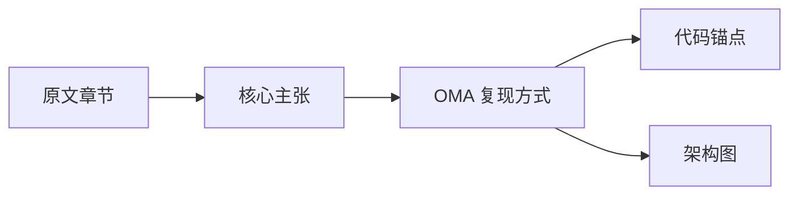

---

## 1. 总览：将"大脑"与"双手"解耦

### 📖 原文主张

> 控制器（harness）编码了关于 Claude 自身无法完成的事情的假设。然而，这些假设需要经常被质疑，因为随着模型能力的提升，它们会过时。

Anthropic 把 Managed Agents 设计成一个「**元控制器（meta-harness）**」——不假设未来模型需要什么具体控制器，只虚拟化三类组件：

| 组件 | 定义 |
|------|------|
| **Session** | 一切已发生事件的只追加日志 |
| **Harness** | 调用 Claude 并把工具调用路由到基础设施的循环 |
| **Sandbox** | Claude 运行代码、编辑文件的执行环境 |

### 🏗️ OMA 复现

meta-harness 把整个栈拆成三个物理进程，各自独立部署、独立故障：

| 进程 | 角色 | 端口 |
|------|------|------|
| `oma-server` (Go) | **平台**：Session、Agent、Vault、Skills、Files、SSE Hub | `:8787` |
| `oma-harness` (Python/FastAPI) | **大脑**：无状态 LLM turn + 工具编排 | `:8090` |
| `SANDBOX_WORKDIR/<sid>/` | **双手**：每 session 一个隔离工作目录（可选本地/e2b/daytona） | — |

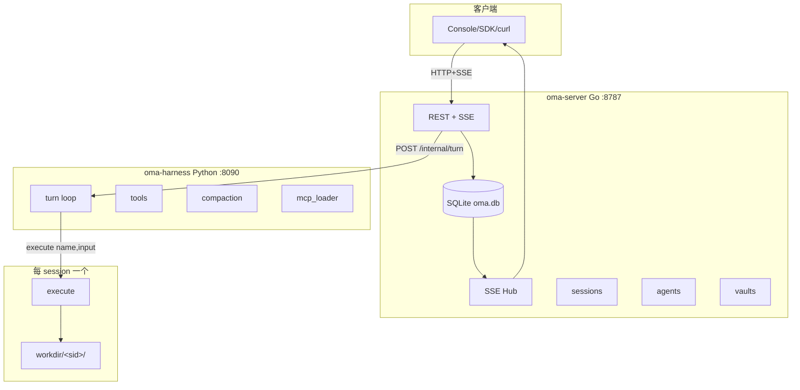

### 📂 代码锚点

- 总架构图：[`README.md`](../../README.md#architecture)
- 入口进程：[`cmd/oma-server/main.go`](../../cmd/oma-server/main.go)
- Harness sidecar：[`harness/oma_adapter/turn.py`](../../harness/oma_adapter/turn.py)
- Sandbox 多 provider：[`internal/sandbox/`](../../internal/sandbox/)（`local.go`, `e2b.go`, `daytona.go`, `litebox.go`）

---

## 2. 不要养宠物

### 📖 原文主张

> 把所有智能体组件放入单个容器……如果一个容器发生故障，会话就丢失了。如果一个容器无响应，我们必须把它"照料"回健康状态。

耦合设计的两个痛点：

1. **调试盲区**：WebSocket 事件流看不出故障发生在哪一层，必须进容器 shell，但容器持有用户数据。
2. **VPC 绑定**：控制器假设 Claude 操作的一切都与其共处一个容器——客户想连自家 VPC 时，必须与 Anthropic 网络对等互联。

### 🏗️ OMA 复现

meta-harness 通过「**三进程 + SQLite 外部化**」让每一层都变成**牲畜**：

| 组件 | 失败模式 | 恢复方式 |
|------|----------|----------|
| `oma-harness` | 进程崩溃 | 平台捕获 `/internal/turn` 超时 → 标记 session `idle`，新 turn 自动启动新 harness 进程 |
| `oma-server` | 进程重启 | 启动时扫描 `status=running` 的孤儿 session，批量 reset 为 `idle`（**Crash recovery**） |
| Sandbox | 容器/进程挂掉 | harness 把 `execute()` 错误作为 tool result 返回给 Claude，Claude 自行决定是否 `provision` 新的 |

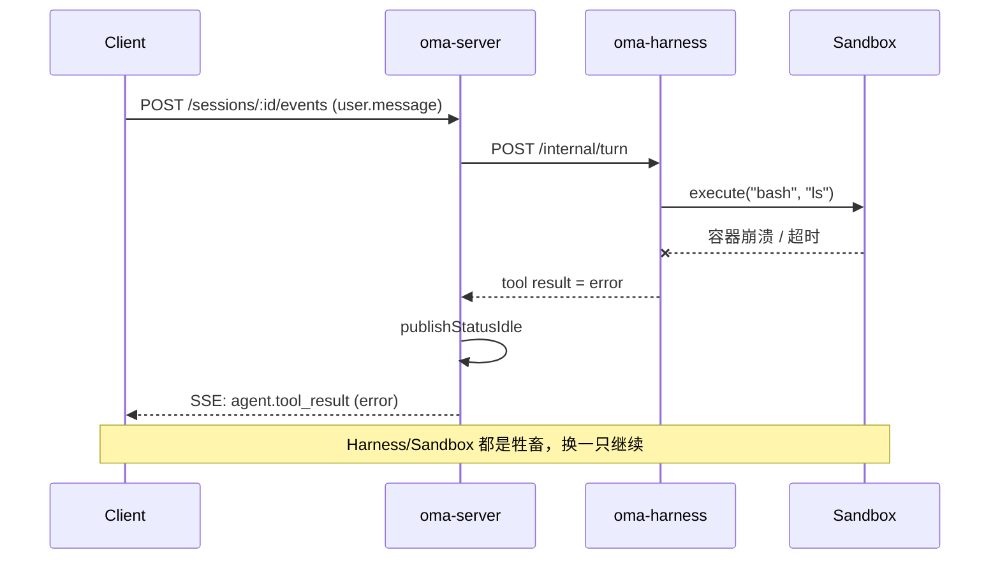

### 📂 代码锚点

- Crash recovery：[`cmd/oma-server/main.go`](../../cmd/oma-server/main.go) 启动时 `resetOrphanSessions()`
- Sandbox provider 接口：[`internal/sandbox/provider.go`](../../internal/sandbox/provider.go)
- Harness turn 超时：[`harness/oma_adapter/turn.py`](../../harness/oma_adapter/turn.py) 的 `HARNESS_TURN_TIMEOUT_SEC`（默认 900s）
- Turn 终止分层：[`docs/design/loop-task-termination.md`](../../docs/design/loop-task-termination.md)

---

## 3. 将大脑与双手解耦

### 📖 原文主张

> 控制器离开容器。它像调用任何其他工具一样调用容器：`execute(name, input) → string`。容器变成了牲畜。

> 控制器也变成了牲畜。因为会话日志位于控制器之外，控制器中没有任何东西需要在崩溃后存活。当一个控制器故障时，一个新的可以用 `wake(sessionId)` 重新启动，使用 `getSession(id)` 取回事件日志，然后从最后一个事件处恢复。

两个关键设计：

1. **接口化解耦**：`execute(name, input) → string`、`wake(sessionId)`、`getSession(id)`、`emitEvent(id, event)`
2. **安全边界**：凭据永不进入沙箱。Git token 在 clone 时注入；OAuth token 存在 Vault，由平台代理注入

### 🏗️ OMA 复现（解耦）

meta-harness 把文章里的四个伪代码接口**一一落地**：

| 原文接口 | OMA 实现 | 位置 |
|----------|----------|------|
| `getSession(id) → Event[]` | `Machine.getEvents()` 从 SQLite `session_events` 按 `seq` 拉取 | [`internal/session/machine.go`](../../internal/session/machine.go) |
| `emitEvent(id, event)` | Harness NDJSON 流式回传事件，Go 层统一落库 + SSE 广播 | [`internal/session/machine.go`](../../internal/session/machine.go) + [`harness/oma_adapter/emit.py`](../../harness/oma_adapter/emit.py) |
| `wake(sessionId)` | `WakeupWorker` 定时扫描 `session_wakeup_schedules`，到点注入合成 `user.message` 触发新 turn | [`internal/wakeup/`](../../internal/wakeup/) |
| `execute(name, input) → string` | 所有工具（bash/MCP/subagent/web_fetch）统一走 harness tool 协议，返回字符串 | [`harness/oma_adapter/tools.py`](../../harness/oma_adapter/tools.py) |

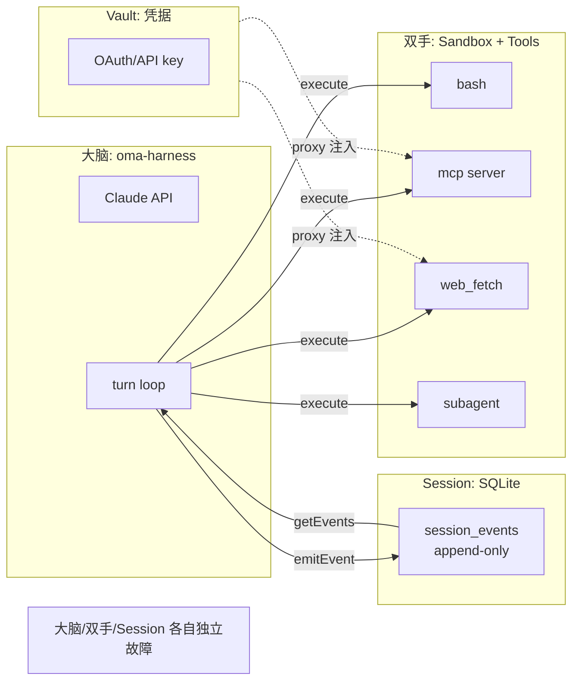

### 🏗️ OMA 复现（安全边界）

文章强调「**token 永远不被 Claude 生成的代码触及**」。meta-harness 用两层隔离实现：

| 模式 | OMA 实现 | 设计文档 |
|------|----------|----------|
| **资源绑定凭据**（Git clone） | sandbox 初始化时用 per-repo token clone，token 不进 workdir | [`docs/design/vault-and-credentials.md`](../../docs/design/vault-and-credentials.md) |
| **Vault 存放 + 代理注入** | MCP / HTTP 上游 token 存在 Vault，调用时由 `/v1/mcp-proxy` 与 outbound proxy 注入 `Authorization` | [`docs/design/mcp-architecture.md`](../../docs/design/mcp-architecture.md) + [`internal/mcpproxy/target.go`](../../internal/mcpproxy/target.go) |

```mermaid
flowchart TB
    Agent[Agent 配置<br/>mcp_servers: name+url] --> Session[Session snapshot]
    Session --> Resolver[mcpproxy.Resolver]
    Vault[Vault credentials] --> Resolver
    Resolver -->|Bearer upstream_token| Upstream[真实 MCP Server]

    Harness -->|Bearer oma_api_key| Proxy[/v1/mcp-proxy/{sid}/{srv}]
    Proxy --> Resolver
    subgraph 永不跨越的边界
        Harness
    end
    subgraph 永不跨越的边界2
        Upstream
    end
    note1["Harness 永远拿不到 upstream token<br/>（结构化安全边界）"]
```

### 📂 代码锚点

- Vault 设计：[`docs/design/vault-and-credentials.md`](../../docs/design/vault-and-credentials.md)
- MCP 凭证解析：[`internal/mcpproxy/target.go`](../../internal/mcpproxy/target.go)
- 出站代理：[`internal/outbound/`](../../internal/outbound/)
- Session 事件存储：[`internal/store/migrations/005_vaults_credentials_skills.sql`](../../internal/store/migrations/005_vaults_credentials_skills.sql)

---

## 4. 会话不是 Claude 的上下文窗口

### 📖 原文主张

> 长周期任务通常会超过 Claude 的上下文窗口长度，而解决这个问题的标准方法都涉及对保留什么内容的**不可逆决策**。

> 在 Managed Agents 中，会话提供了同样的好处，作为一个**生活在 Claude 上下文窗口之外的上下文对象**。接口 `getEvents()` 允许大脑通过选择事件流的位置切片来审查上下文。

关键洞察：
- **Session ≠ Context Window**：Session 是完整的、可恢复的真相日志
- **Context Window = Session 的某个切片 + 任意转换**：转换发生在控制器里，与会话存储解耦

### 🏗️ OMA 复现

meta-harness 用「**只追加事件日志 + 按需切片 + 控制器内 compaction**」实现这一分层：

| 层次 | 实现 | 说明 |
|------|------|------|
| **持久真相** | SQLite `session_events` 表，`seq` 单调递增 | 所有事件永不修改，取消用 `cancelled_at` 标记 | [`internal/session/machine.go`](../../internal/session/machine.go) |
| **按需切片** | `GET /v1/sessions/:id/events?since_seq=N&thread_id=X` | 支持按 seq、thread、type 拉取任意切片 | [`internal/api/sessions.go`](../../internal/api/sessions.go) |
| **控制器内转换** | `harness/oma_adapter/compaction.py` | turn 前对历史做摘要，只把「压缩后的消息 + 最近 N 个事件」喂给 Claude | [`harness/oma_adapter/compaction.py`](../../harness/oma_adapter/compaction.py) |
| **流式回看** | `GET /events/stream?replay=1` | SSE 先回放历史、再接续新事件，Console 可重建完整视图 | [`docs/design/streaming-turn-and-sse.md`](../../docs/design/streaming-turn-and-sse.md) |

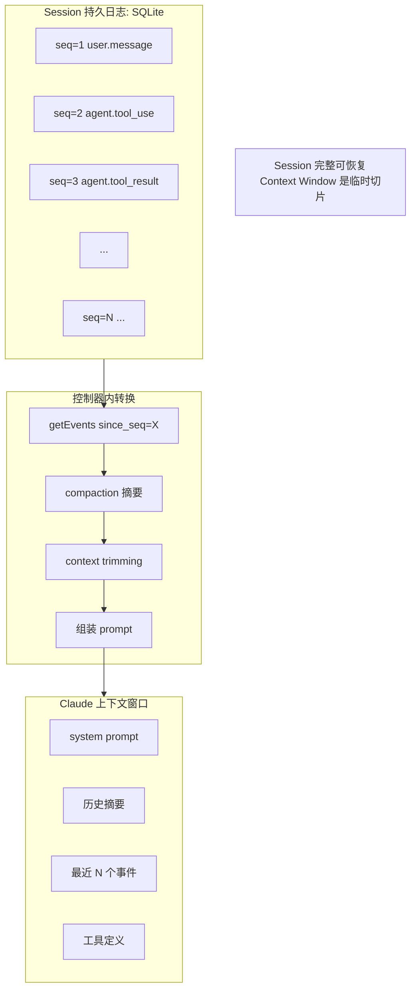

### 📂 代码锚点

- 事件模型：[`docs/design/session-events.md`](../../docs/design/session-events.md)
- 线程切片：[`docs/design/session-threads.md`](../../docs/design/session-threads.md)
- Compaction：[`harness/oma_adapter/compaction.py`](../../harness/oma_adapter/compaction.py)
- SSE 流 + 回放：[`internal/stream/hub.go`](../../internal/stream/hub.go) + [`docs/design/streaming-turn-and-sse.md`](../../docs/design/streaming-turn-and-sse.md)

---

## 5. 多大脑，多双手

### 📖 原文主张

> **多大脑**：将大脑与双手解耦意味着容器仅在大脑通过工具调用需要时才被配置。所以一个暂时不需要容器的会话不用等它。推理可以在编排层从会话日志拉取待处理事件后立即开始。
>
> **多双手**：每个大脑能够连接到多个双手……每双手都变成一个工具 `execute(name, input) → string`。
>
> **性能回报**：p50 TTFT 下降约 60%，p95 下降超过 90%。

### 🏗️ OMA 复现

meta-harness 通过**三处解耦**实现「多大脑 × 多双手」：

#### 5.1 多大脑：无状态 Harness + Sub-agent / Team

| 机制 | 实现 |
|------|------|
| **Harness 无状态** | 每个 turn 独立，新 turn 启动新 harness 进程，所有状态从 SQLite 重建 | [`internal/harness/client.go`](../../internal/harness/client.go) |
| **Sub-agent 委派** | 主 Agent 通过 `call_agent_<id>` / `general_subagent` 工具把子任务交给另一个 Agent，子 Agent 在独立 thread 跑一轮 turn | [`docs/design/subagent.md`](../../docs/design/subagent.md) + [`harness/oma_adapter/subagent_bridge.py`](../../harness/oma_adapter/subagent_bridge.py) |
| **Agent Teams** | 多 Agent 组队，通过 `team_*` harness 工具协调，每个 teammate 在独立线程轮询 | [`docs/design/agent-team.md`](../../docs/design/agent-team.md) + [`harness/oma_adapter/team_bridge.py`](../../harness/oma_adapter/team_bridge.py) |

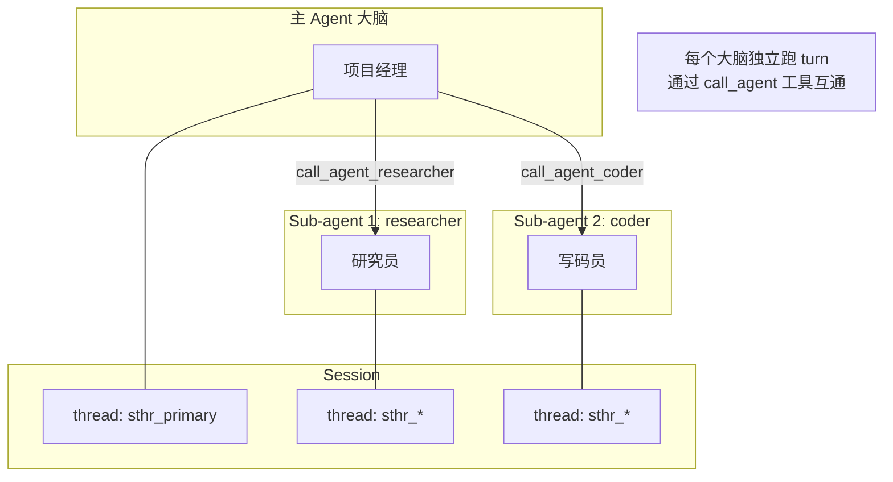

#### 5.2 多双手：Sandbox 多 Provider + MCP 多 Server

| 类型 | OMA 实现 |
|------|----------|
| **本地沙箱** | `SANDBOX_WORKDIR/<sid>/`，进程级隔离 | [`internal/sandbox/local.go`](../../internal/sandbox/local.go) |
| **远程容器** | E2B / Daytona / Litebox 等 provider，按需 provision | [`internal/sandbox/e2b.go`](../../internal/sandbox/e2b.go), [`daytona.go`](../../internal/sandbox/daytona.go) |
| **MCP Server** | Agent 声明 `mcp_servers[]`，每个都是一个独立的「手」 | [`docs/design/mcp-architecture.md`](../../docs/design/mcp-architecture.md) |
| **ACP Runtime** | 用户本机 Claude Code/Cursor 通过 WebSocket 桥接进来，也成为一双手 | [`docs/design/runtime-architecture.md`](../../docs/design/runtime-architecture.md) |

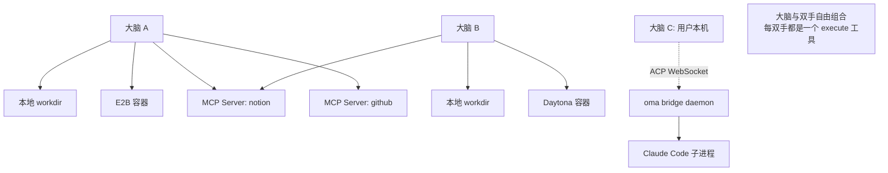

#### 5.3 TTFT 优化：按需配置 Sandbox

原文指出「**容器仅在大脑通过工具调用需要时才被配置**」。meta-harness 的实现：

- Session 创建时**不**立即启动 sandbox，只在工作目录首次被访问时才创建
- Resource Mounter 在每个 turn 开始时才把 Environment 声明的文件注入 workdir
- 纯对话类 session 永不触及 sandbox

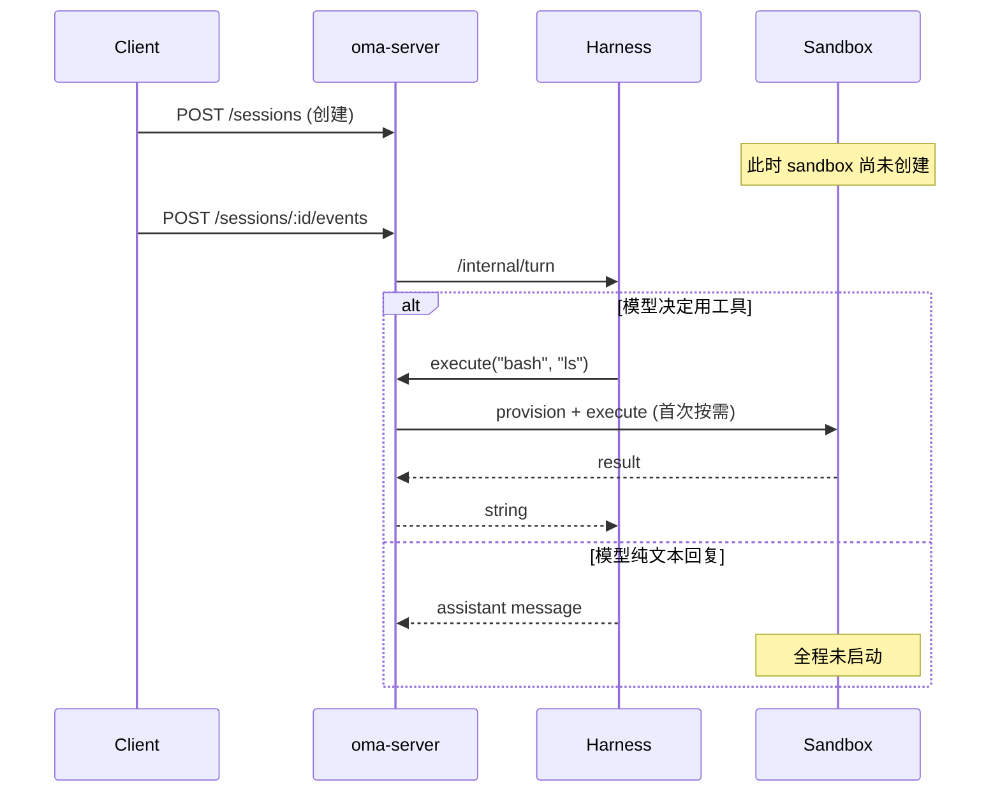

### 📂 代码锚点

- Sub-agent：[`docs/design/subagent.md`](../../docs/design/subagent.md)
- Agent teams：[`docs/design/agent-team.md`](../../docs/design/agent-team.md)
- Sandbox provider 注册：[`internal/sandbox/registry.go`](../../internal/sandbox/registry.go)
- ACP Runtime 桥接：[`internal/runtime/`](../../internal/runtime/) + [`docs/design/runtime-architecture.md`](../../docs/design/runtime-architecture.md)
- Resource mounter：[`harness/oma_adapter/resource_mounter.py`](../../harness/oma_adapter/resource_mounter.py) + [`docs/design/resource-mounter-and-outcome-evaluator.md`](../../docs/design/resource-mounter-and-outcome-evaluator.md)

---

## 6. 结论：元控制器

### 📖 原文主张

> Managed Agents 是相同精神的**元控制器（meta-harness）**，对 Claude 未来需要的具体控制器不做主张。相反，它是一个具有通用接口的系统，允许许多不同的控制器。

> 我们对 Claude 需要的大脑或双手的数量或位置不做任何假设。

### 🏗️ OMA 复现

meta-harness 通过「**接口驱动 + Provider 注册表**」把元控制器思想落到每一层：

| 抽象 | OMA 接口 | 可替换实现 |
|------|----------|------------|
| Sandbox | `sandbox.Provider` | `local` / `e2b` / `daytona` / `litebox` |
| Harness | `POST /internal/turn` | `piPy` (默认) / `fake` (CI) / `acp-proxy` (Runtime 桥接) |
| Tool | `AgentTool` schema | bash / MCP / web_fetch / subagent / custom tool (HITL) |
| Storage | SQLite + filesystem | 可替换为 Postgres + S3（接口已分层） |
| 调度 | `wake(session_id)` | `WakeupWorker` ticker / 可扩展为 cron / 队列 |

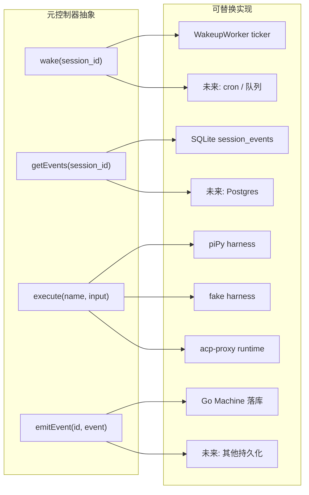

---

## 7. 组件接口一览：原文 vs OMA

原文给出了一张接口表。下表是**原文伪代码 ↔ OMA 真实落地**的对照：

| 组件 | 原文伪代码 | OMA 实现 | 关键代码 |
|------|------------|----------|----------|
| **Session** | `getSession(id)` / `getEvents(id)` / `emitEvent(id, event)` | SQLite `session_events` 表 + `GET /events` + SSE 流 | [`internal/session/machine.go`](../../internal/session/machine.go) |
| **Orchestration** | `wake(session_id)` | `WakeupWorker` + `session_wakeup_schedules` 表 + `POST /internal/sessions/{id}/wakeups` | [`internal/wakeup/`](../../internal/wakeup/) + [`docs/design/schedule-session-wakeup.md`](../../docs/design/schedule-session-wakeup.md) |
| **Harness** | `yield Effect<T> → EffectResult<T>` | `POST /internal/turn`（同步）/ `POST /internal/turn/stream`（NDJSON 流式） | [`harness/oma_adapter/turn.py`](../../harness/oma_adapter/turn.py) |
| **Sandbox** | `provision({resources})` / `execute(name, input) → string` | `sandbox.Provider` 接口 + 多 provider 实现 | [`internal/sandbox/provider.go`](../../internal/sandbox/provider.go) |
| **Resources** | `[{source_ref, mount_path}]` | Environment snapshot → `ResourceResolver` → `TurnRequest.resources` → Harness `mount_resources` | [`harness/oma_adapter/resource_mounter.py`](../../harness/oma_adapter/resource_mounter.py) |
| **Tools** | `{name, description, input_schema}` | Agent `tools[]` + MCP `mcp_servers[]` + custom tools with HITL | [`harness/oma_adapter/tools.py`](../../harness/oma_adapter/tools.py) + [`docs/design/loop-task-termination.md`](../../docs/design/loop-task-termination.md) |

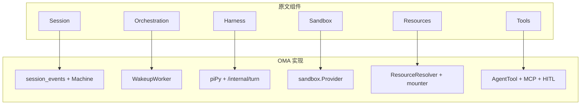

---

## 8. 覆盖度矩阵

| 原文核心主张 | OMA 复现程度 | 备注 |
|--------------|--------------|------|
| 大脑与双手解耦 | ✅ 完全复现 | 三进程拆分，Harness 无状态 |
| 不要养宠物 | ✅ 完全复现 | 每层独立故障 + Crash recovery |
| 会话外部化（只追加日志） | ✅ 完全复现 | SQLite `session_events` + `seq` |
| 安全边界（Vault + 代理注入） | ✅ 完全复现 | Vault + MCP proxy + outbound proxy |
| `wake(sessionId)` 恢复 | ✅ 完全复现 | `WakeupWorker` + Schedule 工具 |
| `getEvents()` 切片 | ✅ 完全复现 | `since_seq` / `thread_id` / `type` 过滤 |
| 控制器内任意上下文管理 | ✅ 完全复现 | `compaction.py` + context trimming |
| 多大脑（Sub-agent / Teams） | ✅ 完全复现 | `call_agent_*` + `team_*` |
| 多双手（MCP + Sandbox provider） | ✅ 完全复现 | 4 个 sandbox provider + MCP |
| 按需 provision → TTFT 优化 | ✅ 完全复现 | 延迟到首次 execute 才 provision |
| 元控制器 / 接口驱动 | ✅ 完全复现 | Provider 注册表 + 接口分层 |

---

## 9. 一图总结：OMA 如何把原文落地

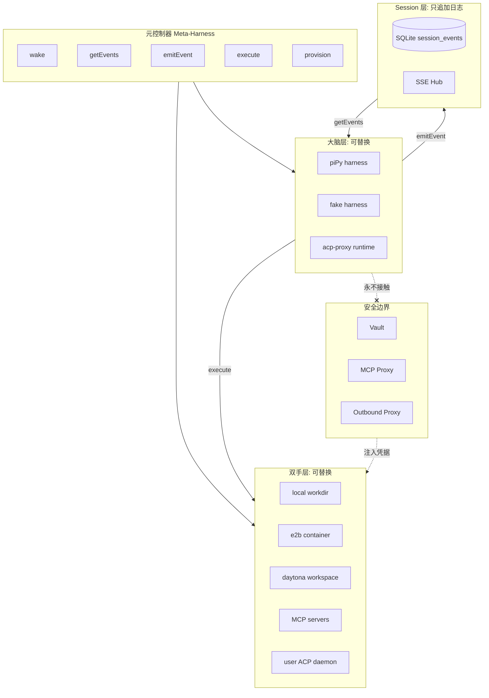

---

## 10. 关键结论

1. **架构同构**：meta-harness 的三进程拆分（`oma-server` / `oma-harness` / sandbox）与原文「Session / Harness / Sandbox」三组件一一对应。
2. **接口忠实**：原文的 6 个组件伪代码接口（Session / Orchestration / Harness / Sandbox / Resources / Tools）在 OMA 中都有对应的 Go/Python 类型与 HTTP 路由。
3. **安全边界结构性保证**：通过 Vault + MCP proxy + Outbound proxy 三层拦截，确保「凭据永不进入沙箱」不是靠约定，而是靠架构。
4. **元控制器可演进**：Provider 注册表（sandbox、harness、tool）让每层都能独立替换，符合原文「对具体控制器不做主张」的元设计哲学。
5. **超出原文的扩展**：OMA 在原文基础上额外实现了 **Agent Teams**（多 Agent 协作）、**Outcome Evaluator**（基于 rubric 的评分）、**Dream worker**、**Eval worker** 等，属于「多大脑」能力的进一步延伸。

---

> **报告生成日期**：2026-07-11
> **分析版本**：meta-harness `~91% feature parity`（44/52 domains aligned，截至 2026-07-07）
> **原文翻译参考**：[`http://localhost:1313/www6vAIGC/docs/Harness-engineering/managed-agent/managed-agent/`](http://localhost:1313/www6vAIGC/docs/Harness-engineering/managed-agent/managed-agent/)
