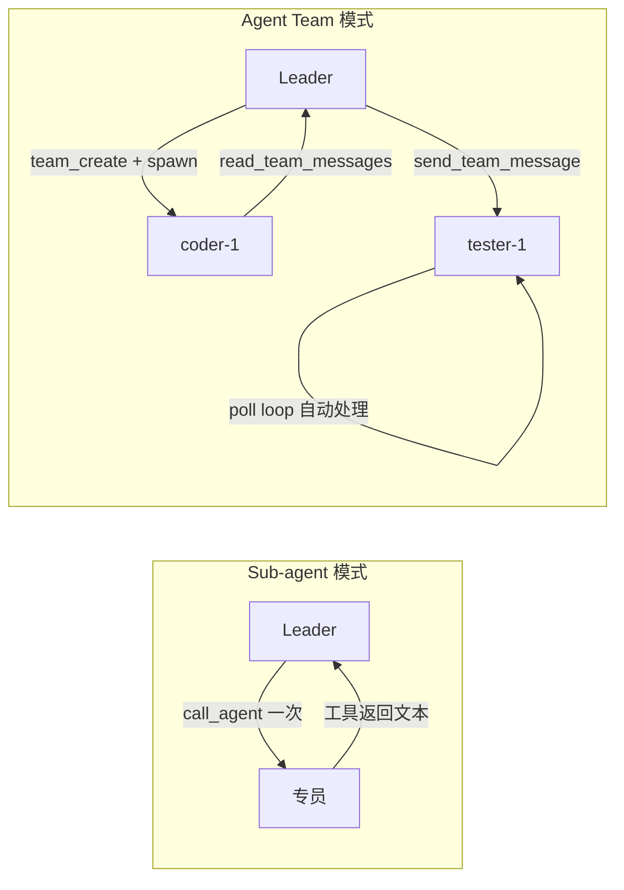

# Agent Team（多 Agent 团队）

本文用通俗语言说明 OMA 中 **Agent Team** 是什么、和 Sub-agent 有何不同，以及系统如何实现「多 Agent 长期协作」。

## 一句话总结

**Agent Team 是在一次 Session 里组建的「固定编制小队」：队长（Leader）通过邮箱（Mailbox）给具名队友发消息，队友在各自线程里持续工作，而不是干完一次就解散。**

可以把 Sub-agent 想成「临时外包」——派活、汇报、走人；Agent Team 想成「项目组」——有编制、有工位、有内部邮件，可以来回沟通很多轮。

## 通俗类比

| 概念 | 类比 | 在系统里 |
|------|------|----------|
| **Session** | 一次完整项目 | 用户开启的一次对话 / 任务 |
| **Team（团队）** | 项目组编制 | `teams` 表中的一条记录，如 `feature-auth` |
| **Leader（队长）** | 项目经理 | 主线程 `sthr_primary` 上的 Agent |
| **Teammate（队友）** | 组内专员 | `team_members` 表中的成员，各有 `display_name` |
| **Session Thread** | 工位 / 独立工作台 | 每个队友绑定一条 `sthr_*` 子线程 |
| **Mailbox（邮箱）** | 组内邮件 | `agent_messages` 表，按成员寻址 |
| **Poll Loop（轮询循环）** | 专员「盯着收件箱」 | 后台任务定期读未读邮件并触发 turn |

用户通常只和 Leader 对话；队友是 Leader 通过工具拉起来的协作单元。打开 Console 的 **Team** Tab 可以看到成员状态、消息时间线，并跳转到对应线程。

## 和 Sub-agent 的区别

OMA 有两套多 Agent 能力，容易混淆，务必区分：

| 维度 | Sub-agent（子 Agent） | Agent Team（团队） |
|------|----------------------|-------------------|
| **关系** | 一次性委派 | 长期编制 |
| **入口工具** | `call_agent_*` / `general_subagent` | `team_create` / `spawn_teammate` |
| **通信** | 工具返回值（口头汇报一句） | Mailbox 多轮消息 |
| **寻址** | 按 Agent id | 按队友 `display_name` |
| **生命周期** | 委派结束即退场 | 长驻 + shutdown 协议 |
| **持久化** | 仅 `session.thread_created` 事件 | `teams` + `team_members` + `agent_messages` 表 |
| **典型场景** | 「帮我去搜一下代码」 | 「coder 写接口，tester 并行写测试，来回改几轮」 |

两者可以配合：Leader 既可以用 `call_agent` 做临时调研，也可以用 Team 做需要多轮协调的大任务。底层都复用 [Session Thread](./session-threads.md) 作为执行容器。



## 核心概念

### 1. Team（团队）

一次 Session 内可以有一个或多个 Team，每个 Team 有唯一 `name`（同 Session 内不可重复）。

Team 记录包含：

- **队长信息**：`lead_thread_id`（默认 `sthr_primary`）、`lead_agent_id`
- **描述**：可选的 `description`
- **状态**：`active` 等

创建时发出 `session.team_created` 事件，Console 可实时感知。

### 2. Team Member（队友）

每个队友是 Team 里的一条成员记录，关键字段：

| 字段 | 含义 |
|------|------|
| `display_name` | 邮箱寻址名，如 `coder-1`；`send_team_message` 的 `to` 参数用它 |
| `agent_id` | 绑定的 Agent 配置（system prompt、tools 等） |
| `thread_id` | 该队友独占的 Session Thread（`sthr_*`） |
| `role` | 可选角色标签，如 `coder`、`tester` |
| `status` | `idle` → `listening` → `active` → `shutdown` |
| `backend_type` | 当前为 `in_process`（同 harness 进程内） |

`spawn_teammate` 时会：

1. 插入 `team_members` 行
2. 发出 `session.thread_created`（Console 线程 Tab 可见）
3. 可选启动 **Poll Loop**（默认开启）

### 3. Mailbox（邮箱 / 消息）

队友之间通过 **持久化消息** 协调，而不是一次性 tool return。

| 字段 | 含义 |
|------|------|
| `from_member_id` / `to_member_id` | 发件人 / 收件人（`*` 表示广播，待完善） |
| `message_type` | `text`（普通）、`shutdown_request`、`shutdown_response`、`plan_approval_request` 等 |
| `body` / `summary` | 正文 / 摘要 |
| `read_at` | 已读时间；未读消息会被 poll loop 或 `read_team_messages` 消费 |

每条消息还会推一条 SSE 事件 `team.message`，Console Team Tab 可展示时间线。

### 4. Session Thread（执行线程）

Team 不替代 Thread 模型，而是在其上叠加「编制 + 邮箱」：

- **Leader** 跑在 `sthr_primary`
- **每个 Teammate** 跑在独立 `sthr_*`，`parent_thread_id` 指向 Leader 线程
- 同一 Session、同一沙箱 workdir，文件互相可见

详见 [Session Threads](./session-threads.md)。

## 典型协作流程

### 流程一：建队并拉起队友

```
用户向 Leader 提需求
    │
    ▼
Leader 调用 team_create({ name: "auth-refactor", members: [...] })
    ├─ 写入 teams / team_members
    └─ SSE: session.team_created
    │
    ▼
Leader 调用 spawn_teammate({ display_name: "coder-1", agent_id: "..." })
    ├─ 创建 sthr_xxx 子线程
    ├─ SSE: session.thread_created
    └─ 启动 poll loop（队友开始「听邮箱」）
    │
    ▼
Leader 调用 send_team_message({ to: "coder-1", body: "实现 JWT 中间件" })
    ├─ 写入 agent_messages
    ├─ SSE: team.message
    └─ 唤醒 coder-1 线程跑一轮 turn
```

### 流程二：队友 Poll Loop 自动处理邮件

当 `spawn_teammate(start_poll_loop=true)` 时，后台会跑一个 **Teammate Loop**：

```
每 2 秒（可配置）
    │
    ▼
查该成员的未读 agent_messages
    │
    ├─ 无邮件 → 继续等（超时默认 600s 后自动退出）
    │
    ├─ shutdown_request → 标记 shutdown，回复 shutdown_response，退出 loop
    │
    └─ 普通 text → 拼成 [Team mailbox] 格式的 user.message
                    → enqueue 到该成员 thread_id 跑 turn
                    → 标记已读
```

这样 Leader 发消息后，即使没显式 `run_target_turn`，队友也能通过 loop 自动接单。若 loop 已在跑，`send_team_message` 会跳过重复 enqueue，避免同一邮件触发两次 turn。

### 流程三：Console 手动 Shutdown

用户在 Team Tab 点 **Shutdown** 某队友：

```
Console → POST /v1/sessions/{id}/teams/{team_id}/members/{member_id}/shutdown
    ├─ 写入 shutdown_request 消息
    ├─ SSE: team.message
    └─ 队友 loop 收到后退出，status → shutdown
```

## 架构分层

系统按「谁存数据、谁跑 LLM、谁展示」三层分工：

```mermaid
flowchart TB
  subgraph Console
    TeamTab[Team Tab / 消息时间线]
  end

  subgraph Harness["oma-harness (Python)"]
    Turn[turn.py 主循环]
    PiTeam[pi_team/ 业务逻辑]
    TeamExt[extensions/team_extension.py]
    Loop[pi_team/loop.py Poll Loop]
    Turn --> TeamExt --> PiTeam
    PiTeam --> Loop
  end

  subgraph Go["oma-server (Go)"]
    TeamsAPI["GET /teams, GET /messages"]
    Events[SSE 事件广播]
    Registry[Session Registry / EnqueueEvents]
  end

  subgraph DB[(SQLite)]
    TeamsTable[teams]
    MembersTable[team_members]
    MessagesTable[agent_messages]
  end

  TeamTab --> TeamsAPI
  PiTeam --> TeamsTable
  PiTeam --> MembersTable
  PiTeam --> MessagesTable
  PiTeam --> Events
  PiTeam --> Registry
  TeamsAPI --> DB
```

| 层 | 职责 |
|----|------|
| **Harness (`pi_team`)** | LLM turn、工具实现、mailbox 读写、poll loop |
| **Go (`oma-server`)** | 租户 ACL、SSE 广播、Session 状态机；Team **读 API** |
| **SQLite** | Team / Member / Message 的 **唯一数据源** |
| **Console** | 成员列表、消息时间线、Shutdown、跳转线程 |

**重要原则**：Team 的写操作（create / spawn / send）在 Harness 侧通过 `pi_team/store.py` 直连 SQLite 完成，与现有 Session 模式一致；Go 提供 Console 只读查询和 Shutdown 等辅助入口。

## 数据模型

Migration：`internal/store/migrations/017_teams.sql`

```text
teams
  id, session_id, tenant_id, name, description
  lead_thread_id, lead_agent_id, status, created_at

team_members
  id, team_id, agent_id, display_name, color
  thread_id, role, backend_type, status, joined_at

agent_messages
  id, team_id, from_member_id, to_member_id
  message_type, body, summary, read_at, created_at
```

同一 Session 内 `(session_id, name)` 唯一；同一 Team 内 `(team_id, display_name)` 唯一。

## Agent 工具一览

在 Agent 上启用 Team 工具后，Leader 可使用：

| 工具 | 作用 |
|------|------|
| `team_create` | 创建 Team，可选同时注册初始成员 |
| `spawn_teammate` | 向已有 Team 添加队友并创建线程 |
| `send_team_message` | 向队友发邮件（`to=display_name` 或 `*` 广播） |
| `read_team_messages` | 读取某成员未读邮件，可选 mark read |

### 如何启用

在 Agent 配置中任选其一：

```json
{
  "metadata": {
    "enable_team_tools": true
  }
}
```

或在 `tools[]` 里显式声明工具名（如 `team_create`）。

Harness 在 turn 开始时通过 `oma_adapter/team_bridge.py` 注入 `TeamRuntime`（session_id、tenant_id、database_path 等）。

## HTTP API（Console / 集成）

| 方法 | 路径 | 说明 |
|------|------|------|
| GET | `/v1/sessions/{id}/teams` | 列出 Session 下所有 Team 及成员 |
| GET | `/v1/sessions/{id}/teams/{team_id}/messages` | 消息时间线（Console 用） |
| POST | `/v1/sessions/{id}/teams/{team_id}/members/{member_id}/shutdown` | 手动关闭队友 |

Team 的创建、spawn、发消息由 Harness 工具完成，不暴露为公开写 API（与 Sub-agent 委派模式一致）。

## Console 体验

`console/src/pages/session-detail/TeamPanel.tsx`：

1. **Team 列表**：展示 name、description、成员数
2. **成员卡片**：`display_name`、role、status（idle / listening / active / shutdown）
3. **消息时间线**：按时间展示 `team.message` 对应的历史
4. **跳转线程**：点击成员可切换到该 `thread_id` 的对话视图
5. **Shutdown**：对 in_process 队友发送 shutdown 请求

SSE 监听 `session.team_created`、`team.message`、`team.member_shutdown` 等事件做实时刷新。

## 与 Claude Code Agent Teams 的对应

OMA 的 Agent Team 设计参考 Claude Code 的 Agent Teams / Swarm，做了平台化改造：

| Claude Code | OMA |
|-------------|-----|
| `TeamCreate` | `team_create` |
| `Agent` + `name` spawn 队友 | `spawn_teammate` |
| `SendMessage` | `send_team_message` |
| `~/.claude/teams/` 文件 | SQLite `teams` 表 |
| `inboxes/{name}.json` | `agent_messages` 表 |
| tmux 多 pane | in_process + Session Thread |
| `TaskCreate` 看板 | ⏳ Phase 3 规划中的 `team_tasks` |

详细迁移路线见 [Claude Code Agent Teams 迁移方案](../multi-agent/claude-code-agent-teams-migration-plan.md)。

## 当前能力与路线图

| 能力 | 状态 |
|------|------|
| Sub-agent 一次性委派（`call_agent`） | ✅ 已上线 |
| Team 创建 / spawn / 发消息 / 读消息 | ✅ 已上线 |
| 长驻 Teammate Poll Loop | ✅ 已上线 |
| Shutdown 协议 | ✅ 已上线 |
| Console Team Tab | ✅ 已上线 |
| E2E / smoke 测试 | ✅ `smoke-team-e2e.sh` 等 |
| 任务看板（TaskCreate 等价） | ⏳ Phase 3 |
| Git worktree 隔离 | ⏳ Phase 3 |
| 广播 fan-out（`to="*"`） | 🚧 部分支持 |
| 独立 harness 进程队友 | ⏳ Phase 4 |

## 关键文件索引

| 层级 | 路径 | 职责 |
|------|------|------|
| 设计 | `docs/design/subagent.md` | Sub-agent（对比阅读） |
| 设计 | `docs/design/session-threads.md` | 线程模型 |
| 迁移 | `docs/multi-agent/claude-code-agent-teams-migration-plan.md` | 分阶段实施计划 |
| DB | `internal/store/migrations/017_teams.sql` | 表结构 |
| Go API | `internal/api/teams.go` | 只读列表、消息、Shutdown |
| Harness 核心 | `harness/pi_team/service.py` | create / spawn / send / read |
| Harness 循环 | `harness/pi_team/loop.py` | Poll Loop、shutdown 处理 |
| Harness 工具 | `harness/pi_team/tools.py` | piPy 工具定义 |
| Harness 桥接 | `harness/oma_adapter/team_bridge.py` | 按 Agent 配置启用 |
| Console | `console/src/pages/session-detail/TeamPanel.tsx` | Team Tab UI |
| E2E | `scripts/e2e/smoke-team-e2e.sh` | 全链路 smoke |

## 相关文档

- [Sub-agent](./subagent.md) — 一次性委派、`call_agent` 实现
- [Session Threads](./session-threads.md) — 主/子线程、事件打标
- [Harness 流式 Turn 与 SSE](./streaming-turn-and-sse.md) — 事件如何推到 Console
- [Claude Code Agent Teams 架构说明](../multi-agent/claude-code-agent-teams-architecture.md) — 源项目原理
- [Claude Code Agent Teams 迁移方案](../multi-agent/claude-code-agent-teams-migration-plan.md) — oma 落地路线
