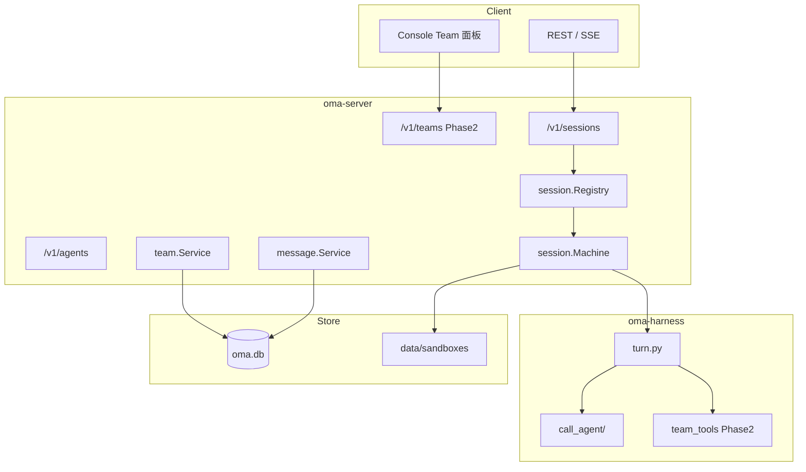

# Claude Code Agent Teams → oma-platform 迁移方案

> 前置阅读：[claude-code-agent-teams-architecture.md](./claude-code-agent-teams-architecture.md)
> 目标仓库：`oma-platform`（Go `oma-server` + Python `oma-harness`）
> 源仓库：`claude-code-rev/src`（Claude Code Agent Teams / Swarm）

---

## 1. 迁移目标与原则

### 1.1 目标陈述

将 Claude Code 的 **Agent Teams 协调能力** 映射到 oma 的 **持久化、多租户、API 优先** 平台，而不是把 Claude Code CLI 源码搬进 monorepo。

用户应能：

1. 在 Console / API 定义 **Team 编制**（Leader Agent + 具名 Teammate Agent）。
2. 在 Session 中 **并行或串行** 运行多个 Agent turn，并通过 SSE 观测各 `session_thread_id`。
3. 使用 **Mailbox 式协调**（SendMessage 等价 API / 工具），而非仅一次性 tool return。
4. 使用 **Team 任务看板**（TaskCreate 等价），带 owner 与依赖。
5. 保持 oma 强项：**SQLite 持久化、OAuth、Integrations、Eval、租户隔离**。

### 1.2 决策原则

| 原则 | 迁移含义 |
|------|----------|
| 完整性 | 先 E2E「Team + 委派 + 观测」，再叠 mailbox / 任务图 |
| Boil lakes | 动 session、harness、agents API 时同步补测试与 Console |
| 务实 | 复用 `call_agent` / `run_sub_agent_turn`，不重写 piPy 主循环 |
| DRY | Agent 定义进 `agents` 表 + Skills，不复制 CC 的 `.claude/agents/` 文件树 |
| 显式优于巧妙 | Team / Message / Task 进 DB 表，不用 `~/.claude/teams/` 隐式目录 |
| 行动偏向 | 分阶段可 ship，每阶段有 smoke / eval |

### 1.3 非目标（首期不做）

- 复刻 tmux / iTerm2 pane 布局（oma 用进程/容器级隔离替代 UI pane）
- 1:1 移植 Claude Code 全量工具（Monitor、EnterWorktree 等可 Phase 3+）
- 嵌套 Claude Code 源码作为依赖
- Remote CCR / teleport 远程队友（另立项）
- 完整 GrowthBook feature gate 体系

---

## 2. 现状对照（Gap 矩阵）

| Claude Code 能力 | oma 现状 | Gap | 迁移策略 |
|------------------|----------|-----|----------|
| `Agent` sub-agent | ✅ `call_agent_*` / `general_subagent` | 单次 turn，无寻址 | Phase 1 增强 |
| Named teammate | ❌ | 无持久 agent 名 | Phase 2 `team_members` |
| `TeamCreate` | ❌ | 无 team 实体 | Phase 2 `teams` 表 |
| `SendMessage` | ❌ | 无 mailbox | Phase 2 `agent_messages` |
| `TaskCreate` 看板 | ❌ | 无任务依赖 | Phase 3 `team_tasks` |
| 并行 teammate | 串行 sub-turn | 无真并行 | Phase 2 可选 goroutine/多 harness |
| Worktree 隔离 | 共享 sandbox | 无 git worktree | Phase 3 sandbox 扩展 |
| Plan/shutdown 协议 | ❌ | 无结构化消息 | Phase 2 message `type` |
| `TeamFile` 路径白名单 | sandbox policy | 模型不同 | Phase 3 policy 扩展 |
| Built-in agent 类型 | Agent 配置 | 无 explore/plan 预设 | Phase 1 Skills 模板 |
| Monitor 工具 | Console thread tab | 无 aggregate 视图 | Phase 2 Console Team 面板 |
| In-process teammate | harness 单进程 | 语义接近 | Phase 2 对齐 thread 模型 |

参考现有文档：[subagent.md](./subagent.md)、[session-threads.md](./session-threads.md)。

---

## 3. 目标架构（oma 侧）



### 3.1 概念映射

| Claude Code | oma-platform |
|-------------|--------------|
| Team Lead session | Session 主线程 `sthr_primary` |
| Teammate session | Session Thread `sthr_*` + 可选长驻 worker |
| `TeamFile` | `teams` + `team_members` 表 |
| `inboxes/{name}.json` | `agent_messages` 表（按 team + recipient） |
| `Agent({ name })` | `spawn_teammate` 工具 + thread 注册 |
| `SendMessage` | `send_team_message` 工具 / POST message API |
| `TaskCreate` | `create_team_task` + `team_tasks` 表 |
| `subagent_type` | Agent `metadata.role` 或 Skill 绑定 |

---

## 4. 分阶段实施

### Phase 1 — Sub-agent 增强（2–3 周，可独立 ship）

**目标**：对齐 Claude Code `Agent` 工具的「单次委派」体验，不引入 Team 实体。

#### 4.1.1 Harness

| 项 | 改动 | 参考 CC 源 |
|----|------|-----------|
| 并行 sub-turn | `call_agent` 在 `execution_mode=parallel` 时真并行 `asyncio.gather` | `AgentTool` async 路径 |
| 后台 sub-agent | 委派后立即返回 task id，SSE 推送完成 | `LocalAgentTask` |
| 深度与 resume | 保持 `max_depth=3`；增加 `resume_thread_id` | `resumeAgent.ts` |
| Agent 角色模板 | Skills：`explore-agent`, `plan-agent`, `verify-agent` | `builtInAgents.ts` |

文件触点：

- `harness/oma_adapter/extensions/call_agent.py`
- `harness/oma_adapter/call_agent/delegate.py`
- `harness/oma_adapter/call_agent/sub_turn.py`

#### 4.1.2 Go API

- `POST /v1/sessions/{id}/turn` 支持 `parallel_tool_calls` 语义文档化
- Agent 配置：`metadata.default_subagent_roles` → 映射 callable_agents

#### 4.1.3 Console

- Thread 面板：显示 parallel 委派树（已有基础，补并行状态）

#### 4.1.4 验收

- `scripts/e2e/smoke-subagent-e2e.sh` 通过
- `test/eval/suites/multi-agent.ts` 增加 parallel 场景
- Eval：`session.thread_created` × N 同 turn

---

### Phase 2 — Team + Mailbox（4–6 周）

**目标**：复刻 Claude Code 的 Team 编制与 SendMessage 协调，DB 持久化。

#### 4.2.1 数据模型（SQLite）

```sql
-- teams: 一个 session 内可有多个 team（通常 1:1）
CREATE TABLE teams (
  id TEXT PRIMARY KEY,
  session_id TEXT NOT NULL,
  tenant_id TEXT NOT NULL,
  name TEXT NOT NULL,
  description TEXT,
  lead_thread_id TEXT NOT NULL DEFAULT 'sthr_primary',
  lead_agent_id TEXT NOT NULL,
  status TEXT NOT NULL DEFAULT 'active',  -- active | archived
  created_at INTEGER NOT NULL,
  UNIQUE(session_id, name)
);

CREATE TABLE team_members (
  id TEXT PRIMARY KEY,
  team_id TEXT NOT NULL REFERENCES teams(id),
  agent_id TEXT NOT NULL,
  display_name TEXT NOT NULL,          -- SendMessage 寻址名
  color TEXT,
  thread_id TEXT,                      -- 绑定 session thread
  role TEXT,                           -- coder | tester | ...
  plan_mode_required INTEGER DEFAULT 0,
  backend_type TEXT DEFAULT 'in_process', -- in_process | subprocess
  status TEXT DEFAULT 'idle',          -- idle | running | shutdown
  joined_at INTEGER NOT NULL
);

CREATE TABLE agent_messages (
  id TEXT PRIMARY KEY,
  team_id TEXT NOT NULL,
  from_member_id TEXT NOT NULL,
  to_member_id TEXT,                   -- NULL = broadcast
  message_type TEXT NOT NULL DEFAULT 'text',  -- text | shutdown_request | ...
  body TEXT NOT NULL,                  -- JSON for structured
  summary TEXT,
  read_at INTEGER,
  created_at INTEGER NOT NULL
);
```

#### 4.2.2 Go 服务

| 包 | 职责 |
|----|------|
| `internal/team/` | CRUD team / member；spawn 时创建 thread |
| `internal/teammessage/` | 写 inbox、mark read、SSE `team.message` 事件 |
| `internal/api/teams.go` | REST：`POST /v1/sessions/{sid}/teams`, `POST .../messages` |

#### 4.2.3 Harness 工具

新增扩展（类比 CC 工具名，便于 prompt 迁移）：

| 工具 | 行为 |
|------|------|
| `team_create` | 调 Go API 建 team，写 `session.team_created` 事件 |
| `spawn_teammate` | 创建 member + thread，启动 sub-turn loop（长驻） |
| `send_team_message` | 写 `agent_messages`，唤醒目标 thread |
| `read_team_messages` | Leader/teammate turn 开头拉 unread |

实现目录建议：`harness/oma_adapter/extensions/team/`

#### 4.2.4 长驻 Teammate 循环（对齐 inProcessRunner）

```
spawn_teammate
→ register thread + team_member
→ while status != shutdown:
      unread = read_team_messages()
      if unread: run_turn(unread)
      else: wait SSE / poll 2s
→ session.thread_archived
```

参考：`utils/swarm/inProcessRunner.ts` 主循环。

#### 4.2.5 Console

- Session 详情页 **Team** Tab：成员列表、颜色、状态
- Message 时间线（按 member 过滤）
- 手动「Shutdown teammate」

#### 4.2.6 验收

- E2E：Leader spawn 2 teammates → SendMessage → 两者均回复 → Monitor 状态正确
- 租户隔离：team 不可跨 tenant 读
- 结构化消息：plan_approval_request/response 往返

---

### Phase 3 — 任务看板 + 高级隔离（4–5 周）

**目标**：TaskCreate 等价能力 + 可选 worktree sandbox。

#### 4.3.1 `team_tasks` 表

```sql
CREATE TABLE team_tasks (
  id TEXT PRIMARY KEY,
  team_id TEXT NOT NULL,
  subject TEXT NOT NULL,
  description TEXT,
  owner_member_id TEXT,
  status TEXT NOT NULL,  -- pending | in_progress | completed
  blocks_json TEXT,      -- task id 数组
  blocked_by_json TEXT,
  metadata_json TEXT,
  created_at INTEGER NOT NULL,
  updated_at INTEGER NOT NULL
);
```

Harness 工具：`team_task_create`, `team_task_update`, `team_task_list`（对齐 CC Task* 工具）。

#### 4.3.2 Worktree 沙箱（可选）

- Sandbox manager：`git worktree add` per teammate
- Agent metadata：`isolation: worktree`
- 合并策略：teammate turn 结束 diff summary → leader 审批

参考：`utils/worktree.ts`, `AgentTool` isolation 分支。

#### 4.3.3 Permission 白名单

- `team_allowed_paths` JSON on `teams` 表
- Harness permission hook：member 编辑路径时跳过 ask

---

### Phase 4 — 可选增强

| 项 | 说明 |
|----|------|
| 真 subprocess teammate | 每 member 独立 harness 进程（类比 tmux spawn） |
| Coordinator 模式 | 专用 worker agent 池 + 队列 |
| Eval 扩展 | multi-agent eval 覆盖 SendMessage / task blocked |
| MCP 暴露 | `oma_team_*` tools 供外部 Cursor 调用 |

---

## 5. API 设计草案

### 5.1 创建 Team

```http
POST /v1/sessions/{session_id}/teams
{
  "name": "feature-x",
  "description": "Implement auth refactor",
  "members": [
    { "agent_id": "agt_coder", "display_name": "coder-1", "role": "coder" },
    { "agent_id": "agt_tester", "display_name": "tester-1", "role": "tester" }
  ]
}
```

### 5.2 SendMessage 等价

```http
POST /v1/sessions/{session_id}/teams/{team_id}/messages
{
  "to": "coder-1",           // 或 "*" broadcast
  "summary": "Implement JWT middleware",
  "message": { "type": "text", "text": "..." }
}
```

SSE 事件：

```json
{
  "type": "team.message",
  "team_id": "...",
  "from": "team-lead",
  "to": "coder-1",
  "session_thread_id": "sthr_abc"
}
```

### 5.3 Spawn Teammate（Harness 内部）

Leader 调用工具 `spawn_teammate` 时，Go 侧：

1. Insert `team_members`
2. Emit `session.thread_created`
3. 返回 `{ "member_id", "thread_id", "display_name" }`

---

## 6. Harness 与 Go 分工

| 层 | 负责 |
|----|------|
| **Go** | 持久化、租户 ACL、SSE 广播、Session 状态机 |
| **Harness** | LLM turn、工具实现、sub-turn 循环 |
| **Console** | Team / Thread / Task 可视化 |

原则：**Go 为 source of truth**，Harness 不直接写 SQLite（与现有 session 模式一致）。

---

## 7. 测试策略

| 层级 | 内容 |
|------|------|
| Unit | `team` store CRUD；message read/mark；delegate depth |
| Harness | `test_call_agent.py` + 新 `test_team_tools.py` |
| Go | `teams_test.go`, `teammessage_test.go` |
| E2E | `smoke-team-e2e.sh`：create team → spawn → message → assert SSE |
| Eval | 扩展 `multi-agent.ts`：team spawn + 协作完成任务 |

---

## 8. 风险与缓解

| 风险 | 影响 | 缓解 |
|------|------|------|
| 长驻 teammate 消耗 token | 成本高 | idle timeout + shutdown 协议 |
| 并行 turn 争用 sandbox | 文件冲突 | worktree 或 path 白名单 |
| 与现有 subagent 语义混淆 | 文档/UX | Phase 1 明确「一次性 vs 编队内」 |
| Console 复杂度 | 交付延迟 | Phase 2 先做 API + 最小 Team 列表 |
| CC 工具名不一致 | Prompt 迁移难 | Harness 同时注册 alias（`SendMessage` → `send_team_message`） |

---

## 9. 里程碑与交付物

| 里程碑 | 交付 | 预计 |
|--------|------|------|
| M1 | Phase 1 代码 + eval 绿 | +2–3 周 |
| M2 | `teams` / `agent_messages` + harness tools + smoke | +4–6 周 |
| M3 | Task 看板 + worktree 可选 | +4–5 周 |
| M4 | Console Team 面板 + 文档 | 与 M2/M3 重叠 |

文档交付（本次）：

- ✅ [claude-code-agent-teams-architecture.md](./claude-code-agent-teams-architecture.md)
- ✅ 本文档

---

## 10. 与 Ruflo 方案的关系

仓库内另有 [ruflo-multi-agent-architecture.md](./ruflo-multi-agent-architecture.md)（MCP Ledger / `.claude-flow` 队列）。

| 维度 | Claude Code Agent Teams | Ruflo |
|------|----------------------|-------|
| 主通道 | 宿主工具 + 文件 inbox | MCP swarm_* + 文件队列 |
| 执行 | Claude Code 多会话 | 同一宿主 LLM |
| oma 优先级 | **P0**（与 Cursor/CC 用户模型一致） | P2（可选 MCP 网关） |

建议：**以本文档（CC Agent Teams）为主路径**；Ruflo 的 MCP 账本、联邦、neural 学习作为 Phase 4+ 可选模块，通过 oma MCP proxy 暴露。

---

## 11. 首批实现任务（Phase 1 可立即开工）

| ID | 优先级 | 任务 | 文件 |
|----|--------|------|------|
| T1 | P1 | `call_agent` 真并行 `asyncio.gather` | `delegate.py` |
| T2 | P1 | 后台 sub-agent：返回 task_id + SSE 完成事件 | `delegate.py`, `session/machine` |
| T3 | P1 | Skills 模板：explore / plan / verify agent | `data/skills/` |
| T4 | P2 | Agent API：`metadata.team_roles` 文档与校验 | `internal/api/agents.go` |
| T5 | P2 | Eval：parallel delegation 场景 | `test/eval/suites/multi-agent.ts` |
| T6 | P2 | 设计 `teams` 表 migration | `internal/store/migrations/` |

---

## 12. 结论

Claude Code 的多 Agent 本质是 **Team 持久化 + Mailbox 协调 + 多后端 spawn**；oma 已有 **sub-agent 委派 + session thread 观测** 作为地基。

迁移路径：**Phase 1 强化 call_agent → Phase 2 引入 Team/Message 数据模型 → Phase 3 任务看板与隔离**。每阶段可独立 ship，且与现有 `subagent.md` 架构兼容扩展，无需推翻 Session/Thread 模型。
