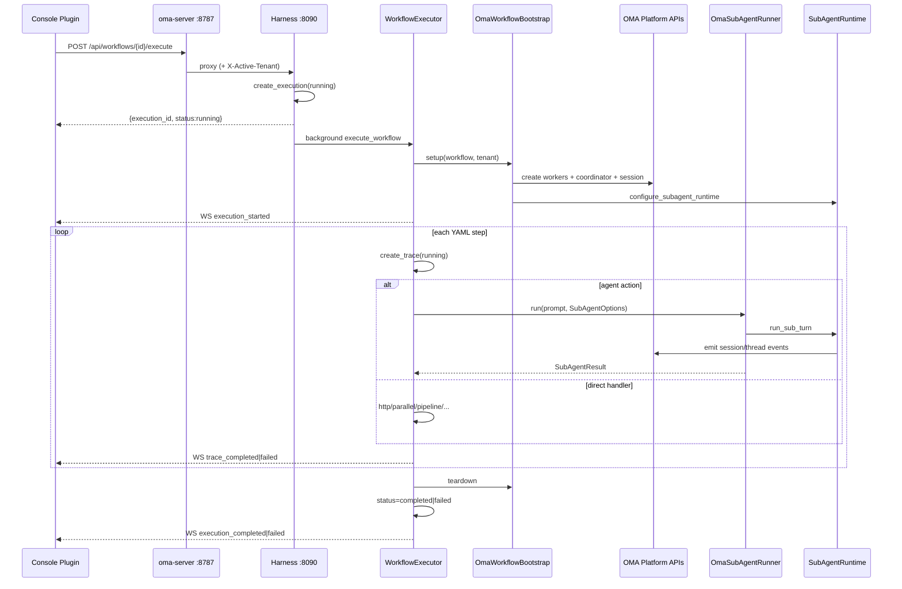

# Dynamic Workflow 执行流程

本文说明 oma-platform 中 **Dynamic Workflows** 的定义、端到端执行链路，以及与 Console、Go 平台、harness 扩展、OMA Session 的协作方式。

## 一句话

**Dynamic Workflows 是一套 YAML 描述的多步骤流水线**：可手写或自然语言生成，由 harness 上的 `pi_dynamic_workflows` 扩展异步执行；Go 平台仅做 `/api/workflows*` 反向代理，Agent 类步骤会挂到 OMA Session 作为子 Agent，执行轨迹可在 Console 与 Session 中查看。

---

## 整体架构

```
Console `/workflows`
    → oma-server :8787（workflows_proxy + 租户头）
        → harness :8090（pi_dynamic_workflows）
            → WorkflowExecutor
                → OmaWorkflowBootstrap（建 Session / Coordinator / Workers）
                → 逐步执行（Agent 步骤 / 直接 Handler）
                → WS 推送 traces + OMA Session 事件
```

| 层 | 职责 |
|---|---|
| **Console 插件** | 生成 / 编辑 / 执行 / Trace 查看 |
| **Go `:8787`** | 鉴权、注入 `X-Active-Tenant`、代理到 harness |
| **Harness `:8090`** | CRUD、YAML 引擎、执行状态机、WebSocket |
| **OMA 桥接** | 创建 Session/Agents，子 turn 写入 Session UI |

**职责分离：**

- **Go**：auth/tenant 注入、反向代理、OMA agents/sessions/events 存储
- **Harness 扩展**：workflow CRUD、YAML 引擎、执行状态机、WS traces
- **桥接层**：bootstrap 创建 OMA 资源；runner 向 Session 发事件，使 Console Sessions 页可看到 workflow 子线程

---

## 入口点

### Console 插件

| 路由 | 组件 | 作用 |
|------|------|------|
| `/workflows` | `WorkflowQuickstart` | 模板 + NL 生成 + 创建/执行 |
| `/workflows/new`, `/workflows/:id` | `WorkflowEditor` | YAML 编辑 / 校验 / 保存 / 执行 |
| `/workflows/:id/traces/:executionId` | `TraceViewer` | 实时 WS traces + 取消 |

- 插件注册：`console/src/plugins/dynamic-workflows/index.tsx`
- 租户头：`workflowApi.ts` → `workflowFetch()` 添加 `x-active-tenant`

### HTTP API（实际执行方 = harness FastAPI）

所有路由前缀 `/api/workflows`，由 `DynamicWorkflowsExtension` 挂载：

| Method | Path | 作用 |
|--------|------|------|
| GET | `/health` | 健康检查 |
| POST | `/generate` | NL → YAML |
| GET/POST | `/templates`, `/templates/{id}` | 内置模板 |
| POST | `/validate` | 仅校验 YAML |
| GET/POST | `` | 列表 / 创建 |
| GET/PUT/DELETE | `/{id}` | CRUD |
| POST | `/{id}/execute` | **启动执行**（后台任务） |
| GET | `/executions/{id}`, `.../traces` | 状态 + traces |
| WS | `/executions/{id}/ws` | 实时事件 |
| POST | `/executions/{id}/cancel` | 取消（仅 `running`） |

源码：`piPy-dynamic-workflows/packages/pi_dynamic_workflows/src/pi_dynamic_workflows/api/routes.py`

### Go 平台（薄代理）

- `internal/api/workflows_proxy.go` — `NewWorkflowsProxy` / `mountWorkflowsProxyRoutes`
- `internal/api/router.go` — 通过 `deps.HarnessURL` 挂载（默认 `http://127.0.0.1:8090`）
- 注入租户：`X-Active-Tenant` 来自 auth context / headers
- 代理 REST **和** WebSocket 到 harness

Go **没有** 原生 workflow 执行器，只做反向代理。

---

## 端到端流程

### 1. 创建 / 生成

1. 用户打开 `/workflows` → Quickstart 加载模板（`GET /api/workflows/templates`）
2. **自然语言路径**：`POST /api/workflows/generate`，body `{prompt}`
   - `generate_workflow_from_nl()`（`lib/workflow_generator.py`）
   - 尝试 piPy agent → 可选 LLM API → 模板兜底
   - 返回 `{yaml, parsed, metadata}`
3. **模板路径**：`GET /api/workflows/templates/{id}` 加载内置 YAML
4. 用户编辑/保存：`POST /api/workflows` 或 `PUT /api/workflows/{id}`
   - `parse_workflow_yaml()` → `database.create_workflow` / `update_workflow`

### 2. 触发执行

```
POST /api/workflows/{id}/execute
Body: { env_vars?, session_id? }
```

1. Console → Go proxy → Harness `execute_workflow`
2. `database.create_execution(...)` → 状态 **`running`**，立即返回 `execution_id`
3. `asyncio.create_task(run_workflow())` 后台执行

### 3. OMA Bootstrap（有 Agent 步骤时）

Harness 启动时通过 `configure_workflow_oma_integration()` 注入：

- `OmaSubAgentRunner`
- `OmaWorkflowBootstrap`

执行开始时 `get_workflow_bootstrap().setup(...)` 会：

1. 为每个独特 Agent 步骤创建 worker agents
2. 创建 coordinator（multiagent roster）+ session
3. `build_subagent_runtime` + `configure_subagent_runtime`
4. 设置 ContextVar worker map `step_name → agent_id`
5. 通过 internal `v1/internal/sessions/{id}/events/batch` 发送 `user.message`
6. 将 `oma_session_id` / `oma_coordinator_id` 持久化到 execution 行

未注入 OMA 时走 `NoopWorkflowBootstrap`：workflow 仍可执行，但不创建 Session。

### 4. 逐步执行

1. 广播 WS `execution_started`
2. 构建 `WorkflowRuntime`（journal、并发 semaphore）
3. 对 YAML 中每个 step 顺序执行：
   - 检查 `depends_on` 是否满足（`step_outputs`）
   - `_execute_step`：创建 trace `running` → 解析 `{{...}}` 参数 → 重试循环 → `_dispatch_action`
   - **Agent actions**：`WorkflowRuntime.run_step_agent` → `OmaSubAgentRunner.run` → `SubAgentRuntime.run_sub_turn` → 事件写入 OMA Session
   - **Direct handlers**：本地 Python handler
   - trace → `completed` / `failed`；WS 推送 `trace_*` 事件
4. `finally`：`OmaWorkflowBootstrap.teardown` 重置 SubAgentRuntime + worker map

### 5. 完成

- 成功 → execution 状态 `completed`，WS `execution_completed`
- 异常 → `failed`，WS `execution_failed`
- 取消 → `POST /executions/{id}/cancel`（仅 `running`）→ `cancelled`
- UI TraceViewer 已订阅 WS；SessionDetail 可通过 `session.thread_created` / `agent.tool_use` 等事件展示 workflow 子线程

---

## 步骤分发：Agent vs Direct

### Agent 动作（走子 Agent）

`llm_execute` / `llm_analyze` / `llm_write` / `file_read` / `file_write` / `web_search`

→ `OmaSubAgentRunner` → `SubAgentRuntime.run_sub_turn` → Session 可见

定义：`pi_dynamic_workflows/lib/sub_agent_constants.py` → `AGENT_ACTIONS`

### 直接 Handler（本地 Python）

`http_request` / `parallel` / `conditional` / `loop` / `pipeline` / `verify` / `judge_panel` / `loop_until_dry` / `approval` / `custom` / `database_query`

注册于 `WorkflowExecutor.action_handlers`（`lib/executor.py`）

---

## 状态机

### Execution

```
create_execution → running
        │
        ├─ 成功路径 → completed (+ completed_at)
        ├─ 未捕获异常 → failed
        └─ cancel API（仅 running）→ cancelled
```

### Trace（每步）

```
create_trace → running
        │
        ├─ 成功 → completed
        ├─ 超时/错误（重试耗尽）→ failed
        └─ depends_on 缺失 → failed (DEPENDENCY_NOT_MET)
```

### WebSocket 事件类型

- `execution_started` / `execution_completed` / `execution_failed`
- `trace_started` / `trace_completed` / `trace_failed` / `trace_retry`

### 核心模型（`lib/types.py`）

- `WorkflowSpec` / `WorkflowStep` / `WorkflowInput` / `RetryConfig`
- `Execution`：`pending | running | completed | failed | cancelled`
- `Trace`：`pending | running | completed | failed | skipped`

---

## 数据持久化

### 表结构

1. `workflows` — YAML + `parsed_spec` JSON + `env_var_refs`、`is_draft`
2. `workflow_executions` — status、env_vars、`oma_session_id`、`oma_coordinator_id`
3. `workflow_traces` — 每步 I/O / error / duration
4. `workflow_journal` — agent 调用哈希，用于 resume / 幂等

DDL：`pi_dynamic_workflows/sql/workflows.sql`

---

## 时序图



### Harness 启动接线（一次性）

```
main.py
  → register_extension() → DynamicWorkflowsExtension.router
  → configure_workflow_oma_integration()
       set_sub_agent_runner(OmaSubAgentRunner)
       set_workflow_bootstrap(OmaWorkflowBootstrap)
```

---

## 关键文件索引

### Console

| 路径 | 作用 |
|------|------|
| `console/src/plugins/dynamic-workflows/index.tsx` | 插件路由/导航 |
| `console/src/plugins/dynamic-workflows/WorkflowQuickstart.tsx` | NL/模板 → 创建 → 执行 |
| `console/src/plugins/dynamic-workflows/WorkflowEditor.tsx` | 编辑/校验/保存/执行 |
| `console/src/plugins/dynamic-workflows/TraceViewer.tsx` | 轮询 + WS 监控/取消 |
| `console/src/plugins/dynamic-workflows/workflowApi.ts` | 带租户的 `fetch` |

### Go 平台

| 路径 | 作用 |
|------|------|
| `internal/api/workflows_proxy.go` | 反向代理 `/api/workflows*` |
| `internal/api/router.go` | 挂载 proxy（`HarnessURL`） |
| `cmd/oma-server/main.go` | `HARNESS_URL` 默认 `:8090` |

### Harness 桥接

| 路径 | 作用 |
|------|------|
| `harness/oma_adapter/main.py` | `register_extension()` + include router + `configure_workflow_oma_integration()` |
| `harness/oma_adapter/workflow_integration.py` | 注入 `OmaSubAgentRunner` + `OmaWorkflowBootstrap` |
| `harness/oma_adapter/workflow_bootstrap.py` | 创建 OMA agents/session + SubAgentRuntime |
| `harness/oma_adapter/workflow_sub_agent_runner.py` | `OmaSubAgentRunner.run` → `run_sub_turn` |

### 扩展包（`pi_dynamic_workflows`）

| 路径 | 作用 |
|------|------|
| `api/routes.py` | REST/WS 端点 |
| `lib/executor.py` | `WorkflowExecutor` 主引擎 |
| `lib/workflow_runtime.py` | DSL：agent/parallel/verify/journal |
| `lib/workflow_bootstrap.py` | Protocol + noop + registry |
| `lib/workflow_sub_agent.py` | Prompt 构建；runner 重导出 |
| `lib/workflow_generator.py` | NL → YAML |
| `lib/yaml_parser.py` | 解析/校验 |
| `lib/param_resolver.py` | `{{input}}` / `{{step.x}}` / env |
| `lib/database.py` | SQLite/MySQL 持久化 |
| `lib/websocket_manager.py` | 实时 WS 广播 |
| `lib/journal.py` | Agent 调用幂等缓存 |
| `lib/types.py` | Pydantic 模型 + 状态字面量 |

扩展源码根目录：`../piPy-dynamic-workflows/packages/pi_dynamic_workflows/src/pi_dynamic_workflows/`

---

## 相关文档

- 上游 JS 参考（生成与执行）：[`piPy-dynamic-workflows/docs/upstream-js-generation-and-execution.md`](../../../../piPy-dynamic-workflows/docs/upstream-js-generation-and-execution.md)
- Orchestration 对照（piPy vs 上游）：[`piPy-dynamic-workflows/docs/orchestration-comparison.md`](../../../../piPy-dynamic-workflows/docs/orchestration-comparison.md)
- 平台 README：`oma-platform/README.md`（Dynamic workflows 概述）
- 扩展 README：`piPy-dynamic-workflows/README.md`
- 扩展架构：`piPy-dynamic-workflows/v1/ARCHITECTURE.md`
- 迁移设计：`piPy-dynamic-workflows/migrate/t-wangwei07-master-design-20260626-182600.md`
- Console 插件说明：`console/src/plugins/dynamic-workflows/README.md`
