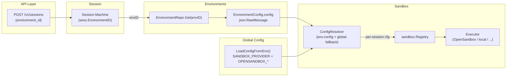

# Environments 绑定到 Sandbox 运行时

**目标**：把 "Environment" 从当前只是元数据标记的占位，升级成能真正决定 sandbox 运行时的实体。每个 Environment 在其 `config` JSON 里声明用哪个 sandbox provider + 该 provider 的参数。Session 启动时，按它绑定的 EnvironmentID 解析出 sandbox 配置，再交给 `sandbox.Registry` 去 Acquire——不再走全局的 `SANDBOX_PROVIDER`。

**MVP 聚焦**：OpenSandbox provider 第一个完整接入 per-environment 绑定。其它 provider（`local` / `e2b` / `daytona` / `litebox` / `boxrun`）保持现有全局行为作为回退，未来按需扩展。

**附带约束**：OpenSandbox 默认镜像切换到 slim 瘦身版本（`python:3.12-slim`），Environment config 可以覆盖镜像 URI。

## 一句话总结

**把 `sandbox.Config` 的解析从"部署时一次性读 env vars"改成"每个 session 根据其 environment_id 查 Environment.config 动态解析"，全局 Config 只作回退；OpenSandbox 的默认镜像切到 `python:3.12-slim`，并允许 Environment 覆盖。**

## 在整体架构中的位置



现在（红色）：`M → Reg（global cfg）→ Ex`。Environment.config 完全不参与。
未来（绿色）：`M → env.config → Resolver（回退 global cfg）→ Reg → Ex`。

## 当前状态（baseline）

1. **`store.EnvironmentConfig`**（`internal/store/environments.go`）已经存在：
   - `config json.RawMessage` 字段当前只写 `{"type":"local"}`（默认环境）或用户自定义
   - 没有 schema 校验；`type` 字段形同虚设
2. **`session.Session.EnvironmentID`** 已经在 createSessionRequest 里暴露（`environment_id` 字段），写入 `sessions.environment_id` 列
3. **`Machine.Workdirs.Sandbox`** 是 `*sandbox.Registry`，`main.go:135` 处一次性 `sandbox.NewRegistry(sandboxCfg)` 注入，整个进程共享
4. **`Registry.Acquire`** 只看 `r.cfg.Provider` 决定走哪个 Executor，完全不感知 EnvironmentID
5. **`sandbox.Config`** 由 `LoadConfigFromEnv()` 从 `SANDBOX_PROVIDER` + `OPENSANDBOX_*` / `E2B_*` / `DAYTONA_*` 等 env vars 加载

也就是说，"Environment" 现在是个**标签**，对执行路径没有任何影响。

## 数据模型：Environment.config 的 schema

引入一个强类型的内部结构（仍按 json.RawMessage 序列化到 SQLite），把当前散在 env vars 里的 provider 参数收拢到一个自描述的 JSON：

```jsonc
// Environment.config 示例 — OpenSandbox 运行时
{
  "type": "sandbox",
  "sandbox": {
    "provider": "opensandbox",
    "opensandbox": {
      "domain":        "124.221.28.203:18090",
      "protocol":      "http",
      "api_key_env":   "OPENSANDBOX_API_KEY",     // 引用进程 env var，避免明文写库
      "use_server_proxy": true,
      "execd_port":    44772,
      "image":         "python:3.12-slim",         // ← slim 瘦身镜像
      "entrypoint":    "",                          // 空 → 默认 ["tail","-f","/dev/null"]
      "timeout_seconds": 3600,
      "cpu":           "500m",
      "memory":        "512Mi"
    }
  }
}
```

```jsonc
// 默认 Environment（保持现有行为）
{ "type": "local" }

// 未来：e2b
{
  "type": "sandbox",
  "sandbox": {
    "provider": "e2b",
    "e2b": {
      "template_id": "my-agent-template",
      "api_key_env": "E2B_API_KEY"
    }
  }
}
```

**关键设计选择**：

- **`type` 字段保留两种值**：`"local"` 表示沿用"本机 workdir 子进程"的旧语义（向后兼容）；`"sandbox"` 表示要走 sandbox provider 解析。
- **API key 走引用不走向量**：`api_key_env` 存的是 env var 名字，运行时从 `os.Getenv` 取。避免 secret 落库；key rotation 不需要改数据库。
- **`sandbox` 对象内部按 provider 名字分桶**：将来加 daytona/litebox 只是加新字段，schema 向后兼容。
- **缺失字段走 provider 默认值**：与现有 `sandbox.Config` 的 LoadConfigFromEnv 默认值对齐（见下表）。

### OpenSandbox 默认值对照

| 字段 | 来自 env var 的默认 | JSON 缺失时默认 |
|------|---------------------|------------------|
| `domain` | `OPENSANDBOX_DOMAIN`（必填） | 回退到全局 |
| `protocol` | `"http"` | `"http"` |
| `api_key_env` | `"OPENSANDBOX_API_KEY"` | `"OPENSANDBOX_API_KEY"` |
| `use_server_proxy` | `true` | `true` |
| `execd_port` | `44772` | `44772` |
| `image` | `OPENSANDBOX_IMAGE`（默认 `python:3.12`） | **`python:3.12-slim`** ← MVP 变更 |
| `entrypoint` | `""` | `""`（运行时 fallback `tail -f /dev/null`） |
| `timeout_seconds` | `3600` | `3600` |
| `cpu` | `"500m"` | `"500m"` |
| `memory` | `"512Mi"` | `"512Mi"` |

**MVP 变更**：`sandbox.LoadConfigFromEnv()` 里 `OpenSandboxImage` 的默认值从 `python:3.12` 改成 `python:3.12-slim`。所有路径（全局回退 + JSON 缺失）都切到 slim。这是本次"Slime 瘦身"要求的具体落点。

## 解析流程：ConfigResolver

新增 `internal/sandbox/resolver.go`：

```go
// Resolver 把 (EnvironmentConfig, global Config) 合并成 Acquire 用的 Config。
// 规则：
//   1. env.config 为空 / type == "local" / 解析失败 → 返回 globalCfg 原样
//   2. env.config.type == "sandbox" → 读 sandbox.provider，按 provider 填字段，
//      缺失字段继承 globalCfg（这样 OPENSANDBOX_DOMAIN 这类"部署级 secret"
//      仍可只在 env vars 里给一份，环境 JSON 只写差异）
//   3. 未知 type → 返回 globalCfg 原样，不报错（容忍未来扩展）
type Resolver struct {
    globalCfg Config
}

func (r *Resolver) Resolve(envCfg *store.EnvironmentConfig) Config { ... }
```

**为什么不是"Environment.config 完全自描述、完全不回退"**：
- `OPENSANDBOX_DOMAIN` / `E2B_API_KEY` 这类值通常是部署级基础设施，同一套 oma-server 进程下所有 OpenSandbox environment 共用同一个 lifecycle server。让 JSON 只声明"差异"（比如镜像名）更贴合实际。
- 但**镜像、CPU、memory、timeout 这些**"运行规格"允许环境自己覆盖——这正是 per-environment 的价值所在。

## Registry 的变化

Registry 内部不变——它仍然持有"一个 Config + 一组 per-session Executor"。变化在**谁持有 Registry**：

```mermaid
flowchart LR
    subgraph before[Before]
        M1["main.go"] -->|new once| GR["*Registry<br/>(global cfg)"]
        GR --> WM["Workdirs.Sandbox"]
        WM --> MC["Machine"]
    end

    subgraph after[After]
        M2["main.go"] -->|new once| GR2["*Registry<br/>(global cfg = fallback)"]
        M2 -->|new once| RES["*Resolver"]
        ERS["EnvironmentRepo"] --> RES
        RES -->|per-session cfg| GR2
        WM2["Workdirs.Sandbox"] --> MC2["Machine"]
        MC2 -->|AcquireWith(cfg)| GR2
    end
```

具体接口变化：

```go
// 现有
func (r *Registry) Acquire(ctx, opts) (Executor, error)

// 新增
func (r *Registry) AcquireWith(
    ctx context.Context,
    cfg Config,            // 已解析的 per-session cfg
    opts AcquireOpts,
) (Executor, error)
```

`AcquireWith` 内部按 `cfg.Provider` 走 switch（与现有 `Acquire` 一致），区别是它使用传入的 cfg 而不是 `r.cfg`。**老的 `Acquire` 保留，内部调 `AcquireWith(r.cfg, opts)`**，保持兼容。

session cache key 也要跟着变：现在 key 是 `sessionID`，未来是 `(sessionID, provider, identity)`，避免同一 session 在环境切换后复用旧 provider 的 executor。MVP 用 `sessionID` 即可——session 一旦创建 EnvironmentID 不可变（见下文）。

## Machine 端的接线

`internal/session/machine.go` 的 turn-start 逻辑改造：

```go
// 现状
if m.Workdirs.Sandbox.Config().IsRemote() {
    m.Workdirs.Sandbox.Acquire(ctx, opts)
}

// 改为
sess, _ := m.Sessions.Get(ctx, m.SessionID)
envCfg, _ := m.Environments.Get(ctx, m.TenantID, sess.EnvironmentID)
resolved := m.SandboxResolver.Resolve(envCfg)      // Resolver.Resolve(nil) → globalCfg
if resolved.IsRemote() {
    m.Workdirs.Sandbox.AcquireWith(ctx, resolved, opts)
}
```

`m.SandboxResolver` 是新注入的依赖，`Machine` struct 多一个字段。`main.go` 里：

```go
resolver := sandbox.NewResolver(sandboxCfg)       // 包一层
// 注入 Machine 构造时带上 resolver + EnvironmentRepo
```

**EnvironmentID 缺失的处理**：`store.SessionRepo` 在 `EnvironmentID == ""` 时已经会填 `DefaultEnvironmentID`（"env-local-default"），所以 Machine 一定能拿到一个 envID，不会出现 nil。

## Release 路径

`Registry.Release(sessionID)` 不变——destroy 当前 session 的 executor。因为 session→environment 是 1:1（session 创建后 EnvironmentID 不可变），按 sessionID 索引就够了。

## OpenSandbox Slim 镜像

**背景**：标准 `python:3.12` 镜像 ~900MB，启动慢、占磁盘。slim 变体 ~150MB，去掉文档/编译器/locales，对纯 shell+Python 执行足够。OpenSandbox 对镜像没有特殊依赖（execd 是预装在镜像里的 agent，slim 不会缺它）。

**落点**：

1. `sandbox/provider.go` 的 `LoadConfigFromEnv`：
   ```go
   OpenSandboxImage: envOrDefault("OPENSANDBOX_IMAGE", "python:3.12-slim"),
   ```
2. `opensandbox.go` 的构造器默认分支：
   ```go
   image := cfg.OpenSandboxImage
   if image == "" {
       image = "python:3.12-slim"
   }
   ```
3. `.env.example`：
   ```
   OPENSANDBOX_IMAGE=python:3.12-slim
   ```
4. `docs/design/opensandbox-environment.md`：把"默认 python:3.12"的描述改成 `python:3.12-slim`
5. 单元测试 `opensandbox_test.go`：断言默认镜像是 `python:3.12-slim`
6. Smoke 脚本 `smoke-opensandbox-e2e.sh`：`IMAGE` 默认值切到 slim

**回退阀**：保留 `OPENSANDBOX_IMAGE` env var，用户仍可覆盖。Environment.config 也允许覆盖（见 schema 示例）。

**验证**：slim 镜像需要包含 execd agent。首次切换时跑一遍 smoke script，确认 `/ping`、`/command`、`/files/download` 都能工作。如果 slim 缺了什么依赖（例如 `base64` / `mkdir` / `bash`），再换 `python:3.12-alpine` 或定制镜像。

## 错误处理与边界

| 场景 | 行为 |
|------|------|
| `EnvironmentRepo.Get` 失败 | 返回 global cfg，记 warn 日志（不阻塞 session 启动） |
| env 不存在（被删了） | 同上，回退 global |
| env.config 不是合法 JSON | 同上，回退 global |
| env.config.type == "sandbox" 但 sandbox.provider 缺失 | 同上，回退 global |
| env.config 解析出未知 provider | 同上，回退 global |
| env.config 缺 `domain` 等必填字段 | 用 global cfg 的对应字段填充 |
| 全局 cfg 也是空（没有任何 provider 配置） | 退化成 `local` provider |
| session 已存在但 environment 被 archive | 已起的 session 继续工作；新 session 不能在创建时引用 archived env（API 层校验） |

**关键原则：Resolver 永远不返回 error**——它只会在"环境配置不可用"时默默回退到全局配置，保证 session 启动不会因为环境配置问题崩掉。真正的错误（比如 OpenSandbox lifecycle 不可达）由 Executor 构造时抛出，与今天的行为一致。

## 向后兼容

- **没有 EnvironmentID 的旧 session**：store 层补成 `DefaultEnvironmentID`（已经是现状），Resolver 解析出 `{"type":"local"}` → 用 global cfg → 行为完全不变
- **只有 env vars 没有 Environment.config 的部署**：`SANDBOX_PROVIDER=opensandbox` + `OPENSANDBOX_DOMAIN=...` 仍然工作——global cfg 作为回退被 Resolver 透传
- **`DefaultEnvironmentID` 的 config**：保持 `{"type":"local"}`，永远走 local provider（即使 global cfg 切到 remote）。这意味着默认环境下的 session 行为完全不变
- **多租户**：`EnvironmentRepo.Get` 已经按 `tenantID` 隔离，不同租户可以创建不同的 sandbox 环境

## 不做（显式排除）

- **动态切换 sandbox provider（热更新）**：Environment.config 改了不会影响已存在的 session，只影响新建的。MVP 不做"环境修改 → 踢掉现存 session"
- **Environment.config 的热加载缓存**：每次 session 启动现查 DB。SQLite 读很便宜，不用缓存；后续如果走外部 DB 再加
- **多 provider 同时预热**：Registry 仍是按需创建 executor
- **UI 上的"环境选择器"**：Console 改动不在本设计范围。MVP 用 API 直接创建 Environment + 在 session create 时传 `environment_id`
- **Provider-specific 字段的全量暴露**：例如 OpenSandbox 的 `networkPolicy`、`credentialProxy` 留到后续设计。本设计只暴露 schema 里已列出的字段
- **Environment.config schema 校验**：MVP 用宽松解析（unknown field 忽略、missing field 用默认）。严格 JSON schema 校验留到后续

## 验收标准

1. **创建 OpenSandbox 环境**：
   ```bash
   curl -X POST /v1/environments \
     -H "x-api-key: $KEY" -H "content-type: application/json" \
     -d '{
       "name": "opensandbox-slim",
       "config": {
         "type": "sandbox",
         "sandbox": {
           "provider": "opensandbox",
           "opensandbox": {
             "domain": "124.221.28.203:18090",
             "image": "python:3.12-slim"
           }
         }
       }
     }'
   ```
2. **创建使用此环境的 session**：
   ```bash
   curl -X POST /v1/sessions \
     -d '{"agent":"<id>","environment_id":"<env-id>"}'
   ```
   启动 turn 后，lifecycle server 能看到新 sandbox（metadata 含 `oma_session_id`），且镜像是 `python:3.12-slim`
3. **同一进程的另一个 session 不传 environment_id**：走 default environment → local provider → 不创建任何 sandbox
4. **全局 `SANDBOX_PROVIDER=opensandbox` + 不传 environment_id**：行为与现在一致（用 global cfg 透传）
5. **slim 镜像 smoke 通过**：`scripts/e2e/smoke-opensandbox-e2e.sh` 默认镜像切到 slim 后仍然 PASS
6. **单元测试**：`sandbox/resolver_test.go` 覆盖全部回退分支；现有 `opensandbox_test.go` 断言默认镜像是 slim

## 文件清单

| 文件 | 改动 |
|------|------|
| `internal/sandbox/resolver.go` | 新增：Resolver + Environment.config schema 解析 |
| `internal/sandbox/resolver_test.go` | 新增：覆盖 default env / sandbox+opensandbox / missing fields / invalid JSON |
| `internal/sandbox/provider.go` | `OpenSandboxImage` 默认值改 `python:3.12-slim` |
| `internal/sandbox/opensandbox.go` | 默认 image 改 slim |
| `internal/sandbox/registry.go` | 新增 `AcquireWith(ctx, cfg, opts)`；老 `Acquire` 改成调它 |
| `internal/session/machine.go` | turn-start 调 Resolver 解析 env → 调 `AcquireWith` |
| `internal/session/machine_test.go` | 新增：环境解析 → provider 切换的测试 |
| `cmd/oma-server/main.go` | 构造 Resolver 注入 Machine |
| `internal/api/environments.go` | （可选）创建/更新时做基础 schema 校验 |
| `.env.example` | `OPENSANDBOX_IMAGE=python:3.12-slim` |
| `docs/design/opensandbox-environment.md` | 默认镜像描述更新 |
| `scripts/e2e/smoke-opensandbox-e2e.sh` | `IMAGE` 默认改 slim |
| 本文 | `docs/design/environment-sandbox-binding.md` |

## 风险与未知

1. **slim 镜像缺依赖**：`python:3.12-slim` 基于 Debian bookworm-slim，移除了 `bash`（只有 `sh`）。execd 可能假设 `bash` 存在。第一次切过去要跑一遍 smoke，发现问题就换成 `python:3.12-alpine` 或自建镜像。
2. **Environment.config schema 漂移**：宽松解析意味着老环境可能意外匹配新语义。靠约定 + 文档控制，MVP 不做版本字段。
3. **Registry 内存里按 sessionID 索引**：如果未来要支持"同一 session 切换环境"，cache key 需要重构。MVP 假设 session→environment 是 1:1，不处理。
4. **`api_key_env` 引用 env var**：env var 改了不会通知到已在跑的 session。Key rotation 需要重启 oma-server 或等旧 session 自然结束。可接受。

## 后续迭代（不在 MVP）

- 支持 e2b / daytona / litebox / boxrun 的 per-environment 绑定（Resolver 框架已就位，加 case 即可）
- Console UI 环境选择器
- 环境修改 → 通知现存 session
- JSON schema 严格校验 + 版本字段
- OpenSandbox `networkPolicy` / `credentialProxy` 暴露到 Environment.config
- `snapshots` / `renew-expiration` 在 per-environment 上下文的语义

---

# 工程评审笔记（plan-eng-review）

## 1. 架构评审

### 1.1 Silent fallback 是一个安全坑

设计里"Resolver 永远不返回 error，默默回退 global cfg"对可用性友好，但对安全有害：

- 场景：管理员创建了一个 `type: "sandbox", provider: "opensandbox"` 的环境，但 JSON 拼写错误（比如 `"provder": "opensandbox"`）。宽松解析把它当 unknown provider，回退到 global cfg。如果 global cfg 是 `local`，本该跑在远程容器里的 agent 代码直接跑在宿主机 workdir 里。
- 修复建议：Resolver 返回一个带 `UsedFallback bool` + `FallbackReason string` 的结构体。Machine 在 `UsedFallback && envCfg != nil` 时记 warn 日志 + 在 session event 里留一条 `environment_fallback` 事件，方便事后审计。仍然不抛 error（保证可用性），但留下可追溯的痕迹。

### 1.2 Schema 类型放哪儿？（避免 import cycle）

`EnvironmentConfig` 在 `internal/store` 包里。如果 sandbox 解析逻辑要读它的 config 字段，会引入 `sandbox → store` 依赖。同时 Machine 在 `internal/session` 里要同时用 store 和 sandbox。路径：

```
session → store  (已有)
session → sandbox  (已有)
sandbox → store  (新增,如果 Resolver 直接吃 *store.EnvironmentConfig)
```

不会成环，但耦合变紧。更干净的做法：

- 在 `internal/sandbox/` 定义一个轻量 `EnvironmentView { ID, ConfigJSON []byte }` 结构
- Resolver 接收 `EnvironmentView`，store 负责把 `EnvironmentConfig` 映射到 `EnvironmentView`
- `session/machine.go` 做这个映射（它已经同时依赖两个包）

这样 sandbox 包完全不知道 store 的存在。

### 1.3 Session → Environment 1:1 不变量需要强制

设计假设"session 创建后 EnvironmentID 不可变"。但当前 `store.SessionRepo.Update` 没有显式禁止 `EnvironmentID` 字段被改。建议：

- `SessionRepo.Update` 的 SQL `UPDATE sessions SET ...` 不包含 `environment_id`（直接排除该列）
- 在 Session store 层加注释明确"environment_id is immutable after creation"
- 加一个单元测试：Update 调用带不同 EnvironmentID，断言数据库里值没变

### 1.4 `api_key_env` 引用的双刃剑

好处：避免 secret 落库。风险：
- 用户可能误把 literal key 写进 JSON（"我就想这个 env 用这个 key"）。文档要写明这个字段**只接受 env var 名字**。
- 跨环境复用同一个 env var 名字时，rotation 一次性影响所有引用它的环境——可接受，但需要文档说明。
- MVP 之后可以考虑支持 `api_key_ref: {vault: "...", key: "..."}` 引用 Vault（与 `docs/design/vault-and-credentials.md` 对齐）。

### 1.5 Registry cache key

设计里说"session→environment 1:1 所以 sessionID 足够"。但 `Registry.sessions` 是个 `map[string]Executor`，executor 持有 sandboxID 这种重资源。如果某天 session 真的能切环境，cache key 不变就会复用旧 provider 的 executor——**资源泄漏 + 跨环境串数据**。

MVP 接受这个风险，但建议在 Registry 内部加一行注释，并在 executor 上打一个 `environmentID` tag 方便调试：

```go
type Executor interface {
    ...
    EnvironmentID() string
}
```

## 2. 代码质量评审

### 2.1 `Acquire` vs `AcquireWith` 重构

当前 `Acquire` 内部有 6 路 switch。加 `AcquireWith(cfg, opts)` 时：

```go
func (r *Registry) Acquire(ctx, opts) (Executor, error) {
    return r.AcquireWith(ctx, r.cfg, opts)
}

func (r *Registry) AcquireWith(ctx, cfg Config, opts) (Executor, error) {
    // 真正的实现
    switch cfg.Provider { ... }
}
```

不要让两个方法各自维护一份 switch。

### 2.2 Default image 切换是 breaking change

`python:3.12` → `python:3.12-slim` 会影响：
- 已经用 `OPENSANDBOX_IMAGE` 默认值的部署：升级后下次创建 sandbox 镜像变小。通常是好事，但如果用户依赖 `gcc` / `build-essential` 在 sandbox 里编译东西，会突然失败。
- 已经在跑的 sandbox 不受影响（image 是 create 时决定的）。

建议：
- 在 changelog / release notes 显式说明
- 保留 `OPENSANDBOX_IMAGE=python:3.12` 一行在 `.env.example` 注释里作为回退选项（已做）
- 第一次 smoke 时验证 slim 真的能跑通（特别是 bash vs sh 的问题——slim 镜像默认只有 `dash`，execd 的命令如果硬编码 `/bin/bash` 会失败）

### 2.3 Schema 结构体的命名

建议：

```go
// internal/sandbox/resolver.go
type EnvironmentSandboxConfig struct {
    Type     string              `json:"type"`     // "local" | "sandbox"
    Sandbox  *SandboxRuntimeSpec `json:"sandbox"`
}

type SandboxRuntimeSpec struct {
    Provider    string                   `json:"provider"`
    OpenSandbox *OpenSandboxEnvSpec      `json:"opensandbox,omitempty"`
    // 未来加 E2B *E2BEnvSpec 等
}

type OpenSandboxEnvSpec struct {
    Domain          string `json:"domain,omitempty"`
    Protocol        string `json:"protocol,omitempty"`
    APIKeyEnv       string `json:"api_key_env,omitempty"`
    UseServerProxy  *bool  `json:"use_server_proxy,omitempty"`
    ExecdPort       int    `json:"execd_port,omitempty"`
    Image           string `json:"image,omitempty"`
    Entrypoint      string `json:"entrypoint,omitempty"`
    TimeoutSeconds  int    `json:"timeout_seconds,omitempty"`
    CPU             string `json:"cpu,omitempty"`
    Memory          string `json:"memory,omitempty"`
}
```

注意 `UseServerProxy *bool`（pointer）区分"缺失" vs "false"。其它 int/string 零值与默认值相同，可以用零值代表缺失。

### 2.4 Resolver 的依赖注入

Machine 加 `SandboxResolver *sandbox.Resolver` 字段时，所有 `session.NewMachine(...)` 调用点都要传。`integrationtest/` 里的测试 fixture 也得更新。建议：

- Resolver 无状态（不持有 DB 引用），只持有 global cfg
- 构造函数 `sandbox.NewResolver(globalCfg Config) *Resolver`
- Machine 调用 `resolver.Resolve(envView)` 而不是依赖 Repo

## 3. 测试评审

### 3.1 Resolver 测试矩阵（`sandbox/resolver_test.go`）

| 输入 env.config | global cfg | 期望输出 |
|-----------------|------------|----------|
| `nil` (env 不存在) | opensandbox | global cfg, UsedFallback=true |
| `{}` (空 JSON) | opensandbox | global cfg, UsedFallback=true |
| `{"type":"local"}` | opensandbox | Provider=local, UsedFallback=false（显式 local） |
| `{"type":"sandbox","sandbox":{"provider":"opensandbox"}}` (字段全缺) | opensandbox | global cfg 的 OpenSandbox 字段 |
| `{"type":"sandbox","sandbox":{"provider":"opensandbox","opensandbox":{"image":"custom:v1"}}}` | opensandbox | global cfg + image=custom:v1 |
| `{"type":"sandbox","sandbox":{"provider":"opensandbox","opensandbox":{"domain":"other:18090"}}}` | opensandbox domain=X | domain=other:18090 覆盖 global |
| `{"type":"sandbox","sandbox":{"provider":"e2b"}}` (MVP 不支持) | opensandbox | global cfg, UsedFallback=true |
| `not json` | opensandbox | global cfg, UsedFallback=true |
| `{}` | local | Provider=local |

### 3.2 Slim 镜像 smoke 验证

`scripts/e2e/smoke-opensandbox-e2e.sh` 已切到 slim。第一次跑的时候要特别验证：

- `execd /ping` 在 slim 镜像里能起来
- `echo $MARKER && uname -s && pwd` 跑通（需要 `echo`、`uname`、`pwd`，slim 都有）
- `base64 -w0` 在 ReadFile fallback 里——slim 的 coreutils 是否包含 `base64`？如果没有，fallback 会失败。验证方法：把 `/files/download` 接口故意打挂，看 fallback 表现
- `mkdir -p /workspace`（sandbox init 阶段）——slim 有 `mkdir`

### 3.3 Machine 集成测试

需要一个新测试：

```go
func TestMachine_UsesEnvironmentSandboxConfig(t *testing.T) {
    // 1. 创建 env with opensandbox config (mock lifecycle server)
    // 2. 创建 session with that environment_id
    // 3. Start turn
    // 4. 断言 mock lifecycle 收到了 POST /v1/sandboxes，且 image 字段是 env.config 指定的值
}
```

### 3.4 默认环境的不变性测试

```go
func TestDefaultEnvironment_AlwaysLocal(t *testing.T) {
    // 即使 global cfg 是 opensandbox，DefaultEnvironmentID 的 env.config
    // 是 {"type":"local"}，解析结果必须是 Provider=local
}
```

## 4. 性能评审

### 4.1 Session 启动的额外 SQLite 查询

每个 session turn 开始多一次 `EnvironmentRepo.Get(envID)` 查询。SQLite 单表主键查询 < 1ms，可以忽略。

如果未来换外部数据库（Postgres）+ 高并发，考虑：
- `EnvironmentRepo` 加进程内 LRU cache（TTL 30s，按 tenantID+envID 键）
- 或者：Machine 只在 session 创建时读一次 env，把解析后的 sandbox cfg 存到 `sessions` 表的新列 `sandbox_config_snapshot`

MVP 不做任何缓存。

### 4.2 Registry 的内存占用

每个 remote session 持有一个 Executor（含 httpClient、sandboxID、execdURL）。与现状一致，没有新增内存压力。

### 4.3 Resolver 本身的成本

Resolver 是无状态的纯函数（JSON 解析 + 字段合并）。每次 ~几微秒。不需要缓存。

## 风险清单（按严重度）

| 级别 | 风险 | 缓解 |
|------|------|------|
| 🔴 高 | Silent fallback 让错误配置的执行路径偏离用户预期 | Resolver 返回 `UsedFallback` + 记 `environment_fallback` session event |
| 🟡 中 | Slim 镜像缺依赖（`bash` / `base64`）导致执行失败 | Smoke 验证 + 保留 `OPENSANDBOX_IMAGE` 覆盖能力 |
| 🟡 中 | Session 的 envID 不可变不变量没被强制 | store.Update 排除 environment_id 列 + 单元测试 |
| 🟢 低 | Schema 演进时老环境的 JSON 意外匹配新语义 | 加 `version` 字段（后续） |
| 🟢 低 | API key env var 引用让错误信息难定位 | 文档 + 错误消息里显式提示"这是 env var 名字" |

## 实施顺序建议

1. **Phase 1 — Slim 镜像切换**（已完成）：`provider.go` / `opensandbox.go` / `.env.example` / 文档 / smoke 默认都切到 slim，验证 smoke 通过
2. **Phase 2 — Resolver 框架**：`sandbox/resolver.go` + `resolver_test.go`（不接线，只测）
3. **Phase 3 — Registry 重构**：`AcquireWith(ctx, cfg, opts)`，老 `Acquire` 改成调它
4. **Phase 4 — Machine 接线**：Machine 调 Resolver 解析 env → `AcquireWith`。集成测试覆盖
5. **Phase 5 — API schema 校验**（可选）：`/v1/environments` 创建时做基础 JSON schema 校验，拒绝明显错误的 config
6. **Phase 6 — 文档 & 运维**：release notes 说明 default image breaking change + 新 Environment API 用法
