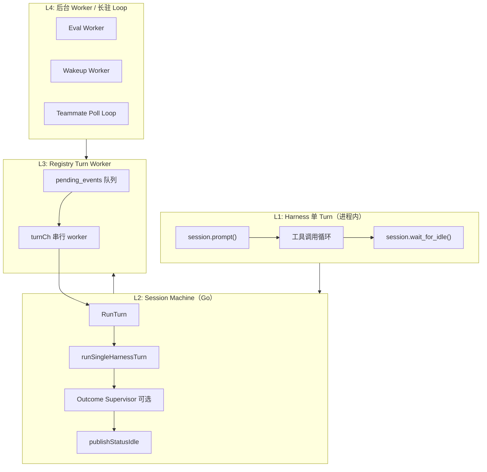
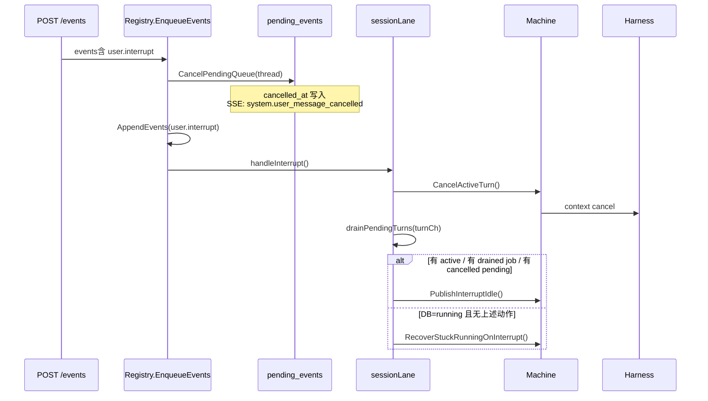

# 循环任务的终止保障

本文说明 meta-harness 中 **「循环反复跑」的任务** 在哪些场景会出现、系统如何 **保证它们最终会结束**，以及客户端如何可靠感知结束态。

## 一句话

OMA 里没有「无限跑下去」的单点循环：每一层循环都绑定了 **明确的退出条件**（模型自然停手、迭代上限、超时、用户中断、显式取消或终态判定），并通过 **Session 状态机 + `stop_reason` 事件** 把「这一轮真的结束了」广播给 Console / SDK。

---

## 生活类比

| 循环类型 | 类比 | 怎么停下来 |
|----------|------|------------|
| Harness 单轮内的 LLM ↔ 工具 | 厨师反复试菜、改配方 | 模型不再调工具 → `wait_for_idle` |
| Session Turn 队列 | 前台按号叫客 | 每轮只处理一条 pending；interrupt 清空队列 |
| Outcome Supervisor 改稿循环 | 导师批改作业、要求重写 | `max_iterations` 或 rubric 判定 `satisfied` |
| HITL 自定义工具 | 等用户点批准 | 外部提交 `custom_tool_result` → 下一轮 `end_turn` |
| Schedule / Cron 唤醒 | 闹钟 | one_shot 响一次删；cron 需 `cancel_schedule` |
| Agent Team Poll Loop | 专员盯邮箱 | 空闲超时 / shutdown 协议 / turn 结束清理 |
| Eval Trial 多轮发题 | 监考逐题发卷 | 消息发完或 trial 超时 |

---

## 系统中的「循环」分层



理解终止机制的关键：**先分清循环发生在哪一层**。上层依赖下层先 idle，再决定是 `end_turn`、`requires_action` 还是进入下一层循环。

---

## L1：Harness 单轮 LLM ↔ 工具循环

### 发生什么

每个 `RunTurn` 在 Python harness 里调用 piPy `session.prompt()`，模型可能多轮调用 bash / MCP / subagent 等工具。这是 **最短周期** 的「反复跑」。

### 如何结束

| 机制 | 说明 |
|------|------|
| **模型自然停手** | 不再产生 tool call 后，`session.wait_for_idle()` 返回，单轮 harness 结束 |
| **Turn 级超时** | `HARNESS_TURN_TIMEOUT_SEC`（默认 **900s**）包裹整次 `run_turn`；超时返回 `504` / `session.error` |
| **Context 取消** | Go `Machine.CancelActiveTurn()` 取消 turn context → harness 收到 `context.Canceled` → `finishInterruptedTurn` |
| **Custom tool 挂起** | 若 turn 结束时仍有未答复的 custom tool，返回 `pending_custom_tool_ids`；**不在 harness 内死循环等用户** |

Turn 结束时 harness 还会：

- `await` 所有 subagent `background_tasks`（同步后台委派）
- 调用 `loop_manager.stop_all_for_session()` 停止该 Session 的 Teammate poll loop

实现入口：`harness/oma_adapter/turn.py`（`session.prompt` → `wait_for_idle` → `finally` 清理）。

---

## L2：Session Machine — 一轮 Turn 与 Outcome 改稿循环

### 2.1 单轮 Turn 生命周期

```text
BeginTurn (DB status=running)
  → session.lifecycle turn_start
  → session.status_running
  → RunTurnStreaming (L1)
  → session.lifecycle turn_end
  → [可选] Outcome Supervisor
  → publishStatusIdle (session.status_idle + stop_reason)
  → EndTurn (DB status=idle)
```

**并发保护**：同一 Session 同时只允许一个 active turn（`Machine.activeTurn` + `turn already active` 错误）。

**HTTP 超时**：平台调用 harness 流式接口使用 **无 Client.Timeout** 的长连接；进程内 turn 超时由 harness 的 `TURN_TIMEOUT_SEC` 负责。非流式 fallback 默认 **10 分钟**（`internal/harness/client.go`）。

### 2.2 `stop_reason` — 区分「真结束」与「等人」

Turn 结束后 `publishStatusIdle` 根据历史事件计算 `stop_reason`：

| `stop_reason.type` | 含义 | 是否算「任务结束」 |
|--------------------|------|-------------------|
| `end_turn` | 无 pending custom tool，本轮正常收工 | ✅ 对调用方是 turn 完成 |
| `requires_action` | 仍有未答复 custom tool（HITL） | ⏸ Session idle，但 **业务上未结束**；需外部补 `user.custom_tool_result` 再 enqueue turn |

`requires_action` 携带最多 **5** 个 `event_ids`（滑动窗口，与 managed-agents 对齐），见 `internal/harness/pending_custom_tools.go`。

**Interrupt 特例**：用户 `user.interrupt` 时强制 `stop_reason: end_turn` 并清空 pending tool metadata，避免 HITL 面板在打断后仍显示「待操作」（`PublishInterruptIdle`）。

### 2.3 Outcome Supervisor — 有上限的「改到满意为止」

当 Session metadata 存在 active `outcome`（来自 `user.define_outcome`）且 **无 pending custom tool** 时，`RunTurn` 在 harness turn 之后进入 **Outcome Supervisor** 循环：

```text
for iteration < max_iterations:
  评估 agent 输出
  if 终态 (satisfied | failed | interrupted | max_iterations_reached):
    清除 metadata.outcome → return
  注入 user.message (outcome_feedback)
  runSingleHarnessTurn()  # 再来一轮 L1
```

**迭代上限**：

- 默认 `max_iterations = 3`
- API 校验 clamp 到 **1～20**（`clampMaxIterations`）

**终态集合**（`terminalOutcomeResults`）：

- `satisfied` — rubric 通过
- `max_iterations_reached` — 用尽迭代或最后一轮仍 `needs_revision`
- `failed` — 评估器错误、harness 崩溃、rubric 解析失败等
- `interrupted` — context 取消

终态时写入 `span.outcome_evaluation_end` 并 **清除** `metadata.outcome`，防止后续 turn 再次进入 supervisor。

实现：`internal/session/outcome_supervisor.go`、`internal/session/outcome_state.go`。

---

## L3：Pending 队列与 Turn Worker — 串行消化「反复 enqueue」

### 发生什么

`user.message`、`user.custom_tool_result`、`schedule` 唤醒等事件先入 `pending_events`，再由 Registry **串行** promote + `RunTurn`。

### 如何结束

| 机制 | 说明 |
|------|------|
| **一次 turn 只 promote 一条** | `promoteAllPending` 在 turn 开始前逐条提升；turn 内不会无限吞队列 |
| **Turn worker 单线程** | 每个 Session 一个 `turnCh`，job 顺序执行，不会并行多个 `RunTurn` |
| **Interrupt 清空** | `user.interrupt` → `CancelActiveTurn` + `drainPendingTurns` + `PublishInterruptIdle` |
| **孤儿 running 恢复** | DB 仍 `running` 但内存无 active turn 时，`RecoverStuckRunningOnInterrupt` 强制 idle |

Schedule 唤醒、`POST /events` 与 Console 发消息 **走同一条路径**（`EnqueueEvents` → `scheduleTurn`），因此终止语义一致。

实现：`internal/session/registry.go`、`internal/session/registry_enqueue.go`、`internal/session/pending.go`。

---

## L4：长周期 / 跨 Turn 循环

### 4.1 Schedule / Wakeup（定时自我唤醒）

Agent 通过 `schedule` 工具预约未来 `user.message`。详见 [Session Schedule](./schedule-session-wakeup.md)。

| 类型 | 终止方式 |
|------|----------|
| **one_shot** | 触发一次后 **DELETE** 行，不再重复 |
| **cron** | **不会自动停止**；需 Agent 或用户 `cancel_schedule`，或 Session archived 后静默跳过 |
| **Cap** | 每 Session 最多 **20** 条 pending 计划 |

每次触发仍只是 enqueue **一条** message + **一轮** turn，不会在 Worker 内嵌套跑 harness。

### 4.2 Agent Team Poll Loop

队友 `spawn_teammate(start_poll_loop=true)` 启动后台 poll：

| 终止方式 | 说明 |
|----------|------|
| **空闲超时** | 默认 **600s** 无未读邮件则 loop 退出 |
| **Shutdown 协议** | `shutdown_request` → 回复 `shutdown_response` → member `shutdown` |
| **Turn 结束清理** | 主 turn `finally` 调用 `stop_all_for_session` |
| **Console Shutdown API** | `POST .../members/{id}/shutdown` 写入 shutdown 消息 |

详见 [Agent Team](./agent-team.md)。

### 4.3 Eval Worker（测评多消息 Trial）

Eval worker 对每个 trial：

1. 顺序发送 task spec 中的 messages
2. 每条之间 **等待 Session idle**
3. 全部发完 → 评分 → trial `completed` / `failed`
4. **Trial 超时**（`task.spec.timeout_ms` 或默认值）→ `failed`

Run 级：所有 task/trial 终态后 run `completed` / `failed`。详见 [Eval Run Background Worker](./eval-run-background-worker.md)。

### 4.4 Sub-agent 后台委派

`run_in_background: true` 时子 turn 异步执行，但 **主 turn 返回前** `await asyncio.gather(*background_tasks)`，保证不会无限泄漏；完成时发 `session.sub_agent_completed`。

---

## 用户中断与服务重启

用户主动停止、进程崩溃、部署重启，都会打断「正在跑或排队中的循环」。meta-harness 用 **两套互补机制** 处理：

| 场景 | 触发方 | 主要机制 | DB `sessions.status` 终态 |
|------|--------|----------|----------------------------|
| 用户点 Stop / SDK 发 interrupt | `user.interrupt` | Registry `handleInterrupt` + context cancel | **`idle`**（并写 `session.status_idle`） |
| 服务启动扫描孤儿 | `oma-server` 启动 | `RecoverRunning` | **`interrupted`**（无 idle 事件） |
| DB 仍 `running` 但内存无 turn | 用户 interrupt（无 active turn） | `RecoverStuckRunningOnInterrupt` | **`idle`** |

与 open-managed-agents 的 SessionDO `_checkOrphanTurns` / abort 语义对齐；Console Stop 按钮注释亦引用该 recovery 路径。

---

### 用户 interrupt — 入口与事件形态

**HTTP 入口**：`POST /v1/sessions/{id}/events`，body 含 `user.interrupt`（可与其它事件同批，但含 interrupt 时 **不会** `runTurn`）。

```json
{
  "events": [{
    "type": "user.interrupt",
    "session_thread_id": "sthr_primary"
  }]
}
```

| 字段 | 说明 |
|------|------|
| `session_thread_id` | 可选；省略时默认 `sthr_primary`。只取消 **该线程** 的 pending 队列与在途 turn，其它子线程不受影响 |
| 持久化 | `user.interrupt` 作为 **direct event** 写入 `session_events`（不进 pending 队列），SSE 可 replay |
| API 行为 | 立即返回 `202 queued`；中断在 Registry 内 **同步** 执行，不另起 turn job |

Console：`SessionDetail.tsx` Stop 按钮向当前 `activeThreadId` 发 scoped interrupt，并乐观置 `status=idle`、清空 HITL pending（防御 stuck-running 旧 bug）。

---

### 用户 interrupt — `EnqueueEvents` 处理顺序

`internal/session/registry_enqueue.go` 在 `handleInterrupt=true` 时按固定顺序执行：



**步骤说明**：

1. **`CancelPendingQueue(thread)`** — 将该 thread 所有未 promote 的 `user.message` / `user.custom_tool_result` / `user.tool_confirmation` 标 `cancelled_at`；广播 `system.user_message_cancelled`。已写入 `session_events` 的历史 **不删除**。
2. **Append `user.interrupt`** — 控制面事件落库，供 Trajectory / Console 时间轴展示。
3. **`CancelActiveTurn()`** — 调用 `RunTurn` 持有的 `context.CancelFunc`；harness 流收到 `context.Canceled`。
4. **`drainPendingTurns()`** — 非阻塞清空 `turnCh` 中尚未执行的 turn job（含连续 enqueue 的排队 turn）；各 job 的 `onDone(nil)` 仍被调用。
5. **收尾 idle** — 见下文决策树。

**不会发生的事**（`machine_interrupt_test.go` 保证）：

- 不 emit `session.error`（interrupt 是控制流，不是 harness 失败）
- 已 cancel 的 turn **不** 产出 `agent.message`
- 排队 3 条 user.message 后 interrupt，harness **只启动 1 次**（其余 turn job 被 drain）

---

### 用户 interrupt — `handleInterrupt` 决策树

```text
hadActive := CancelActiveTurn()
drained   := drainPendingTurns()
if !hadActive && drained==0 && !hadCancelledPending:
    RecoverStuckRunningOnInterrupt()   // 仅 DB orphan
    return                             // 失败则 no-op
PublishInterruptIdle()
```

| 分支 | 典型场景 | 结果 |
|------|----------|------|
| 有 **active harness turn** | 用户点 Stop | context cancel → `finishInterruptedTurn`（仅 `turn_end`）+ `PublishInterruptIdle` |
| **turnCh 有排队 job** | 连发多条消息后 Stop | drain 掉未跑 job + `PublishInterruptIdle` |
| **pending 队列有未 promote 消息** | 消息还在 inbox | cancel 行 + `PublishInterruptIdle` |
| **DB=`running` 且无内存 turn** | 崩溃后 lane 丢失 | `EndTurn` + `PublishInterruptIdle` |
| **已 idle、无 pending、无 running** | 空 interrupt | **no-op**（不 emit `session.status_idle`） |

---

### 用户 interrupt — 在途 Turn 如何停下

`RunTurn` 为每轮创建可取消 context（`context.WithCancel`），`CancelActiveTurn` 触发后：

```text
RunTurnStreaming → context.Canceled
  → finishInterruptedTurn
       emit session.lifecycle phase=turn_end
       （不 emit session.error）
  → defer EndTurn → DB status=idle
  → maybeRunOutcomeSupervisor（若 metadata.outcome 仍存在）
  → publishStatusIdle（正常路径，可能第二次 idle）
```

**与 `PublishInterruptIdle` 的差异**：

| | 正常 `publishStatusIdle` | `PublishInterruptIdle` |
|--|--------------------------|------------------------|
| `stop_reason` | 按 pending custom tool 计算 `end_turn` / `requires_action` | **强制** `end_turn` |
| `metadata.pending_tool_calls` | HITL 时保留 | **清空** `[]` |
| 目的 | 自然收工或等人 | 用户显式 Stop，Console 必须关闭 HITL 面板 |

因此 interrupt 后即使历史里仍有未答复的 `agent.custom_tool_use`，Session 也 **不会** 停在 `requires_action`（避免下一条 `custom_tool_result` 误恢复旧 HITL）。

---

### 用户 interrupt — Per-thread 与多 Agent

- **Pending 队列**、**CancelPendingQueue**、**PromoteOnePending** 均按 `session_thread_id` 隔离（见 [Session Threads](./session-threads.md)）。
- 对 `sthr_A` 发 interrupt：**不会** cancel `sthr_B` 的 pending 行。
- **内存 turn worker** 每个 Session 仍是一个 lane、一条 `turnCh`：interrupt 会 cancel **当前进程内** 唯一的 active turn（通常为正在跑的那条 thread 的 `RunTurn`）。子线程 turn 与主线程 **串行** 执行，不会并行两个 harness。

集成测试：`test/integration/threads-endpoints.test.ts`（thread-scoped abort、queue flush、无 `session.error`）。

---

### 服务崩溃 / 重启 — 启动时 DB 恢复

**时机**：`cmd/oma-server/main.go` 在打开 SQLite、创建 `SessionRepo` 后 **立即** 调用：

```go
sessions.RecoverRunning(ctx)
```

**SQL 语义**（`internal/store/sessions.go`）：

```sql
UPDATE sessions
SET status = 'interrupted', turn_id = NULL, updated_at = ?
WHERE status = 'running'
```

| 项 | 行为 |
|----|------|
| 影响范围 | 所有租户、所有仍为 `running` 的行 |
| 事件流 | **不** 自动补写 `session.status_idle` 或 `user.interrupt` |
| 内存 | Registry / Machine / 在途 harness **全部丢失**（进程内状态） |
| 日志 | `recovered N orphan running sessions`（N>0 时） |

**为何用 `interrupted` 而非直接 `idle`**：启动扫描无法区分「真在跑」与「崩溃前已跑完但未写 idle」；标为 `interrupted` 表示 **上次进程未正常收尾**，与 Trajectory 的 `outcome=interrupted` 一致，且避免误以为 Session 仍在执行。

**重启后继续对话**：

1. 用户/API 再次 `POST /events` 或发消息 → `registerMachine` 为该 Session **新建** lane + turn worker
2. `BeginTurn` 将 `interrupted` / `idle` Session 再次标为 `running`
3. 新 turn 从 **持久化事件历史** 继续，不依赖旧进程内存

`TestStartupRecoveryOrphanRunningSession`（`internal/api/sessions_recovery_test.go`）：模拟 harness 阻塞 → 手动 `RecoverRunning` → status=`interrupted` → 再发 user.message → 正常完成 → status=`idle`。

---

### 服务崩溃 / 重启 — 与 `EndTurn` 的协作

`EndTurn` 先按 `turn_id` 精确匹配更新；若行已被 `RecoverRunning` 清掉 `turn_id`，走 **fallback**：

```sql
UPDATE sessions SET status = 'idle', turn_id = NULL
WHERE id = ? AND status IN ('running', 'interrupted')
```

保证：崩溃后内存里 **迟到的** goroutine 若仍调用 `EndTurn`，不会把 Session 永久卡在 `running` / `interrupted`。

---

### 两种「孤儿 running」对比

| | 启动时 `RecoverRunning` | 运行时 `RecoverStuckRunningOnInterrupt` |
|--|---------------------------|----------------------------------------|
| 触发 | 进程启动 | 用户 `user.interrupt` |
| 条件 | `status=running` | `status=running` 且 **无** active turn / 无 drained job / 无 cancelled pending |
| DB 结果 | `interrupted` | `idle` |
| 事件 | 无 | `session.status_idle` + `stop_reason: end_turn` |
| 典型原因 | 部署 kill、OOM、宕机 | 上一进程 crash 后 **新进程** 已起来，用户点 Stop 清 stuck UI |

用户在新进程中对 **仍为 `running` 的僵尸行** 点 Stop，走第二条路径，Console 才能看到 idle 事件并解锁输入框。

---

### 可观测性与客户端约定

**Trajectory**（`internal/api/trajectory.go`）：自后向前扫描事件，遇 `user.interrupt` → `outcome=interrupted`；遇 `session.status_idle` → `success`。

**SDK**（`stream_until_end_turn` / `stream_hitl_until_end_turn`）：收到 `user.interrupt` 即视为本轮结束（`end_turn_seen`），HITL 循环 **不再** 自动回 `custom_tool_result`。

**Console SSE 处理**：

- `system.user_message_cancelled` — 从 pending 条移除
- `user.interrupt` — 设 `sessionStopped`、清 HITL state
- `session.status_idle` + `stop_reason.end_turn` — 正式 idle

**Session 状态枚举**（`internal/store/sessions.go`）：`idle` | `running` | `interrupted` | `archived`。循环任务「结束」对用户可见时，通常是 **`idle` + 最近一条 `session.status_idle`**；`interrupted` 仅表示 **进程级** 异常中断，需下一次成功 turn 才回到正常 idle 轨迹。

---

### 相关测试与代码索引

| 场景 | 测试 |
|------|------|
| Cancel active turn | `TestInterruptCancelsActiveTurn` |
| Drain turnCh | `TestInterruptDrainsQueuedTurns` |
| Stuck running + interrupt | `TestInterruptRecoversStuckRunningSession` |
| HITL metadata 清空 | `TestInterruptEmitsEndTurnClearsPendingCustomTools` |
| No-op interrupt | `TestNoOpInterruptDoesNotEmitIdle` |
| 启动 RecoverRunning | `TestRecoverRunningSessions`、`TestStartupRecoveryOrphanRunningSession` |

| 模块 | 文件 |
|------|------|
| Enqueue + interrupt 编排 | `internal/session/registry_enqueue.go` |
| handleInterrupt / drain | `internal/session/registry.go` |
| Cancel / PublishInterruptIdle | `internal/session/machine.go` |
| Pending cancel | `internal/session/pending.go`、`internal/store/pending.go` |
| DB RecoverRunning / EndTurn | `internal/store/sessions.go` |
| 启动调用 | `cmd/oma-server/main.go` |
| API 路由 | `internal/api/sessions.go` |
| Console Stop | `console/src/pages/SessionDetail.tsx` |

---

## 客户端 / SDK 如何感知「真的结束了」

### 单轮对话（无 HITL）

监听 SSE / 事件流，等待 **`session.status_idle` 且 `stop_reason.type == end_turn`**，且 `seq` 大于本轮起始 seq（避免 replay 误判）。SDK：`stream_until_end_turn`（`sdk/oma_sdk/cookbook.py`）。

### HITL 自定义工具

循环：`requires_action` idle → POST `custom_tool_result` → 再等 idle，直到 `end_turn`。SDK：`stream_hitl_until_end_turn`。

### Outcome Grader

等待 `span.outcome_evaluation_end`，`result` 为终态之一；或 metadata 中 `outcome` 被清除。

### 超时兜底

SDK `StreamConfig.timeout_sec`、Eval trial timeout、Harness `TURN_TIMEOUT_SEC` 多层独立超时，防止外层永远阻塞。

---

## 超时与上限速查表

| 层级 | 配置 / 常量 | 默认值 | 作用 |
|------|-------------|--------|------|
| Harness turn | `HARNESS_TURN_TIMEOUT_SEC` | 900s | 单次 harness run_turn 硬超时 |
| Platform → harness (非流式) | HTTP client | 10min | 批量 turn API |
| Outcome supervisor | `max_iterations` | 3（max 20） | 改稿循环上限 |
| Custom tool sliding window | `MaxPendingCustomToolEventIDs` | 5 | HITL event_ids 窗口 |
| Schedule pending cap | `MaxPendingWakeups` | 20 | 每 Session 计划数 |
| Team poll idle | 文档约定 | 600s | 无邮件自动停 loop |
| Eval trial | `task.spec.timeout_ms` | worker 默认 | trial 失败 |
| SDK stream | `StreamConfig.timeout_sec` | 调用方设定 | 客户端等待 end_turn |

---

## 设计原则（为何不会「跑飞」）

1. **分层退出**：内层 loop（LLM↔tool）不等待外层事件；HITL 用 idle + 新 turn 拆开，避免 harness 阻塞读 stdin。
2. **显式终态**：Outcome、Eval、Schedule one_shot 都写入 **可观测终态**（事件或 DB 行删除），不靠隐式超时 alone。
3. **串行 Session lane**：同一 Session 的 turn 永不并发，队列 + interrupt 可预测。
4. **stop_reason 契约**：`end_turn` vs `requires_action` 区分「完成」与「暂停等人」，SDK 与 Console 共用同一语义。
5. **失败也收尾**：`failTurn`、`session.error`、interrupt 都会 emit `turn_end` 并尽量 idle DB，避免 zombie `running`。
6. **有界迭代**：Outcome `max_iterations`、Eval trial timeout、poll idle timeout 为 **故意设计的停损**。

---

## 关键代码索引

| 模块 | 文件 |
|------|------|
| Turn 状态机 | `internal/session/machine.go` |
| Outcome 改稿循环 | `internal/session/outcome_supervisor.go` |
| stop_reason / pending custom tool | `internal/harness/pending_custom_tools.go` |
| Turn 串行 worker | `internal/session/registry.go` |
| Enqueue / interrupt | `internal/session/registry_enqueue.go` |
| Pending 队列 | `internal/session/pending.go` |
| Harness 单轮执行 | `harness/oma_adapter/turn.py` |
| Harness 超时 | `harness/oma_adapter/main.py` |
| SDK 等待 end_turn | `sdk/oma_sdk/cookbook.py` |
| DB 孤儿恢复 | `internal/store/sessions.go` |
| Schedule 触发 | `internal/api/wakeup.go`、`internal/api/wakeup_worker.go` |
| Eval trial 推进 | `internal/eval/worker.go` |

---

## 相关设计文档

- [Streaming Turn 与 SSE](./streaming-turn-and-sse.md) — turn 边界与事件流
- [Session Threads](./session-threads.md) — 多线程 pending 与 turn 路由
- [Outcome Evaluator](./resource-mounter-and-outcome-evaluator.md) — rubric 评估
- [Schedule / Wakeup](./schedule-session-wakeup.md) — 定时唤醒
- [Agent Team](./agent-team.md) — poll loop 与 shutdown
- [Sub-agent](./subagent.md) — 委派与 background 子 turn
- [Eval Run Background Worker](./eval-run-background-worker.md) — 测评推进
