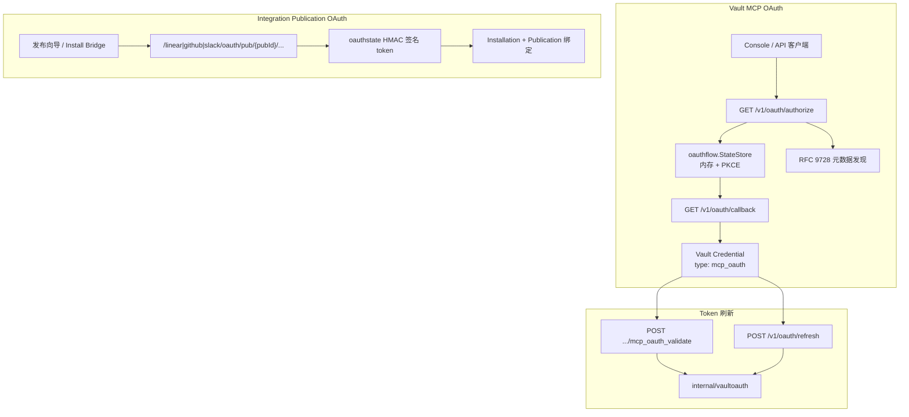

# OAuth 架构

本文说明 OMA（Open Managed Agents）系统中 **OAuth** 的职责划分、两条实现路径，以及 Vault MCP OAuth 与 Integration 安装 OAuth 的完整流程。

相关文档：

- [Vault 与凭据架构](./vault-and-credentials.md) — OAuth 完成后 token 的存储与注入
- [MCP 架构](./mcp-architecture.md) — MCP Proxy 如何使用 Vault 中的 `mcp_oauth` 凭据

## 一句话总结

OMA 的 OAuth 分为**两条互不混淆的路径**：

1. **Vault MCP OAuth**（`/v1/oauth`）— 为 Vault 中的 MCP server 获取 `mcp_oauth` 凭据，供 MCP Proxy / Outbound 注入 Bearer token。
2. **Integration Publication OAuth**（`/linear|github|slack/oauth/...`）— 为 Agent 发布到 Linear / GitHub / Slack 完成 workspace 安装，token 存入 Integration 表（可选关联 `vault_id`）。

两条路径使用**不同的 state 机制**、**不同的回调 URL 形态**，但共享 `OMA_INTERNAL_SECRET` 作为 Integration 侧 HMAC 签名密钥。

## 架构总览



## 两条 OAuth 路径对比

| 维度 | Vault MCP OAuth | Integration Publication OAuth |
|------|-----------------|------------------------------|
| 目的 | 为 MCP server 获取 Bearer token，写入 Vault | 将 Agent 发布到第三方 workspace |
| 入口 API | `/v1/oauth/authorize` | `/v1/integrations/...` + Install Gateway |
| 回调路径 | `/v1/oauth/callback` | `/{provider}/oauth/pub/{pubId}/callback` |
| State 机制 | 内存 `StateStore` + PKCE `code_verifier` | HMAC 签名 JWT（`oauthstate` 包） |
| 协议 | MCP OAuth（RFC 9728 元数据发现 + PKCE） | 各 provider 原生 OAuth（Linear / Slack v2 / GitHub App Install） |
| 凭据落点 | `credentials.auth`（`type: mcp_oauth`） | `integration_installations` + `integration_publications` |
| 认证要求 | `/v1/oauth/*` 需租户 API Key（authorize/refresh） | Install Gateway 路由**免认证**（见下文） |

## Vault MCP OAuth（`/v1/oauth`）

面向 Console 或 API 客户端：用户选定 Vault 与 MCP server URL，平台完成 OAuth 授权后将 token 写入 Vault credential。

### 路由

| 方法 | 路径 | 说明 |
|------|------|------|
| GET | `/v1/oauth/authorize` | 发起授权，302 重定向到上游 IdP |
| GET | `/v1/oauth/callback` | IdP 回调，换 token 并写入 Vault |
| POST | `/v1/oauth/refresh` | 手动刷新指定 `mcp_oauth` credential |

实现位于 `internal/api/oauth_v1.go`，路由挂载见 `internal/api/router.go`。

### Authorize 流程

```
客户端 GET /v1/oauth/authorize
  ?mcp_server_url=...
  &vault_id=...
  &credential_id=...        （可选，更新已有 credential）
  &redirect_uri=...          （可选，完成后浏览器跳转）
  &client_id=...             （可选，覆盖自动解析）
  &client_secret=...
        │
        ▼
1. 校验 vault 属于当前 tenant
2. DiscoverOAuthMeta(mcp_server_url)  — RFC 9728 元数据链
3. 解析 client_id（优先级见下）
4. 生成 PKCE code_verifier / code_challenge
5. 生成 state token，写入 StateStore（TTL 10 分钟）
6. 302 → 上游 authorization_endpoint
```

**Client ID 解析优先级**（`internal/oauthflow/discover.go`、`presets.go`）：

1. 调用方 query 参数 `client_id` / `client_secret`
2. **Dynamic Client Registration**（RFC 7591）— 若 ASM 暴露 `registration_endpoint`
3. **Preset 环境变量** — 按 issuer 匹配已知 provider（GitHub、Feishu、Lark、Asana、ClickUp、Slack 等）
4. 均不可用 → `501 Not Implemented` 及操作指引

Authorize 请求携带标准 OAuth 2.1 + PKCE 参数：

- `response_type=code`
- `redirect_uri={PUBLIC_URL}/v1/oauth/callback`（固定，注册到 IdP）
- `code_challenge` / `code_challenge_method=S256`
- `resource={MCP Protected Resource URI}`（MCP OAuth 扩展）

### Callback 流程

```
IdP GET /v1/oauth/callback?code=...&state=...
        │
        ▼
1. 从 StateStore 取出 PendingState（含 tenant、vault、PKCE verifier）
2. POST token_endpoint（authorization_code + code_verifier + resource）
3. 组装 mcp_oauth auth JSON，Create 或 Update credential
4. ProbeMcpServer — POST tools/list 验证 token
5. 返回 HTML 关闭页（postMessage + BroadcastChannel）
```

写入 Vault 的 `auth` 结构（`internal/api/oauth_v1.go`）：

```json
{
  "type": "mcp_oauth",
  "mcp_server_url": "https://mcp.example.com/mcp",
  "access_token": "...",
  "refresh_token": "...",
  "token_endpoint": "...",
  "client_id": "...",
  "client_secret": "...",
  "expires_at": "2026-06-16T12:00:00Z",
  "authorization_server": "https://issuer.example/"
}
```

Callback 页面向 opener 发送 `postMessage`（`type: oauth_complete`），并尝试 `BroadcastChannel("openma-oauth")`，便于 Console 弹窗感知完成状态。

### MCP OAuth 元数据发现

`oauthflow.DiscoverOAuthMeta` 按 MCP OAuth 规范依次请求：

1. **Protected Resource Metadata**（RFC 9728）  
   `/.well-known/oauth-protected-resource`（含 path 变体）
2. **Authorization Server Metadata**  
   `/.well-known/oauth-authorization-server` 或 `openid-configuration`
3. GitHub issuer 硬编码兜底（`https://github.com/login/oauth`）

### State 存储（PKCE 路径）

`internal/oauthflow/state.go`：

- 进程内 `sync.Mutex` + `map[string]stateEntry`
- 默认 TTL **10 分钟**
- `PendingState` 携带：`TenantID`、`VaultID`、`CredentialID`、`McpServerURL`、`CodeVerifier`、`ClientID/Secret`、`TokenEndpoint`、`RedirectURI`、`ResourceURI`

单实例部署足够；多实例需后续改为 Redis/KV（代码注释：`parity with KV oauth_state:*`）。

## Integration Publication OAuth

面向 Agent **发布向导**：用户创建 Publication shell → 粘贴/生成第三方 App 凭据 → OAuth 安装到 workspace → Publication 变为 `live`。

Install 逻辑由 `internal/installbridge` 编排；HTTP 入口在 Install Gateway（`internal/api/install_gateway.go`）与 Linear Gateway（`internal/api/oauth.go`）。

### State 机制（HMAC 路径）

`internal/integrations/oauthstate` 提供两类签名 token，格式为 `base64url(payload).base64url(hmac-sha256)`：

| 类型 | Kind 常量 | TTL | 用途 |
|------|-----------|-----|------|
| Linear Publication State | `linear.oauth.publication` | 15 分钟 | Linear OAuth `state` 参数 |
| Form Token | `github.pub.form` / `slack.pub.form` | 60 分钟 | 发布向导表单会话 |
| Install State | `github.install.pub` / `slack.oauth.pub` | 60 分钟 | OAuth 安装回调校验 |
| Manifest State | `github.manifest.state` | 60 分钟 | GitHub Manifest 创建流程 |
| Handoff Token | 同上 + `handoff: true` | 7 天 | 管理员代填凭据链接 |

签名密钥为 **`OMA_INTERNAL_SECRET`**（与 `/v1/internal/*` 共享）。

验证时检查：HMAC 签名、过期时间、`kind` 匹配、`publicationId` 与 URL 路径一致。

### 认证豁免

Integration OAuth 回调由浏览器或第三方 IdP 直接访问，**不携带 API Key**。以下路径在 `internal/auth/middleware.go` 的 `isExempt` 中免认证：

- `/linear/oauth/*`、`/linear/webhook/*`
- `/github/oauth/*`、`/github/manifest/*`、`/github-setup/*`
- `/slack/oauth/*`、`/slack-setup/*`
- `POST /github/publications/credentials`、`POST /slack/publications/credentials`

`/v1/oauth/callback` **不在**豁免列表；MCP OAuth 回调依赖 Console 会话 cookie 或 `OMA_AUTH_DISABLED=1` 开发模式。生产环境若纯 API Key 认证，需补充 callback 豁免或改用服务端代理 authorize。

### Linear

**路由**（`internal/api/oauth.go`）：

| 方法 | 路径 | 说明 |
|------|------|------|
| GET | `/linear/oauth/pub/{pubId}/authorize` | 本地入口，校验 state 后 302 到 Linear |
| GET | `/linear/oauth/pub/{pubId}/callback` | Linear 回调，换 token 并绑定 installation |

**流程**：

```
PATCH /v1/integrations/linear/publications/{id}/credentials
  （clientId, clientSecret, webhookSecret, returnUrl）
        │
        ▼
返回 install_url → /linear/oauth/pub/{pubId}/authorize?state={signed}
        │
        ▼
AuthorizeRedirectURL → https://linear.app/oauth/authorize
        │
        ▼
CompleteOAuth:
  - ExchangeAuthorizationCode
  - FetchViewerAndOrg（GraphQL）
  - InsertLinearInstallation + BindLinearPublication
  - 302 → returnUrl?publication_id=...&install=ok
```

Linear OAuth 实现见 `internal/integrations/linear/oauth.go`；默认 scopes：`read`, `write`, `app:assignable`, `app:mentionable`；`actor=app`。

### GitHub

GitHub 采用 **GitHub App** 模型，OAuth 安装分多步，非单次 authorization code 流程。

**路径 A：Manifest 自动创建 App**

```
StartA1 → manifestStartUrl (/github/manifest/start/{formToken})
        │
        ▼
PrepareManifestForm → 自动 POST 到 GitHub Manifest API
        │
        ▼
/github/manifest/callback → ExchangeManifestCode → 存储 App 凭据
        │
        ▼
返回 GitHub org install URL（BuildInstallURL）
```

**路径 B：手动粘贴 App 凭据**

```
POST /github/publications/credentials
  （appId, privateKey, webhookSecret, clientId, clientSecret）
        │
        ▼
MintAppJWT + GetApp 验证 → 返回 install URL
```

**Org Install 回调**：

```
GET /github/oauth/pub/{pubId}/callback
  ?installation_id=...&state=...
        │
        ▼
CompleteGitHubOAuth:
  - 验证 installation（MintInstallationToken）
  - InsertProviderInstallation + BindProviderPublication
```

GitHub 特有逻辑：`MintAppJWT`（RS256，10 分钟有效）、Installation token 校验。见 `internal/integrations/github/oauth.go`、`internal/installbridge/continue.go`。

### Slack

**流程**：

```
StartA1 → 返回 callbackUrl、manifestLaunchUrl（Slack「从 manifest 创建 App」）
        │
        ▼
POST /slack/publications/credentials
  （clientId, clientSecret, signingSecret）
        │
        ▼
返回 Slack OAuth v2 authorize URL（bot + user scopes）
        │
        ▼
GET /slack/oauth/pub/{pubId}/callback?code=...&state=...
        │
        ▼
CompleteSlackOAuth:
  - ExchangeOAuthCode → oauth.v2.access
  - 要求 bot token (xoxb-) 与 user token (xoxp-)
  - InsertProviderInstallation + BindProviderPublication
```

Slack OAuth URL 构建与默认 scopes 见 `internal/integrations/slack/oauth.go`；token 交换见 `internal/integrations/slack/token.go`。

### Install Bridge 与外部 Proxy

`newInstallBridgeDeps`（`internal/api/integrations.go`）：

- 默认：`installbridge.New(repo, origin, OMA_INTERNAL_SECRET)` — 进程内 Bridge
- 若设置 `INTEGRATIONS_INSTALL_PROXY_URL`：转发到外部 integrations worker（`installbridge.Proxy`）

Gateway 对外 origin 对齐 open-managed-agents：`GATEWAY_ORIGIN` →（别名 `INTEGRATIONS_GATEWAY_ORIGIN` / `OMA_GATEWAY_ORIGIN`）→ `OMA_PUBLIC_URL` → `PUBLIC_BASE_URL`（均未设置时默认 `http://127.0.0.1:8787`）。远程部署必须让该 origin 与 Slack App Redirect URLs 一致。

## Token 刷新

### `internal/vaultoauth`

专用于 Vault 中 `type: mcp_oauth` 凭据：

- `RefreshMetadataOf` — 从 auth JSON 提取 `refresh_token`、`token_endpoint`、`client_id`
- `RefreshMcpOAuth` — `grant_type=refresh_token` POST 到 token endpoint
- `AuthPatchForRefresh` — 生成 partial auth patch（`access_token`、`refresh_token`、`expires_at`）

默认 `client_id` 缺省时使用 `"open-managed-agents"`。

### 刷新入口

| 入口 | 路径 | 说明 |
|------|------|------|
| Vault 校验 | `POST /v1/vaults/{id}/credentials/{credId}/mcp_oauth_validate` | 校验并刷新，返回 `validated: true` |
| OAuth API | `POST /v1/oauth/refresh` | 显式刷新，返回新 `access_token` / `expires_at` |

两者均调用 `vaultoauth.RefreshMcpOAuth` 并写回 credential。

Integration 安装 token（Linear refresh、Slack bot token 等）的刷新由各自 gateway / worker 处理，不在 `/v1/oauth/refresh` 范围内。

## 环境变量

| 变量 | 用途 |
|------|------|
| `OMA_PUBLIC_URL` / `PublicURL` | OAuth callback 基址（`/v1/oauth/callback`） |
| `OMA_INTERNAL_SECRET` | Integration HMAC state、Install Bridge、Linear Gateway |
| `GATEWAY_ORIGIN` | Publication OAuth 回调 host（未设时回退 `PUBLIC_BASE_URL`；兼容 `INTEGRATIONS_GATEWAY_ORIGIN`） |
| `INTEGRATIONS_INSTALL_PROXY_URL` | 可选，转发 install 请求到外部 worker |
| `GITHUB_OAUTH_CLIENT_ID` / `_SECRET` | MCP OAuth preset（GitHub MCP issuer） |
| `SLACK_OAUTH_CLIENT_ID` / `_SECRET` | MCP OAuth preset（Slack MCP issuer） |
| `FEISHU_*` / `LARK_*` / `ASANA_*` / `CLICKUP_*` | 其他 MCP OAuth preset |

## 安全设计要点

1. **State 防 CSRF** — MCP 路径用随机 state + 服务端存储；Integration 路径用 HMAC 签名 + 过期时间 + publicationId 绑定。
2. **PKCE** — MCP OAuth 强制 S256，防止 authorization code 拦截。
3. **Tenant 隔离** — MCP authorize 从认证中间件取 `tenant_id`，callback 从 PendingState 恢复，credential 写入对应 tenant。
4. **密钥不落沙箱** — OAuth 完成后 token 存 Vault 或 Integration 加密字段；运行时经 MCP Proxy / Outbound 注入（见 [Vault 与凭据架构](./vault-and-credentials.md)）。
5. **Publication 凭据加密** — Integration 表 `client_secret_cipher`、`signing_secret_cipher` 等字段加密存储；GitHub private key 单独表。

## 相关代码路径

| 组件 | 路径 |
|------|------|
| Vault MCP OAuth HTTP | `internal/api/oauth_v1.go` |
| MCP OAuth 发现 / PKCE / State | `internal/oauthflow/` |
| Token 刷新 | `internal/vaultoauth/oauth.go` |
| Vault 校验 API | `internal/api/vaults.go`（`handleMcpOAuthValidate`） |
| Linear Gateway OAuth | `internal/api/oauth.go`、`internal/integrations/linear/` |
| GitHub / Slack OAuth 工具 | `internal/integrations/github/oauth.go`、`internal/integrations/slack/` |
| Integration HMAC State | `internal/integrations/oauthstate/` |
| Install Bridge | `internal/installbridge/bridge.go`、`continue.go` |
| Install Gateway 路由 | `internal/api/install_gateway.go` |
| Integration API | `internal/api/integrations.go` |
| 认证豁免 | `internal/auth/middleware.go` |
| 路由挂载 | `internal/api/router.go` |
| 进程入口 | `cmd/oma-server/main.go` |
| E2E 测试 | `internal/api/install_oauth_e2e_test.go`、`internal/api/oauth_v1_test.go` |

## 与 Vault 的关系

- **Vault MCP OAuth** 直接产出 `mcp_oauth` credential，供 MCP Proxy（按 MCP URL）和 Outbound（按 hostname）匹配注入。
- **Integration OAuth** 产出 installation 记录；publication 可关联 `vault_id`，供后续将 workspace token 同步到 Vault（具体同步逻辑见 integration gateway / worker）。

两条路径服务不同产品场景（「连 MCP 工具」vs「发布 Agent 到 IM/代码平台」），但在凭据隔离原则上一致：**平台侧存储，运行时按需注入，沙箱不可见明文 token**。
