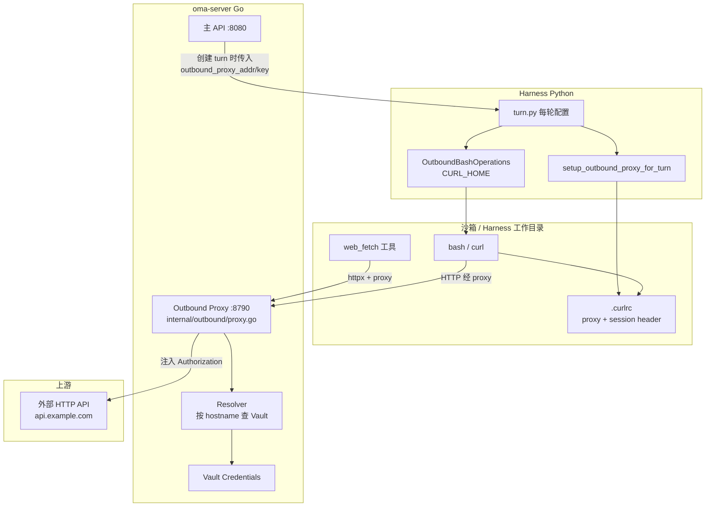
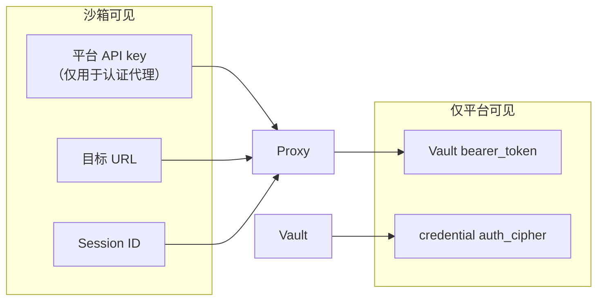

# Outbound 架构

本文用通俗语言说明 OMA（Open Managed Agents）系统中 **outbound**（也叫 **Vault outbound** / **outbound proxy**）是什么、为什么需要它，以及它在 `meta-harness` 里如何设计与实现。

相关文档：

- [Vault 与凭据架构](./vault-and-credentials.md) — Vault 总览，含 outbound 与 MCP Proxy 的对比摘要
- [MCP 架构](./mcp-architecture.md) — 另一条凭据注入路径（MCP 协议调用）

## 一句话总结

**Outbound 是「出站 HTTP 的凭据门卫」**：Agent 在沙箱里用 `curl`、`web_fetch` 等方式访问外部 API 时，请求先经过平台上的一个**正向代理**；代理根据目标网站的**域名**从 Vault 取出 token，自动加上 `Authorization`，再转发给真正的上游服务。**沙箱里永远看不到密钥。**

## 通俗理解：两个门卫

可以把 OMA 的凭据注入想象成大楼里的两个门卫：

| 门卫 | 管什么 | 类比 |
|------|--------|------|
| **MCP Proxy** | Agent 通过 MCP 协议调用的「登记过的工具服务」 | 前台：只有名册上的 MCP server 才能进，门卫查名册发通行证 |
| **Outbound Proxy** | 沙箱里任意 HTTP 出站（`curl`、脚本、`web_fetch` 等） | 侧门：任何人要出去上网，都先过侧门，门卫按**要去哪家网站**查 Vault 发 token |

Agent 只知道「我要访问 `https://api.example.com/...`」，**不知道** Bearer token 长什么样。密钥只活在平台侧 Vault 里，每次请求临时注入，用完即走。

## 为什么需要 outbound？

MCP Proxy 只覆盖「Agent 配置里声明的 MCP server」。但 Agent 在沙箱里还会：

- 用 `bash` 跑 `curl` 调 REST API
- 用 `web_fetch` 抓网页
- 跑脚本访问第三方 HTTP 服务

如果没有 outbound，只有两种糟糕选择：

1. **不带鉴权** — 调不通需要登录的 API
2. **把 token 写进沙箱环境变量或文件** — 违背 Vault 隔离，prompt injection 时密钥可能泄露

Outbound 让「普通 HTTP 出站」也能享受和 MCP 一样的 **credential proxy** 模式。

## 和 MCP Proxy 的对比

| 维度 | MCP Proxy | Vault outbound |
|------|-----------|----------------|
| 触发场景 | Agent 调用已声明的 **MCP server** | 沙箱/Harness 的**任意 HTTP** |
| 匹配键 | `(sessionId, serverName)` → Agent 快照里的 MCP URL | 请求 URL 的 **hostname**（域名） |
| 查 Vault | 按 `mcp_server_url` **精确**匹配 credential | 按 credential 里 `mcp_server_url` 解析出的 **hostname** 匹配 |
| 平台入口 | `POST /v1/mcp-proxy/{sid}/{serverName}` | 独立 HTTP forward proxy（默认 `127.0.0.1:8790`） |
| 调用方 | Harness MCP 客户端 | 沙箱 `curl`（经 `.curlrc`）、`web_fetch`（经 httpx proxy） |

两条路径遵循同一原则：**密钥只在平台侧，每次调用实时从 Vault 读取，不下发到沙箱。**

## 整体架构



## 一次请求的完整旅程

以 Agent 在沙箱里执行 `curl https://api.example.com/v1/me` 为例：

```
1. 用户发消息 → 平台创建 turn
2. 平台把 outbound_proxy_addr、outbound_proxy_api_key 传给 Harness
3. Harness 在 session 工作目录写入 .curlrc：
      proxy = "http://127.0.0.1:8790"
      proxy-header = "X-OMA-Session-Id: <session_id>"
      proxy-header = "Proxy-Authorization: Bearer <platform_api_key>"
4. bash 子进程通过 CURL_HOME 读到 .curlrc，curl 自动走代理
5. Outbound Proxy 收到请求：
      a. 校验 platform api key → 得到 tenant_id
      b. 读取 X-OMA-Session-Id → 校验 session 未归档
      c. 从 URL 提取 hostname：api.example.com
      d. Resolver 在 Vault 里找 mcp_server_url 域名匹配的 credential
      e. 取出 bearer_token，设置 Authorization: Bearer <vault_token>
      f. 转发到 https://api.example.com/v1/me
6. 上游返回结果 → 代理原样传回 → curl 打印给 Agent
```

注意：请求里有两层「Bearer」，含义不同：

| Header | 作用 |
|--------|------|
| `Proxy-Authorization: Bearer <platform_api_key>` | 证明「我有权使用 outbound 代理」 |
| `Authorization: Bearer <vault_token>` | 由代理**注入**，证明「我有权访问上游 API」 |

沙箱只知道前者（平台 API key，用于访问代理本身）；后者由平台在转发前加上，沙箱不可见。

## 设计原则

1. **密钥不下发** — Vault token 不进入沙箱环境变量、工作目录或 Harness 长期状态
2. **按域名匹配** — 复用 credential 上的 `mcp_server_url` 字段解析 hostname，无需单独的「outbound 凭据类型」
3. **Session 绑定** — 必须带 `X-OMA-Session-Id`，且 session 未归档才允许解析凭据
4. **租户隔离** — 通过 api key 解析 `tenant_id`，只查该租户下的 active credentials
5. **不污染 Harness 全局代理** — 故意**不**给 Harness 进程设置 `HTTP_PROXY`，避免 LLM 模型 API 流量误走 outbound 代理导致 turn 失败；仅沙箱内的 `curl` / `web_fetch` 走代理

## 实现：Go 平台侧

### 启动与配置

`cmd/oma-server/main.go` 在启动时：

- 读取 `OMA_OUTBOUND_PROXY_ADDR`（默认 `:8790`；设为空字符串则**不启动** outbound 监听）
- 用 `outbound.HostForHarness()` 把监听地址转成 Harness 能连的 `127.0.0.1:8790`
- 在独立 goroutine 里启动 HTTP forward proxy
- 创建 turn 时通过 `internal/harness/client.go` 把 `outbound_proxy_addr` / `outbound_proxy_api_key` 传给 Harness

### `internal/outbound/proxy.go` — 正向代理

核心流程（`ServeHTTP`）：

1. `resolveAuth` — 从 `x-api-key`、`Proxy-Authorization` 或 `Authorization` 解析平台 API key，映射到 `tenant_id`
2. 读取 `X-OMA-Session-Id`，缺失则 400
3. `CONNECT` 方法（HTTPS 隧道）返回 **501**，MVP 不支持 MITM
4. 解析绝对 URL，复制转发头（去掉 hop-by-hop 与内部头）
5. 调用 `Resolver.Resolve(tenant, session, hostname)`
6. 若有 token，设置 `Authorization: Bearer ...`
7. `http.DefaultClient.Do` 转发，把响应写回客户端

### `internal/outbound/resolver.go` — 凭据解析

匹配逻辑：

1. 加载 session，归档则拒绝
2. 列出 tenant 下所有 **active** credentials
3. 从每条 `auth.mcp_server_url` 解析 hostname（小写、去端口）
4. 与出站请求的 hostname 比较
5. 多条命中时取 `updated_at`（或 `created_at`）**最新**的一条
6. 从 `auth` 中取 `bearer_token` → `token` → `access_token`（按顺序）

无匹配时**不注入** Authorization，请求仍会转发（适合公开 API）；解析出错则 403。

### `internal/outbound/host.go`

把 `:8790` 这类「只写端口」的监听地址规范为 `127.0.0.1:8790`，供 Harness 与沙箱客户端连接。

## 实现：Python Harness 侧

目录：`harness/oma_adapter/outbound/`

### `setup.py` — 每轮写入 `.curlrc`

`setup_outbound_proxy_for_turn()` 在 session 工作目录创建 `.curlrc`：

```text
proxy = "http://127.0.0.1:8790"
proxy-header = "X-OMA-Session-Id: <session_id>"
proxy-header = "Proxy-Authorization: Bearer <platform_api_key>"
```

**刻意不**设置进程级 `HTTP_PROXY` / `HTTPS_PROXY`，避免 piPy 调模型 API 时误走 outbound。

### `bash_ops.py` — 让 bash 里的 curl 生效

`OutboundBashOperations` 在执行 bash 前设置 `CURL_HOME=<workdir>`，因为 curl 读的是 `$CURL_HOME/.curlrc`，而不是当前目录下的 `.curlrc`。

`turn.py` 在 agent session 创建后调用 `_wire_outbound_bash_proxy()`，把 piPy 的 `bash` 工具的 `operations` 替换为 `OutboundBashOperations`。

### `web_fetch` — httpx 走同一代理

`harness/oma_adapter/web_fetch/core.py` 的 `_fetch_bytes()`：

- `httpx.AsyncClient(proxy=outbound_proxy_url)`
- 请求头附带 `X-OMA-Session-Id` 与 `Proxy-Authorization`

`turn.py` 在 `_run_turn_core()` 里通过 `configure_web_fetch()` / `configure_web_search()` 注入 runtime；`web_search` 的 DuckDuckGo 等公开搜索路径当前多为直连，Tavily 等需鉴权的 API 可走同一 proxy 配置。

### 生命周期

```
turn 开始 → setup_outbound_proxy_for_turn() 写 .curlrc
         → configure_web_fetch / web_search
         → 创建 agent session → _wire_outbound_bash_proxy()
turn 结束 → clear_outbound_proxy_for_turn() 清理临时环境
```

## Vault 凭据如何绑定到域名？

Outbound **复用** MCP credential 的 `mcp_server_url` 字段，不新增凭据类型。

示例：Vault 里有一条 credential：

```json
{
  "mcp_server_url": "https://api.linear.app/mcp",
  "bearer_token": "lin_api_xxxx"
}
```

解析 hostname 为 `api.linear.app`。沙箱里任何发往 `api.linear.app` 的 HTTP（不论路径）都会注入该 token。

在 Console 或 API 里为某 API 域名配置 Vault 凭据时，把 `mcp_server_url` 设为该 API 的 base URL 即可（与 MCP 共用同一字段名是历史设计，语义上是「host 绑定」）。

## 环境变量

| 变量 | 默认值 | 说明 |
|------|--------|------|
| `OMA_OUTBOUND_PROXY_ADDR` | `:8790` | outbound 代理监听地址；**空字符串关闭** outbound |
| `OMA_API_KEY` | （部署配置） | 同时用作访问 outbound 代理的 `Proxy-Authorization` |

平台主 API 地址与 outbound 地址相互独立：主服务常见为 `:8080`，outbound 为 `:8790`。

## 安全边界



- 沙箱 **没有** Vault 明文 token
- Outbound 代理 **不会**把 `Proxy-Authorization` 转发给上游（在 `copyForwardHeaders` 前已删除）
- Session 归档后 Resolver 返回 not found，避免僵尸 session 继续带凭据出站
- `command_secret`（如 `GIT_TOKEN` 注入 git 命令环境变量）**不属于** outbound 范围，仍可能出现在沙箱进程 env 中

## MVP 能力与限制

| 能力 | 状态 |
|------|------|
| 明文 HTTP 经 proxy 转发 + Vault Bearer 注入 | ✅ 已实现 |
| Harness `curl`（经 `.curlrc` + `CURL_HOME`） | ✅ 已实现 |
| `web_fetch` 经 httpx proxy | ✅ 已实现 |
| **HTTPS CONNECT** 隧道（MITM 解密） | ❌ 未实现；返回 501，需 Cloud 版 `oma-vault` MITM |
| OAuth 401 自动 refresh（outbound 路径） | 🟡 Cloud 主 worker 有；自托管 outbound 为直接注入 |
| 无匹配 credential 时静默转发（无 Authorization） | ✅ 当前行为 |
| `command_secret` 类环境变量注入 | ❌ 不在 outbound 覆盖范围 |

## 测试与验证

| 脚本 / 测试 | 说明 |
|-------------|------|
| `scripts/e2e/smoke-outbound-e2e.sh` | 端到端：Vault credential → outbound → harness bash `curl` |
| `scripts/e2e/smoke-outbound-proxy.sh` | 代理层冒烟 |
| `scripts/e2e/mock-outbound-server.py` | 模拟需要 `Authorization: Bearer` 的上游 |
| `harness/tests/test_outbound.py` | Harness 侧 `.curlrc`、`CURL_HOME` 单元测试 |
| `internal/outbound/proxy_test.go` | Go 代理与鉴权测试 |
| `internal/outbound/resolver_test.go` | hostname 匹配与 token 提取测试 |

`scripts/e2e/smoke-all.sh` 在完整冒烟流程中包含 outbound 相关检查。

## 关键源码索引

| 层级 | 路径 | 职责 |
|------|------|------|
| 启动 | `cmd/oma-server/main.go` | 读 env、启动 proxy goroutine、传给 harness client |
| 代理 | `internal/outbound/proxy.go` | HTTP forward、鉴权、注入、转发 |
| 解析 | `internal/outbound/resolver.go` | session + hostname → Vault token |
| 地址 | `internal/outbound/host.go` | 监听地址 → Harness 可连 host:port |
| API 传参 | `internal/api/sessions.go` | turn 请求携带 outbound 配置 |
| Harness 契约 | `internal/harness/client.go` | `TurnRequest` JSON 字段 |
| 每轮配置 | `harness/oma_adapter/outbound/setup.py` | 写 `.curlrc` |
| Bash 集成 | `harness/oma_adapter/outbound/bash_ops.py` | `CURL_HOME` |
| Turn 编排 | `harness/oma_adapter/turn.py` | 串联 setup、web_fetch、bash |
| Web 抓取 | `harness/oma_adapter/web_fetch/core.py` | httpx + proxy headers |

## 小结

**Outbound** 解决的是：Agent 在沙箱里用普通 HTTP 工具访问外部服务时，如何**既不泄露密钥、又能自动带上鉴权**。

实现上分两层：

- **Go 平台**：独立 forward proxy + 按 hostname 查 Vault 注入 Bearer
- **Python Harness**：每轮在工作目录配置 `.curlrc` / httpx proxy，让沙箱流量「自然地」经过平台门卫

与 MCP Proxy 并列，共同构成 OMA「凭据永不进沙箱」的安全模型。
