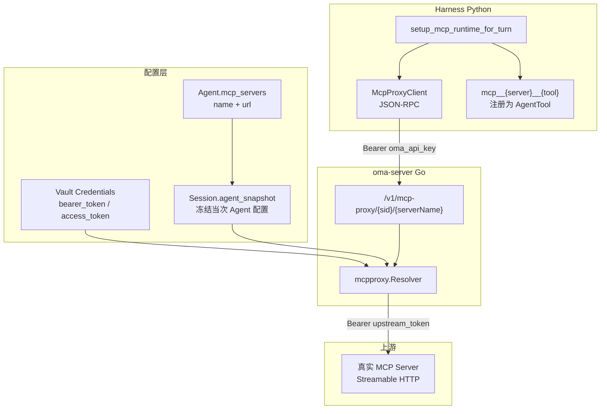

# MCP 架构

本文说明 OMA（Open Managed Agents）系统中 **MCP（Model Context Protocol）** 的实现方式：配置如何声明、凭证如何解析、平台代理如何转发，以及 Harness 如何发现并调用 MCP 工具。

## 一句话总结

OMA 的 MCP 采用 **「凭证代理在平台侧、Harness 不碰上游密钥」** 的设计：Agent 只声明要连接哪些 MCP server；Harness 通过 `/v1/mcp-proxy/{sid}/{serverName}` 发起 JSON-RPC 调用，使用 OMA API key 认证；平台在校验 session 与 server 声明后，从 Vault 或内联配置取出上游 token 并注入，再透明转发到真实 MCP server。

核心思想与 `open-managed-agents/docs/mcp-credential-architecture.md` 一致：**Harness / Agent 只知道 `(session_id, server_name)`，上游凭证只在平台代理层出现。**

## 整体架构



## 1. 配置：Agent 声明 MCP Server

Agent 的 `mcp_servers` 是一个数组，每项大致为：

```json
{
  "name": "notion",
  "url": "https://mcp.notion.com/mcp",
  "authorization_token": "..."
}
```

其中 `authorization_token` 为可选内联 token。Session 创建时会快照到 `agent_snapshot`，代理解析时从这里读取「这个 session 允许连接哪些 server」。

相关类型定义见 `internal/harness/client.go`（`AgentSnapshot.MCPServers`）与 `internal/mcpproxy/target.go`（`MCPServer`）。

## 2. 凭证：Vault + Resolver

`internal/mcpproxy/target.go` 中的 `Resolver.Resolve` 负责解析上游目标，主要步骤：

1. 校验 session 存在且未归档（`archived_at IS NULL`）
2. 在 `agent_snapshot.mcp_servers` 中按 `serverName` 查找对应 server
3. 解析上游 token：
   - 若 server 配置中有 `authorization_token` → 直接使用
   - 否则按 `server.URL` 调用 `CredentialRepo.FindActiveByMcpURL` 从 Vault 查询，从 `auth` 中取 `bearer_token` / `token` / `access_token`

Harness **永远拿不到** 上游 token。Vault 与凭据的 broader 设计见 [vault-and-credentials.md](./vault-and-credentials.md)。

## 3. 平台代理：`/v1/mcp-proxy`

路由挂载于 `internal/api/router.go`，处理逻辑在 `internal/api/mcp_proxy.go`：

```
/v1/mcp-proxy/{sid}/{serverName}
/v1/mcp-proxy/{sid}/{serverName}/*
```

处理流程：

1. **鉴权**：通过 `x-api-key` 或 `Authorization: Bearer` 解析 tenant（API key SHA256 查库，或 dev 环境下的单 key）
2. **解析目标**：`Resolver.Resolve(tenantID, sid, serverName)` → 得到 `UpstreamURL` + `UpstreamToken`
3. **转发**：复制请求头，设置 `Authorization: Bearer <upstream_token>`，HTTP 透传到上游 MCP URL

这是透明 HTTP 代理，不解析 JSON-RPC 语义，只负责鉴权与凭证注入。

## 4. Harness 侧：发现工具并注册

每轮 turn 在 `harness/oma_adapter/turn.py` 中调用 `setup_mcp_runtime_for_turn`：

```python
await setup_mcp_runtime_for_turn(
    mcp_servers=mcp_servers_from_agent(agent),
    session_id=session_id,
    proxy_base=mcp_proxy_base,
    proxy_api_key=mcp_proxy_api_key,
)
```

`mcp_proxy_base` / `mcp_proxy_api_key` 由 `oma-server` 经 `internal/session/machine.go` → `TurnRequest` 传给 Harness。平台地址一般为 `publicURL`（见 `cmd/oma-server/main.go`），key 为 `OMA_API_KEY`。

### MCP 客户端

`harness/oma_adapter/mcp/client.py` 中的 `McpProxyClient` 是精简版 Streamable HTTP MCP 客户端：

- 请求地址：`{proxy_base}/v1/mcp-proxy/{session_id}/{server_name}`
- 使用 OMA API key 认证（**不是**上游 token）
- JSON-RPC 方法：`initialize` → `tools/list` → `tools/call`
- 支持 JSON 与 SSE 响应解析

### 工具包装与注册

`harness/oma_adapter/mcp/setup.py` 负责：

1. 为每个 MCP server 创建 `McpProxyClient`
2. 调用 `list_tools()` 拉取远程工具列表
3. 包装为 Harness 工具，命名规则：`mcp__{server_name}__{remote_tool_name}`
4. 通过 `harness/oma_adapter/extensions/mcp_loader.py` 注册到 piPy agent

当 Agent 调用例如 `mcp__mock__ping` 时，实际执行 `McpProxyClient.call_tool("ping", args)` → 平台代理 → 上游 MCP server。

### 运行时状态

`harness/oma_adapter/mcp/runtime.py` 维护 per-turn 的 `McpRuntime`，与 `web_fetch.runtime` 模式类似：每轮 turn 开始时配置，结束时清理。

## 5. 一次完整调用链

以 `scripts/smoke-mcp-e2e.sh` 为例：

```
用户消息 → Session Machine → Harness turn
    → setup_mcp_runtime（发现 mcp__mock__ping）
    → LLM 选择工具 mcp__mock__ping
    → McpProxyClient POST /v1/mcp-proxy/{sid}/mock
        Header: Authorization: Bearer <OMA_API_KEY>
        Body: {"method":"tools/call","params":{"name":"ping",...}}
    → Go mcp_proxy.serve
        → Resolve(session, "mock") → upstream URL + token
        → 转发到 mock MCP server（带真实 Bearer）
    → 结果返回 Harness → 写入 turn events
```

本地开发可用 `scripts/mock-mcp-server.py` 作为上游 mock。

## 6. 与 `open-managed-agents` 的关系

当前仓库中还有一套 Cloudflare Workers 实现（`open-managed-agents/apps/main/src/routes/mcp-proxy.ts`），能力更完整：

| 能力 | oma-platform (Go) | open-managed-agents (CF) |
|------|-------------------|--------------------------|
| HTTP 代理 | ✅ `/v1/mcp-proxy` | ✅ 同路径 |
| RPC 代理 | ❌ | ✅ `McpProxyRpc.mcpForward` |
| OAuth 401 自动刷新 | ❌（oma-platform 暂未实现） | ✅ `forwardWithRefresh` |
| Outbound HTTPS 代理 | ✅ 独立 outbound proxy | ✅ `outboundForward` |

`oma-platform` 是 MVP 迁移版，MCP 核心链路（配置 → 代理 → Harness 工具）已打通；OAuth 刷新等高级能力主要在 CF 版实现。

## 7. 关键文件索引

| 层级 | 文件 | 职责 |
|------|------|------|
| 路由 | `internal/api/mcp_proxy.go` | HTTP 代理入口 |
| 解析 | `internal/mcpproxy/target.go` | session + vault → upstream target |
| 凭证 | `internal/store/credentials.go` | 按 MCP URL 查 token |
| 传参 | `internal/session/machine.go` | 将 proxy base/key 传给 Harness |
| 客户端 | `harness/oma_adapter/mcp/client.py` | JSON-RPC MCP 客户端 |
| 发现 | `harness/oma_adapter/mcp/setup.py` | 发现工具、包装为 AgentTool |
| 注册 | `harness/oma_adapter/extensions/mcp_loader.py` | 扩展加载 MCP 工具 |
| 测试 | `scripts/smoke-mcp-e2e.sh` | 端到端冒烟 |
| Mock | `scripts/mock-mcp-server.py` | 本地 mock 上游 MCP |

## 相关文档

- [Vault 与凭据架构](./vault-and-credentials.md)
- `open-managed-agents/docs/mcp-credential-architecture.md`（CF 版完整凭证代理设计）
