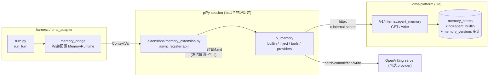
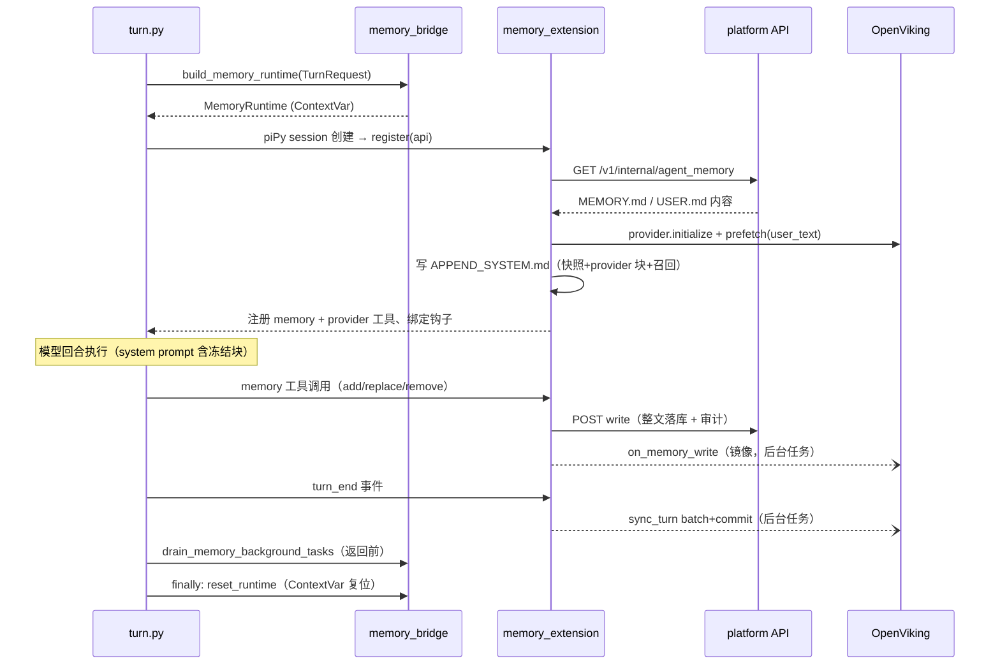

# Agent 内置记忆（Hermes Parity）设计

本文说明 OMA 的 **Agent 内置记忆系统**：目标、分层架构、内置记忆语义、持久化契约、
Provider 抽象与 OpenViking 集成、注入与回合生命周期。它是 [Memory Store 架构](./memory.md)
之上的 **agent_builtin 专用形态**，以 piPy extension 交付（仓库 `piPy-hermes-memory`）。

## 一句话总结

以 piPy extension 形态实现 Hermes Agent 的 memory 体系：每个 agent 拥有内置的
`MEMORY.md`（agent 笔记）/ `USER.md`（用户画像），回合开始时以冻结快照注入 system
prompt，agent 通过 `memory` 工具增删改并持久化到平台 Memory Store；外部记忆
（OpenViking 等）通过可插拔的 MemoryProvider 抽象接入，负责召回、回合同步与镜像。

## 目标与背景

- **对齐 Hermes**：Hermes Agent 的持久记忆由两部分组成——内置 MEMORY.md/USER.md
  （agent 自管、注入 context、容量受限）+ MemoryProvider 插件（外部记忆后端，
  单 selection）。OMA 需要同等能力，使跨 session 的"记住用户/环境/教训"成为一等公民。
- **外部记忆可插拔**：最终可集成 OpenViking 等外部记忆系统（语义召回、会话提取），
  且不改变内置记忆的行为——与 Hermes 的"内置 + provider 并行"语义一致。
- **交付形态**：全部记忆逻辑放在 piPy extension 包（`piPy-hermes-memory/`，布局对齐
  `piPy-subagent/`、`piPy-teams/`）；oma-platform 只做薄接线（store 扩展 + 两个 internal
  端点 + harness 桥接），不改 TurnRequest、不改 `compose_system_prompt`。
- **默认关闭**：`OMA_MEMORY_ENABLED=1` 才启用，避免改变既有 e2e 行为。

## 总体架构



| 层 | 位置 | 职责 |
|----|------|------|
| 平台存储 | `oma-platform` Go | 内置 store 懒创建、读写持久化、版本审计、console 可见性 |
| Host 桥接 | `harness/oma_adapter` | 开关、每回合构建 MemoryRuntime、加载 extension、drain 后台任务 |
| Extension | `piPy-hermes-memory/extensions` | `register(api)`：拉取记忆 → 注入 prompt → 注册工具 → 绑定生命周期钩子 |
| 记忆库 | `piPy-hermes-memory/packages/pi_memory` | 内置记忆语义、注入、工具、Provider 抽象与 OpenViking 适配器 |

## 内置记忆语义（Hermes parity）

两个 target，各为一篇 `§` 分隔条目的文档，由 `BuiltinMemory` 维护：

| target | 用途 | 默认上限 | 存储 path |
|--------|------|----------|-----------|
| `memory` | agent 个人笔记：环境事实、约定、教训 | 2200 字符 | `/MEMORY.md` |
| `user` | 用户画像：身份、偏好、沟通风格 | 1375 字符 | `/USER.md` |

- 上限可用 `OMA_MEMORY_LIMIT_MEMORY` / `OMA_MEMORY_LIMIT_USER` 覆盖（字符数，非 token）。
- `memory` 工具动作：`add`（追加条目）/ `replace`（按 `old_text` 换内容）/ `remove`。
  `old_text` 必须是**唯一子串**：未命中或命中多条都报错，由 agent 自行换更精确的子串。
- **写满不自动压缩**：超限直接报错（"consolidate or remove entries first"），
  与 Hermes 一致——迫使 agent 主动整理，而不是静默丢弃。
- 工具返回 Hermes 风格结果：操作后的实时状态（用量 `[used/limit chars, N entries]` + 当前条目列表）。
- 无 read 动作：记忆在 session 启动时自动注入 context，agent 不需要主动读。

### 快照渲染（冻结块）

回合开始时对非空 target 渲染带用量头的冻结块，注入 system prompt：

```
══════════════════════════════════════════════
MEMORY (your personal notes) [67% — 1474/2200 chars]
══════════════════════════════════════════════
<§ 分隔的条目原文>
```

## 持久化设计（复用 Memory Store）

内置记忆不自建存储，直接落在平台 Memory Store 上，复用其版本审计（`memory_versions`）、
retention worker 与 console 可见性：

- **store 标识**：确定性 ID `agentmem-{agent_id}`，`kind = 'agent_builtin'`，
  按 `(tenant, agent)` 维度，同 agent 跨 session 共享（对应 Hermes per-profile）。
- **懒创建**：`EnsureStoreWithID` 幂等（MySQL `INSERT IGNORE`），首次 GET 即创建；
  不依赖 agent 记录是否存在。
- **列表隐藏**：`ListStores` 默认过滤 `kind='standard'`，console 的 store 列表不被
  agent_builtin 污染；`include_builtin=true` 可显式包含。
- **审计**：写入 actor 记为 `agent_session/{session_id}`，可追溯是哪个会话改的记忆。

### internal API 契约（harness → platform，`x-internal-secret` 鉴权）

| 端点 | 行为 |
|------|------|
| `GET /v1/internal/agent_memory?tenant_id=&agent_id=` | 懒创建内置 store，返回 `{store_id, contents:{"/MEMORY.md","/USER.md"}}`（缺失为空串，blob hydrate） |
| `POST /v1/internal/agent_memory/write` | body `{tenant_id, agent_id, path, content, session_id}`；path 白名单仅限 `/MEMORY.md` \| `/USER.md`；整文覆盖写 |

写入语义：**工具每次成功操作后，把该 target 的整篇文档内容**经 write 端点落库
（而非增量），保证平台侧内容即最终态；失败时工具返回 "updated locally but
persistence failed"，agent 可重试。

## Prompt 注入机制

- 载体：`{workdir}/.pi/APPEND_SYSTEM.md`——piPy 在 session 创建时把它追加进
  system prompt（即使显式 `custom_prompt` 也追加）。
- 时序保证：extension 的 `register(api)` **先于** system prompt 解析执行，
  因此"register 内写文件 → 本回合 prompt 即包含快照"闭环成立（OMA 每回合新建
  piPy session，无跨回合残留问题）。
- 幂等：内容包裹在 `<!-- oma:memory begin/end -->` marker 块中，重复加载替换不叠加。
- 注入内容（按序）：
  1. MEMORY/USER 冻结快照块；
  2. `provider.system_prompt_block()`（如 OpenViking 的工具使用指引）；
  3. `provider.prefetch(last_user_text)` 召回块（**3 秒超时上限**，失败静默跳过，
     不阻塞回合启动）。

## Provider 抽象层（外部记忆可插拔）

`MemoryProvider` ABC（对齐 Hermes MemoryProvider，async 化），单选规则：
env `OMA_MEMORY_PROVIDER` = `builtin`（默认）| `openviking`；非法值降级 builtin 并告警。
内置记忆始终运行，provider 只是叠加的外部后端——与 Hermes 完全一致。

| 钩子 | 触发时机 | 语义 |
|------|----------|------|
| `initialize(runtime)` | register 时 | 建立身份映射（如 OV session id） |
| `system_prompt_block()` | 注入时 | 静态 provider 指引文本 |
| `prefetch(query)` | 注入时 | 按本回合 user 文本做语义召回 |
| `sync_turn(user, assistant)` | `turn_end` | 持久化一个回合（fire-and-forget） |
| `on_pre_compress(messages)` | `session_before_compact` | 压缩前抢救信息 |
| `on_session_end(messages)` | `agent_end` | 会话结束的最终提取/flush |
| `on_memory_write(action, target, content)` | memory 工具写成功后 | 内置记忆镜像到外部后端 |
| `get_tool_schemas()` / `handle_tool_call()` | 注册/调用 | provider 自带工具 |

`BuiltinProvider` 全 no-op、无工具；`OpenVikingProvider` 见下节。

## OpenViking 集成设计

对接自托管 openviking-server（`/api/v1/*`，调用形状对齐 Hermes 官方 openviking 插件）。

### 身份映射

| OV 概念 | OMA 映射 | 说明 |
|---------|----------|------|
| account | `OPENVIKING_ACCOUNT`（默认 `default`） | 信任模式头 |
| user | oma `tenant_id` | **租户级命名空间**，记忆按租户隔离 |
| peer/agent | `OPENVIKING_AGENT`（默认 `oma`） | assistant 消息的 `peer_id` |
| session | `{oma_session_id}-t{turn_uuid}` | **每回合一个**，规避 OV commit 后会话固化的限制 |

### 钩子映射

- `prefetch` → `POST /api/v1/search/find`（query + limit，score_threshold=0），
  结果按 score 排序取前 `OPENVIKING_RECALL_MAX` 条，渲染为
  `## Recalled memory (OpenViking)` 召回块（uri + 标题 + 摘要截断 400 字符）。
- `sync_turn` → `POST /api/v1/sessions/{sid}/messages/batch`（user/assistant parts）
  后立即 `POST /api/v1/sessions/{sid}/commit`（`keep_recent_count: 0`）。
  **v1 为回合级 commit**（Hermes 原版是会话级 commit）；OMA 每回合物理新建 piPy
  session，没有自然的"会话结束"边界，会话级 commit 需要平台→harness 新 RPC，列为后续。
- `on_memory_write` → `POST /api/v1/content/write` 把整篇文档镜像到
  `viking://user/{tenant_id}/memories/{target}.md`。

### Provider 工具（4 个，`ProviderToolAdapter` 统一路由）

| 工具 | 后端端点 |
|------|----------|
| `memory_search` | `search/find`（`deep=true` 时 `search/search` 深度模式） |
| `memory_read` | `content/read` \| `abstract` \| `overview` |
| `memory_browse` | `fs/ls` \| `tree` \| `stat` |
| `memory_write` | `content/write`（mode=create） |

### 错误处理

- 非 2xx / HTML 响应脱敏为短错误文本（剥 HTML、截断 240 字符，不泄露堆栈）；
- 所有网络失败仅 warning/debug 日志，**绝不阻断回合**（prefetch 3s 超时、
  sync/mirror fire-and-forget）。

## 回合生命周期（时序）



## Host 接线（oma-platform 侧，最小改动）

- `harness/oma_adapter/memory_bridge.py`：`memory_enabled()`（`OMA_MEMORY_ENABLED=1`）；
  `build_memory_runtime()` 从 TurnRequest 提取 session_id / tenant_id / agent.id /
  workdir / platform_base / internal_secret，从事件历史取最后一条 user 文本，
  生成 turn_uuid；要素不全（无 platform_base/secret）时返回 None 并告警。
- `turn.py`：在 subagent/team runtime 同处 configure；返回前 drain provider 后台任务；
  `finally` 里 reset ContextVar。
- `tools.py`：`resolve_memory_extension_path()`（env `PIPY_MEMORY_EXTENSION` →
  bundled 副本 → 兄弟仓库 `piPy-hermes-memory/extensions/`，与 subagent/teams 同构）；
  enabled 时把 extension 路径追加进 `_extension_paths_for_agent`。
- `pyproject.toml`：`pi-memory` 依赖，uv source 为 gitee pin
  （`www6v6v/piPy-hermes-memory`，branch master，subdirectory `packages/pi_memory`）。

## 配置参考

| 变量 | 默认 | 说明 |
|------|------|------|
| `OMA_MEMORY_ENABLED` | 关 | `=1` 启用整个记忆系统 |
| `OMA_MEMORY_PROVIDER` | `builtin` | `builtin` / `openviking`，非法值降级 |
| `OMA_MEMORY_LIMIT_MEMORY` / `_USER` | 2200 / 1375 | 字符上限 |
| `OPENVIKING_ENDPOINT` | `http://127.0.0.1:1933` | OV server 地址 |
| `OPENVIKING_API_KEY` | — | 认证模式（Bearer + X-API-Key）；留空走信任模式头 |
| `OPENVIKING_ACCOUNT` / `_USER` | `default` | 信任模式身份 |
| `OPENVIKING_AGENT` | `oma` | peer id |
| `OPENVIKING_TIMEOUT_MS` / `_RECALL_MAX` | 5000 / 5 | 超时 / 召回条数 |
| `PIPY_MEMORY_EXTENSION` | — | extension 路径显式覆盖 |

## 失败模式与降级

| 故障 | 行为 |
|------|------|
| `OMA_MEMORY_ENABLED` 未开 | extension 不加载，零影响 |
| platform_base / internal_secret 缺失 | runtime 不构建，extension register 直接 no-op |
| 平台 GET 失败 | 空记忆起步，warning；工具写入失败时明确报错给 agent |
| OV 不可达 / 超时 | prefetch 3s 超时跳过；sync/mirror 仅告警；工具错误脱敏返回 |
| pi_memory 未安装 | bridge 告警并跳过，不影响回合 |

## 测试与验证

- **单元/集成（pi_memory，36 个）**：builtin 语义（超限、唯一子串、快照渲染）、
  inject 幂等、platform_client、provider registry、OpenViking 请求形状与脱敏、
  MemoryTool 全链路、extension register 全流程（httpx MockTransport）。
- **harness（18 个）**：开关、user 文本提取、runtime 构建/配置/重置、drain、
  extension 路径解析与 `_extension_paths_for_agent` 门控。
- **Go**：migration 024、`EnsureStoreWithID` 幂等、ListStores kind 过滤、
  两个 internal 端点的鉴权 / path 白名单 / actor 审计（远程 MySQL 全绿）。
- **真实 E2E（2026-08-11，13/13 通过）**：openviking 0.4.13 本地实例
  （vlm 走 OpenAI 兼容网关，embedding 用本地 bge-small-zh GGUF）+ 真实 oma-server：
  注入、落库、OV 镜像、batch+commit、语义召回（score 0.65）、4 个 provider 工具实测。

## 边界与后续演进

- 会话级 commit（对齐 Hermes 原版）需要平台→harness 新 RPC，v1 用回合级替代；
- Hermes 的 write_approval 审批门、后台自改进 review、skill 捕获不在本期；
- `register()` 先于 prompt 解析、APPEND_SYSTEM.md 追加行为依赖 piPy v0.3.0，
  升级 piPy 时需回归这两点；
- 其他 harness（ACP/managed）暂不获得 memory 能力（v1 仅 piPy）；
- bundled 副本 `harness/oma_adapter/extensions/memory_extension.py` 已随镜像交付（Docker/生产部署必需，容器内无兄弟仓库可回退）；源仓库为 `piPy-hermes-memory/extensions/memory_extension.py`，升级扩展时需同步两处。

## 相关文档

- [Memory Store 架构](./memory.md)（底层存储、版本审计、挂载语义）
- 实施计划与进度：`docs/plans/hermes-memory-parity-zh.md`
- 扩展仓库：`piPy-hermes-memory/readme.md`（集成方式、E2E 步骤）
