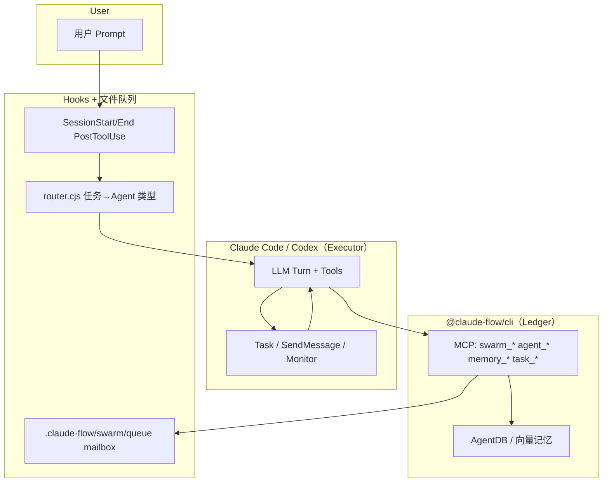

# Ruflo 多 Agent 方案（原项目架构说明）

> 来源项目：`/Users/t-wangwei07/Downloads/workspacePy/harness/ruflo-main`（`claude-flow` / `ruflo` v3.10.x）
> 用途：为迁移到 oma-platform 提供「原样理解」基线，不假设 oma 已有能力。

---

## 1. 定位与核心思想

Ruflo **不是**独立的 LLM Worker 运行时，而是包在 **Claude Code / Codex** 之上的 **协调与学习层（Ledger）**：

| 角色 | 职责 | 谁执行 |
|------|------|--------|
| **Executor** | 写代码、跑命令、调工具 | Claude Code / Codex（宿主 LLM） |
| **Ledger** | 登记 Swarm/Agent/Task、记忆、模式学习 | `@claude-flow/cli`（MCP + CLI） |
| **Glue** | 路由 prompt、生命周期 Hook、文件队列通信 | `.claude/helpers/*`、Hooks |

关键约束（`AGENTS.md`）：

- `swarm_init` / `agent_spawn` **只创建协调记录**，不会自动派生 OS 进程或第二个 LLM。
- 调用协调工具后，**宿主必须继续干活**；停止等待 = 错误用法。



---

## 2. 多 Agent 的五种含义

迁移时必须明确要复刻哪一种（oma 不必全部照搬）：

| # | 模式 | 说明 | 是否「真并行」 |
|---|------|------|----------------|
| 1 | **逻辑多角色** | 108+ Markdown Agent 定义（prompt + MCP 配方） | 否，同一 LLM 换 persona |
| 2 | **Claude Code Agent Teams** | `Task` / `SendMessage` / worktree 隔离 | 是（宿主能力） |
| 3 | **协调账本多 Agent** | MCP 维护 agent 注册表、拓扑、任务状态 | 状态真，执行未必并行 |
| 4 | **跨会话 / 跨机器** | AgentDB + Federation WSS + Ed25519 信任梯 | 是（多节点） |
| 5 | **结构化流水线** | 类型化 SendMessage + 阻塞门（如 risk-analyst） | 协议强制，可串行 |

oma-platform 当前最接近 **#1 + 部分 #2**（`call_agent` 委派）；Ruflo 额外强在 **#3 账本、#4 联邦、#5 流水线、Hooks 学习环**。

---

## 3. 目录与组件地图

### 3.1 入口

| 路径 | 作用 |
|------|------|
| `bin/cli.js` | 统一 CLI → `v3/@claude-flow/cli` |
| `ruflo/bin/ruflo.js` | 品牌包装：MCP + CLI |
| `package.json` | `claude-flow@3.10.37`，依赖 `@claude-flow/*` |

**注意**：本 checkout **不含** `v3/@claude-flow/cli` 源码；`swarm_*` / `agent_*` 实现来自 **npm 包**。

### 3.2 Agent 定义（Prompt 资产）

| 路径 | 规模 |
|------|------|
| `.claude/agents/` | 108+ Markdown（core / swarm / hive-mind / consensus / sparc / github / v3 / dual-mode …） |
| `plugins/*/agents/` | 插件级 Agent（如 `sparc-orchestrator`、`autopilot-coordinator`） |

格式：YAML frontmatter + 角色说明 + **推荐 MCP 调用序列**。

示例类别：

- **core/**：`coder`, `tester`, `reviewer`, `planner`, `researcher`, `architect`
- **swarm/**：`hierarchical-coordinator`, `mesh-coordinator`
- **hive-mind/**：`queen-coordinator`, `worker-specialist`
- **dual-mode/**：Claude 交互设计 + Codex 无头实现

### 3.3 Skills（~142 个 SKILL.md）

| 路径 | 示例 |
|------|------|
| `.agents/skills/` | `swarm-orchestration`, `memory-management`, `sparc-methodology` |
| `.claude/skills/` | 与上重叠副本 |
| `plugins/*/skills/` | 插件专属 |

Skills 教宿主 **何时** 启 Swarm、**如何** 调 MCP/CLI，不是可执行代码。

### 3.4 Hooks 与本地协调

| 文件 | 作用 |
|------|------|
| `.claude/helpers/hook-handler.cjs` | Hook 总线 |
| `.claude/helpers/router.cjs` | 正则：任务文本 → `agent type`（coder/tester/…） |
| `.claude/helpers/memory.cjs` | 本地 KV：`.claude-flow/data/memory.json` |
| `.claude/helpers/session.cjs` | `.claude-flow/sessions/` |
| `.claude/helpers/intelligence.cjs` | 模式匹配 / PageRank 上下文 |
| `.claude/helpers/swarm-comms.sh` | 优先级队列 + mailbox |
| `.claude/helpers/swarm-hooks.sh` | A2A、consensus、handoff |
| `.claude/helpers/worker-manager.sh` | 后台 worker 守护（perf/health/patterns…） |
| `.claude/settings.json` | Hooks 绑定 + `claudeFlow` 配置块 |

### 3.5 运行时数据目录（`npx ruflo init` 后）

| 路径 | 内容 |
|------|------|
| `.claude-flow/swarm/` | `queue/`, `mailbox/`, `patterns/`, `consensus/`, `handoffs/`, `agents.json` |
| `.claude-flow/data/` | `memory.json`, `auto-memory-store.json`, `ranked-context.json` |
| `.claude-flow/sessions/` | `current.json`、归档会话 |
| `.claude-flow/metrics/` | Worker PID / 日志 |

### 3.6 插件市场（33 个）

代表性插件：

| 插件 | 能力 |
|------|------|
| `ruflo-swarm` | 12 MCP 工具契约 + Monitor 流 |
| `ruflo-rag-memory` | 向量 / AgentDB |
| `ruflo-autopilot` | `/loop` 自主完成循环 |
| `ruflo-sparc` | 五阶段 SPARC 门控 |
| `ruflo-federation` | 跨安装点 WSS + 信任梯 |
| `ruflo-intelligence` | `hooks_route` 推荐 Agent |
| `ruflo-neural-trader` | 类型化 SendMessage 流水线示例 |

### 3.7 Web / MCP Bridge

| 路径 | 作用 |
|------|------|
| `ruflo/src/mcp-bridge/index.js` | Express：聚合 stdio MCP 后端 |
| `ruflo/src/ruvocal/` | SvelteKit Chat UI |
| `ruflo/docker-compose.yml` | MongoDB + bridge + nginx + UI |

---

## 4. MCP 工具面（稳定契约）

`plugins/ruflo-swarm/docs/adrs/0001-swarm-contract.md` 钉死 **12 工具**：

### Swarm 族（4）

| 工具 | 用途 |
|------|------|
| `swarm_init` | 拓扑、maxAgents、strategy |
| `swarm_status` | 健康与成员 |
| `swarm_shutdown` | 关闭 Swarm |
| `swarm_health` | 探活 |

### Agent 族（8）

| 工具 | 用途 |
|------|------|
| `agent_spawn` | 登记 Agent 实例 |
| `agent_execute` | 驱动执行（仍依赖宿主） |
| `agent_terminate` | 终止 |
| `agent_status` / `agent_list` / `agent_health` | 观测 |
| `agent_pool` / `agent_update` | 池化与配置更新 |

另有 **memory_***、**task_***、**hive-mind**、**federation_*** 等，文档称 313+ 工具（npm 包内）。

默认反漂移配置（`ruflo-swarm/README.md`）：

- topology: `hierarchical`
- maxAgents: 6–8
- strategy: `specialized`
- consensus: `raft`
- memory: `hybrid`（SQLite + AgentDB）

---

## 5. 通信与协调机制

### 5.1 MCP + 记忆命名空间

协调者写入共享状态：

```javascript
memory_usage {
  action: "store",
  key: "swarm/hierarchical/status",
  namespace: "coordination",
  value: JSON.stringify({...})
}
```

常用 namespace：`coordination`, `swarm-state`, `sparc-state`, `patterns`, `agent-teams`。

### 5.2 文件队列（`swarm-comms.sh`）

```
.claude-flow/swarm/queue/{priority}_{msg_id}.json   # 0=critical … 3=low
.claude-flow/swarm/mailbox/{agent_id}/
```

批处理投递、广播复制到各 mailbox。

### 5.3 A2A 协议（`swarm-hooks.sh`）

```
.claude-flow/swarm/messages/    # Agent 间消息
.claude-flow/swarm/consensus/   # 投票提案
.claude-flow/swarm/handoffs/    # 任务交接
.claude-flow/swarm/agents.json  # 注册表
```

### 5.4 Claude Code 原生 Agent Teams

`.claude/settings.json`：

```json
"env": { "CLAUDE_CODE_EXPERIMENTAL_AGENT_TEAMS": "1" }
```

工具：`Task`, `SendMessage`, `TaskCreate`, `Monitor`, `EnterWorktree`。

与 MCP 账本 **并行存在**，Coding Swarm 文档以原生 Teams 为主通道。

### 5.5 Federation（可选）

- WSS + Ed25519 签名
- 信任梯：`UNTRUSTED` → `PRIVILEGED`
- 工具：`federation_init`, `federation_join`, `federation_send`, `federation_query`

### 5.6 类型化流水线（领域示例）

`ruflo-neural-trader`：

```
market-analyst → RegimeVerdict → trading-strategist
→ SignalProposal[] → risk-analyst（阻塞门）
→ RiskDecision → execute-or-halt
```

多 Agent = **消息 schema + 强制门控**，不一定是并行 LLM。

---

## 6. 状态与学习

| 层 | 存储 | 内容 |
|----|------|------|
| Swarm 文件态 | `.claude-flow/swarm/` | 队列、mailbox、handoff |
| Session | `.claude-flow/sessions/` | 编辑/命令/任务计数 |
| 简单记忆 | `memory.json` | KV |
| 智能图 | `auto-memory-store.json` | 模式 + PageRank 上下文 |
| 向量记忆 | AgentDB（MCP） | HNSW、namespace |
| RVF | `ruflo-rvf` 插件 | 跨会话 Agent 状态 |

学习环：

```
UserPromptSubmit → route + intelligence 上下文
PostToolUse → 记录编辑、训练模式
SubagentStop → post-task neural train
SessionEnd → intelligence.consolidate()
```

依赖 `@claude-flow/neural`（SONA / ReasoningBank，npm）。

---

## 7. 配置与部署

| 文件 | 作用 |
|------|------|
| `.agents/config.toml` | Codex：MCP、skills、swarm/neural/hooks |
| `.claude/settings.json` | Claude Code Hooks + `claudeFlow` |
| `claude-flow.config.json` | `npx ruflo init` 生成 |

部署形态：

1. 本地：`npx ruflo mcp start`
2. Docker：`ruflo/docker-compose.yml`（Mongo + mcp-bridge + UI）
3. K8s / Cloud Run：`ruvocal/chart/`
4. Federation 多节点

---

## 8. 典型主流程

### 8.1 Init → 工作 → 学习

```
npx ruflo init wizard
→ UserPromptSubmit → router + intelligence
→（可选）swarm_init + agent_spawn + task_create
→ 宿主 LLM 执行工具/写代码
→ memory_store(patterns) + SessionEnd consolidate
```

### 8.2 多 Agent 编码 Swarm

```
swarm_init(hierarchical, max=8, specialized)
→ agent_spawn: coordinator, coder×2, tester, reviewer
→ Task 并行子 Agent + SendMessage 交接
→ memory_store(coordination) + Monitor 观测
```

### 8.3 SPARC 五阶段

`sparc-orchestrator`：Specification → Pseudocode → Architecture → Refinement → Completion，每阶段 **gate** + `sparc-gates` namespace。

### 8.4 Autopilot

`autopilot_enable` → 执行任务 → `ScheduleWakeup@270s` → 循环直至 `autopilot_disable`。

### 8.5 Dual-mode（Claude + Codex）

交互设计（Claude Code）→ 无头并行实现（Codex `claude -p`）→ 交互审查；共享 `memory_search/store`。

---

## 9. 依赖与外部集成

| 包 / 服务 | 作用 |
|-----------|------|
| `@claude-flow/cli-core` | 轻量 MCP（~1.5s 冷启） |
| `@claude-flow/mcp` | MCP Server |
| `@claude-flow/neural` | 模式学习 |
| `agentdb` / `@ruvector/*` | 向量 / HNSW |
| `@noble/ed25519` | Federation 签名 |
| `ruvector` MCP | `hooks_*` 智能路由 |
| `agentic-flow` MCP | 66+ 专用 Agent |
| GitHub / Flow Nexus MCP | PR/Issue/云编排 |

---

## 10. 与「单 Agent」的本质差异

| 维度 | 单 Agent | Ruflo 多 Agent |
|------|----------|----------------|
| 角色 | 一个 system prompt | 108+ 角色 + 路由 + 拓扑 |
| 状态 | 对话历史 | Swarm 注册表 + namespace + 文件队列 |
| 并行 | 单 turn | Agent Teams +（可选）多会话联邦 |
| 学习 | 无 / 手动 | Hooks → 模式库 → neural train |
| 执行主体 | LLM | **仍是** LLM；账本不替代执行 |
| 契约 | 无 | ADR + smoke.sh（如 swarm 11 checks） |

---

## 11. 迁移阅读清单（给 oma 团队）

优先读这些文件即可建立正确心智模型：

1. `AGENTS.md` — Ledger vs Executor
2. `plugins/ruflo-swarm/docs/adrs/0001-swarm-contract.md` — 12 MCP 工具
3. `.claude/helpers/router.cjs` — 任务→类型路由
4. `.claude/helpers/swarm-comms.sh` — 文件队列
5. `.claude/agents/core/coder.md` — Agent 定义格式
6. `.agents/skills/swarm-orchestration/SKILL.md` — 何时启 Swarm
7. `docs/federation/README.md` — 跨节点（若需要）
8. `plugins/ruflo-neural-trader/src/pipeline-messages.ts` — 类型化流水线范例

**不要**假设 checkout 内的 `v3/@claude-flow/cli` 存在；实现以 npm `@claude-flow/cli` 为准。

---

## 12. 能力矩阵（摘要）

| 能力 | Ruflo 实现 | 成熟度 |
|------|-----------|--------|
| 角色库（Markdown） | `.claude/agents/` | 高（资产多） |
| Swarm 账本 MCP | npm CLI | 高（契约化） |
| 宿主内并行 | Claude Agent Teams | 高（依赖 Cursor/CC） |
| 文件 A2A | swarm-comms/hooks | 中（单机） |
| 向量记忆 | AgentDB + MCP | 高 |
| 模式学习 | neural + hooks | 中 |
| SPARC / Autopilot | 插件 + Agent | 高 |
| 联邦多节点 | federation 插件 | 中 |
| 类型化流水线 | 领域插件示例 | 中（需定制） |
| 持久化 API / 多租户 | 无（本地/CLI 为主） | 低 vs 云平台 |

此矩阵直接用于下一文档《Ruflo → oma-platform 多 Agent 迁移方案》的 gap 对照。
