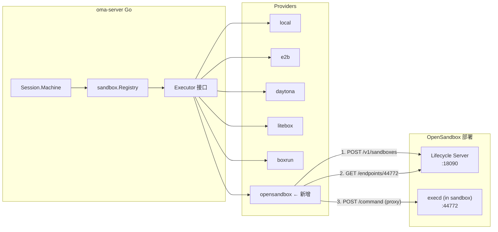
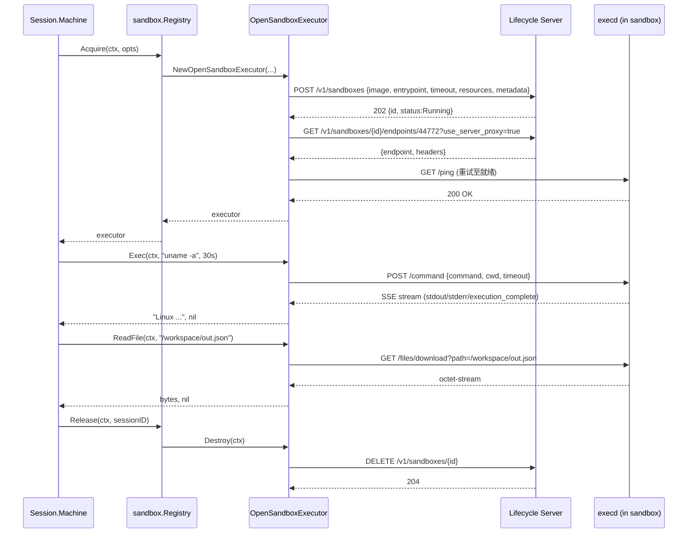

# OpenSandbox 作为 Environment 的设计

本文说明如何把 [OpenSandbox](https://github.com/opensandbox-group/OpenSandbox) 接入 oma-platform，作为第 6 种 sandbox provider（与 `local` / `e2b` / `daytona` / `litebox` / `boxrun` 并列），给 Session 提供远程、容器化、带 execd 的隔离执行环境。

参考实现：

- `agent-infra/src/agent_infra/sandbox/` —— 已验证可用的 Python 客户端，本文的 API 行为以它为准
- `sandbox/OpenSandbox-main/specs/` —— OpenSandbox 官方 OpenAPI（lifecycle + execd）
- `sandbox/OpenSandbox-main/server/` —— OpenSandbox Server 源码（Docker / K8s 后端）

## 一句话总结

**OpenSandbox Provider 通过两层 HTTP 调用完成工作：① Lifecycle Server（`POST /v1/sandboxes`，跑在 VM 上，端口默认 18090）负责创建/销毁容器；② 容器内的 execd（端口 44772）通过 Server 端点代理（`GET /v1/sandboxes/{id}/endpoints/44772?use_server_proxy=true`）暴露出来，oma-platform 走这条代理通道调用 `/command` 跑 shell、`/files/download` 读文件。** 在 `internal/sandbox/` 中新增 `opensandbox.go`，实现 `Executor` 接口；在 `Registry.Acquire` 的 `switch` 中加一个分支；`Config` 增加一组 `OPENSANDBOX_*` 字段。

## 在整体架构中的位置

oma-platform 的 sandbox 抽象位于 `internal/sandbox/`，对外只暴露 `Executor` 接口（`Exec` / `ReadFile` / `Destroy`）。上层通过 `workdir.Manager.Sandbox`（即 `*sandbox.Registry`）持有；`Session.Machine` 在 turn 开始时根据 `Config.IsRemote()` 决定是否 `Acquire`，turn 结束调 `Release`。OpenSandbox 加进来后：



`Executor` 的 3 个方法映射到 OpenSandbox：

| Executor 方法 | OpenSandbox 调用 |
|---------------|------------------|
| `Exec(ctx, cmd, timeout)` | `POST {execd_url}/command` + SSE 收集 stdout/stderr/exit |
| `ReadFile(ctx, path)` | `GET {execd_url}/files/download?path=...`（首选）或 `Exec(base64)` 兜底 |
| `Destroy(ctx)` | `DELETE {lifecycle_url}/v1/sandboxes/{id}` |

## OpenSandbox 两层 API 简述

### Layer 1 — Lifecycle Server（oma-platform ↔ Server）

端口默认 18090，路径前缀 `/v1`。认证：HTTP header `OPEN-SANDBOX-API-KEY`。oma-platform 会用到：

| 操作 | 方法 | 路径 |
|------|------|------|
| 创建 sandbox | `POST` | `/v1/sandboxes` |
| 删除 sandbox | `DELETE` | `/v1/sandboxes/{id}` |
| 取 execd 端点 | `GET` | `/v1/sandboxes/{id}/endpoints/44772?use_server_proxy=true` |
| 续期 TTL | `POST` | `/v1/sandboxes/{id}/renew-expiration`（可选，MVP 不做） |

创建请求体（oma-platform 只填必需字段，其余走服务端默认）：

```json
{
  "image":        { "uri": "python:3.12" },
  "entrypoint":   ["tail", "-f", "/dev/null"],
  "timeout":      3600,
  "resourceLimits": { "cpu": "500m", "memory": "512Mi" },
  "env":          { "OMA_SESSION_ID": "sess_abc" },
  "metadata":     { "oma_session_id": "sess_abc", "oma_tenant_id": "t_xyz" }
}
```

响应（202）：`{ id, status: { state: "Running" }, createdAt, entrypoint, metadata, expiresAt }`。拿到 `id` 后**立刻查 endpoint**，execd 的 URL 通常要 1~3 秒后才可用，需带指数退避的重试。

### Layer 2 — execd（oma-platform ↔ 容器内 daemon，经 Server 代理）

`use_server_proxy=true` 时，`GET /v1/sandboxes/{id}/endpoints/44772` 返回：

```json
{
  "endpoint": "http://124.221.28.203:18090/sandboxes/<id>/proxy/44772/",
  "headers":  { "X-Proxy-Sandbox-Id": "<id>", "X-Proxy-Port": "44772", ... }
}
```

所有后续的 execd 调用都发到 `endpoint + path`，并把 `headers` 透传回去。认证由 Server 端点代理处理，oma-platform 不需要再带 execd 自己的 token。

execd 暴露的能力（oma-platform 用到的）：

| 操作 | 方法 | 路径 | 备注 |
|------|------|------|------|
| 跑 shell 命令 | `POST` | `/command` | 响应是 SSE 流 |
| 中断命令 | `DELETE` | `/command?id=<cmdId>` | 可选，MVP 不做 |
| 读文件 | `GET` | `/files/download?path=...` | 返回 octet-stream |
| 健康检查 | `GET` | `/ping` | 用来轮询 execd 就绪 |

`/command` 的请求体：

```json
{
  "command": "uname -a",
  "cwd": "/workspace",
  "background": false,
  "timeout": 30000,
  "envs": { "PATH": "..." }
}
```

响应是 `text/event-stream`，事件类型有 `init` / `stdout` / `stderr` / `status` / `execution_complete` / `error`，每条形如：

```
data: {"type":"stdout","text":"Linux ...\n","timestamp":1700000000000}
data: {"type":"execution_complete","exit_code":0,"execution_time":42}
```

oma-platform 的 SSE parser 只需关心 `stdout` / `stderr` / `execution_complete` / `error` 四类。

## 模块设计

### 1. 常量与配置（`internal/sandbox/provider.go`）

新增：

```go
const ProviderOpenSandbox = "opensandbox"

type Config struct {
    // ... 现有字段 ...

    // OpenSandbox Lifecycle Server
    OpenSandboxDomain        string   // 例如 "124.221.28.203:18090"
    OpenSandboxProtocol      string   // "http" 或 "https"，默认 "http"
    OpenSandboxAPIKey        string   // 可选；留空走 INSECURE 模式
    OpenSandboxUseServerProxy bool    // 默认 true；execd 走 server 代理
    OpenSandboxExecdPort     int      // 默认 44772

    // 沙箱创建参数
    OpenSandboxImage         string   // 默认 "python:3.12"
    OpenSandboxEntrypoint    string   // 默认 "tail -f /dev/null"(服务端必填,Python SDK 行为一致)
    OpenSandboxTimeoutSec    int      // 默认 3600
    OpenSandboxCPU           string   // 默认 "500m"
    OpenSandboxMemory        string   // 默认 "512Mi"
}
```

`LoadConfigFromEnv` 读取：

| 环境变量 | 字段 | 默认 |
|----------|------|------|
| `OPENSANDBOX_DOMAIN` | `OpenSandboxDomain` | （必填） |
| `OPENSANDBOX_PROTOCOL` | `OpenSandboxProtocol` | `http` |
| `OPENSANDBOX_API_KEY` | `OpenSandboxAPIKey` | `""` |
| `OPENSANDBOX_USE_SERVER_PROXY` | `OpenSandboxUseServerProxy` | `true` |
| `OPENSANDBOX_EXECD_PORT` | `OpenSandboxExecdPort` | `44772` |
| `OPENSANDBOX_IMAGE` | `OpenSandboxImage` | `python:3.12` |
| `OPENSANDBOX_ENTRYPOINT` | `OpenSandboxEntrypoint` | `""` |
| `OPENSANDBOX_TIMEOUT_SECONDS` | `OpenSandboxTimeoutSec` | `3600` |
| `OPENSANDBOX_CPU` | `OpenSandboxCPU` | `500m` |
| `OPENSANDBOX_MEMORY` | `OpenSandboxMemory` | `512Mi` |

`Validate`：`Provider == "opensandbox"` 时要求 `OpenSandboxDomain != ""`；其它可选。

`IsRemote`：把 `ProviderOpenSandbox` 加进 remote 名单。

`normalizeProviderName`：不需要别名，`opensandbox` 原样返回即可。

### 2. `OpenSandboxExecutor`（`internal/sandbox/opensandbox.go`）

```go
type OpenSandboxExecutor struct {
    cfg         Config
    httpClient  *http.Client
    sandboxID   string
    execdURL    string       // https://.../sandboxes/<id>/proxy/44772/
    execdHeaders http.Header // endpoint 返回的透传 header
    mu          sync.Mutex
}
```

生命周期：

```
NewOpenSandboxExecutor(ctx, cfg, opts, httpClient)
  ├─ POST {lifecycle}/v1/sandboxes  (body: image/entrypoint/timeout/resources/env/metadata)
  │    └─ 响应 202: id = resp.id; 若 state != "Running" → 轮询 GET /sandboxes/{id}
  │        直到 state ∈ {Running, Failed} 或超时(30s)
  ├─ openSandboxWaitForExecd(ctx, execdURL)
  │    └─ 指数退避: GET {execdURL}/ping，200 即就绪；最多 15s
  └─ 返回 executor；任何一步失败 → Destroy() 已创建的 sandbox，避免泄漏
```

`Exec`：

```
Exec(ctx, command, timeout):
  1. POST {execdURL}/command, body = { command, cwd:"/workspace", timeout: ms }
     headers 带上 execdHeaders + Content-Type: application/json
  2. 读 SSE 流：
     - type=stdout → append stdout
     - type=stderr → append stderr
     - type=execution_complete → exitCode = event.exit_code, break
     - type=error → 记录错误信息
  3. 拼接 combined = stdout + stderr，非 0 exit → combined + "\n[exit N]"
```

SSE parser：逐行读，跳过空行与 `:` 注释；对 `data: ` 行 `json.Unmarshal` 到 `{type, text, exit_code, error}` 结构。参考现有 `parseE2BConnectOutput`，但 event schema 不同（OpenSandbox 直接给 `text`，不是 base64）。

`ReadFile`：

```
ReadFile(ctx, path):
  1. GET {execdURL}/files/download?path={urlquery(path)}
  2. headers: execdHeaders
  3. 响应 200/206 → io.ReadAll(resp.Body)
  4. 4xx/5xx → 回退到 Exec(ctx, "base64 -w0 <path>")，解码 stdout
```

回退到 base64 是为了兼容极少数 execd 老版本不支持 `/files/download` 的情况；正常情况下走直读，避免 shell 转义问题。

`Destroy`：

```
Destroy(ctx):
  if sandboxID == "": return nil
  DELETE {lifecycle}/v1/sandboxes/{id}, header OPEN-SANDBOX-API-KEY
  404 → 忽略（已清理）
  sandboxID = ""
```

### 3. Registry 分发（`internal/sandbox/registry.go`）

在 `Acquire` 的 `switch r.cfg.Provider` 中加：

```go
case ProviderOpenSandbox:
    ex, err = NewOpenSandboxExecutor(ctx, r.cfg, opts, r.httpClient)
```

### 4. Provider 校验（`internal/sandbox/provider.go`）

`Validate` 增加：

```go
case ProviderOpenSandbox:
    if c.OpenSandboxDomain == "" {
        return fmt.Errorf("OPENSANDBOX_DOMAIN required when SANDBOX_PROVIDER=opensandbox")
    }
    return nil
```

错误信息里的枚举字符串也加上 `opensandbox`。

### 5. 单元测试（`internal/sandbox/opensandbox_test.go`）

对齐 `boxrun_test.go` 的做法：用 `httptest.NewServer` 起两个 fake——一个 lifecycle，一个 execd。覆盖：

- 创建成功 → 端点解析 → execd 就绪 → `Exec` 拼 stdout
- 创建返回 4xx → 返回带 status 的 error
- execd 一直不就绪（/ping 持续 503）→ 超时返回 error 且 sandbox 被销毁
- `ReadFile` 走 `/files/download` 成功路径
- `ReadFile` 下载失败回退到 `base64` 路径
- `Destroy` 幂等：多次调用不报错
- `Config.Validate`：缺 `OPENSANDBOX_DOMAIN` 时返回错误

## 端到端流程



## 错误处理与超时

| 阶段 | 超时 | 失败处理 |
|------|------|----------|
| Lifecycle `POST /v1/sandboxes` | 60s | 返回 error；无 sandbox 可清理 |
| 等 sandbox state=Running | 30s 总预算 | 失败 → 调 `DELETE /sandboxes/{id}` 清理 |
| `GET /endpoints/44772` | 10s | 失败 → 同上清理 |
| execd `/ping` 就绪轮询 | 15s，指数退避 200ms→2s | 失败 → 同上清理 |
| `/command` 执行 | 用户给的 timeout（默认 120s） | HTTP 错 → 返回 err；非 0 exit → 拼到输出 |
| `/files/download` | 30s | 失败 → 回退到 `base64` 路径 |
| `DELETE /sandboxes/{id}` | 15s | 404 忽略；其它错误 log + 返回 |

**关键原则：`NewOpenSandboxExecutor` 失败时必须自行清理已创建的 sandbox**，不能依赖上层 `Release`（因为注册表还没登记）。`litebox.go` 和 `e2b.go` 都遵循这个模式，OpenSandbox 保持一致。

## 与现有 provider 的对比

| 维度 | e2b | daytona | litebox | boxrun | **opensandbox** |
|------|-----|---------|---------|--------|-----------------|
| 部署位置 | 公有云 | 公有云 | 本地 Node 桥 | 自建 HTTP | 自建 VM (Docker/K8s) |
| 协议 | Connect/grpc-web | REST+toolbox | stdin/stdout JSON | REST | REST (lifecycle) + SSE (execd) |
| 文件读 | `base64` 兜底 | toolbox download | bridge `readFile` | 同 e2b | `/files/download`，失败回退 `base64` |
| 命令输出 | base64 嵌套 | 字符串 | 字符串 | 字符串 | SSE 流拼装 |
| 镜像可定制 | 模板 ID | image 字段 | image 字段 | 配置 | `image.uri` + `entrypoint` |
| 资源限制 | 模板 | - | memoryMib/cpus | CPUs/MemoryMib | `cpu`/`memory` 字符串（K8s 风格） |
| 沙箱 TTL | 模板/timeout | - | 进程存活 | - | `timeout` 秒；支持续期（MVP 不做） |
| 网络策略 | - | - | - | - | `networkPolicy`（MVP 不做，留给后续） |

## 安全考量

1. **认证**：Lifecycle Server 用 `OPEN-SANDBOX-API-KEY`；execd 通过 Server 端点代理，oma-platform 不直接持有 execd token。这意味着 oma-platform 只要保护一个 secret。
2. **传输层**：默认 `http`；生产环境应配 `OPENSANDBOX_PROTOCOL=https` 并启用 `secureAccess: true`（K8s 模式下由 Server 签发 endpoint token）。MVP 用 `use_server_proxy=true` 已足够。
3. **沙箱隔离**：每个 oma session 一个 sandbox（对应一个容器），与 e2b/daytona 的粒度一致。metadata 里打 `oma_session_id` / `oma_tenant_id` 方便追溯。
4. **出站网络**：OpenSandbox 支持 `networkPolicy`，oma-platform 暂不暴露该字段，默认 allow-all。后续可加 `OPENSANDBOX_NETWORK_POLICY` 环境变量（JSON）。
5. **密钥注入**：OpenSandbox 有 `credentialProxy` 机制；oma-platform 的 Vault 集成（见 `docs/design/vault-and-credentials.md`）可后续对接，MVP 不接。

## 部署考量

oma-platform 不直接部署 OpenSandbox Server——后者由运维团队独立维护（参考 `agent-infra/deploy/start-opensandbox.sh`，已在 VM 上验证）。oma-platform 只需：

1. `.env` 增加 `SANDBOX_PROVIDER=opensandbox` 与 `OPENSANDBOX_DOMAIN` 等变量。
2. 网络可达：oma-server → Lifecycle Server (18090) → execd (44772，代理模式只需开到 Server)。
3. 容器镜像：默认 `python:3.12` 即可跑 shell + Python；若要 Code Interpreter 能力，换成 `opensandbox/code-interpreter:v1.1.0` 并设置 `OPENSANDBOX_ENTRYPOINT=/opt/code-interpreter/code-interpreter.sh`。

## MVP 不做（显式排除）

为把第一版做小，以下能力留到后续迭代：

- `pause` / `resume` / `renew-expiration`
- `snapshots`（快照与恢复）
- `networkPolicy` 出站策略
- `credentialProxy` Vault 注入
- `secureAccess`（K8s 端点签名）
- Code Interpreter 语义（`/code/contexts`、`/code`）——oma-platform 只把 OpenSandbox 当 shell sandbox 用，code interpreter 留给独立 provider
- 资源 requests vs limits 区分（用 `limits` 即可）
- `volumes`（OSSFS/PVC 等）
- 多 execd 语言会话管理

这些能力 OpenSandbox 服务端都支持，未来接入只是扩展 `Config` + 在 `OpenSandboxExecutor` 里加字段，不需要重构。

## 文件清单

| 文件 | 改动 |
|------|------|
| `internal/sandbox/provider.go` | 加常量、Config 字段、env 加载、Validate、IsRemote |
| `internal/sandbox/opensandbox.go` | 新增 `OpenSandboxExecutor` 及其构造、Exec/ReadFile/Destroy、SSE parser |
| `internal/sandbox/registry.go` | `Acquire` switch 加 `ProviderOpenSandbox` 分支 |
| `internal/sandbox/opensandbox_test.go` | 新增单元测试 |
| `.env.example` | 加 `OPENSANDBOX_*` 示例 |
| `docs/design/opensandbox-environment.md` | 本文 |

## 验收标准

- `SANDBOX_PROVIDER=opensandbox` + `OPENSANDBOX_DOMAIN=...` 启动 oma-server，新建 session 时：
  - Lifecycle 上能看到新建的 sandbox（metadata 含 oma_session_id）
  - Agent 的 `bash` 工具调用的命令能在容器内执行并返回 stdout
  - `read_file` 工具能读容器内的文件
  - session 结束时 sandbox 被删除（Lifecycle 上不再出现）
- 单元测试覆盖上述所有路径，`go test ./internal/sandbox/...` 通过
- 失败时不泄漏 sandbox（用 Lifecycle `GET /v1/sandboxes` 列表核对）
