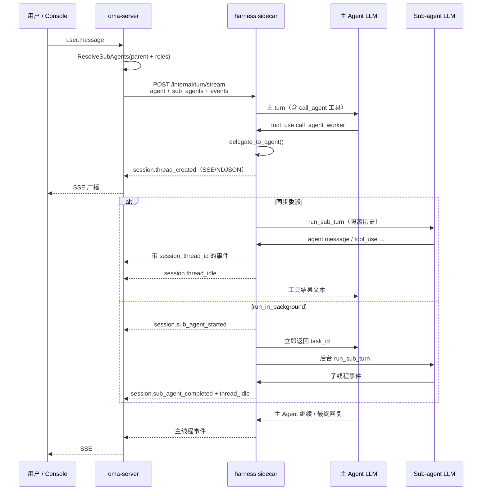

# Sub-agent（子 Agent）

本文说明 OMA 中 **Sub-agent** 是什么、主 Agent 如何委派任务给它，以及 oma-platform 中的实现方式。

## 一句话总结

**Sub-agent 是主 Agent 在运行时临时「派出去干活的另一个 Agent」。** 主 Agent 不亲自完成所有步骤，而是通过 `call_agent_*` 或 `general_subagent` 工具把子任务交给 Sub-agent；Sub-agent 在隔离的对话上下文里跑一轮 LLM turn，最后把文本结果当作工具返回值还给主 Agent（也可选 `run_in_background` 异步执行）。

可以把主 Agent 想成项目经理，Sub-agent 是被派去调研、写代码或跑命令的专员——干完活汇报一句结论，然后退场。

## 通俗类比

| 角色 | 类比 | 在系统里 |
|------|------|----------|
| **主 Agent** | 项目经理 | Session 主线程 `sthr_primary` 上的 Agent |
| **Sub-agent** | 被委派的专员 | 独立 Agent 配置，跑在子线程 `sthr_*` 上 |
| **call_agent 工具** | 「派活」动作 | 主 Agent 的 tool call，触发一次委派 |
| **工具返回值** | 专员的口头汇报 | Sub-agent 最后一则 `agent.message` 的文本 |
| **共享沙箱** | 同一间办公室 | 主、子 Agent 读写同一个 workdir，文件可互相看见 |

用户通常只和主 Agent 对话；Sub-agent 是主 Agent 内部的执行细节，除非打开 Console 的线程 Tab，否则不一定感知得到。

## 模块分层

委派逻辑已从 `oma_adapter` 拆出为可复用包，便于后续 Agent Teams 等能力复用同一套 `pi_subagent`：

| 层级 | 路径 | 职责 |
|------|------|------|
| **核心包** | `piPy-subagent/packages/pi_subagent/` | 与宿主无关：工具定义、`delegate_to_agent`、内置 role prompt、事件 helper |
| **宿主桥** | `harness/oma_adapter/subagent_bridge.py` | 把子 turn 接到 OMA 的 `_run_turn_core`（隔离历史、打标 `session_thread_id`） |
| **piPy 扩展** | `piPy-subagent/extensions/subagent_extension.py` | 在 session 创建时注册 `call_agent_*` / `general_subagent` |
| **Go 解析** | `internal/harness/snapshot.go`、`subagent_roles.go` | `ResolveSubAgents`、角色与 `callable_agents` 合并 |

## 为什么需要 Sub-agent？

1. **分工**：协调者 Agent 负责拆任务，专业 Agent（研究员、写码员）负责执行。
2. **上下文隔离**：子任务在独立历史里跑，不会把大量中间步骤塞进主对话。
3. **可观测**：每次委派创建一条 [Session Thread](./session-threads.md)，Console 可按线程查看子 Agent 的工具调用与回复。
4. **评测**：多 Agent eval 用 `session.thread_created` 判断「是否发生过委派」。

## 三类委派目标

oma-platform 支持三类委派目标（与 open-managed-agents 对齐，并增加角色模板）：

### 1. 具名 Sub-agent（`call_agent_<id>`）

主 Agent 在配置里声明可呼叫的 Agent 列表 `callable_agents`：

```json
{
  "callable_agents": [
    { "type": "agent", "id": "researcher", "version": 1 },
    { "type": "agent", "id": "coder", "version": 1 }
  ]
}
```

Harness 会为每个 id 注册工具：

- `call_agent_researcher`
- `call_agent_coder`

工具参数为 `{ "message": "具体任务描述" }`。Sub-agent 使用**该 Agent 自己的** system prompt、tools、MCP 等完整配置。

### 2. 通用 Sub-agent（`general_subagent`）

无需预先创建 Agent 记录。在父 Agent 的 `metadata` 中开启：

```json
{
  "metadata": {
    "enable_general_subagent": true
  }
}
```

Harness 注册 `general_subagent` 工具，参数为 `{ "task": "..." }`。内部使用保留 id `general`，并**合成**一份临时配置：

- 继承父 Agent 的 model
- 固定「专注执行单一任务」的 system prompt
- 仅启用 bash / read / write / edit / grep / glob（禁用 web_fetch、MCP、再委派）

适合「偶尔派个杂活」、不想维护独立 Agent 配置的场景。

### 3. 内置角色模板（`default_subagent_roles`）

无需在 `callable_agents` 里逐个列举时，可在父 Agent 的 `metadata` 中声明**角色 → Agent id** 映射。Go 层 `mergeCallableWithRoleDefaults` 会：

1. 将角色表与 `callable_agents` 合并（`callable_agents` 为空时，仅凭角色表生成委派列表）；
2. 为每个 Sub-agent 快照写入 `metadata.subagent_role`；
3. Harness 在委派前用内置 prompt 覆盖该 Sub-agent 的 `system_prompt`（与 Claude Code built-in agents 对齐）。

支持的角色：

| 角色 | 行为 |
|------|------|
| `explore` | 只读探索：read / grep / glob / bash 检查，输出结构化发现 |
| `plan` | 输出实现计划，不改文件 |
| `verify` | 跑测试 / lint，报告 pass/fail |

两种 JSON 写法：

```json
{
  "metadata": {
    "default_subagent_roles": {
      "explore": "agt_explorer",
      "plan": "agt_planner"
    }
  }
}
```

或数组形式：

```json
{
  "metadata": {
    "default_subagent_roles": [
      { "id": "agt_explorer", "role": "explore" },
      { "id": "agt_planner", "role": "plan" }
    ]
  }
}
```

角色模板可与 `callable_agents` 混用：同一 id 在角色表中出现时，会附带 `subagent_role` 标签。

## 如何使用

Sub-agent **不是用户直接调用的 API**，而是主 Agent 在 turn 里**自动选择**的工具。你要做的是：配好 Agent → 开 Session → 用自然语言描述任务；主 LLM 在需要时会调用 `call_agent_*` 或 `general_subagent`。

### 方式一：具名 Sub-agent（推荐用于固定分工）

**步骤 1 — 创建子 Agent 配置**

先为每个专员各建一条 Agent 记录（`POST /v1/agents`）。子 Agent 的 `id` 会被主 Agent 引用，建议用稳定、可读的 id（如 `agt_researcher`）。

```bash
# 研究员
curl -sS -X POST "$BASE/v1/agents" \
  -H "Authorization: Bearer $TOKEN" \
  -H "Content-Type: application/json" \
  -d '{
    "name": "Researcher",
    "model": "claude-sonnet-4-20250514",
    "system": "你是研究员。只回答被问到的问题，简洁、可引用。",
    "tools": [{ "type": "agent_toolset_20260401" }]
  }'

# 写码员（记下返回的 id，例如 agt_coder）
curl -sS -X POST "$BASE/v1/agents" \
  -H "Authorization: Bearer $TOKEN" \
  -H "Content-Type: application/json" \
  -d '{
    "name": "Coder",
    "model": "claude-sonnet-4-20250514",
    "system": "你是写码员。按任务写文件、跑测试，返回简短结论。",
    "tools": [{ "type": "agent_toolset_20260401" }]
  }'
```

**步骤 2 — 创建协调者主 Agent**

在 `callable_agents` 里写上一步返回的 **Agent id**（不是 name）：

```bash
curl -sS -X POST "$BASE/v1/agents" \
  -H "Authorization: Bearer $TOKEN" \
  -H "Content-Type: application/json" \
  -d '{
    "name": "Coordinator",
    "model": "claude-sonnet-4-20250514",
    "system": "你是协调者。需要调研时用 call_agent_<研究员id>；需要写代码时用 call_agent_<写码员id>。拿到子 Agent 结果后再整合回复用户。",
    "callable_agents": [
      { "type": "agent", "id": "agt_researcher", "version": 1 },
      { "type": "agent", "id": "agt_coder", "version": 1 }
    ],
    "tools": [{ "type": "agent_toolset_20260401" }]
  }'
```

也可用 `multiagent` 简写（API 会转成 `callable_agents`）：

```json
{
  "multiagent": {
    "type": "coordinator",
    "agents": [
      { "type": "agent", "id": "agt_researcher", "version": 1 },
      { "type": "agent", "id": "agt_coder", "version": 1 }
    ]
  }
}
```

**步骤 3 — 开 Session 并发送任务**

```bash
# 创建 Session（agent 配置会快照进 session）
curl -sS -X POST "$BASE/v1/sessions" \
  -H "Authorization: Bearer $TOKEN" \
  -H "Content-Type: application/json" \
  -d '{ "agent_id": "<coordinator_id>" }'

# 发送用户消息，触发 turn
curl -sS -X POST "$BASE/v1/sessions/<session_id>/events" \
  -H "Authorization: Bearer $TOKEN" \
  -H "Content-Type: application/json" \
  -d '{
    "type": "user.message",
    "content": [{ "type": "text", "text": "先让研究员解释斐波那契数列，再让写码员在 fib.py 实现并跑一个测试。" }]
  }'
```

主 Agent 若判断需要委派，会看到工具 `call_agent_agt_researcher`、`call_agent_agt_coder` 并发起 tool call；你**无需**在消息里写工具名，但 system prompt 里说明「何时委派」会显著提高调用率。

**步骤 4 — 观测结果**

| 入口 | 看什么 |
|------|--------|
| SSE / 事件流 | `agent.tool_use`（name 为 `call_agent_*`）、`session.thread_created`、带 `session_thread_id` 的子线程事件、`session.sub_agent_started` / `session.sub_agent_completed`（后台模式） |
| `GET /v1/sessions/{id}/threads` | 主线程 + 各子线程列表 |
| `GET /v1/sessions/{id}/trajectory` | `summary.num_threads` ≥ 2 表示发生过委派 |
| Console Session 详情 | 出现子线程 Tab 时可切换查看子 Agent 轨迹 |

### 方式二：通用 Sub-agent（`general_subagent`）

只需一个 Agent，在 `metadata` 打开开关：

```bash
curl -sS -X POST "$BASE/v1/agents" \
  -H "Authorization: Bearer $TOKEN" \
  -H "Content-Type: application/json" \
  -d '{
    "name": "SoloWithHelper",
    "model": "claude-sonnet-4-20250514",
    "system": "复杂、可独立完成的子任务用 general_subagent 委派；简单问题自己答。",
    "metadata": { "enable_general_subagent": true },
    "tools": [{ "type": "agent_toolset_20260401" }]
  }'
```

用户消息示例：

> 「用 general_subagent 在 src/ 下 grep 所有 TODO，把结果整理成列表。」

工具参数为 `{ "task": "..." }`（不是 `message`）。`general` 子 Agent 只能用文件/ bash 类工具，**不能**用 MCP、web_fetch，也**不能**再委派。

### 方式三：后台委派（`run_in_background`）

`call_agent_*` 与 `general_subagent` 均支持可选参数 `run_in_background: true`：

```json
{
  "message": "扫描 src/ 下所有 TODO 并汇总",
  "run_in_background": true
}
```

行为：

1. 主 Agent **立即**收到工具返回值（含 `task_id`、`thread_id`），可继续处理其他事；
2. Harness 发出 `session.sub_agent_started`，子 turn 在后台跑；
3. 完成后发出 `session.sub_agent_completed`（含 `summary`）与 `session.thread_idle`；
4. 主 turn 结束前会 `await` 所有后台子任务，保证事件写入完整。

适合耗时探索、与主对话并行的子任务。Console Timeline 会展示 `sub_agent_started` / `sub_agent_completed`。

### 使用要点

1. **`callable_agents` 随 Session 快照冻结** — 改主 Agent 的委派列表后，**已存在的 Session 不会自动更新**；需新建 Session 或依赖 Agent 版本策略。
2. **子 Agent 配置每次 turn 从数据库实时加载** — `ResolveSubAgents` 按快照里的 id 列表（含 `default_subagent_roles` 展开结果）拉最新配置；你更新 Researcher 的 system prompt 后，**同一 Session 下一 turn** 就会用新配置。
3. **默认同步委派** — 未设 `run_in_background` 时，主 turn 会 `await` 子 turn 完成才继续；一次委派 ≈ 额外一整轮 LLM + 工具开销。
4. **子 Agent 共享 workdir** — 子 Agent 写的文件主 Agent 立即可见；委派消息里写清路径与验收标准。
5. **当前仅支持一层委派** — 子 turn 内会去掉 `callable_agents`，子 Agent 不能再 `call_agent`（与 CF 版的嵌套委派不同）。
6. **工具名规则** — id 中的非字母数字会替换成 `_`，例如 id `agt-researcher` → 工具 `call_agent_agt_researcher`。
7. **缺失的子 Agent 在 turn 启动时失败** — `ResolveSubAgents` 若发现 `callable_agents` / 角色表中的 id 在库里不存在，**整轮 turn 报错**（不再静默跳过）。

### 用户 / 开发者无需做的事

- 不要手动 `POST session.thread_created`（由 harness 在委派时发出）。
- 不要为子线程单独创建 Session（子线程是同一 Session 内的事件标签）。
- 不要在 API 层直接调用 `delegate_to_agent`（仅 harness / `pi_subagent` 内部使用）。

## 适用场景

### 适合使用 Sub-agent

| 场景 | 推荐方式 | 原因 |
|------|----------|------|
| **协调者 + 专家分工** | 具名 `call_agent_*` | 研究员 / 写码员 / 审稿员各有独立 system、工具、MCP |
| **子任务会很长、很吵** | 具名或 `general_subagent` | 子 turn 历史隔离，主对话保持简洁 |
| **同一轮里多个独立子任务** | 多个 `call_agent_*`（可并行） | 工具 `execution_mode = "parallel"`；同步委派互不阻塞 |
| **耗时子任务、主 Agent 先继续** | `run_in_background: true` | 立即返回 `task_id`，完成后 `session.sub_agent_completed` |
| **探索 / 规划 / 验证分工** | `default_subagent_roles` | 内置 role prompt，无需为每个角色写独立 system |
| **Eval 多 Agent 用例** | 具名 + `callable_agents` | 用 `session.thread_created` 断言「发生过委派」 |
| **偶尔做一次 repo 扫描 / 整理** | `general_subagent` | 不必为一次性杂活维护子 Agent 记录 |
| **主 Agent 要「汇总多方意见」** | 多个具名 Sub-agent | 主 Agent 收 tool result 后写最终答案 |

典型用户话术（主 Agent 应能识别并委派）：

- 「先调研 X，再根据调研结果实现 Y。」
- 「让研究员查文档，写码员按结论改 `api.go`。」
- 「并行：A 查日志，B 写复现脚本。」

### 不适合使用 Sub-agent

| 场景 | 更合适的做法 |
|------|----------------|
| **单轮问答、翻译、摘要** | 主 Agent 直接回答，无委派开销 |
| **子 Agent 需要 MCP / 浏览器** | 用**具名** Sub-agent 并配好 `mcp_servers`；不要用 `general_subagent` |
| **子 Agent 还要再派子 Agent** | oma-platform 当前不支持；考虑扁平化任务或等嵌套委派落地 |
| **极低延迟交互** | 避免委派（多一整轮 LLM）；或把步骤合并进主 prompt |
| **需要与用户持续多轮对话的子角色** | Sub-agent 只做**单轮**隔离 turn；长期角色应做成独立 Session / 独立 Agent |
| **强依赖完整主对话上下文** | Sub-agent **看不到**主线程历史，须在 `message` / `task` 里写全上下文 |

### 选型速查

```
需要固定专家、不同 MCP/工具集？
  → 具名 Sub-agent（callable_agents）

只是偶尔派个文件/命令类杂活？
  → general_subagent（metadata 开关）

需要 explore / plan / verify 预设行为？
  → default_subagent_roles + 具名 Agent id

子任务很长、主 Agent 不能干等？
  → run_in_background: true

任务简单、一步能做完？
  → 不用 Sub-agent
```

## 与 Session Thread 的关系

**一次 Sub-agent 委派 = 创建一条 Session Thread。**

```
主 Agent 调用 call_agent_worker
    │
    ├─ 生成 session_thread_id: sthr_xxx
    ├─ 发出 session.thread_created
    ├─ （可选）run_in_background → session.sub_agent_started，主 Agent 先拿 task_id
    ├─ Sub-agent 在子线程跑一轮 turn
    │     （事件带 session_thread_id 标签）
    ├─ （后台模式）session.sub_agent_completed
    ├─ 发出 session.thread_idle
    └─ 最后一则 agent.message 文本 → 工具返回值（同步模式）或 summary 事件（后台模式）
```

线程列表由平台从事件派生，见 [Session Threads](./session-threads.md)。

## 端到端数据流



要点：

- **Go 层不跑 Sub-agent 逻辑**，只负责解析 `callable_agents` / `default_subagent_roles`、把 `sub_agents` 配置传给 harness，并持久化/广播 harness 产出的事件。
- **Python harness** 在 `pi_subagent.delegate` 中处理委派；同步模式 `await` 子 turn 后把文本塞回 tool result，后台模式立即返回并在 turn 结束前等待 `background_tasks`。

## oma-platform 实现

### 1. Agent 配置与解析（Go）

主 Agent 的 `callable_agents` 存在 `agents` 表，随 Session 快照进入 turn。`metadata.default_subagent_roles` 在 turn 时与快照合并，不单独冻结（角色 id 仍指向快照中的 Agent 记录）。

每次 turn 前，`internal/session/machine.go` 调用：

```go
subAgents, err := harness.ResolveSubAgents(
    ctx, m.Agents, m.TenantID, agent,
)
```

`ResolveSubAgents`（`internal/harness/snapshot.go` + `subagent_roles.go`）：

1. `mergeCallableWithRoleDefaults` 合并 `callable_agents` 与 `default_subagent_roles`；
2. 按引用 id 从数据库加载各 Sub-agent 的完整 `AgentConfig`；
3. `tagSubagentRole` 写入 `metadata.subagent_role`；
4. 组装为 `map[string]AgentSnapshot`，写入 `TurnRequest.SubAgents`。

若某个 id 在库里不存在，**turn 启动失败**（`callable agent "xxx" not found`），不再静默跳过。

### 2. Turn 请求（Go → Python）

`harness.TurnRequest` 字段：

| 字段 | 作用 |
|------|------|
| `agent` | 主 Agent 快照 |
| `sub_agents` | id → Sub-agent 快照的字典（含 `subagent_role` metadata） |
| `events` | 完整会话历史 |
| `workdir` | 共享沙箱路径 |

流式接口：`POST /internal/turn/stream`，逐行 NDJSON 事件回调到 `machine.publishEvents`。

### 3. 工具注册（Python）

`oma_adapter/tools.py` 的 `_needs_subagent_extension` 判断是否需要加载 `piPy-subagent/extensions/subagent_extension.py`（可通过 `PIPY_SUBAGENT_EXTENSION` 覆盖路径）：

- `agent.callable_agents` 非空，或
- `agent.enable_general_subagent` 为 true

`subagent_extension.py` 在 piPy session 创建时从 `get_subagent_runtime()` 读取父 Agent，注册 `make_call_agent_tool(id)` 与 `GeneralSubagentTool`；工具 `execute` 调用 `pi_subagent.delegate.delegate_to_agent()`。

### 4. 委派核心（`pi_subagent`）

`piPy-subagent/packages/pi_subagent/src/pi_subagent/delegate.py` — `delegate_to_agent(agent_id, message, *, run_in_background=False)`：

1. 读取 `SubAgentRuntime`（ContextVar，见下）
2. 检查 `depth < max_depth`（默认 `max_depth = 3`）
3. `resolve_sub_agent`：`general` 合成配置，或 `sub_agents[id]` + `roles.agent_snapshot_with_role`
4. 生成 `sthr_*` thread id（`pi_subagent.events.new_thread_id`）
5. `emit_event(session.thread_created)`
6. 若 `run_in_background`：`session.sub_agent_started` → `asyncio.create_task` → 立即返回 `task_id`
7. 否则 `await runtime.run_sub_turn(...)`（OMA 侧为 `subagent_bridge._oma_run_sub_turn`）
8. `session.thread_idle`；后台模式额外 `session.sub_agent_completed`
9. 从子 turn 事件 `extract_assistant_text` 并返回（同步模式）

### 5. 子 turn 执行（OMA 宿主桥）

`oma_adapter/subagent_bridge.py` — `_oma_run_sub_turn()`：

- 构造仅含一条 `user.message` 的**隔离**事件列表（不继承主对话历史）
- 通过 `tagged_on_event` 给所有产出事件打上 `session_thread_id`
- `configure_subagent_runtime` 嵌套一层（`depth + 1`、`parent_thread_id = thread_id`）
- 调用与主 turn 相同的 `_run_turn_core()`（同一套 piPy session、工具、MCP 代理）
- `_strip_delegation_to_oma`：**清空** Sub-agent 的 `callable_agents`，避免子 Agent 再注册 `call_agent_*`
- `finally` 中 `reset_subagent_runtime` 恢复外层 ContextVar

主 turn 在 `_run_turn_core` 入口通过 `build_subagent_runtime` + `configure_subagent_runtime` 配置运行时；turn 结束前 `asyncio.gather` 等待 `background_tasks`，再 `clear_subagent_runtime()`。

### 6. 运行时上下文（`pi_subagent.runtime`）

`SubAgentRuntime` 通过 **ContextVar** 隔离（支持子 turn 嵌套配置，不污染并发 turn）：

| 字段 | 含义 |
|------|------|
| `parent_agent` | 发起委派的主 Agent（或上层线程的 Agent） |
| `sub_agents` | 可委派目标配置表 |
| `run_sub_turn` | 宿主实现的子 turn 函数（OMA 注入 `_oma_run_sub_turn`） |
| `emit_event` | 把事件交给主 turn 的 `on_event`，最终流到 Go / SSE |
| `workdir` | 与主 Agent 相同 |
| `parent_thread_id` | 父线程 id，写入 `session.thread_created.parent_thread_id` |
| `depth` / `max_depth` | 委派深度限制 |
| `background_tasks` | 后台委派 task 列表，主 turn 结束前等待 |

## 配置示例（JSON 片段）

完整 API 步骤见上文 [如何使用](#如何使用)。以下为常用 JSON 片段：

### 多 Agent 协调者

```json
{
  "name": "Coordinator",
  "model": "claude-sonnet-4-20250514",
  "system": "你是协调者。需要调研或写代码时，使用 call_agent 工具委派给子 Agent。",
  "callable_agents": [
    { "type": "agent", "id": "researcher" },
    { "type": "agent", "id": "coder" }
  ],
  "tools": [{ "type": "agent_toolset_20260401" }]
}
```

另建 `researcher`、`coder` 两个 Agent 记录；Coordinator 的 Session turn 会自动带上它们的快照。

### 仅通用 Sub-agent

```json
{
  "name": "SoloWithHelper",
  "model": "claude-sonnet-4-20250514",
  "metadata": { "enable_general_subagent": true }
}
```

无需 `callable_agents`，会出现 `general_subagent` 工具。

### 角色模板协调者

```json
{
  "name": "TeamLead",
  "model": "claude-sonnet-4-20250514",
  "system": "先 explore 摸清代码，再 plan 出方案，最后 verify 跑测试。",
  "metadata": {
    "default_subagent_roles": {
      "explore": "agt_explorer",
      "plan": "agt_planner",
      "verify": "agt_verifier"
    }
  },
  "tools": [{ "type": "agent_toolset_20260401" }]
}
```

另建三个 Agent 记录；turn 时 `ResolveSubAgents` 自动展开为 `callable_agents` 并打上 `subagent_role`。

## 行为约束与差异

| 约束 | oma-platform | open-managed-agents (CF) |
|------|--------------|--------------------------|
| 沙箱 | 共享 workdir | 共享 sandbox |
| 子对话历史 | 隔离（仅一条 user.message） | 隔离 `InMemoryHistory` |
| 事件写入 | 合并进同一 Session event log | 同左，带 `session_thread_id` |
| `general` 再委派 | ❌ 合成配置无 callable_agents | ❌ 显式禁止 |
| 具名 Sub-agent 再委派 | ❌ `_strip_delegation_to_oma` 清空 callable_agents | ✅ `runSubAgent` 嵌套，`parent_thread_id` 链式传递 |
| 深度限制 | `max_depth = 3`（当前无嵌套工具则实际为 1 层） | 类似，general 仅一层 |
| 并行工具 | `execution_mode = "parallel"` | 支持并行 `call_agent_*` |
| 后台委派 | ✅ `run_in_background` + `sub_agent_*` 事件 | ✅ 类似 |
| 内置 role prompt | ✅ explore / plan / verify | ✅ builtInAgents |
| per-thread interrupt | 事件层支持 `session_thread_id` | ✅ `user.interrupt` 按线程 abort |

## 错误处理

Sub-agent 失败时，主 Agent 收到**工具结果文本**（不是 HTTP 错误），常见前缀：

- `Sub-agent error: agent "xxx" not found` — id 未在 `sub_agents` 中（委派执行时）
- `callable agent "xxx" not found` — turn 启动时 `ResolveSubAgents` 失败（整轮 turn 报错）
- `Sub-agent error: delegation depth limit (3) reached`
- `Sub-agent error: <exception>` — 子 turn 抛错
- `Multi-agent delegation not available: no thread executor configured` — 未配置 `SubAgentRuntime`

后台委派失败时，除 tool result 外还会发出 `session.sub_agent_completed`（`is_error: true`）。

Harness 将 `Sub-agent error:` 前缀的结果标记为 `is_error=True` 的 tool result，主 LLM 可据此重试或换策略。

## 验证与 E2E

| 脚本 / 测试 | 覆盖 |
|-------------|------|
| `./scripts/multi-agent/smoke-subagent-e2e.sh` | Go `SubAgent`/`E2ESubAgent` 测试 + Python `test_subagent_e2e.py`、`test_call_agent.py` |
| `./scripts/multi-agent/smoke-subagent-live-e2e.sh` | 真实 oma-server + harness 委派 |
| `./scripts/multi-agent/smoke-subagent-console-e2e.sh` | Playwright：Console 线程 Tab、`call_agent` 可见性 |
| `internal/api/subagent_e2e_test.go` | 平台 API 端到端 |
| `harness/tests/test_call_agent.py` | 工具注册、同步/后台委派、role 覆盖 |

## 当前实现状态

- ✅ **P2-1 / T12** — `pi_subagent` + `subagent_extension` 委派链路
- ✅ Go `ResolveSubAgents` + `default_subagent_roles` + turn 请求透传 `sub_agents`
- ✅ `session.thread_created` / `session.thread_idle` / `sub_agent_started` / `sub_agent_completed`
- ✅ `run_in_background` 后台委派
- ✅ 内置角色 explore / plan / verify（`pi_subagent/roles.py`）
- ✅ 单元与 E2E 测试（见上表）
- 🟡 嵌套委派（子 Agent 再 call_agent）— `max_depth` 与 ContextVar 已预留，当前主动禁用工具注册
- 🟡 per-thread `user.interrupt` 取消子 turn — 平台事件模型支持，harness 侧 abort 传递待完善
- 🔜 Agent Teams（mailbox、任务看板）— 见 [Claude Code Agent Teams 迁移方案](../multi-agent/claude-code-agent-teams-migration-plan.md)

## 关键文件索引

| 层级 | 文件 | 职责 |
|------|------|------|
| Turn 编排 | `internal/session/machine.go` | 解析 sub_agents、发起 harness stream |
| 配置解析 | `internal/harness/snapshot.go` | `ResolveSubAgents` |
| 角色合并 | `internal/harness/subagent_roles.go` | `mergeCallableWithRoleDefaults`、`tagSubagentRole` |
| 请求 DTO | `internal/harness/client.go` | `TurnRequest.SubAgents` |
| 工具映射 | `harness/oma_adapter/tools.py` | 加载 subagent 扩展（`PIPY_SUBAGENT_EXTENSION`） |
| piPy 扩展 | `piPy-subagent/extensions/subagent_extension.py` | 注册 `call_agent_*` / `general_subagent` |
| 核心委派 | `piPy-subagent/.../pi_subagent/delegate.py` | `delegate_to_agent`、thread 生命周期 |
| 核心工具 | `piPy-subagent/.../pi_subagent/tools.py` | `make_call_agent_tool`、`GeneralSubagentTool` |
| 角色 prompt | `piPy-subagent/.../pi_subagent/roles.py` | explore / plan / verify |
| 运行时 | `piPy-subagent/.../pi_subagent/runtime.py` | `SubAgentRuntime`（ContextVar） |
| 事件 helper | `piPy-subagent/.../pi_subagent/events.py` | thread/task id、提取 assistant 文本 |
| OMA 宿主桥 | `harness/oma_adapter/subagent_bridge.py` | `_oma_run_sub_turn`、`_strip_delegation_to_oma` |
| Turn 集成 | `harness/oma_adapter/turn.py` | `build_subagent_runtime`、`background_tasks` 等待 |
| 类型 | `piPy-subagent/.../pi_subagent/types.py`、`oma_adapter/types.py` | `SubAgentSnapshot`、`CallableAgentRef` |
| 线程 API | `internal/api/session_threads.go` | 从事件派生线程列表 |
| 测试 | `piPy-subagent/packages/pi_subagent/tests/`、`harness/tests/test_subagent_tools.py` | 委派与工具注册 |
| E2E | `internal/api/subagent_e2e_test.go` | 平台 API E2E |
| Agent API | `internal/store/agents.go` | `callable_agents` 字段 |
| CF 参考 | `open-managed-agents/apps/agent/src/runtime/session-do.ts` | `runSubAgent` |
| CF 参考 | `open-managed-agents/apps/agent/src/harness/tools.ts` | `call_agent_*` 工具定义 |

## 相关文档

- [Session Threads](./session-threads.md) — 子线程如何展示与派生
- [Harness 流式 Turn 与 SSE](./streaming-turn-and-sse.md) — 事件如何从 harness 推到客户端
- [Runtime 架构](./runtime-architecture.md) — ACP 路径下子 Agent 同样继承父 Session tenant
- [Claude Code Agent Teams 迁移方案](../multi-agent/claude-code-agent-teams-migration-plan.md) — Team / mailbox / 任务看板后续路线
- [MVP 迁移计划](../api-migrate/MVP-MIGRATION-PLAN.md) — P2-1 / T12 进度
