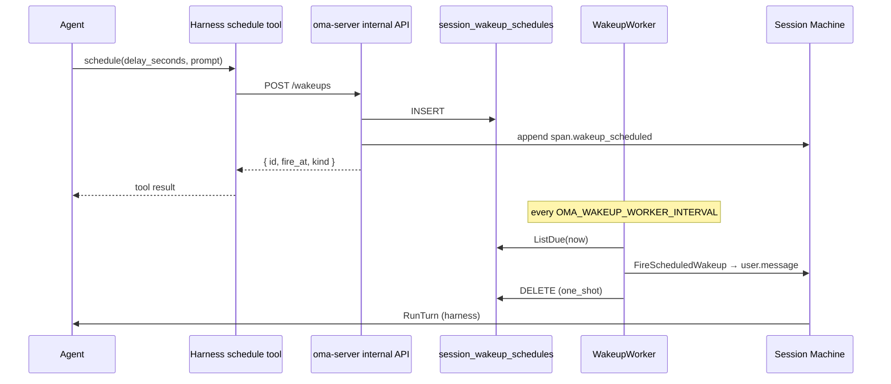

# Session Schedule（会话定时唤醒）

本文说明 meta-harness 中 **Schedule / Wakeup** 的职责、端到端数据流，以及与 Agent 工具、平台 API、后台 Worker 的协作方式。

## 一句话

**Schedule 让 Agent 在「当前 Session」上预约未来的自我唤醒：** 到点后平台注入一条合成 `user.message`（内容为 `prompt`），Session 照常排队并触发新一轮 harness turn，Agent 从该消息继续执行。

典型用途：提醒、跟进、周期性巡检（cron）。

---

## 生活类比

| 角色 | 对应什么 |
|------|----------|
| Agent 调用 `schedule` | 给自己设闹钟，并写好醒来后要读的那句话（`prompt`） |
| `session_wakeup_schedules` 表 | 闹钟登记簿（持久化，服务重启不丢） |
| **Wakeup worker** | 每几秒扫一次登记簿，到点的闹钟响 |
| `user.message`（`harness=schedule`） | 闹钟响起时播放的「提示音」 |
| Session pending queue + turn | 听到提示后，Agent 正常开工 |

与 **Eval worker**、**Cron 平台任务** 不同：Schedule 是 **Session 级、Agent 自驱动** 的定时能力，不依赖用户再次发消息。

---

## 架构总览

```
┌─────────────────────────────────────────────────────────────────┐
│  Agent（piPy harness turn）                                      │
│  工具: schedule | cancel_schedule | list_schedules               │
└────────────────────────────┬────────────────────────────────────┘
                             │ HTTP（x-internal-secret）
                             ▼
┌─────────────────────────────────────────────────────────────────┐
│  oma-server  Internal API                                        │
│  POST/GET/DELETE  /v1/internal/sessions/{id}/wakeups             │
│  ScheduleWakeup / ListWakeups / CancelWakeup                     │
└────────────┬───────────────────────────────┬────────────────────┘
             │ INSERT + span event           │ ListDue (fire_at <= now)
             ▼                               ▼
┌────────────────────────┐      ┌──────────────────────────────────┐
│  SQLite                │      │  WakeupWorker（goroutine ticker） │
│  session_wakeup_       │      │  Tick → FireScheduledWakeup       │
│  schedules             │      └──────────────┬───────────────────┘
└────────────────────────┘                     │
                                               │ EnqueueEvents(user.message, runTurn=true)
                                               ▼
                              ┌──────────────────────────────────┐
                              │  Session Registry / Machine        │
                              │  pending queue → promote → RunTurn │
                              └──────────────────────────────────┘
```

实现分布在三层：

| 层级 | 路径 | 职责 |
|------|------|------|
| Harness 工具 | `harness/oma_adapter/extensions/schedule.py` | 向模型暴露三个工具，转发到 HTTP client |
| Harness 客户端 | `harness/oma_adapter/schedule/client.py` | 调用 internal wakeup API |
| 平台 API + 存储 + Worker | `internal/api/wakeup.go`, `internal/store/wakeups.go`, `internal/api/wakeup_worker.go` | 校验、持久化、发事件、定时触发 |

---

## Agent 工具

与 `open-managed-agents` 的 `harness/tools.ts` 对齐，默认工具集 `agent_toolset_20260401` 包含：

| 工具名 | 作用 |
|--------|------|
| `schedule` | 创建唤醒；必须提供 `prompt`，且 **恰好一种** 时间方式 |
| `cancel_schedule` | 按 `id` 取消未触发的计划 |
| `list_schedules` | 列出当前 Session 所有 pending 计划 |

工具在 `harness/oma_adapter/tools.py` 中映射为 piPy extension；是否启用由 Agent snapshot 的 toolset 配置决定（`enabled_schedule_tools()`）。

每个 turn 开始时，`turn.py` 会 `configure_schedule()` 注入：

- `session_id` — 当前 Session
- `platform_base` — oma-server 公网/内网 base URL
- `internal_secret` — 与 `OMA_INTERNAL_SECRET` 一致
- `enabled_tools` — 该 Agent 启用的 schedule 相关工具子集

Turn 结束后 `clear_schedule_runtime()` 清理，避免跨 Session 泄漏。

---

## 调度类型与时间参数

`ScheduleWakeup` 要求 **三选一**（互斥）：

| 参数 | 类型 | 说明 |
|------|------|------|
| `delay_seconds` | `one_shot` | 相对延迟，**5 秒 ~ 7 天**（604800 秒） |
| `at` | `one_shot` | 绝对时间，**RFC3339 UTC**（如 `2026-04-28T09:00:00Z`） |
| `cron` | `cron` | 标准 **5 字段** cron（分 时 日 月 周），使用 `robfig/cron` 解析 |

Cron 示例：`0 9 * * *` 表示每天 UTC 9:00。Cron 计划 **重复触发**，直到 `cancel_schedule` 删除该行；每次触发后 Worker 会计算 `Next()` 并更新 `fire_at`。

存储中的 `kind` 枚举：`one_shot` | `cron`（见 migration `015_session_wakeups.sql`）。

---

## Internal HTTP API

路由挂载在 `/v1/internal`，受 `x-internal-secret` 中间件保护（`internal.go`）。

| 方法 | 路径 | 行为 |
|------|------|------|
| `POST` | `/sessions/{id}/wakeups` | 创建计划，返回 `201` + `{ id, fire_at, kind, cron? }` |
| `GET` | `/sessions/{id}/wakeups` | 返回 `{ schedules: [...] }`，按 `fire_at` 升序 |
| `DELETE` | `/sessions/{id}/wakeups/{wakeupId}` | 返回 `{ cancelled: true/false }` |

错误语义：

- Session 不存在 → `404`
- Session 已归档 → `409 session archived`
- 参数不合法、超 cap、重复时间模式等 → `400` + 错误文案

Harness client 将 4xx 响应体中的 `error` 字段转为工具层的 `RuntimeError`，模型可见。

---

## 持久化模型

表 `session_wakeup_schedules`（`internal/store/migrations/015_session_wakeups.sql`）：

| 字段 | 含义 |
|------|------|
| `id` | `sched-*`（`store.NewScheduleID()`） |
| `tenant_id` / `session_id` | 租户与 Session 归属 |
| `prompt` | 触发时注入的用户消息正文 |
| `kind` | `one_shot` 或 `cron` |
| `cron` | cron 表达式（one_shot 为空） |
| `fire_at` | Unix 秒，下次触发时间 |
| `parent_event_id` / `span_event_id` | 与轨迹 span 关联（mint-then-emit） |
| `scheduled_at` | 创建时刻 RFC3339Nano |
| `created_at` | 创建毫秒时间戳 |

索引：

- `idx_wakeup_fire_at` — Worker 按到期时间扫描
- `idx_wakeup_session` — 按 Session 列表与计数

**Pending 上限：** 每个 Session 最多 **20** 条未触发记录（`store.MaxPendingWakeups`）。Cron 只占 **1** 个槽位，不论未来会触发多少次。

---

## 创建计划时的事件轨迹

成功 `Create` 后，平台会：

1. 写入 DB 行
2. 追加并 SSE 广播 `span.wakeup_scheduled` 事件

Payload 示例字段：

```json
{
  "type": "span.wakeup_scheduled",
  "id": "evt-...",
  "schedule_id": "sched-...",
  "fire_at": "2026-06-14T12:00:00Z",
  "kind": "one_shot",
  "cron": null
}
```

`parent_event_id` 与 span 的 `id` 相同，供后续 wakeup `user.message` 通过 `parent_event_id` 回指，Console 时间轴可把「预约 → 触发」画成一条等待条（`console/src/components/timeline/derive.ts`）。

---

## Wakeup Worker

在 `cmd/oma-server/main.go` 中，若未设置 `OMA_WAKEUP_WORKER_DISABLED=1`，会启动后台 goroutine：

- 默认间隔 **5 秒**（`OMA_WAKEUP_WORKER_INTERVAL` 可覆盖）
- 每次 `WakeupWorker.Tick()`：
  1. `ListDue(now, limit=50)` 取出 `fire_at <= now` 的行
  2. 对每条调用 `FireScheduledWakeup`
  3. **one_shot**：触发后 `Delete` 该行
  4. **cron**：`UpdateFireAt` 为下次 `schedule.Next(now)`；若 cron 解析失败则删除该行

Worker 与 Eval worker 类似，是 **进程内 ticker**，不依赖外部 cron 服务；多实例部署时需注意：多个 oma-server 可能重复扫描同一行——当前实现以 DB 行 + 触发后删除/更新为主，适合单实例或低并发；大规模多副本需额外分布式锁（当前未实现）。

---

## 触发唤醒：注入消息并跑 Turn

`FireScheduledWakeup`（`internal/api/wakeup.go`）逻辑：

1. 若 Session 不存在或已 `archived`，**静默跳过**（不报错）
2. `registerMachine` 确保 Session lane 存在
3. 构造 `user.message`：

```json
{
  "type": "user.message",
  "content": [{ "type": "text", "text": "<prompt>" }],
  "metadata": {
    "harness": "schedule",
    "kind": "wakeup",
    "wakeup_kind": "one_shot",
    "scheduled_at": "...",
    "fired_at": "..."
  },
  "parent_event_id": "<span_event_id>"
}
```

4. `registry.EnqueueEvents(ctx, sessionID, events, runTurn=true, ...)`

`user.message` 属于 **pending queue 事件**（`IsPendingQueueEventType`）。`runTurn=true` 时进入 `scheduleTurn`，在 promote 后执行 `Machine.RunTurn()`，与用户在 Console 发消息的路径一致。

---

## 端到端时序（one_shot）



---

## 配置与环境变量

| 变量 | 说明 |
|------|------|
| `OMA_INTERNAL_SECRET` | Internal API 与 harness schedule client 共享密钥 |
| `OMA_HARNESS_PLATFORM_BASE` | 传给 harness 的 `platform_base` / `mcp_proxy_base`（Docker 内用 `http://meta-harness:8787`） |
| `OMA_PUBLIC_URL` | 对外 URL（webhook/OAuth）；未设时回退 `PUBLIC_BASE_URL` |
| `OMA_WAKEUP_WORKER_DISABLED` | 设为 `1` 关闭 Worker（仅可手动/API 测存储，不会自动触发） |
| `OMA_WAKEUP_WORKER_INTERVAL` | Worker tick 间隔，如 `2s`、`10s` |

Agent turn 请求中 `PlatformBase` + `InternalSecret` 由 `internal/session/machine.go` 传入 harness `RunTurnStreaming`，与 schedule runtime 配置一致。

---

## Console 与可观测性

- 事件类型 `span.wakeup_scheduled`：预约时刻的轨迹 span
- 触发后的 `user.message`：`metadata.harness === "schedule"` 且 `metadata.kind === "wakeup"`
- 时间轴将二者通过 `parent_event_id` 配对，展示 **schedule waiting** 条（pending / fired）

API 类型注释见 `console/packages/api-types/src/types.ts`。

---

## 测试与验收

| 范围 | 位置 |
|------|------|
| HTTP client 单测 | `harness/tests/test_schedule.py` |
| 工具注册 | `harness/tests/test_tools.py` |
| Store CRUD | `go test ./internal/store/... -run TestWakeupRepo` |
| E2E 脚本 | `scripts/e2e/smoke-schedule-e2e.sh`（单元 + 可选 live：schedule → list → cancel → 短 delay 触发） |
| 集成测试（CF DO 对照） | `test/integration/schedule-wakeup.test.ts` |

Live E2E 前提：`oma-server` 可达、`OMA_INTERNAL_SECRET` 已配置、Worker 未禁用。

---

## 与 open-managed-agents 的对应

| 维度 | open-managed-agents (CF) | meta-harness |
|------|--------------------------|--------------|
| 工具面 | `schedule` / `cancel_schedule` / `list_schedules` | 同名，Python extension |
| 持久化 | SessionDO + D1 / alarm | SQLite `session_wakeup_schedules` |
| 触发 | Durable Object alarm | `WakeupWorker` ticker + `fire_at` 扫描 |
| 唤醒语义 | 合成 `user.message` + dispatch turn | `FireScheduledWakeup` + `EnqueueEvents` |

迁移任务参考：`MVP-MIGRATION-PLAN.md` 中的 schedule / wakeup 相关项（E2E 脚本标注 **T18**）。

---

## 设计要点小结

1. **Session 作用域**：计划绑定单个 Session，不能跨 Session 唤醒。
2. **持久化优先**：创建即落库，Worker 仅负责到期扫描，不持有内存状态。
3. **与正常对话同路径**：唤醒走 pending queue + `RunTurn`，不绕过 Session 状态机。
4. **可取消、可列举**：Agent 可管理自己的闹钟队列，受 20 条 cap 约束。
5. **轨迹可关联**：mint-then-emit 的 span id 与 wakeup 消息 `parent_event_id` 配对，便于运维与 Console 可视化。

---

## 关键代码索引

| 模块 | 文件 |
|------|------|
| 工具定义 | `harness/oma_adapter/extensions/schedule.py` |
| HTTP 客户端 | `harness/oma_adapter/schedule/client.py` |
| Turn 运行时配置 | `harness/oma_adapter/turn.py` |
| API 处理 | `internal/api/wakeup.go` |
| Worker | `internal/api/wakeup_worker.go` |
| 存储 | `internal/store/wakeups.go` |
| 启动 Worker | `cmd/oma-server/main.go` |
| 入队触发 Turn | `internal/session/registry_enqueue.go` |
| DB 迁移 | `internal/store/migrations/015_session_wakeups.sql` |
