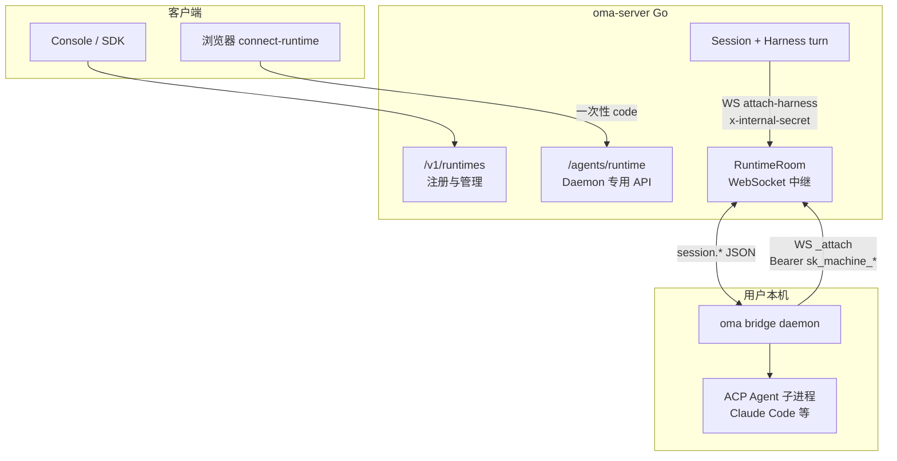
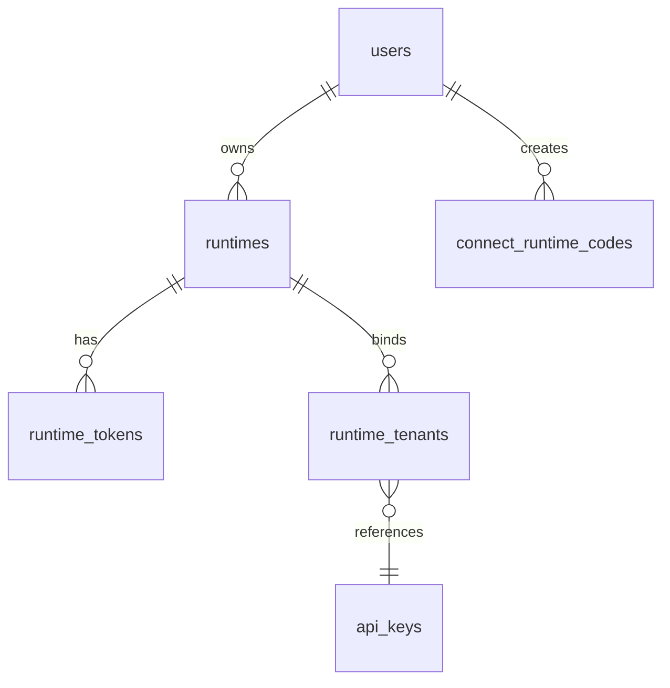

# Runtime 架构

本文说明 OMA（Open Managed Agents）系统中 **Runtime（本地 ACP 桥接运行时）** 是什么、在整体架构中的位置，以及 oma-platform 中的实现设计。

## 一句话总结

**Runtime 是用户本机上的长期运行守护进程（`oma bridge daemon`），通过 WebSocket 连到云端平台，把本地 ACP Agent（如 Claude Code、Cursor 等）的执行能力「桥接」进 OMA Session。** 平台负责注册、鉴权与消息中继；Daemon 负责在本机 spawn / 管理 ACP 子进程；Harness 侧通过 `RuntimeRoom` 与 Daemon 双向转发 `session.*` 协议帧。

Wire 格式与 `open-managed-agents` 的 AMA（Agent Management API）兼容，对应 Cloudflare 版中的 **RuntimeRoom Durable Object**。

## 术语区分

oma-platform 里「runtime」一词出现在多个层次，含义不同：

| 名称 | 含义 | 典型位置 |
|------|------|----------|
| **Local ACP Runtime**（本文主题） | 用户机器上的 bridge daemon + 平台侧的注册/中继 | `internal/runtime/`、`/v1/runtimes`、`/agents/runtime` |
| **Platform runtime** | Go 服务端进程本身（oma-server） | README 架构图 |
| **Harness per-turn runtime** | Python 侧单轮 turn 的临时状态（MCP、web_fetch 等） | `harness/oma_adapter/mcp/runtime.py` |

下文若无特别说明，**Runtime 均指 Local ACP Runtime**。

## 在整体架构中的位置

当 Agent 的 `_oma.harness` 为 `acp-proxy` 且配置了 `runtime_binding` 时，Session 的 LLM turn 不会走默认的 piPy HTTP sidecar，而是通过 Runtime 把 prompt / tool 事件转发到用户本机 ACP 子进程执行。



与默认 **piPy Harness** 路径的对比：

| 维度 | 默认 Harness（`default-loop`） | ACP Runtime（`acp-proxy`） |
|------|-------------------------------|----------------------------|
| 执行位置 | 平台侧 Python sidecar + sandbox workdir | 用户本机 ACP 子进程 |
| 通信 | HTTP `POST /internal/turn` | WebSocket `session.*` 经 RuntimeRoom 中继 |
| 典型场景 | 自托管沙箱工具（bash/read/write） | 本地 IDE、本地 Claude Code、需本机文件系统 |

Agent 声明示例（Console / AMA wire）：

```json
{
  "_oma": {
    "harness": "acp-proxy",
    "runtime_binding": {
      "runtime_id": "550e8400-e29b-41d4-a716-446655440000",
      "acp_agent_id": "claude-code"
    }
  }
}
```

## 核心概念

### Runtime（持久实体）

一条 **Runtime** 记录代表「某用户在某台物理机器上注册过的一个 bridge daemon 实例」。

```go
// internal/store/runtimes.go
type Runtime struct {
    ID              string   // UUID
    OwnerUserID     string
    OwnerTenantID   string
    MachineID       string   // 本机稳定标识，与 user 组成唯一键
    Hostname        string
    OS              string
    AgentsJSON      string   // daemon hello 上报的本地 ACP agent 列表
    LocalSkillsJSON string   // 本机 skill 清单
    Version         string   // daemon 版本
    Status          string   // online | offline
    LastHeartbeat   *int64
    CreatedAt       int64
}
```

- 同一 `(owner_user_id, machine_id)` 重复 setup 会 **复用** 已有 `runtime_id`，只更新 hostname/os/version。
- `status` 由 WebSocket attach / hello / ping / 断连 驱动，不依赖独立 cron。

### RuntimeRoom（内存中继）

每个 `runtime_id` 对应一个 **Room**（`internal/runtime/room.go`），职责等价于 CF 版的 `RuntimeRoom` Durable Object，但在 oma-platform 中实现为 **进程内内存结构**（`internal/runtime/registry.go`）。

Room 维护两类 WebSocket 连接：

| 连接类型 | 挂载方式 | 数量限制 | 作用 |
|----------|----------|----------|------|
| **Daemon** | `GET /agents/runtime/_attach` | 每 runtime 恰好 1 个（重复 attach 返回 409） | 本机 bridge 长连接 |
| **Harness** | `GET /v1/internal/runtimes/{id}/attach-harness` | 每 session 可有多连接（按 session_id 分组） | 云端 ACP-proxy harness 监听该 session 的事件 |

Room 内还缓存：

- `sessionState[session_id]` — 最近一次 `session.ready` / `session.error` 完整帧（供晚到的 harness WS 重放）
- `acpSession[session_id]` — daemon 上报的 `acp_session_id`（用于 `session.start` 时注入 `resume.acp_session_id`，恢复 ACP 对话）
- `sessionTenant[session_id]` — harness attach 时从 `x-harness-tenant` 固定的 tenant pin
- `authorizedTenants` — 来自 `runtime_tenants` 表的授权 tenant 集合（lazy load + refresh 失效）

### 凭证模型

Runtime 使用 **独立于用户 Session 的两层 token**：

1. **Runtime token** — `sk_machine_*`，Daemon 连接 `_attach` 时使用；SHA256 哈希存于 `runtime_tokens`。
2. **Agent API key** — 按 tenant  mint，存于 `runtime_tenants.agent_api_key_id`；Daemon 用其代表各 tenant 调用 OMA `/v1/*` API。

`/agents/runtime/*` 路由在 auth middleware 中 **豁免** 常规用户 Session 鉴权，改由 `authenticateRuntimeBearer` 校验 `sk_machine_*`（见 `internal/auth/middleware.go`）。

## 注册与连接流程

### 1. 浏览器发起 connect（用户已登录）

```
POST /v1/runtimes/connect-runtime
Authorization: （用户 Session / API key）

Body: { "state": "<random>=8 chars, CSRF 绑定>" }

Response: { "code": "<32 hex>", "expires_at": <unix, TTL 5min> }
```

一次性 code 写入 `connect_runtime_codes`，绑定 `user_id`、`tenant_id`、`state`。

### 2. CLI Daemon 兑换 token（设备侧）

```
POST /agents/runtime/exchange

Body: {
  "code": "...",
  "state": "...",
  "machine_id": "...",
  "hostname": "...",
  "os": "...",
  "version": "...",
  "multi_tenant": true   // 可选，返回多 tenant 的 agent_api_key
}
```

校验 code 未使用、未过期、`state` 匹配后：

1. 查找或创建 `runtimes` 行
2. 生成新的 `sk_machine_*` → `runtime_tokens`
3. 遍历用户 tenant membership，为每个 tenant mint `agent_api_key` → `runtime_tenants`

响应（multi_tenant）：

```json
{
  "runtime_id": "...",
  "token": "sk_machine_...",
  "tenants": [
    { "id": "default", "name": "...", "role": "owner", "agent_api_key": "sk_..." }
  ]
}
```

### 3. Daemon WebSocket attach

```
GET /agents/runtime/_attach
Upgrade: websocket
Authorization: Bearer sk_machine_...
```

成功后：

1. `MarkRuntimeOnline`
2. 启动 `readDaemon` goroutine
3. 等待 daemon 发送 `hello` → 持久化 agents / local_skills / version → 回复 `welcome`

### 4. Harness attach（云端 turn 时）

```
GET /v1/internal/runtimes/{runtime_id}/attach-harness
Upgrade: websocket
x-internal-secret: <OMA_INTERNAL_SECRET>
x-session-id: <session_id>
x-harness-tenant: <tenant_id>   // 可选
```

立即下发 `{ "type": "attached", "daemon_online": true|false }`；若已有 terminal state 则重放。

## WebSocket 消息路由

### Daemon → Room → Harness（`session.*` 前缀）

| 消息 type | 行为 |
|-----------|------|
| `hello` | 更新 DB metadata；回复 `welcome` |
| `ping` | 更新 heartbeat；回复 `pong` |
| `session.ready` | 缓存 state + `acp_session_id`；broadcast 到 harness |
| `session.error` | 缓存 state；broadcast |
| `session.disposed` | 清除 session 缓存；broadcast |
| 其他 `session.*` | tenant 校验通过后 broadcast |

若 daemon 离线，harness 侧会收到合成的 `session.error`（`runtime daemon offline`）。

### Harness → Room → Daemon

Harness 发出的帧（如 `session.start`、`session.prompt`、`session.cancel`、`session.dispose`）会：

1. 注入 `session_id`
2. 若缺少 `tenant_id`，补全 harness attach 时的 pin
3. 对 `session.start`：若无 `resume.acp_session_id` 且 Room 有缓存，自动注入以恢复 ACP 会话

### Tenant 校验（additive，非强制）

与 CF 版 rollout 策略一致：当 `authorizedTenants` 已加载且消息带 `tenant_id` 时，校验该 tenant 是否在 `runtime_tenants` 中，且与 session pin 一致。**v1 daemon 省略 `tenant_id` 时仍放行**。

`POST /agents/runtime/{id}/refresh` 会在 membership 变更后：revoke 已离开 tenant 的 key、rotate 现存 key、mint 新 tenant key，并调用 `Room.RefreshAuthorizedTenants()`。

## 数据模型

迁移定义见 `internal/store/migrations/008_runtimes.sql`：

```
runtimes              — 机器注册信息 + 在线状态
runtime_tokens        — sk_machine_* 哈希（可 revoke）
connect_runtime_codes — 一次性 browser→CLI 兑换码
runtime_tenants       — runtime ↔ tenant ↔ agent_api_key 绑定
```

关系示意：



## HTTP API 一览

### 用户 Session 鉴权（`/v1/runtimes`）

| 方法 | 路径 | 说明 |
|------|------|------|
| POST | `/v1/runtimes/connect-runtime` | 生成一次性 connect code |
| GET | `/v1/runtimes` | 列出当前用户的 runtimes |
| DELETE | `/v1/runtimes/{id}` | 撤销 token 并删除 runtime |

### Daemon 鉴权（`/agents/runtime`，Bearer `sk_machine_*`）

| 方法 | 路径 | 说明 |
|------|------|------|
| GET | `/agents/runtime/_attach` | WebSocket：daemon 长连接 |
| POST | `/agents/runtime/exchange` | code → runtime_id + token + keys |
| GET | `/agents/runtime/me` | daemon 自省：runtime 元数据 + tenants |
| POST | `/agents/runtime/{id}/refresh` | 同步 tenant membership / 轮换 keys |

### 内部 Harness 鉴权（`/v1/internal`，`x-internal-secret`）

| 方法 | 路径 | 说明 |
|------|------|------|
| GET | `/v1/internal/runtimes/{id}/attach-harness` | WebSocket：harness 监听 session |

## 与 open-managed-agents 的对应

| 能力 | open-managed-agents (CF) | oma-platform (Go) |
|------|--------------------------|-------------------|
| 寻址 | Durable Object `idFromName(runtime_id)` | 进程内 `Registry.Room(runtime_id)` |
| Daemon attach | `/agents/runtime/_attach` | ✅ 同路径 |
| Harness attach | SessionDO 内部 RPC | ✅ `/v1/internal/.../attach-harness` |
| 状态持久化 | DO storage (`session_state:*`, `acp_session:*`) | Room 内存 map（进程重启丢失，需 daemon 重发 hello） |
| connect / exchange | ✅ | ✅ |
| multi-tenant refresh | ✅ | ✅ |
| WS hibernation / 跨 isolate 恢复 | ✅ DO 原生 | ❌ 单进程内存，无 DO |
| Resource mounter（memory/files/github） | `runtime/resource-mounter.ts` | ❌ 未迁移（P2-3） |

oma-platform 的 Runtime 子系统目标是 **AMA wire 兼容 + 本地 IDE smoke 可测**；生产级跨节点 HA 仍依赖 CF 版 Durable Object 语义。

## 当前实现状态

根据 `MVP-MIGRATION-PLAN.md`（T10 已完成）：

- ✅ connect-runtime / exchange / token 鉴权
- ✅ Daemon WebSocket attach（hello / ping / online 状态）
- ✅ Harness ↔ Daemon 双向 `session.*` 中继
- ✅ multi-tenant key mint / refresh
- ✅ 单元测试：`runtime_attach_test.go`、`runtimes_test.go`
- 🟡 完整 ACP-proxy harness turn 与 Session 集成（端到端 IDE smoke 仍在推进）
- ❌ Resource mounter、Compaction 等 P2 能力

## 关键文件索引

| 层级 | 文件 | 职责 |
|------|------|------|
| 入口 | `cmd/oma-server/main.go` | 创建 `RuntimeRepo` + `runtime.NewRegistry` |
| 路由 | `internal/api/router.go` | 挂载 `/v1/runtimes`、`/agents/runtime` |
| 用户 API | `internal/api/runtimes.go` | connect / list / delete |
| Daemon API | `internal/api/runtime_daemon.go` | exchange / attach / me / refresh |
| Harness attach | `internal/api/internal.go` | `attach-harness` WebSocket |
| 中继 | `internal/runtime/room.go` | WebSocket 路由、session 状态缓存 |
| 注册表 | `internal/runtime/registry.go` | runtime_id → Room 映射 |
| 持久化 | `internal/store/runtimes.go` | CRUD + token 认证 |
| 迁移 | `internal/store/migrations/008_runtimes.sql` | 表结构 |
| 鉴权豁免 | `internal/auth/middleware.go` | `/agents/runtime` 路径 |
| 测试 | `internal/api/runtime_attach_test.go` | attach / relay 冒烟 |
| CF 参考 | `open-managed-agents/apps/main/src/runtime-room.ts` | 原始 RuntimeRoom 设计注释 |

## 相关文档

- [Harness 流式 Turn 与 SSE](./streaming-turn-and-sse.md) — 默认 piPy harness 路径
- [MCP 架构](./mcp-architecture.md) — 与 Runtime 独立的 MCP 代理层
- [Eval Run Background Worker](./eval-run-background-worker.md) — 另一类后台 worker
