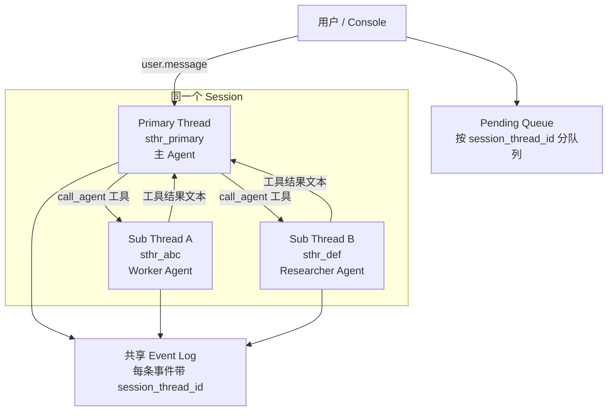

# Session Threads（会话线程）

本文用通俗语言说明 OMA 中 **Session Thread** 是什么、在系统里如何工作，以及它与 **Sub-agent（子 Agent）** 的关系。

## 一句话总结

**Session Thread 是同一次 Session 里的「并行对话轨道」。** 主 Agent 跑在默认的主线程上；当主 Agent 把任务委派给子 Agent 时，会为这次委派新开一条子线程。每条线程有自己的消息队列和（可选的）独立 Agent 配置，但共享同一个 Session、沙箱和事件总线。

可以把 Session 想成一间办公室，Thread 是办公室里的不同工位：主工位（Main）负责统筹，临时工位（Sub-agent）负责被派下去的专项任务。

## 通俗类比

| 概念 | 类比 | 说明 |
|------|------|------|
| **Session** | 一次完整的协作任务 | 例如「帮我把这个 PR 修好并写测试」 |
| **Primary Thread** (`sthr_primary`) | 主工位 / 项目经理 | 用户直接对话的对象，永远存在 |
| **Sub Thread** (`sthr_*`) | 临时工位 / 外包同事 | 主 Agent 通过 `call_agent` 工具派活时创建 |
| **Event Log** | 办公室监控录像 | 所有工位的动作都记在一条时间线上，用 `session_thread_id` 区分来源 |
| **Pending Queue** | 各工位的待办收件箱 | 用户排队发的消息按线程分开，互不抢队列 |

单线程 Session（没有委派过子 Agent）时，用户感知不到 Thread 的存在——一切就像普通的一对一聊天。

## 核心概念

### 主线程 vs 子线程

- **主线程 ID** 固定为 `sthr_primary`，在 Session 创建时隐式存在，不需要单独写入事件。
- **子线程 ID** 格式为 `sthr_<随机后缀>`（AMA 规范要求 `sthr_*` 前缀）。
- 子线程通过 `parent_thread_id` 指向父线程，可形成树形结构（主 Agent → 子 Agent → 嵌套子 Agent）。

### 线程里有什么

每条 Thread 关联：

| 字段 | 含义 |
|------|------|
| `session_thread_id` | 线程唯一 ID |
| `agent_id` / `agent_name` | 该线程上运行的 Agent（子线程通常是另一个 Agent 配置） |
| `parent_thread_id` | 父线程；主线程为 `null` |
| `status` | `active` 或 `archived`（oma-platform 当前主要从事件派生，归档逻辑待完善） |

### 事件如何「贴标签」

同一条 Session 的事件流是**共享**的，但每个事件可以带 `session_thread_id` 字段：

- 主线程上的事件：通常**省略**该字段，读取时默认当作 `sthr_primary`。
- 子线程上的事件：显式带上 `session_thread_id: "sthr_xxx"`。

这样 Console 可以在同一份事件列表里，按线程过滤出「Main」「WorkerA」「WorkerB」各自的对话与工具调用。

## 与 Sub-agent 的关系

**Sub-agent 是「行为」，Session Thread 是「容器」。**

```
用户消息
    │
    ▼
主 Agent（sthr_primary）
    │
    │ 调用 call_agent / delegateToAgent 工具
    ▼
runSubAgent()
    ├─ 生成 sthr_xxx
    ├─ 发出 session.thread_created 事件
    ├─ 用子 Agent 配置跑一轮 harness turn
    └─ 子 Agent 的 agent.message / tool_use 等事件
       全部打上 session_thread_id = sthr_xxx
    │
    ▼
工具返回文本结果给主 Agent（主线程继续）
```

要点：

1. **一个 Sub-agent 委派 ≈ 创建一个 Session Thread**（一对一，在委派开始时创建）。
2. **子 Agent 有独立的历史上下文**（`InMemoryHistory`），但广播到父 Session 的事件会合并进父级 event log。
3. **沙箱共享**：子 Agent 读写的是同一个 workdir，文件会留给主 Agent 继续用。
4. **中断可 per-thread**：`user.interrupt` 可带 `session_thread_id`，只取消该子 Agent 的在途 turn，不影响兄弟线程。
5. **嵌套委派**：子 Agent 再委派时，新线程的 `parent_thread_id` 指向当前子线程，Console 可渲染成树形 Tab。

在 open-managed-agents（Cloudflare 版）中，上述逻辑由 `SessionDO.runSubAgent()` 实现。oma-platform 已在 harness 侧实现 **P2-1（call_agent 委派）**：`call_agent_*` / `general_subagent` 工具会发出 `session.thread_created`，并在隔离子线程中跑一轮 turn。

## 数据流示意



## oma-platform 实现

### 设计选择：从 Event Log **派生**，不单独建 threads 表

Cloudflare 版 `SessionDO` 在 SQLite 里有 `threads` 表，并在 `runSubAgent` 时 `INSERT` 一行。

oma-platform（Go）采用更轻的 **派生模型**（T11 / P1-7 已完成）：

- 不维护独立的 `threads` 表。
- 读取 Session 的全部 `session_events`，扫描 `session.thread_created` 类型事件，动态拼出线程列表。
- 主线程 `sthr_primary` 始终由 Session 元数据合成（`agent_id`、`agent_snapshot.name`、`created_at`）。

优点：实现简单、与 event-sourcing 一致、不担心 threads 表与事件不同步。  
代价：线程列表依赖事件完整性；若从未发出 `session.thread_created`，则只有主线程。

### 派生逻辑

核心函数：`internal/api/session_threads.go` → `deriveSessionThreads()`

```text
1. 初始化 threads["sthr_primary"] ← Session 的 Agent 信息
2. 遍历 events：
     若 type == "session.thread_created"：
       读取 session_thread_id, agent_id, agent_name, parent_thread_id
       若 ID 未见过 → 加入 threads map（去重）
3. 排序：primary 第一，其余子线程按 created_at 升序
4. 序列化为 AMA 兼容的 session_thread 对象数组
```

`session.thread_created` 事件 payload 示例：

```json
{
  "type": "session.thread_created",
  "session_thread_id": "sthr_worker",
  "agent_id": "agt_worker",
  "agent_name": "Worker",
  "parent_thread_id": "sthr_primary"
}
```

### HTTP API

| 方法 | 路径 | 说明 |
|------|------|------|
| GET | `/v1/sessions/{id}/threads` | 返回主线程 + 所有子线程 |
| GET | `/v1/sessions/{id}/threads?include_archived=true` | 含已归档线程（预留） |

响应中每条记录形如：

```json
{
  "id": "sthr_worker",
  "type": "session_thread",
  "session_id": "sess_...",
  "session_thread_id": "sthr_worker",
  "agent_id": "agt_worker",
  "agent_name": "Worker",
  "parent_thread_id": "sthr_primary",
  "status": "active",
  "created_at": "2024-11-15T10:00:01.000Z",
  "archived_at": null,
  "updated_at": "2024-11-15T10:00:01.000Z"
}
```

路由注册见 `internal/api/session_aux.go`。

### 与 Pending Queue 的联动

用户消息可先进入 **pending 队列**（排队输入），再被提升为正式 `user.message` 事件。队列按线程隔离：

- 表 `pending_events` 含 `session_thread_id` 列，默认 `sthr_primary`。
- `GET /v1/sessions/{id}/pending?session_thread_id=sthr_xxx` 只返回该线程的待办。
- `PromoteOnePending`、`CancelPendingQueue`、`user.interrupt` 都支持 per-thread 操作。

相关代码：`internal/session/pending.go`、`internal/store/pending.go`。

### 与 Trajectory 的联动

`GET /v1/sessions/{id}/trajectory` 的 `summary.num_threads` 统计 `session.thread_created` 事件中的不重复 `session_thread_id` 数量（不含 primary）。若统计为 0，对外展示时回落为 1（至少有一条主线程）。

见 `internal/api/trajectory.go` → `computeTrajectorySummary()`。

## Console 如何使用

open-managed-agents Console（`SessionDetail.tsx`）的消费方式：

1. **初始加载**：`GET /v1/sessions/{id}/threads`，过滤掉 `sthr_primary`，得到子线程 Tab 列表。
2. **实时更新**：SSE 收到 `session.thread_created` 时，向 Tab 列表追加新线程（不自动切换用户当前视图）。
3. **按线程过滤事件**：渲染时用 `event.session_thread_id ?? "sthr_primary"` 与 `activeThreadId` 匹配。
4. **树形 Tab**：用 `parent_thread_id` 缩进显示嵌套委派关系。

单线程 Session 不显示线程选择器，避免 UI 噪音。

## 与 open-managed-agents 的对应

| 能力 | open-managed-agents (CF) | oma-platform (Go) |
|------|--------------------------|-------------------|
| 线程存储 | `threads` SQL 表 + 内存 Map | 从 `session_events` 派生 |
| 创建子线程 | `runSubAgent()` → INSERT + 事件 | harness `call_agent` 扩展发出 `session.thread_created` |
| GET /threads | SessionDO HTTP | ✅ `session_aux.go` |
| Per-thread pending | ✅ | ✅ |
| Per-thread interrupt | ✅ | 事件层支持 `session_thread_id` |
| Console 线程选择器 | ✅ | ✅（读同一 AMA API） |

## 当前实现状态

根据 `MVP-MIGRATION-PLAN.md`：

- ✅ **T11 (P1)** — Session threads 从 event log 派生
- ✅ HTTP `GET /sessions/{id}/threads`、单元测试与集成测试
- ✅ Pending queue per-thread
- ✅ Trajectory `num_threads` 统计
- ✅ **P2-1** — harness `call_agent` / `general_subagent` 委派（`harness/oma_adapter/call_agent/`）
- ✅ **P2-2** — turn 前 compaction（`harness/oma_adapter/compaction.py`，发出 `agent.thread_context_compacted`）

因此：**API、派生与 harness 委派链路已打通**；主 Agent 调用 `call_agent_*` 后，Console 可通过 `GET /threads` 与 SSE 实时看到子线程。

## 关键文件索引

| 层级 | 文件 | 职责 |
|------|------|------|
| API | `internal/api/session_aux.go` | `GET /threads` 路由与 handler |
| 派生 | `internal/api/session_threads.go` | `deriveSessionThreads`、序列化 |
| 轨迹 | `internal/api/trajectory.go` | `num_threads` 统计 |
| Pending | `internal/session/pending.go` | per-thread 入队 / 提升 / 取消 |
| 存储 | `internal/store/pending.go` | `pending_events.session_thread_id` |
| 迁移 | `internal/store/migrations/006_pending_events.sql` | pending 表含 thread 列 |
| 测试 | `internal/api/session_threads_test.go` | 派生逻辑单测 |
| 测试 | `internal/api/session_threads_integration_test.go` | HTTP 端到端 |
| Harness | `harness/oma_adapter/call_agent/` | `call_agent_*` 委派与子线程事件 |
| Harness | `harness/oma_adapter/compaction.py` | turn 前 compaction |
| CF 参考 | `open-managed-agents/apps/agent/src/runtime/session-do.ts` | `runSubAgent`、线程创建与事件打标 |
| Console | `open-managed-agents/apps/console/src/pages/SessionDetail.tsx` | 线程 Tab、SSE  live 更新 |

## 相关文档

- [Sub-agent](./subagent.md) — 子 Agent 是什么、如何委派、`call_agent` 实现
- [Runtime 架构](./runtime-architecture.md) — 子 Agent 若走 ACP Runtime，同样继承父 Session 的 tenant
- [Harness 流式 Turn 与 SSE](./streaming-turn-and-sse.md) — 事件如何通过 SSE 推到 Console
- [MVP 迁移计划](../../MVP-MIGRATION-PLAN.md) — P1-7 / T11 / P2-1 进度
