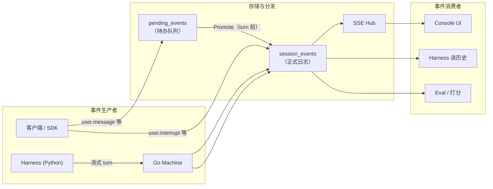

# Session Events（会话事件）

本文用通俗语言说明 oma-platform 中 **Session Event** 是什么、在系统里如何流转，以及客户端 / Console / Harness 各自该关注哪些事件类型。

## 一句话总结

**Session Event 是一次 Agent 会话的「唯一真相时间线」。** 用户说了什么、Agent 调了哪些工具、模型回了什么、turn 何时开始结束——全部以 JSON 事件的形式追加到同一条有序日志里。Console 渲染聊天界面、Harness 重建上下文、Eval 打分、Sub-agent 回放，都读这份日志。

可以把 Session 想成一部连续播放的监控录像，**Event 是录像里的每一帧**；`seq` 是帧号，保证顺序不会乱。

## 通俗类比

| 概念 | 类比 | 说明 |
|------|------|------|
| **Session** | 一次完整的协作任务 | 例如「帮我把这个 PR 修好」 |
| **Session Event** | 录像里的一个动作 | 用户发消息、Agent 调 bash、模型输出文字 |
| **seq** | 帧号 / 页码 | 从 1 递增，同一 Session 内全局有序 |
| **Pending Queue** | 待办收件箱 | 用户刚发的消息先排队，turn 开始前再「转正」进录像 |
| **SSE Stream** | 直播信号 | 新事件产生后立刻推给在线客户端 |
| **Event Log 回放** | 看录像回放 | `GET /events?replay=1` 或分页拉历史 |

## 事件长什么样

每个事件本质上是一个 JSON 对象，至少包含：

| 字段 | 含义 |
|------|------|
| `type` | 事件类型，如 `user.message`、`agent.tool_use` |
| `id` | 事件唯一 ID（服务端可自动生成） |
| `session_thread_id` | 可选，标记事件属于哪条线程（见 [session-threads.md](./session-threads.md)） |
| 其他字段 | 依类型而定，如 `content`、`tool_use_id`、`phase` 等 |

持久化到 SQLite 时，还会加上服务端字段：

| 存储列 | 含义 |
|--------|------|
| `session_id` | 所属 Session |
| `seq` | 单调递增序号（**主排序键**） |
| `event_id` | 对应 JSON 里的 `id` |
| `type` | 冗余存储，便于查询 |
| `payload` | 完整 JSON 正文 |
| `created_at` | 写入时间（毫秒时间戳） |

**API 列表返回**会把一行包装成：

```json
{
  "seq": 42,
  "type": "user.message",
  "ts": "2026-07-10T01:23:45.678Z",
  "data": { "type": "user.message", "id": "sevt_...", "content": [...] }
}
```

## 事件从哪来、到哪去



要点：

1. **只追加、不修改**：历史事件不会被改写（取消的消息会带 `cancelled_at` 或走 `system.*` 通知，见下文）。
2. **先写库、再广播**：每条进入 `session_events` 的事件都会经 `Hub.Publish` 推给 SSE 订阅方。
3. **Harness 不直接写库**：Python Harness 通过流式回调把事件交给 Go，由 Go 统一持久化（保证 `seq` 连续）。

## 两类入站路径：Direct vs Pending

客户端 `POST /v1/sessions/:id/events` 收到的事件，会按类型分流：

| 路径 | 适用类型 | 行为 |
|------|----------|------|
| **Pending Queue** | `user.message`、`user.tool_confirmation`、`user.custom_tool_result` | 先写入 `pending_events`，发 `system.user_message_pending`（仅 SSE，不入正式日志）；在 harness turn **开始前** promote 到 `session_events` |
| **Direct Append** | `user.interrupt`、`user.define_outcome`、`agent.message`、`session.thread_created` 等 | 直接写入 `session_events` 并 SSE 推送 |

为什么要有 Pending Queue？

- Agent 正在跑 turn 时，用户仍可连续发消息——它们排在队列里，不会插队打乱当前 turn 的上下文。
- Console 可以通过 `system.user_message_pending` / `promoted` / `cancelled` 展示「已发送但未处理」的 outbox 状态。
- Session 空闲时，pending 事件会在 schedule turn **之前同步 promote**，保证 turn 开始时日志里已有 `user.message`。

`user.interrupt` 是 **direct event**：立刻写入日志，并取消对应线程的 pending 队列（见 [loop-task-termination.md](./loop-task-termination.md)）。

## 哪些客户端事件会触发 Turn

`POST /events` 校验通过后返回 **202 Accepted**（`{"status":"queued"}`），是否立刻跑 Harness 取决于事件类型：

| 类型 | 触发 turn | 说明 |
|------|-----------|------|
| `user.message` | 是 | 最常见：用户发一句话 |
| `user.custom_tool_result` | 是* | 仅当 Session 上确有未完成的 custom tool 调用 |
| `user.tool_confirmation` | 否 | 入 pending，由 turn 流程消费 |
| `user.interrupt` | 否 | 取消在途 turn / 清空 pending |
| `user.define_outcome` | 否 | 注册 outcome，由 supervisor 后续评估 |

同一次请求里若包含 `user.interrupt`，则 **不会** 因其他事件触发 turn。

## 常见事件类型（按角色分组）

不必背下全部类型；按「谁产生、用来干什么」理解即可。

### 用户侧（Client → Server）

| `type` | 含义 |
|--------|------|
| `user.message` | 用户输入（文本 / 多模态 content blocks） |
| `user.interrupt` | 用户中断当前 turn |
| `user.tool_confirmation` | 对「需确认」的工具调用回复 allow/deny |
| `user.custom_tool_result` | 自定义工具（如人工审批）的结果 |
| `user.define_outcome` | 声明任务完成标准，供 outcome evaluator 使用 |

### Agent 侧（Harness → Server）

| `type` | 含义 |
|--------|------|
| `agent.message` | Agent 文本回复 |
| `agent.thinking` | 模型推理块（需原样保留进历史） |
| `agent.tool_use` / `agent.tool_result` | 内置工具调用与结果 |
| `agent.mcp_tool_use` / `agent.mcp_tool_result` | MCP 工具 |
| `agent.custom_tool_use` | 需客户端参与的自定义工具 |
| `agent.thread_message_sent` / `received` | 多 Agent 线程间消息 |

Harness 内部 piPy 事件会通过 `harness/oma_adapter/emit.py` 映射为上述 OMA 类型。

### Session 状态（Go Machine）

| `type` | 含义 |
|--------|------|
| `session.lifecycle` | turn 边界，`phase`: `turn_start` / `turn_end` |
| `session.status_running` | Session 进入运行态 |
| `session.status_idle` | turn 结束后的空闲态，可带 `stop_reason` |
| `session.error` | turn 失败 |
| `session.warning` | 非致命警告（如凭证刷新失败） |
| `session.thread_created` | 新建子线程（Sub-agent 委派） |

### 可观测性 Span（Harness / Eval）

| `type` | 含义 |
|--------|------|
| `span.model_request_start` / `end` | 一次 LLM 调用的起止与 token 用量 |
| `span.outcome_evaluation_*` | Outcome 评估过程 |
| `aux.model_call` | 工具内部的辅助模型调用（如网页摘要） |

这些事件会写入日志，供时间线和成本统计使用；**默认不会**作为模型对话上下文（Harness 投影时会过滤，见 `project.py` 中的 `_NON_MODEL_EVENT_TYPES`）。

### 系统通知（仅 SSE，通常不入库）

| `type` | 含义 |
|--------|------|
| `system.user_message_pending` | 消息已进入 pending 队列 |
| `system.user_message_promoted` | pending 消息已写入正式日志 |
| `system.user_message_cancelled` | pending 消息被 interrupt 取消 |

### 流式增量（可选，OMA 扩展）

如 `agent.message_chunk`、`agent.thinking_chunk` 等，用于 UI 打字机效果。**多数不落库**，仅经 SSE 广播；最终仍以 `agent.message` / `agent.thinking` 为准。详见 [streaming-turn-and-sse.md](./streaming-turn-and-sse.md)。

## 一次完整对话的时间线示例

用户发送：「列出当前目录文件」

| 顺序 | `type` | 来源 | 说明 |
|------|--------|------|------|
| 1 | `system.user_message_pending` | Go | 消息进 pending（若 session 正 busy 且尚未 promote） |
| 2 | `user.message` | Go | promote 后写入正式日志 |
| 3 | `system.user_message_promoted` | Go | 通知 Console outbox 状态更新 |
| 4 | `session.lifecycle` (`turn_start`) | Go | turn 开始 |
| 5 | `session.status_running` | Go | Session 标记 running |
| 6 | `agent.tool_use` | Harness | Agent 决定调用 `bash` |
| 7 | `agent.tool_result` | Harness | 命令输出 |
| 8 | `agent.message` | Harness | Agent 总结 |
| 9 | `session.lifecycle` (`turn_end`) | Go | turn 结束 |
| 10 | `session.status_idle` | Go | 回到 idle，可接收下一条消息 |

若开启流式 turn，步骤 6～8 会在 turn 进行中**逐条**出现在 SSE 上，而不是等到 turn 结束才批量出现。

## API 速查

| 方法 | 路径 | 作用 |
|------|------|------|
| `POST` | `/v1/sessions/:id/events` | 追加客户端事件，202 入队 |
| `POST` | `/v1/sessions/:id/messages` | Anthropic 兼容：包装为 `user.message` 并入队 |
| `GET` | `/v1/sessions/:id/events` | 分页读取历史（`after_seq` / `next_page`） |
| `GET` | `/v1/sessions/:id/events/stream` | SSE 实时订阅（`replay=1` 先回放再 tail） |

SDK 对应封装：`oma_sdk.api.sessions.SessionEventsResource`（`send` / `list` / `stream`）。

### SSE  wire 格式

```
id: 42
data: {"type":"agent.message","id":"sevt_...","content":[...]}

```

- `id:` 行 = 事件的 `seq`，可用于断线续传。
- 每 15 秒发送 `: keepalive` 注释，防止代理超时。

### 分页读取

```http
GET /v1/sessions/sess_abc/events?limit=100&order=asc&after_seq=100
```

响应：

```json
{
  "data": [ { "seq": 101, "type": "...", "ts": "...", "data": { ... } } ],
  "has_more": true,
  "next_page": "seq_200"
}
```

## 与 Session Thread 的关系

同一条 Session 只有 **一份** event log，但事件可带 `session_thread_id`：

- 主线程：通常省略字段，等价于 `sthr_primary`。
- 子 Agent 线程：显式标记，例如 `sthr_abc123`。

Console 按线程过滤同一份日志即可展示「Main / Worker」多个 Tab。线程列表本身从 `session.thread_created` 等事件**派生**，不单独建表。详见 [session-threads.md](./session-threads.md)。

## Harness 如何使用 Event Log

每次 turn 开始时，Go Machine 会：

1. 从 `session_events` 读取该 Session 的全部历史（上限 10000 条）。
2. 按 `session_thread_id` 过滤出当前线程相关事件。
3. 去掉 `session.lifecycle`、`span.*` 等非对话帧。
4. 将剩余事件投影为 piPy 所需的 prompt / messages。

因此：**写入日志的事件类型与字段，直接影响 Agent 下一轮「记得什么」**。新增事件类型时，需同步考虑 `harness/oma_adapter/project.py` 的投影规则。

## 代码落点（便于对照）

| 环节 | 文件 | 职责 |
|------|------|------|
| 表结构 | `internal/store/migrations/001_core.sql` | `session_events` 定义 |
| 追加 / 列表 | `internal/store/events.go` | `AppendEvents`、`ListEvents`，分配 `seq` |
| Pending 队列 | `internal/store/pending.go` | `pending_events` CRUD |
| 入队分流 | `internal/session/registry_enqueue.go` | `EnqueueEvents`：pending vs direct |
| Turn 执行 | `internal/session/machine.go` | 发 lifecycle、调 Harness、写 agent 事件 |
| HTTP API | `internal/api/sessions.go` | POST/GET events、SSE stream |
| 客户端类型白名单 | `internal/api/eventtypes.go` | 允许 POST 的 `type` |
| SSE 广播 | `internal/stream/hub.go` | 订阅 / 发布 |
| piPy → OMA | `harness/oma_adapter/emit.py` | 工具 / 消息事件映射 |
| OMA → prompt | `harness/oma_adapter/project.py` | 历史投影与线程过滤 |
| TS 类型定义 | `console/packages/api-types/src/types.ts` | `SessionEvent` 联合类型 |
| Python SDK | `oma-sdk/oma_sdk/api/sessions.py` | `send` / `list` / `stream` |

## 设计原则小结

1. **单一有序日志**：一个 Session 一份 append-only 的 `session_events`，`seq` 全局递增。
2. **写路径统一经 Go**：Harness 流式产出也由 Go 落库，避免并发写乱序。
3. **读路径多样**：Console 走 SSE；Harness 走全量历史；Eval 可只抽 `agent.message` 等子集。
4. **用户输入可排队**：pending 机制让「连续发消息」与「单线程 turn 执行」可以并存。
5. **协议对齐 AMA**：核心 `type` 与 Anthropic Managed Agents 规范兼容；OMA 扩展类型（chunk、aux span 等）可通过 SSE 参数按需开启。

## 相关文档

- [streaming-turn-and-sse.md](./streaming-turn-and-sse.md) — turn 流式推送与 SSE 时间线
- [session-threads.md](./session-threads.md) — 多线程与 `session_thread_id`
- [subagent.md](./subagent.md) — 子 Agent 事件如何合并进父 Session
- [loop-task-termination.md](./loop-task-termination.md) — interrupt 与 pending 取消
- [resource-mounter-and-outcome-evaluator.md](./resource-mounter-and-outcome-evaluator.md) — 从 events 提取 Agent 输出做评估
