# Session 渲染流程：前后端交互

> 配套图，展示 session 详情页"回复 + 工具调用"渲染的前后端交互链路。
> 建议用支持 Mermaid 的渲染器查看（GitHub、Notion、VS Code Preview、Typora 等）。

---

## 流程总览

按"数据从后端出来 → 前端分流 → 渲染落定"的顺序展开。

```mermaid
flowchart TB
    %% ============ 后端 ============
    subgraph Backend["oma-platform backend (Go :8787 / harness :8090)"]
        REST[("/v1/sessions/:id/events\nGET · 分页回填历史 (seq ASC, 200/page)")]
        SSE[("SSE · streamEvents()\n实时事件推送")]
        POST[("/v1/sessions/:id/events\nPOST · user.message / user.interrupt\n/ user.tool_confirmation / user.custom_tool_result")]

        EVENTS[(events 表\n按 seq 排序)]
        RUNTIME["Agent runtime\n(default-loop.ts)\n- emitToolCallEvent\n- emitToolResultEvent"]

        EVENTS --> REST
        EVENTS --> SSE
        RUNTIME -->|写入 + 广播| EVENTS
    end

    %% ============ 前端：订阅 ============
    subgraph FE_Subscribe["前端 · 订阅层 (SessionDetail.tsx)"]
        MOUNT["useEffect on mount"]
        MOUNT -->|1| REST
        MOUNT -->|2| SSE
        MOUNT -->|3| POST_API["GET /pending\n(pendingByEventId 初值)"]
        MOUNT -->|4| THREADS_API["GET /threads\n(sub-agent 列表)"]
        MOUNT -->|5| TRAJ["GET /trajectory\n(outcome/reward 懒加载)"]

        REST --> ADD
        SSE --> ADD
    end

    %% ============ 前端：addEvent 分流 ============
    subgraph FE_AddEvent["addEvent() · 事件分流"]
        ADD{"event.type?"}

        ADD -->|message_stream_start\nmessage_chunk\nmessage_stream_end| SMAP["streams Map\nkey=message_id"]
        ADD -->|thinking_stream_*| TMAP["thinkingStreams Map\nkey=thinking_id"]
        ADD -->|tool_use_input_stream_*| TIMAP["toolInputStreams Map\nkey=tool_use_id\n(partial JSON)"]

        ADD -->|agent.message\nagent.thinking\nagent.tool_use/custom/mcp| DROP["从对应 Map 删除\n避免双渲染"] --> PUSH
        ADD -->|session.status_*| STATUS["setStatus"]
        ADD -->|system.user_message_pending| PBID["pendingByEventId Map\n(出站箱)"]
        ADD -->|system.user_message_promoted/cancelled| PBID_DEL["从 pendingByEventId 删除"]
        ADD -->|其它 canonical| PUSH["push 进 events[]\n(去重: e.id / type+payload)"]
    end

    %% ============ 前端：渲染层 ============
    subgraph FE_Render["Conversation 视图 · 渲染叠加顺序"]
        direction TB
        CONV["<Conversation> (StickToBottom 自动跟随)"]

        CONV --> L1["① events 按 thread 过滤\n+ tool_use ↔ tool_result 预配对"]
        L1 --> ER["EventRender (switch)"]
        ER --> E_UM["user.message\n<Message from=user/system>"]
        ER --> E_AM["agent.message\n<Message from=assistant><Markdown>"]
        ER --> E_TH["agent.thinking\n<Reasoning defaultOpen=false>"]
        ER --> E_TU["agent.tool_use / custom / mcp\n<Tool>\n  <ToolHeader 图标+名字+状态Badge>\n  <ToolContent>\n    <ToolInput>  JSON / 单键内联\n    <ToolOutput> mono / CodeBlock"]
        ER --> E_TR_orphan["agent.tool_result (未配对)\n<Tool state=output-available>"]
        ER --> E_ERR["session.error / warning\nalert div + 上游 cause"]

        CONV --> L2["② localPending 乐观槽\n(Send→SSE 空档)"]
        CONV --> L3["③ pendingByEventId\n(服务端排队中消息)"]
        CONV --> L4["④ thinkingStreams\n<Reasoning isStreaming>"]
        CONV --> L5["⑤ toolInputStreams\n<Tool state=input-streaming>\n部分 JSON → CodeBlock"]
        CONV --> L6["⑥ streams\n<Message from=assistant> + 光标"]
        CONV --> L7["⑦ typing dots\n(仅 running 且无流)"]
    end

    %% ============ 工具状态机 ============
    subgraph ToolState["ToolHeader 状态 Badge"]
        direction LR
        S1["input-streaming\nPending"] --> S2["input-available\nRunning"]
        S2 --> S3["output-available\nCompleted ✓"]
        S2 --> S4["output-error\nError ✗"]
        S2 --> S5["output-denied\nDenied"]
    end

    %% ============ 用户回写路径 ============
    subgraph UserAction["用户动作"]
        UA_TEXT["PromptInput 输入文字/图片"] --> UA_SEND["send()\nPOST /events user.message"]
        UA_SEND --> POST
        UA_TEXT -.->|即时| L2

        UA_HITL["HITL 面板\n(allow/deny 或 自定义 result)"] --> UA_HITL_POST["POST /events\nuser.tool_confirmation\nuser.custom_tool_result"]
        UA_HITL_POST --> POST
    end

    %% ============ 样式 ============
    classDef be fill:#eef4ff,stroke:#4f76e0,color:#1b2a4e
    classDef fe fill:#f3f8ee,stroke:#6b9a3a,color:#253512
    classDef ev fill:#fff5ec,stroke:#d97730,color:#4a2a0c
    classDef rd fill:#fdecec,stroke:#c53030,color:#4a1010

    class REST,SSE,POST,EVENTS,RUNTIME be
    class MOUNT,ADD,SMAP,TMAP,TIMAP,DROP,PUSH,STATUS,PBID,PBID_DEL,CONV,L1,L2,L3,L4,L5,L6,L7 fe
    class ER,E_UM,E_AM,E_TH,E_TU,E_TR_orphan,E_ERR ev
    class S1,S2,S3,S4,S5 rd
```

---

## 读图要点

1. **三条"流"与一个"落定"**：后端 SSE 推来的流式 chunk（`message_chunk` / `thinking_chunk` / `tool_use_input_chunk`）不进 `events[]`，而是进三个 in-memory Map 实时刷；等到对应的 canonical 事件（`agent.message` / `agent.thinking` / `agent.tool_use`）到达，从 Map 里删掉、由 `events[]` 接管 —— 这就是图中 `DROP → PUSH` 那一步。

2. **渲染是"七层叠加"**：Conversation 组件里从上到下依次渲染
   1. 落定事件
   2. 本地乐观槽
   3. 服务端出站箱
   4. 推理流
   5. 工具输入流
   6. 文本流
   7. typing dots

   用户看到的"打字中 → 工具调用 → 结果"过渡是这些图层交替出现的视觉合成。

3. **工具调用的双向路径**：前端 POST 出去触发工具 → 后端 runtime 写 `events` 并广播 SSE → 前端 `addEvent` 分流 → `EventRender` 用 `<Tool>/<ToolHeader>/<ToolInput>/<ToolOutput>` 渲染成一张可折叠卡，状态 Badge 在 `input-streaming → input-available → output-*` 之间推进。

4. **HITL（Human-in-the-loop）** 是另一条独立的回写通道：`requires_action` 时 `HitlActionPanel` 出现，用户 submit 后 POST `user.tool_confirmation` 或 `user.custom_tool_result`，后端继续推进 turn。

---

## 关键文件索引

| 关注点 | 路径 |
|---|---|
| 订阅/分流/七层渲染 | `console/src/pages/SessionDetail.tsx` |
| 事件分发器 `EventRender` | `console/src/pages/SessionDetail.tsx` (约 1832 行) |
| 工具折叠卡 + 状态 Badge | `console/src/components/ai-elements/tool.tsx` |
| 消息气泡 | `console/src/components/ai-elements/message.tsx` |
| 推理折叠块 | `console/src/components/ai-elements/reasoning.tsx` |
| 对话容器 + 自动跟随 | `console/src/components/ai-elements/conversation.tsx` |
| HITL 面板 | `console/src/pages/session-detail/HitlActionPanel.tsx` |
| Timeline 视图 | `console/src/components/timeline/TimelineView.tsx` |
