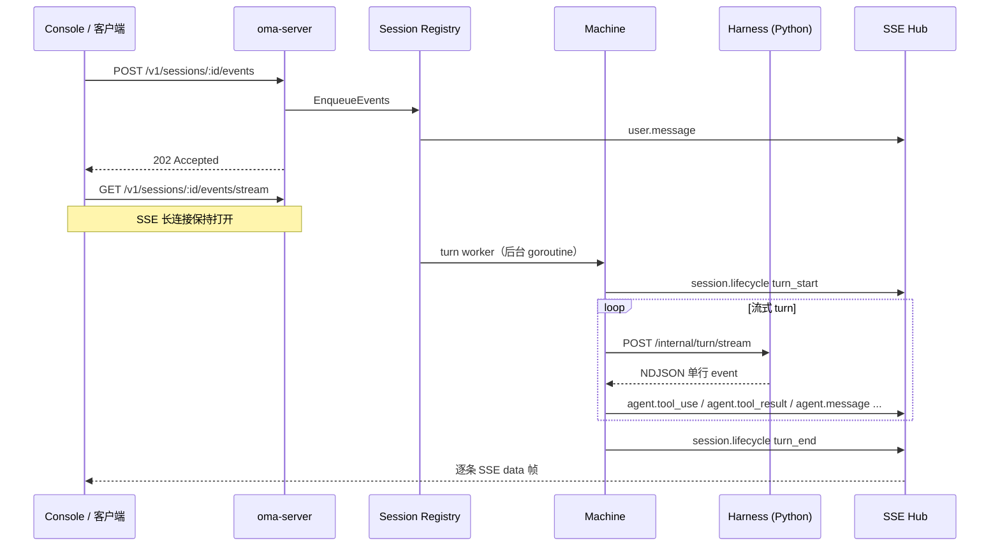

# Harness 流式 Turn 与 SSE 推送

本文说明 oma-platform 中「整轮结束后批量推送」与「边跑边推」的区别，并用真实的 OMA 事件类型画一条时间线。

## 一句话对比

| 模式 | 比喻 | 用户感受 |
|------|------|----------|
| **批量推送（旧）** | 厨师做完一整桌菜，一次性端上来 | 长 turn 期间界面长时间无更新，最后突然冒出全部内容 |
| **边跑边推（现）** | 做一道上一道 | 工具调用、模型回复等步骤实时出现在会话里 |

## 场景示例

用户发送：

> 帮我查一下北京天气，然后用一句话总结今天是否适合出门。

Agent 背后可能依次：调用天气工具 → 拿到结果 → 生成总结。整轮耗时可能 **10～20 秒**。

### 旧方式：整轮结束后批量推送

```
用户 POST /events
    → API 立刻返回 202（queued）
    → 后台跑 Harness（阻塞 15 秒）
    → Harness 一次性返回 events 数组
    → Go 批量写入 DB + 批量推 SSE
```

**SSE 订阅方看到的时间线：**

| 时刻 | SSE 收到的事件 | 说明 |
|------|----------------|------|
| T+0.1s | `user.message` | 用户消息（Enqueue 时立即推送） |
| T+0.2s | `session.lifecycle`（`phase: turn_start`） | turn 开始 |
| T+0.2s ~ T+15s | *（无新事件）* | Harness 仍在跑，界面像「卡住」 |
| T+15s | `agent.tool_use` | 查天气 |
| T+15s | `agent.tool_result` | 天气结果 |
| T+15s | `agent.message` | 总结文案 |
| T+15s | `session.lifecycle`（`phase: turn_end`） | turn 结束 |

问题不在 API 是否异步（`POST /events` 早就返回 202），而在于 **Harness 产出的事件被攒到 turn 结束才一次性可见**。

### 新方式：边跑边推（流式 Turn）

```
用户 POST /events
    → API 立刻返回 202（queued）
    → turn worker 异步执行 Machine.RunTurn
    → Harness 通过 POST /internal/turn/stream 按 NDJSON 逐条产出事件
    → Go 每收到一条就立刻：写 DB → Hub.Publish → SSE 推送
```

**SSE 订阅方看到的时间线：**

| 时刻 | SSE 收到的事件 | 说明 |
|------|----------------|------|
| T+0.1s | `user.message` | 用户消息 |
| T+0.2s | `session.lifecycle`（`phase: turn_start`） | turn 开始 |
| T+1.0s | `agent.tool_use` | 开始查天气（Harness 边跑边推） |
| T+6.0s | `agent.tool_result` | 天气 API 返回 |
| T+8.0s | `agent.message` | 模型输出总结 |
| T+15s | `session.lifecycle`（`phase: turn_end`） | turn 结束 |

用户在 T+1s 就能看到「正在调工具」，不必等到 T+15s。

## 真实事件类型说明

oma-platform 会话里常见的事件类型（与 Console / OMA 协议对齐）：

| `type` | 含义 | 典型来源 |
|--------|------|----------|
| `user.message` | 用户输入 | 客户端 `POST /v1/sessions/:id/events` |
| `session.lifecycle` | turn 生命周期 | Go `Machine`，`phase` 为 `turn_start` / `turn_end` |
| `agent.tool_use` | Agent 发起工具调用 | Harness `emit_oma_events`（piPy `tool_use` 等） |
| `agent.tool_result` | 工具返回结果 | Harness `emit_oma_events`（piPy `tool_result` 等） |
| `agent.message` | Agent 文本回复 | Harness `emit_oma_events`（piPy `assistant_message` 等） |
| `session.error` | turn 失败 | Go `Machine.failTurn` |
| `session.status_idle` | 中断后的空闲态 | Go `Machine.PublishStatusIdle`（如 user interrupt） |

`session.lifecycle` 示例：

```json
{
  "type": "session.lifecycle",
  "phase": "turn_start",
  "turn_id": "a1b2c3d4e5f6g7h8"
}
```

## 端到端数据流



要点：

1. **HTTP 请求不阻塞**：`POST /events` 只入队，立即 202。
2. **Turn 在后台跑**：`Registry` 的 `runTurnWorker` 串行处理同一 session 的 turn。
3. **SSE 不傻等整轮**：订阅方在 turn 进行中持续收到中间事件。

## 代码落点（便于对照）

| 环节 | 文件 | 职责 |
|------|------|------|
| 异步入队 | `internal/session/registry.go` | `EnqueueEvents` → `scheduleTurn` |
| 202 响应 | `internal/api/sessions.go` | 用户事件入队后返回 `queued` |
| 流式执行 turn | `internal/session/machine.go` | `harness.RunTurnStreaming` + 逐条 `publishEvents` |
| Harness NDJSON | `harness/oma_adapter/main.py` | `POST /internal/turn/stream` |
| piPy → OMA 事件 | `harness/oma_adapter/turn.py` | `run_turn_stream`，listener 增量 emit |
| Go 读流 | `internal/harness/client.go` | `HTTPClient.RunTurnStream` |
| SSE 输出 | `internal/api/sessions.go` | `GET .../events/stream` 订阅 Hub |

## 「SSE 不阻塞」到底指什么？

容易混淆的两层「异步」：

| 层次 | 是否一直异步 | 改造前的问题 | 改造后 |
|------|--------------|--------------|--------|
| API 层 | 是（202） | 无 | 无变化 |
| 事件可见性 | 改造前否 | Harness 事件批量延迟 | 每条事件立即持久化并 SSE 推送 |

因此：

- **不会**因为 turn 很长就让 `POST /events` 挂起（本来就不会）。
- **会**因为流式推送，让 **SSE 客户端在长 turn 期间持续有内容**，而不是长时间空白。

## 相关测试

- `internal/api/sessions_stream_incremental_test.go`：在 `turn_end` 之前收到 `agent.tool_use`
- `internal/api/sessions_sse_test.go`：完整 turn 的 SSE 流程
- `internal/harness/client_stream_test.go`：NDJSON 客户端
- `harness/tests/test_turn_stream.py`：Python 流式 turn

## 向后兼容

- 保留 `POST /internal/turn`（批量 JSON 响应），便于简单调用与测试。
- 生产路径优先 `POST /internal/turn/stream`；测试里 `FakeClient.RunTurnStream` 仍可模拟流式行为。
