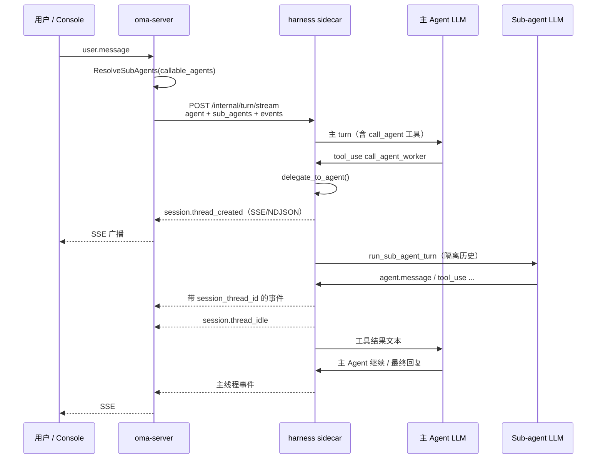

# Sub-agent（子 Agent）

本文说明 OMA 中 **Sub-agent** 是什么、主 Agent 如何委派任务给它，以及 oma-platform 中的实现方式。

## 一句话总结

**Sub-agent 是主 Agent 在运行时临时「派出去干活的另一个 Agent」。** 主 Agent 不亲自完成所有步骤，而是通过 `call_agent_*` 或 `general_subagent` 工具把子任务交给 Sub-agent；Sub-agent 在隔离的对话上下文里跑一轮 LLM turn，最后把文本结果当作工具返回值还给主 Agent。

可以把主 Agent 想成项目经理，Sub-agent 是被派去调研、写代码或跑命令的专员——干完活汇报一句结论，然后退场。

## 通俗类比

| 角色 | 类比 | 在系统里 |
|------|------|----------|
| **主 Agent** | 项目经理 | Session 主线程 `sthr_primary` 上的 Agent |
| **Sub-agent** | 被委派的专员 | 独立 Agent 配置，跑在子线程 `sthr_*` 上 |
| **call_agent 工具** | 「派活」动作 | 主 Agent 的 tool call，触发一次委派 |
| **工具返回值** | 专员的口头汇报 | Sub-agent 最后一则 `agent.message` 的文本 |
| **共享沙箱** | 同一间办公室 | 主、子 Agent 读写同一个 workdir，文件可互相看见 |

用户通常只和主 Agent 对话；Sub-agent 是主 Agent 内部的执行细节，除非打开 Console 的线程 Tab，否则不一定感知得到。

## 为什么需要 Sub-agent？

1. **分工**：协调者 Agent 负责拆任务，专业 Agent（研究员、写码员）负责执行。
2. **上下文隔离**：子任务在独立历史里跑，不会把大量中间步骤塞进主对话。
3. **可观测**：每次委派创建一条 [Session Thread](./session-threads.md)，Console 可按线程查看子 Agent 的工具调用与回复。
4. **评测**：多 Agent eval 用 `session.thread_created` 判断「是否发生过委派」。

## 两种 Sub-agent

oma-platform 支持两类委派目标，与 open-managed-agents 对齐：

### 1. 具名 Sub-agent（`call_agent_<id>`）

主 Agent 在配置里声明可呼叫的 Agent 列表 `callable_agents`：

```json
{
  "callable_agents": [
    { "type": "agent", "id": "researcher", "version": 1 },
    { "type": "agent", "id": "coder", "version": 1 }
  ]
}
```

Harness 会为每个 id 注册工具：

- `call_agent_researcher`
- `call_agent_coder`

工具参数为 `{ "message": "具体任务描述" }`。Sub-agent 使用**该 Agent 自己的** system prompt、tools、MCP 等完整配置。

### 2. 通用 Sub-agent（`general_subagent`）

无需预先创建 Agent 记录。在父 Agent 的 `metadata` 中开启：

```json
{
  "metadata": {
    "enable_general_subagent": true
  }
}
```

Harness 注册 `general_subagent` 工具，参数为 `{ "task": "..." }`。内部使用保留 id `general`，并**合成**一份临时配置：

- 继承父 Agent 的 model
- 固定「专注执行单一任务」的 system prompt
- 仅启用 bash / read / write / edit / grep / glob（禁用 web_fetch、MCP、再委派）

适合「偶尔派个杂活」、不想维护独立 Agent 配置的场景。

## 与 Session Thread 的关系

**一次 Sub-agent 委派 = 创建一条 Session Thread。**

```
主 Agent 调用 call_agent_worker
    │
    ├─ 生成 session_thread_id: sthr_xxx
    ├─ 发出 session.thread_created
    ├─ Sub-agent 在子线程跑一轮 turn
    │     （事件带 session_thread_id 标签）
    ├─ 发出 session.thread_idle
    └─ 最后一则 agent.message 文本 → 工具返回值给主 Agent
```

线程列表由平台从事件派生，见 [Session Threads](./session-threads.md)。

## 端到端数据流



要点：

- **Go 层不跑 Sub-agent 逻辑**，只负责解析 `callable_agents`、把 `sub_agents` 配置传给 harness，并持久化/广播 harness 产出的事件。
- **Python harness** 在工具执行时同步（`await`）跑完 Sub-agent turn，再把文本塞回主 Agent 的 tool result。

## oma-platform 实现

### 1. Agent 配置与解析（Go）

主 Agent 的 `callable_agents` 存在 `agents` 表，随 Session 快照进入 turn。

每次 turn 前，`internal/session/machine.go` 调用：

```go
subAgents, err := harness.ResolveSubAgents(
    ctx, m.Agents, m.TenantID, agent.CallableAgents,
)
```

`ResolveSubAgents`（`internal/harness/snapshot.go`）按引用 id 从数据库加载各 Sub-agent 的完整 `AgentConfig`，组装为 `map[string]AgentSnapshot`，写入 `TurnRequest.SubAgents`。

若某个 id 在库里不存在，**静默跳过**（不报错，但该 `call_agent_*` 工具执行时会返回 `agent not found`）。

### 2. Turn 请求（Go → Python）

`harness.TurnRequest` 字段：

| 字段 | 作用 |
|------|------|
| `agent` | 主 Agent 快照 |
| `sub_agents` | id → Sub-agent 快照的字典 |
| `events` | 完整会话历史 |
| `workdir` | 共享沙箱路径 |

流式接口：`POST /internal/turn/stream`，逐行 NDJSON 事件回调到 `machine.publishEvents`。

### 3. 工具注册（Python）

`oma_adapter/tools.py` 判断是否需要加载 `extensions/call_agent.py`：

- `agent.callable_agents` 非空，或
- `agent.enable_general_subagent` 为 true

`extensions/call_agent.py` 在 piPy session 创建时注册工具类；工具 `execute` 调用 `delegate_to_agent()`。

### 4. 委派核心（Python）

`oma_adapter/call_agent/delegate.py` — `delegate_to_agent(agent_id, message)`：

1. 读取 `CallAgentRuntime`（见下）
2. 检查 `depth < max_depth`（默认 `max_depth = 3`）
3. 解析 Sub-agent 配置（`general` 或 `sub_agents[id]`）
4. 生成 `sthr_*` thread id
5. `emit_event(session.thread_created)`
6. `await run_sub_agent_turn(...)`
7. `emit_event(session.thread_idle)`
8. 从子 turn 事件提取最后一条 `agent.message` 文本并返回

### 5. 子 turn 执行（Python）

`oma_adapter/call_agent/sub_turn.py` — `run_sub_agent_turn()`：

- 构造仅含一条 `user.message` 的**隔离**事件列表（不继承主对话历史）
- 通过 `tagged_on_event` 给所有产出事件打上 `session_thread_id`
- 调用与主 turn 相同的 `_run_turn_core()`（同一套 piPy session、工具、MCP 代理）
- `_strip_delegation()`：**清空** Sub-agent 的 `callable_agents`，避免子 Agent 再注册 `call_agent_*`（oma-platform 当前**不支持嵌套委派**）

子 turn 期间会重新 `configure_call_agent`，`depth` 加 1、`parent_thread_id` 设为当前子线程 id，为将来嵌套委派预留结构。

### 6. 运行时上下文（Python）

`oma_adapter/call_agent/runtime.py` — 模块级 `CallAgentRuntime`：

| 字段 | 含义 |
|------|------|
| `parent_agent` | 发起委派的主 Agent（或上层线程的 Agent） |
| `sub_agents` | 可委派目标配置表 |
| `emit_event` | 把事件交给主 turn 的 `on_event`，最终流到 Go / SSE |
| `workdir` | 与主 Agent 相同 |
| `parent_thread_id` | 父线程 id，写入 `session.thread_created.parent_thread_id` |
| `depth` / `max_depth` | 委派深度限制 |

主 turn 在 `_run_turn_core` 入口配置 `CallAgentRuntime`；子 turn 在 `run_sub_agent_turn` 内临时覆盖，结束后 `clear_call_agent_runtime()`。

## 配置示例

### 多 Agent 协调者

```json
{
  "name": "Coordinator",
  "model": "claude-sonnet-4-20250514",
  "system": "你是协调者。需要调研或写代码时，使用 call_agent 工具委派给子 Agent。",
  "callable_agents": [
    { "type": "agent", "id": "researcher" },
    { "type": "agent", "id": "coder" }
  ],
  "tools": [{ "type": "agent_toolset_20260401" }]
}
```

另建 `researcher`、`coder` 两个 Agent 记录；Coordinator 的 Session turn 会自动带上它们的快照。

### 仅通用 Sub-agent

```json
{
  "name": "SoloWithHelper",
  "model": "claude-sonnet-4-20250514",
  "metadata": { "enable_general_subagent": true }
}
```

无需 `callable_agents`，会出现 `general_subagent` 工具。

## 行为约束与差异

| 约束 | oma-platform | open-managed-agents (CF) |
|------|--------------|--------------------------|
| 沙箱 | 共享 workdir | 共享 sandbox |
| 子对话历史 | 隔离（仅一条 user.message） | 隔离 `InMemoryHistory` |
| 事件写入 | 合并进同一 Session event log | 同左，带 `session_thread_id` |
| `general` 再委派 | ❌ 合成配置无 callable_agents | ❌ 显式禁止 |
| 具名 Sub-agent 再委派 | ❌ `_strip_delegation` 清空 callable_agents | ✅ `runSubAgent` 嵌套，`parent_thread_id` 链式传递 |
| 深度限制 | `max_depth = 3`（当前无嵌套工具则实际为 1 层） | 类似，general 仅一层 |
| 并行工具 | `execution_mode = "parallel"` | 支持并行 `call_agent_*` |
| per-thread interrupt | 事件层支持 `session_thread_id` | ✅ `user.interrupt` 按线程 abort |

## 错误处理

Sub-agent 失败时，主 Agent 收到**工具结果文本**（不是 HTTP 错误），常见前缀：

- `Sub-agent error: agent "xxx" not found` — id 未在 `sub_agents` 中
- `Sub-agent error: delegation depth limit (3) reached`
- `Sub-agent error: <exception>` — 子 turn 抛错
- `Multi-agent delegation not available: no thread executor configured` — 未配置 `CallAgentRuntime`

Harness 将 `Sub-agent error:` 前缀的结果标记为 `is_error=True` 的 tool result，主 LLM 可据此重试或换策略。

## 当前实现状态

根据 `MVP-MIGRATION-PLAN.md`：

- ✅ **P2-1 / T12** — harness `call_agent` / `general_subagent` 委派
- ✅ Go `ResolveSubAgents` + turn 请求透传 `sub_agents`
- ✅ `session.thread_created` / `session.thread_idle` 事件
- ✅ 单元测试 `harness/tests/test_call_agent.py`
- 🟡 嵌套委派（子 Agent 再 call_agent）— 结构已预留，当前主动禁用
- 🟡 per-thread `user.interrupt` 取消子 turn — 平台事件模型支持，harness 侧 abort 传递待完善

## 关键文件索引

| 层级 | 文件 | 职责 |
|------|------|------|
| Turn 编排 | `internal/session/machine.go` | 解析 sub_agents、发起 harness stream |
| 配置解析 | `internal/harness/snapshot.go` | `ResolveSubAgents` |
| 请求 DTO | `internal/harness/client.go` | `TurnRequest.SubAgents` |
| 工具映射 | `harness/oma_adapter/tools.py` | 加载 call_agent 扩展 |
| 工具注册 | `harness/oma_adapter/extensions/call_agent.py` | `call_agent_*` / `general_subagent` |
| 委派入口 | `harness/oma_adapter/call_agent/delegate.py` | `delegate_to_agent`、thread 生命周期 |
| 子 turn | `harness/oma_adapter/call_agent/sub_turn.py` | 隔离 turn + 事件打标 |
| 运行时 | `harness/oma_adapter/call_agent/runtime.py` | `CallAgentRuntime` |
| Turn 集成 | `harness/oma_adapter/turn.py` | 主 turn 配置 `configure_call_agent` |
| 类型 | `harness/oma_adapter/types.py` | `CallableAgentRef`、`enable_general_subagent` |
| 测试 | `harness/tests/test_call_agent.py` | 委派与工具注册测试 |
| Agent API | `internal/store/agents.go` | `callable_agents` 字段 |
| CF 参考 | `open-managed-agents/apps/agent/src/runtime/session-do.ts` | `runSubAgent` |
| CF 参考 | `open-managed-agents/apps/agent/src/harness/tools.ts` | `call_agent_*` 工具定义 |

## 相关文档

- [Session Threads](./session-threads.md) — 子线程如何展示与派生
- [Harness 流式 Turn 与 SSE](./streaming-turn-and-sse.md) — 事件如何从 harness 推到客户端
- [Runtime 架构](./runtime-architecture.md) — ACP 路径下子 Agent 同样继承父 Session tenant
- [MVP 迁移计划](../../MVP-MIGRATION-PLAN.md) — P2-1 进度
