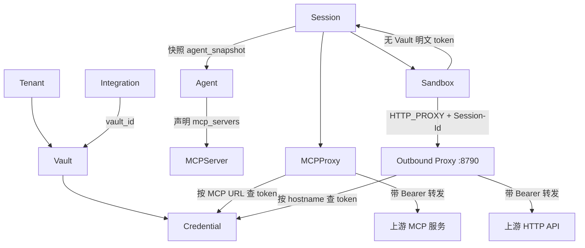

# Vault 与凭据架构

本文说明 OMA（Open Managed Agents）系统中 **Vault** 的职责、与其他组件的关系，以及凭据在运行时如何被注入。

## 一句话总结

**Vault** 是 OMA 的**安全凭据容器**：集中存放上游服务的认证信息（OAuth token、API key、MCP bearer token 等），并且**不会**把明文密钥下发到沙箱或 Harness。平台在真正发起上游 HTTP/MCP 调用时，才从 Vault 读取并注入 `Authorization` 等头。

## Vault 是干什么的？

核心职责可以概括成三点：

1. **存密钥**：OAuth token、API key、MCP server 的 bearer token 等
2. **隔离密钥**：凭据**不会**下发到沙箱工作目录或 piPy 侧车里
3. **按需注入**：平台在真正发起上游 HTTP/MCP 调用时，才从 Vault 读取并注入 `Authorization` 等头

官方概念说明（`open-managed-agents/AGENTS.md`）：

> A **vault** is a secure credential store. Credentials in vaults are **never exposed to sandboxes** — they're injected via an outbound proxy that intercepts HTTP requests and adds authentication headers transparently.

在 `oma-platform` 里，Vault 是租户级资源，对应 SQLite 表 `vaults`（见 `internal/store/vaults.go`）：

```go
// Vault is a tenant-scoped secret container.
type Vault struct {
    ID         string
    TenantID   string
    Name       string
    CreatedAt  int64
    UpdatedAt  *int64
    ArchivedAt *int64
}
```

## Vault 和什么有关系？

可以按「存什么 → 谁用 → 怎么注入」来理解关系网。

### 1. Credential（凭据）—— 直接父子关系

- 每个 **Credential** 都绑定一个 `vault_id`
- 实际密钥存在 `credentials.auth_cipher`（加密字段）
- 支持类型包括 `mcp_oauth`、`static_bearer` 等
- 每个 Vault 最多 20 条 active credential

```go
// Credential is a vault-bound auth record.
type Credential struct {
    ID          string
    TenantID    string
    VaultID     string
    DisplayName string
    Auth        json.RawMessage
    ...
}
```

数据库 schema 见 `internal/store/migrations/005_vaults_credentials_skills.sql`。

### 2. MCP Proxy —— 运行时注入入口

Agent 在配置里声明 `mcp_servers`（只有 name + url，通常**不带** token）。Session 创建时会快照 Agent 配置。真正调用 MCP 时走 `/v1/mcp-proxy/{sessionId}/{serverName}`：

- 若 snapshot 里已有 `authorization_token`，直接用
- 否则按 **MCP URL** 去 Vault 的 credentials 里查匹配项，取出 token 再转发

解析逻辑在 `internal/mcpproxy/target.go`：

```go
// Resolver resolves MCP proxy targets from session state and vault creds.
cred, err := r.Credentials.FindActiveByMcpURL(ctx, tenantID, server.URL)
return &Target{UpstreamURL: server.URL, UpstreamToken: token}, nil
```

也就是说：**Agent/Session 只知道 server 名字和 URL，Vault 负责「谁有权访问、用什么 token」。**

HTTP 路由挂载在 `internal/api/mcp_proxy.go` 的 `/v1/mcp-proxy/{sid}/{serverName}`。

**MCP Proxy 与 Vault outbound 的区别**见下文「Vault outbound 是什么？」。

### 2b. Vault outbound —— 沙箱任意 HTTP 的凭据注入

见独立章节 [Vault outbound 是什么？](#vault-outbound-是什么)。

### 3. Agent / Session —— 间接关联

- **Agent**：定义可用 MCP server 列表
- **Session**：绑定某个 Agent 版本，保存 `agent_snapshot`
- **MCP Proxy**：用 `(tenantId, sessionId, serverName)` 解析该 Session 该用哪条 credential

Agent 本身不持有 Vault 里的明文密钥；这是 OMA 的「credential proxy outside the harness」设计（详见 `open-managed-agents/docs/mcp-credential-architecture.md`）。

### 4. OAuth 刷新 —— `vaultoauth` 包

Vault 里的 `mcp_oauth` 类型凭据，可通过 `/v1/vaults/{id}/credentials/{id}/mcp_oauth_validate` 校验，并在 token 过期时由 `internal/vaultoauth` 做 refresh。

### 5. Integrations（Linear / GitHub / Slack）

第三方集成安装记录（`internal/store/integrations.go`）里也有 `vault_id` 字段：OAuth 安装完成后把 token 存进对应 Vault，供后续 MCP / outbound 调用使用。

### 6. Tenant（租户）

Vault 和 Credential 都是 `tenant_id` 隔离的，API 路径为 `/v1/vaults`（见 `internal/api/vaults.go`、`internal/api/router.go`）。

### 7. 和 Sandbox 的边界

Vault 和 **Sandbox 工作目录**（`SANDBOX_WORKDIR/<session_id>/`）是刻意分离的：

- **Sandbox**：跑 bash、读写文件等工具（Harness / piPy 侧车）
- **Vault**：只在平台侧（Go server / MCP proxy）参与认证

即使 Agent 被 prompt injection，沙箱里也**没有**可泄露的 API key。

## Vault outbound 是什么？

**Vault outbound**（也叫 **outbound proxy / outbound forward**）是 OMA 里**第二条**凭据注入路径：专门处理沙箱或 Harness 发起的**普通 HTTP/HTTPS 出站请求**（`curl`、`web_fetch`、bash 里的 `wget` 等），而不是 MCP 协议调用。

### 一句话

沙箱只知道「我要访问 `https://api.example.com/...`」，**不知道** Bearer token；所有出站 HTTP 先经过平台的 **outbound 正向代理**，代理按**目标 hostname** 查 Vault，注入 `Authorization` 后再转发上游。

### 和 MCP Proxy 的对比

| 维度 | **MCP Proxy** | **Vault outbound** |
|------|---------------|-------------------|
| 触发场景 | Agent 调用已声明的 **MCP server**（工具协议） | 沙箱/Harness 的**任意 HTTP**（curl、web_fetch 等） |
| 匹配键 | `(sessionId, serverName)` → Agent snapshot 里的 MCP URL | 请求 URL 的 **hostname** |
| 查 Vault 方式 | 按 `mcp_server_url` 精确匹配 credential | 按 credential 里 `mcp_server_url` 解析出的 **hostname** 匹配 |
| 入口 | `POST /v1/mcp-proxy/{sid}/{serverName}` | 独立监听的 **HTTP forward proxy**（默认 `:8790`） |
| 调用方 | MCP 客户端 / Binding RPC | 沙箱子进程（经 `HTTP_PROXY` / `.curlrc`） |

两条路径都遵循同一原则：**密钥只在平台侧、每次调用实时从 Vault 读取**，不下发到沙箱内存。

### 请求链路（oma-platform）

```
沙箱 / Harness（bash curl、web_fetch、httpx）
    │  HTTP_PROXY=http://127.0.0.1:8790
    │  X-OMA-Session-Id: <session_id>
    │  Proxy-Authorization: Bearer <platform api key>   ← 认证代理本身，不是 Vault token
    ▼
Go outbound proxy（internal/outbound/proxy.go，OMA_OUTBOUND_PROXY_ADDR）
    │  1. 校验 api key，解析 tenant + session
    │  2. 从绝对 URL 提取 hostname
    │  3. Resolver 按 hostname 查 Vault credential
    │  4. 注入 Authorization: Bearer <vault token>
    ▼
上游 HTTP API（api.linear.app、mcp.example.com 等）
```

Harness 侧在每个 turn 开始时配置代理环境（`harness/oma_adapter/outbound/setup.py`）：

- 写入 session 工作目录下的 `.curlrc`（`proxy`、`X-OMA-Session-Id`、`Proxy-Authorization`）
- 设置 `HTTP_PROXY` / `HTTPS_PROXY` 环境变量

`web_fetch` 工具同样走该 proxy，并附带相同 header（`harness/oma_adapter/web_fetch/core.py`）。

平台在创建 turn 时把 `outbound_proxy_addr` 与 `outbound_proxy_api_key` 传给 Harness（`internal/harness/client.go` → `internal/api/sessions.go`）。

### Vault 凭据如何被 outbound 匹配？

`internal/outbound/resolver.go` 会：

1. 加载当前 session（校验未归档）
2. 列出 tenant 下所有 active credentials
3. 从每条 credential 的 `auth.mcp_server_url` 解析 **hostname**
4. 与出站请求的 hostname 比较（小写、去端口）
5. 多条命中时取 **updated_at 最新** 的一条，提取 `bearer_token` / `token` / `access_token`

因此 outbound 路径复用了 credential 上的 `mcp_server_url` 字段作为 **host 绑定**，而不是单独的「outbound 凭据类型」。

### 当前 MVP 限制

| 能力 | 状态 |
|------|------|
| 明文 HTTP 经 proxy 转发 + Vault Bearer 注入 | ✅ 已实现 |
| Harness curl / web_fetch 走 proxy | ✅ 已实现 |
| **HTTPS CONNECT** 隧道（MITM 解密） | ❌ 未实现；proxy 返回 `501`，需 Cloud 版 `oma-vault` MITM |
| OAuth 401 自动 refresh（outbound 路径） | 🟡 Cloud 主 worker 有；自托管 outbound 当前为直接注入 |
| `command_secret`（如 `GIT_TOKEN` 注入 git 命令 env） | ❌ 仍可能进沙箱进程 env，不属于 outbound 覆盖范围 |

环境变量：`OMA_OUTBOUND_PROXY_ADDR`（默认 `:8790`），为空则不启动 outbound 监听。

### 为何需要 outbound？

MCP Proxy 只覆盖「Agent 显式配置的 MCP server」。但 Agent 在沙箱里还可能：

- 用 `curl` 调 REST API
- 用 `web_fetch` 抓网页
- 跑脚本访问第三方 HTTPS

若没有 outbound，这些请求要么**不带鉴权**，要么必须把 token 写进沙箱——后者违背 Vault 隔离设计。Vault outbound 让「任意出站 HTTP」也能享受与 MCP 相同的 **credential proxy** 模式。

## 关系示意



## 与 Model Cards 的区别

| 概念 | 用途 |
|------|------|
| **Vault** | 上游集成凭据（Linear、Slack、自定义 MCP 等） |
| **Model Cards** | LLM 提供商 API key（调用模型本身） |

两者都是密钥管理，但服务对象不同：Vault 管「Agent 要调用的外部工具/服务」，Model Cards 管「Agent 用的模型」。

## 架构原则（credential proxy）

OMA 的 Vault 是上游凭据的**唯一可信来源**。Agent、Harness、沙箱容器三者只知道 `(tenantId, sessionId, server-name | hostname)`，由**平台主服务**在每次调用时**实时**查 Vault、注入 Bearer、转发上游请求——不在 Session 或 Agent worker 里做凭据快照。

这样即使 Agent 被 prompt 注入，也没有明文 credential 可泄露。完整架构说明见：

- `open-managed-agents/docs/mcp-credential-architecture.md`
- `open-managed-agents/apps/docs/src/content/docs/build/vault-and-mcp.mdx`

## 相关代码路径

| 组件 | 路径 |
|------|------|
| Vault 存储 | `internal/store/vaults.go` |
| Credential 存储 | `internal/store/credentials.go` |
| Vault HTTP API | `internal/api/vaults.go` |
| MCP Proxy | `internal/api/mcp_proxy.go`、`internal/mcpproxy/target.go` |
| **Vault outbound** | `internal/outbound/proxy.go`、`internal/outbound/resolver.go` |
| Harness outbound 接线 | `harness/oma_adapter/outbound/setup.py`、`harness/oma_adapter/turn.py` |
| web_fetch 走 proxy | `harness/oma_adapter/web_fetch/core.py` |
| 进程入口 / 监听 | `cmd/oma-server/main.go`（`OMA_OUTBOUND_PROXY_ADDR`） |
| OAuth 刷新 | `internal/vaultoauth/oauth.go` |
| Integrations | `internal/store/integrations.go` |
| DB 迁移 | `internal/store/migrations/005_vaults_credentials_skills.sql` |

## MVP 迁移状态说明

`MVP-MIGRATION-PLAN.md` 中 P0-3「Vault outbound HTTP 代理」在 `oma-platform` 已落地基础实现：

- ✅ Vault CRUD、`mcp_oauth_validate`
- ✅ MCP Proxy 凭据注入（`/v1/mcp-proxy`）
- ✅ Outbound forward proxy（`:8790`）+ Harness `HTTP_PROXY` / `.curlrc` 接线
- 🟡 HTTPS CONNECT / MITM（需 Cloud `oma-vault`，自托管 MVP 不支持）
- 🟡 Outbound 路径上的 OAuth 401 自动 refresh（Cloud 主 worker 更完整）

自托管部署下，**MCP 调用**走 MCP Proxy，**沙箱普通 HTTP** 走 Vault outbound；两者互补，共同实现「凭据不出沙箱」。
