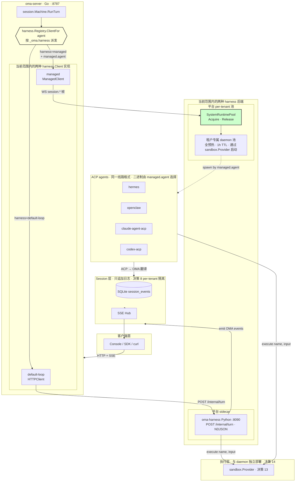

# 方案：可插拔 Harness（pipy / acp-proxy / openclaw / hermes / claude）

**状态：** APPROVED（已批准，2026-07-11）
**日期：** 2026-07-11
**分支：** `harness`
**范围：** `oma-platform` Go 服务端 + 参考 `open-managed-agents` 的 ACP 运行时实现

## 实施状态（2026-07-12 更新）

**已完成：**

- 基础阶段 1 —— `harness.Registry` 派发器。已落到 `harness` 分支
  （commit `9c5e8f3`，2026-07-12）。`Machine` 持有一个 `HarnessRegistry`，
  根据 agent 的 `_oma.harness` 元数据解析出每轮使用的 `Client`。
  `OMA_FAKE_HARNESS` 通过 `RegistryConfig.Force` 保留。
- 扩展阶段 3 —— `managed` kind stub + schema + API 校验。已落到
  `harness` 分支（2026-07-12）。`ManagedClient` stub 的 `RunTurn` 返回
  "managed harness not implemented (Phase 4 pending)"。
  `system_runtimes` + `system_runtime_leases` 表通过 migration 023 添加
  （仅 schema；行由阶段 4 的池管理器写入）。Agent API 在创建时、以及在
  patch 把 `harness` 翻到 `"managed"` 的更新路径上，按
  `harness.KnownAgents` 校验 `runtime_binding.agent`。
- 扩展阶段 4（中间版本）—— `managed` 真实客户端，直连现有共享网关。
  已落到 `harness` 分支（commit `f33afc2`，2026-07-12）。
  `OpenClawClient` 通过 OpenAI 兼容 `/v1/chat/completions` 调用 OpenClaw
  Gateway，使用 `x-openclaw-session-key` 维持服务端会话；`HermesClient`
  同样调 OpenAI 兼容接口，但因为 Hermes 无服务端状态，每轮重放完整历史。
  `NewManagedFactory(oc, hc)` 按 `binding.Agent` 派发（`"hermes"` → Hermes，
  其它 → OpenClaw）。Gateway 地址/token 通过 `OMA_OPENCLAW_*` 与
  `OMA_HERMES_*` 环境变量注入；任一为空时回退到原 stub（向后兼容）。
  该版本绕过了 per-tenant daemon 池，直接路由到 `124.221.28.203` 上
  已经部署好的 OpenClaw（17772）和 Hermes（8642）。端到端已验证：
  用户消息 → agent 回复 → 多轮对话（OpenClaw 通过 header 维持记忆；
  Hermes 通过全历史重放）。
- 可观测性（方案 §10.13 选项 1）—— 每轮埋点。已落到 `harness` 分支
  （commit `c22deea`，2026-07-12）。两个 managed 客户端的流式/非流式
  路径都会：捕获上游 token 用量（`TurnResponse.Usage`）、追加
  `span.model_request_end` 事件（喂给既有 `usage.AggregateEvents` 管道
  → `/v1/cost_report`）、写一行结构化日志
  `managed.turn backend=… session=… model=… stream=… duration_ms=… input_tokens=… output_tokens=…`。
  流式请求通过 `stream_options.include_usage=true` 在最后一个 SSE chunk
  拿 token 数（上游遵循 OpenAI 扩展时生效）。

**延期（保留在方案中作为设计参考，从活动架构图 §3 和 §10.13 中移除）：**

- 基础阶段 2：`acp-proxy` harness kind —— `RuntimeClient`、用户自托管 daemon、
  `RuntimeRoom`、`acp-proxy-wire.md` 设计文档。
- 扩展阶段 4（完整版）：`SystemRuntimePool` 真实实现 + 冷启动 spawn 路径、
  per-tenant daemon 隔离。当前中间版本用共享网关替代，
  直到真正需要租户隔离 / 规模扩展时再启动。
- 扩展阶段 5：预热切到分级 + per-tenant 容量 + Console UX 翻转。
- Console 集成（原阶段 3）—— 等 managed 路径可用再做。
- 可观测性选项 2：`claude-acp` / `codex-acp` 客户端。

---

## 1. 问题

今天 `oma-platform` 只有**一种** harness 实现：**pipy HTTP sidecar**。
`cmd/oma-server/main.go:145` 在启动时构造了一个 `&harness.HTTPClient{BaseURL: harnessURL}`，
并把它灌入到每一个 session。所有 session —— 不管 agent 的 `_oma.harness` 元数据写了什么 ——
都用同一个 pipy 客户端。

`Agent` 其实已经有 `_oma.harness` 和 `_oma.runtime_binding` 字段（见
`internal/store/agents.go:37`、`internal/api/agentwire.go:18-19`），
`docs/design/runtime-architecture.md` 也描述过 `acp-proxy` 这种 harness 类型。
但**整个 turn 路径上没有任何 Go 代码读取 `_oma.harness`** —— runtime / room
这套机制已经存在（`internal/runtime/registry.go`、`room.go`），却没有被接入
`session/machine.go` 的 turn 派发。

我们希望运维人员（以及 Console 上的选择器）能在下列选项中挑选：

| Harness 类型 | 它是什么 | 线路格式 |
|--------------|-----------|-------------|
| `default-loop`（别名 `pipy`） | 平台自带的 Python sidecar | `POST /internal/turn`（NDJSON 流） |
| `acp-proxy` | 用户本机上的 ACP daemon，通过 `RuntimeRoom` 桥接 | WebSocket `session.*` JSON |
| *（agents）* `openclaw` / `hermes` / `claude` / `codex` | daemon 启动的具体 ACP agent | 同样是 `session.*` —— daemon 通过 `acp_agent_id` 选择二进制 |

参考实现：`open-managed-agents/packages/acp-runtime/src/`。它把
**Spawner** / **ChildHandle** / **AcpRuntime** 拆成三层，并在
`known-agents.ts` 中以 overlay 形式列出 `hermes`、`openclaw`、`claude-acp`、
`codex-acp`，每项带 `{command, args}` 启动规约。

## 2. 关键洞察：两种类型，多个 Agent

`openclaw` / `hermes` / `claude` / `codex` **不是**独立的 harness 类型。
它们都是 **ACP agent**，讲的是同一套 JSON-RPC-over-stdio 协议。
真正的差异在 `runtime_binding.acp_agent_id` —— 它告诉 daemon **该启动哪个二进制**：

```jsonc
// Agent 配置
{
  "_oma": {
    "harness": "acp-proxy",            // ← harness 类型（共 2 种选择）
    "runtime_binding": {
      "runtime_id": "rt-uuid",          // ← 用哪个 daemon
      "acp_agent_id": "openclaw"        // ← 启动哪个 agent 二进制（openclaw|hermes|claude-acp|codex-acp）
    }
  }
}
```

所以要做的活就是：

1. 引入一个 **per-session 的 harness 派发器**（`harness.Registry`），以 `_oma.harness` 为键。
2. 实现两种 `harness.Client`：`default-loop`（已有的 HTTP）和 `acp-proxy`（新的 WS）。
3. 在 daemon 的 known-agents 列表里扩展 `openclaw` / `hermes` / `claude-acp` / `codex-acp`。
4. （可选）在服务端用一份 known-agents 数据文件校验 `acp_agent_id`。

## 3. 架构

```
┌────────────────────────────────────────────────────────────────────┐
│                        Client / Console                            │
└────────────────────────────┬───────────────────────────────────────┘
                             │
                             ▼
┌────────────────────────────────────────────────────────────────────┐
│  session.Machine.RunTurn                                           │
│    ├─ 读取 agent.Harness                                          │
│    └─ 询问 harness.Registry.ClientFor(agent) → harness.Client     │
└────────────────────────────┬───────────────────────────────────────┘
                             │
                   ┌─────────┼─────────┐
                   │         │         │
                   ▼         ▼         ▼
          ┌────────────┐ ┌──────────┐ ┌──────────────────┐
          │default-loop│ │ managed  │ │ fake / sim       │
          │HTTPClient  │ │Managed-  │ │ （测试用）        │
          │POST /inter-│ │Client    │ │                  │
          │nal/turn    │ │WS → Pool │ │                  │
          │(NDJSON)    │ │          │ │                  │
          └─────┬──────┘ └────┬─────┘ └──────────────────┘
                │              │
                │              ▼
                │    ┌─────────────────────────┐
                │    │ SystemRuntimePool       │
                │    │ (per-tenant · 全预热)    │
                │    │ sandbox.Provider 启动    │
                │    │ 固定 1h idle TTL        │
                │    └───────────┬─────────────┘
                │                │ spawn by managed.agent
                │                ▼
                │    ┌─────────────────────────┐
                │    │ 租户专属 daemon 池       │
                │    │ hermes / openclaw /     │
                │    │ claude-agent-acp /      │
                │    │ codex-agent-acp         │
                │    └───────────┬─────────────┘
                │                │
                ▼                ▼
          ┌──────────────────────────────────────┐
          │   sandbox.Provider（独立部署）        │
          │   local / e2b / daytona / litebox    │
          └──────────────────┬───────────────────┘
                             │
                             ▼
          ┌──────────────────────────────────────┐
          │  Session 层（SQLite session_events）  │
          │  只追加日志 · SSE Hub                │
          │  per-tenant 隔离                     │
          └──────────────────────────────────────┘
```

## 4. 变更

> **范围说明（2026-07-11）：** §4.2（`runtime_client.go`）、§4.7（Console 选择器）、
> §4.8（daemon known-agents）以及 §4.6 中 `acp_agent_id` 的校验部分 **已延期** ——
> 它们属于当前不实施的 `acp-proxy` harness 路径。
> §4.1 / §4.3 / §4.4 / §4.5 以及 §4.6 中 `managed.agent` 的校验部分在当前范围内。

### 4.1 `internal/harness/registry.go`（新增）

```go
// Kind 标识一个 harness 实现。
type Kind string

const (
    KindDefaultLoop Kind = "default-loop" // pipy HTTP sidecar（别名 "pipy"）
    KindAcpProxy    Kind = "acp-proxy"
    KindFake        Kind = "fake"
)

// Registry 为一个 agent 解析出对应的 harness.Client。
type Registry struct {
    defaultClient Client               // 兜底（指向 pipy 的 HTTPClient）
    acpFactory    func(binding AcpBinding) (Client, error)
    knownKinds    map[Kind]struct{}
}

// AcpBinding 是 _oma.runtime_binding 在 acp-proxy 模式下的解析结果。
type AcpBinding struct {
    RuntimeID  string `json:"runtime_id"`
    AcpAgentID string `json:"acp_agent_id"`
}

func (r *Registry) ClientFor(agent store.AgentConfig) (Client, error) {
    kind := Kind(agent.Harness)
    if kind == "" { kind = KindDefaultLoop }
    switch kind {
    case KindDefaultLoop, "pipy":
        return r.defaultClient, nil
    case KindAcpProxy:
        b, err := parseAcpBinding(agent.RuntimeBinding)
        if err != nil { return nil, err }
        return r.acpFactory(b)
    case KindFake:
        return &FakeClient{}, nil
    default:
        return nil, fmt.Errorf("unknown harness kind: %q", kind)
    }
}
```

### 4.2 `internal/harness/runtime_client.go`（新增）

```go
// RuntimeClient 讲 ACP-proxy 协议：通过 WS 挂到 RuntimeRoom 上，
// 中继 session.* 帧，并把它们即时翻译成 OMA 事件。
type RuntimeClient struct {
    PlatformBase string
    InternalSecret string
    Rooms        *runtime.Registry   // 同进程内的 rooms
}

func (c *RuntimeClient) RunTurnStream(ctx context.Context, req TurnRequest, onEvent EventHandler) error {
    // 1. 打开 WS 连接到 /v1/internal/runtimes/{runtime_id}/attach-harness
    // 2. 发送 session.start { session_id, agent, user_prompt, acp_agent_id }
    // 3. 读帧；把 session.update 翻译成 OMA 事件；交给 onEvent
    // 4. 等到 session.idle 或 context 取消后返回
}
```

### 4.3 `internal/session/machine.go`（修改）

`runSingleHarnessTurn` 现在调用 `harness.RunTurnStreaming(ctx, m.Harness, req, onEvent)`，
其中 `m.Harness` 是那个单一的全局客户端。改为：

```go
func (m *Machine) clientForTurn() (harness.Client, error) {
    agent, err := m.Agents.Get(m.TenantID, m.AgentID)
    if err != nil { return nil, err }
    return m.HarnessRegistry.ClientFor(agent.AgentConfig)
}
```

然后 `runSingleHarnessTurn` 调用 `clientForTurn()` 并使用返回的客户端。

`Machine` 结构体新增：

```go
HarnessRegistry *harness.Registry   // 取代 Harness harness.Client
```

### 4.4 `cmd/oma-server/main.go`（修改）

把：

```go
var harnessClient harness.Client = &harness.HTTPClient{...}
```

替换为：

```go
defaultHarness := &harness.HTTPClient{BaseURL: harnessURL, HTTP: &http.Client{Timeout: harnessTimeout}}
registry := harness.NewRegistry(harness.RegistryConfig{
    Default:        defaultHarness,
    AcpFactory:     func(b harness.AcpBinding) (harness.Client, error) {
        return &harness.RuntimeClient{
            PlatformBase:   harnessPlatformBase,
            InternalSecret: internalSecret,
            Rooms:          runtimeRooms,
            Binding:        b,
        }, nil
    },
})
```

把 `registry`（而不是 `harnessClient`）透传到 `api.NewSessionHandlers` 以及 `Machine` 的依赖里。

### 4.5 `internal/runtime/known_agents.go`（新增）

镜像 `open-managed-agents/packages/acp-runtime/src/known-agents.ts`：

```go
var KnownAgents = map[string]KnownAgent{
    "claude-acp":   {Label: "Claude",        Command: "claude-agent-acp", Args: []string{"acp"}, Featured: true},
    "codex-acp":    {Label: "Codex",         Command: "codex-agent-acp",  Args: []string{"acp"}, Featured: true},
    "openclaw":     {Label: "OpenClaw",      Command: "openclaw",         Args: []string{"acp"}, Featured: true},
    "hermes":       {Label: "Hermes",        Command: "hermes",           Args: []string{"acp"}, Featured: true},
    "gemini":       {Label: "Gemini",        Command: "gemini",           Args: nil,                 Featured: false},
    "opencode":     {Label: "OpenCode",      Command: "opencode",         Args: []string{"acp"},     Featured: false},
}

// ValidateAcpAgentID 在 id 未知时返回错误。
// 供 Agent 创建/更新 API 提前拒绝非法的 runtime_binding。
func ValidateAcpAgentID(id string) error { ... }
```

### 4.6 Agent API 校验（修改 `internal/api/agents.go`）

创建/更新时，如果 `_oma.harness == "acp-proxy"`，就校验
`runtime_binding.acp_agent_id` 是否在 `KnownAgents` 里。否则返回 400。

### 4.7 Console agent 选择器（修改 `console/src/`）

把 `KnownAgents` 列表（通过新增的 `GET /v1/agents/known-acp-agents` 拉取）
渲染到 runtime-binding 下拉框中。featured agents 排在前面（对齐 OMA CF Console 的行为）。

### 4.8 Bridge daemon 的 known-agents（本任务范围之外，但跟踪在案）

Daemon 的 `hello` 握手会上报本机安装了哪些 ACP agent。
本任务不改 daemon —— 我们假设它已经通过 `open-managed-agents` 的 daemon 代码支持
openclaw / hermes / claude-acp。如果 daemon 版本过旧，那是另一个任务。

## 5. 迁移计划（分阶段）

> **范围说明（2026-07-11）：** 当前范围仅含**阶段 1**。
> 阶段 2（acp-proxy 接入）、阶段 3（Console 集成）、阶段 4（daemon known-agents
> 扩展，另一仓库）**已延期**。

### 阶段 1 —— 引入 registry，不改行为（最小起步）

- 新增 `internal/harness/registry.go`，包含 `KindDefaultLoop` + `KindFake`。
- 修改 `cmd/oma-server/main.go`，构造 `Registry` 而不是裸 client。
- 修改 `session.Machine`，让它持有 `*Registry` 并调用 `ClientFor(agent)`。
- **行为校验：** `_oma.harness` 未设置（也就是今天默认的情况）时，所有 agent
  都解析到同一个 HTTPClient。不会有测试挂掉，也不会有用户可见的变化。
- 更新 `internal/api/agents_ama_test.go`，显式覆盖 `_oma.harness = "default-loop"`。

### 阶段 2 —— 接入 `acp-proxy`

- 新增 `internal/harness/runtime_client.go`。
- 在 `RegistryConfig` 中增加 `AcpFactory`。
- 新增 `internal/runtime/known_agents.go`，包含 known-agents 表。
- 新增 `GET /v1/agents/known-acp-agents` API。
- 在 Agent 创建/更新时校验 `acp_agent_id`。
- 冒烟测试：用 curl 注册一个 runtime，创建一个
  `_oma.harness: acp-proxy` + `runtime_binding: {runtime_id, acp_agent_id: "hermes"}`
  的 agent，发一条 user message，验证 daemon 启动了 `hermes acp` 并且事件流回来了。

### 阶段 3 —— Console 集成

- 加 agent 选择器 UI，接到 `GET /v1/agents/known-acp-agents`。
- featured agents 在前，其余在后。
- daemon 报告某 agent 缺失时，显示 `installHint`。

### 阶段 4 —— Daemon known-agents 扩展（另一个仓库）

- 如果 `open-managed-agents` 的 daemon 还没列出 `openclaw` / `hermes`，
  向上游提 PR 加上。用单独的 issue 跟踪。

## 6. 测试

| 测试 | 范围 | 文件 |
|------|------|------|
| `Registry.ClientFor` 各类型 | 单元 | `internal/harness/registry_test.go` |
| `parseAcpBinding` 畸形输入 | 单元 | `internal/harness/registry_test.go` |
| `RuntimeClient` 帧往返（mock Room） | 单元 | `internal/harness/runtime_client_test.go` |
| Machine 按 agent 派发到正确客户端 | 单元 | `internal/session/machine_harness_test.go` |
| Agent API 拒绝未知 `acp_agent_id` | 集成 | `internal/api/agents_ama_test.go` |
| 端到端：pipy vs acp-proxy session | E2E | `scripts/e2e/acp-proxy-smoke.sh` |

## 7. 待定问题

1. **`harness` 字段是否应该把 `pipy` 当作 `default-loop` 的别名接受？**
   建议：**是**，为了向后兼容和使用顺手。读取时归一为 `default-loop`。

2. **服务端的未知 `acp_agent_id` 应该严格拒绝，还是放行并告警？**
   建议：在 Agent 写入时**严格拒绝**（400）。反正 daemon 也会启动失败 —— 早失败成本更低。

3. **如果一个 agent 想在某些 turn 用 pipy、另一些 turn 用 ACP，怎么办？**
   本任务范围之外。harness 类型是 per-Agent、per-session 的。如果一个 agent
   需要两者，定义两个 agent。

4. **需不需要 per-tenant 的默认 harness 配置？**
   阶段 1 不需要。Agent 级别的 `_oma.harness` 已经够用；tenant 全局默认
   可以等阶段 3 看 Console 体验是否真需要再加。

## 8. 风险

| 风险 | 影响 | 缓解 |
|------|------|------|
| 破坏那些隐式依赖单客户端的现有 session | 中 | 阶段 1 完全保留默认行为；现有数据行无需迁移 |
| RuntimeRoom 还没支持多 session fan-out | 高 | 阶段 2 之前先验证 `room.go` 的 harness-map fan-out 是好使的 |
| Daemon 不知道 `openclaw` / `hermes` | 中 | 连接时检查 daemon 版本；缺失 agent 的错误要清楚地返回给用户 |
| ACP 协议与 OMA 事件之间的翻译漂移 | 高 | 在 `internal/harness/testdata/acp-events.golden.json` 加 goldens 测试 |

## 9. 验收标准

- [ ] 运维人员可以通过 Console 或 API 创建一个 `_oma.harness: "acp-proxy"` 且
      `_oma.runtime_binding.acp_agent_id: "hermes"` 的 agent。
- [ ] 发送 user message 会在用户的 daemon 上启动 `hermes acp`，事件流回 Console。
- [ ] 同一位运维人员可以再创建一个 `acp_agent_id: "openclaw"` 的 agent，
      不改服务端也能跑。
- [ ] 现有 agent（没有 `_oma.harness`）继续用 pipy。行为不变。
- [ ] 单元 + 集成测试覆盖 registry 派发、binding 解析和 API 校验。

---

## 附录 A：对照 `open-managed-agents` 参考实现

| open-managed-agents | oma-platform |
|---------------------|--------------|
| `packages/acp-runtime/src/known-agents.ts` | `internal/runtime/known_agents.go`（本方案） |
| `packages/acp-runtime/src/types.ts::Spawner` | bridge daemon（本方案范围外） |
| `packages/acp-runtime/src/session.ts::AcpSessionImpl` | bridge daemon 侧 |
| `packages/session-runtime/src/machine.ts::HarnessRunFn` | `internal/harness.Client` 接口（已存在） |
| `packages/session-runtime/src/machine.ts::buildHarness()` | `harness.Registry.ClientFor(agent)`（本方案） |
| CF `RuntimeRoom` DO | `internal/runtime/registry.go` + `room.go`（已存在） |

## 附录 B：文件清单

```
新增：
  internal/harness/registry.go
  internal/harness/registry_test.go
  internal/harness/runtime_client.go
  internal/harness/runtime_client_test.go
  internal/runtime/known_agents.go
  internal/runtime/known_agents_test.go
  scripts/e2e/acp-proxy-smoke.sh

修改：
  internal/session/machine.go            （用 Registry 替代裸 Client）
  internal/api/sessions.go               （把 Registry 透传到 handlers）
  internal/api/router.go                 （透传 Registry）
  internal/api/agents.go                 （校验 acp_agent_id）
  cmd/oma-server/main.go                 （构造 Registry）
  internal/harness/client.go             （不改；保持接口稳定）

CONSOLE：
  console/src/components/agent-picker.tsx （runtime_binding 下拉框）
  console/src/api/knownAgents.ts          （GET /v1/agents/known-acp-agents）
```

---

## 附录 C：评审备注（autoplan 精简一轮）

### CEO 视角

- **前提校验：** 站得住。OMA 已经在存 `_oma.harness` + `_oma.runtime_binding`，
  但从来没派发过；RuntimeRoom 机制已存在但没进 turn 路径。这活主要是 **接线**，
  不是新概念。
- **范围校准：** 阶段 1（registry + 行为不变）是正确的第一刀 —— 在动 ACP 路径之前
  先把重构风险卸掉。
- **6 个月后悔场景：** 如果 ACP 协议发生变化，我们已经搭了一层适配层可能要返工。
  缓解：把 `RuntimeClient` 写小，所有 ACP 专属翻译都集中在一个文件
  （`runtime_client.go`）里，这样一旦线路格式演进，改动是局部的。
- **被否掉的替代方案：** "一个 Agent 一种 harness 类型"（现状）vs.
  "per-session 覆盖"。方案选了 per-Agent —— 更简单，也对齐 open-managed-agents 的心智模型。

### Eng 视角

- **架构健全：** 是的。`harness.Registry` 加一个 `ClientFor(agent)` 方法是个干净的接缝。
  `harness.Client` 接口本身已经流式友好（`StreamingClient`），所以 `RuntimeClient`
  不需要新的抽象。
- **隐藏复杂度 #1 —— Room 中继语义：** 现在的 `room.go` 做的是 *原始 WS 中继* ——
  它不解析 `session.*` 帧。这意味着 `RuntimeClient` 必须自己讲帧协议。
  **行动：** 在阶段 2 编码前写一份明确的 `docs/design/acp-proxy-wire.md`，
  把帧集合钉死（session.start、session.update、session.idle、session.error、
  session.cancel）。不然适配器和 daemon 会悄悄地对不上。
- **隐藏复杂度 #2 —— ACP → OMA 事件翻译：** ACP 的 `sessionUpdate` 通知和
  OMA 事件（`agent.tool_use`、`agent.message` 等）不是一一对应的。
  这是风险最高的一段翻译。**行动：** 加一个 goldens 测试
  `internal/harness/testdata/acp-events.golden.json`，里面放 5–10 个有代表性的
  ACP 帧以及它们期望的 OMA 翻译。把这套映射锁在 CI 里。
- **边界情况：**
  - turn 启动时 daemon 离线 → `RuntimeClient` 必须快速失败（不要把 session
    挂在 `running` 状态）。加 5 秒的拨号超时。
  - `acp_agent_id` 没装在 daemon 上 → daemon 的 `hello` 应该上报检测到的 agents；
    服务端应该在 `ClientFor()` 时交叉检查，并给出清晰的报错
    （`agent "hermes" not detected on runtime rt-xxx`）。
  - turn 取消 → 必须把 `ctx.Done()` 翻译成 `session.cancel` 帧。
    现在 `Machine.CancelActiveTurn()` 取消的是 harness 的 context；对 `RuntimeClient`
    来说，必须在关闭前发一个 WS 帧。
- **测试影响半径：** 把 `Machine.Harness Client` 换成 `Machine.HarnessRegistry *Registry`
  会碰到每一处 `Machine` 的构造点。**行动：** 给 `Registry` 加一个
  `DefaultOnly(defaultClient Client) *Registry` 构造器，让现有测试能用 1 行改动
  完成机械式迁移。阶段 1 就做。
- **迁移：** 现有的 `OMA_FAKE_HARNESS=1 | subagent` 环境变量逻辑必须继续好用。
  方案说可以；验证方法：把 env-var 派发挪到 `Registry` **内部**（这样 `main.go`
  保持干净，env-var 行为变成一等公民的 registry 类型，而不是一个旁路分支）。

### 决策审计轨迹

| # | 阶段 | 决策 | 分类 | 原则 | 理由 | 被否方案 |
|---|------|------|------|------|------|----------|
| 1 | CEO | 两种类型（default-loop、acp-proxy）；openclaw/hermes/claude 是 agent 不是类型 | 机械性 | P3 实用 | 对齐 open-managed-agents 模型；避免 N 种新传输 | N 种 harness 类型（每个 agent 一种） |
| 2 | CEO | 在 Agent 写入时严格拒绝未知 `acp_agent_id`（400） | 机械性 | P1 完整 | 早失败胜过运行时启动错误 | 警告但放行 |
| 3 | Eng | 阶段 1 必须完全保留现有行为 | 机械性 | P2 把湖煮沸 | 行为不变能卸掉重构风险 | 大爆炸式切换 |
| 4 | Eng | 加 `DefaultOnly(registry)` 构造器便于测试迁移 | 品味 | P5 显式 | API 小，测试折腾少 | 把所有测试都重构成用完整 Registry |
| 5 | Eng | 阶段 2 编码前先写 `acp-proxy-wire.md` | 机械性 | P5 显式 | 钉死帧集合；防止悄悄漂移 | 临时协议协商 |
| 6 | Eng | ACP→OMA 事件翻译的 goldens 测试 | 机械性 | P1 完整 | 风险最高的翻译，要锁死 | 只写手工单元测试 |
| 7 | Eng | 把 `OMA_FAKE_HARNESS` 派发挪进 Registry | 品味 | P5 显式 | main.go 更干净；env-var 变成一等公民类型 | 在 main.go 里保留 env-var 旁路分支 |

---

## 10. 扩展：平台托管的 System Runtime（per-tenant）

**状态：** APPROVED（已批准，2026-07-11）
**日期：** 2026-07-11
**前置：** 基础方案的阶段 1–2（registry + acp-proxy 接线）

### 10.1 新需求

用户不应该被迫自己跑 daemon。平台要能在**平台自有的远程机器**上运行
claude code / codex / openclaw / hermes，按租户分配。用户只需选一个 ACP agent
（hermes、openclaw、claude、codex），平台就能给他一个能跑的 session —— 无需
任何 daemon 安装。

### 10.2 关键决策（已锁定）

**系统 runtime 是 per-tenant，不跨租户共享。** 每个租户都有自己的一组
平台托管的 daemon 实例池。理由：

- **安全隔离** —— 租户 A 的 agent 上下文绝不会落到租户 B 的 daemon 进程里。
- **计费可归属** —— 一个 session 消耗的 CPU / API token 可以精确归属到
  一个租户。
- **故障隔离** —— 租户 A 的崩溃 / 嘈杂 daemon 不会影响租户 B 的 session。
- **容量分级** —— 不同租户可以对应不同 SLA 等级。
  当前（用户量少）所有租户都是**全预热**；阶段 5 在用户增长后
  引入分级预热。
- **拓扑** —— daemon 与 sandbox 分开放（不 colocation）。
  Daemon 跑在平台的 daemon 池里；sandbox 继续走现有的
  `sandbox.Provider`（local / e2b / daytona）。
  对齐 managed-agents 分析里的解耦哲学（独立故障域）。

### 10.3 新 harness kind：`managed`

在 `default-loop` 与 `acp-proxy` 之外新增第三种 harness kind。Agent 配置：

```jsonc
{
  "_oma": {
    "harness": "managed",
    "managed": {
      "agent": "hermes"
      // 没有 runtime_id —— 平台从租户池里挑一个
    }
  }
}
```

对比 `acp-proxy`：后者要求用户提供一个指向**自己** daemon 的 `runtime_id`。
`managed` 模式下租户不拥有 daemon —— 平台替他跑一个池。

### 10.4 数据模型

新增表：

```sql
CREATE TABLE system_runtimes (
    id TEXT PRIMARY KEY,
    tenant_id TEXT NOT NULL,
    agent_kind TEXT NOT NULL,           -- hermes | openclaw | claude-acp | codex-acp
    status TEXT NOT NULL,               -- prewarming | busy | draining | dead
    container_id TEXT,
    started_at INTEGER,
    last_heartbeat_at INTEGER,
    active_session_id TEXT,             -- NULL if idle
    capacity_slots INTEGER NOT NULL DEFAULT 1
);

CREATE TABLE system_runtime_leases (
    id TEXT PRIMARY KEY,
    runtime_id TEXT NOT NULL REFERENCES system_runtimes(id),
    session_id TEXT NOT NULL,
    tenant_id TEXT NOT NULL,
    leased_at INTEGER NOT NULL,
    released_at INTEGER,
    outcome TEXT                        -- completed | cancelled | failed
);

CREATE INDEX idx_system_runtimes_tenant_kind_status
    ON system_runtimes(tenant_id, agent_kind, status);
```

### 10.5 `SystemRuntimePool`

一个 per-tenant、per-agent-kind 的池，提供 acquire/release 语义。

```go
type SystemRuntimePool struct {
    Runtimes    *store.SystemRuntimeRepo
    Spawner     SystemRuntimeSpawner   // 基于 sandbox.Provider 实现
    WarmerCount int                    // 每个 (tenant, kind) 的目标 idle slot 数
}

// Acquire 找到一个 idle slot，否则启动一个新 daemon（冷启动）。
func (p *SystemRuntimePool) Acquire(ctx context.Context, tenantID, agentKind string) (*SystemRuntime, error)

// Release 把一个 slot 还给池（如果 daemon 已过时则 recycle）。
func (p *SystemRuntimePool) Release(ctx context.Context, runtimeID, sessionID string) error
```

**Spawner 实现（已锁定）：** 阶段 4 复用 `sandbox.Provider`。
Daemon 容器不过是另一种沙箱化的执行环境。
如果阶段 4 推进时发现语义不匹配（daemon 需要心跳 / slot 追踪，
而 sandbox.Provider 表达不了），就在阶段 5 拆出独立的 `daemon.Provider`。

**预热策略（已锁定）：** 当前**对所有租户全预热** —— 平台为观察到的每个
(tenant, agent_kind) 对保留一个热 daemon。用户量少时这个策略可行。
阶段 5 在成本压力下引入分级预热
（免费：仅冷启动；Pro：1–2 slot；Enterprise：N slot）。

**Idle TTL（已锁定）：** 固定 **1 小时**。一个 daemon 空闲 60 分钟后被回收，
其 slot 从池里移除。简单、可预测，当前用户量下可接受。
如果成本分析显示不活跃租户占用过多资源，阶段 5 可能引入按等级的 TTL。

两条 spawn 路径：

- **冷启动** —— Acquire 时若没有 idle slot，启动一个新 daemon 容器。
  首个 turn 的 TTFT 增加 ~2–5s。
- **预热** —— 后台 worker 维持每个 (tenant, kind) 的 `WarmerCount` 个
  idle slot，让 Acquire 多数时候走快路径。

### 10.6 `ManagedClient`

```go
type ManagedClient struct {
    Pool           *SystemRuntimePool
    InternalSecret string
    PlatformBase   string
}

func (c *ManagedClient) RunTurnStream(ctx context.Context, req TurnRequest, onEvent EventHandler) error {
    rt, err := c.Pool.Acquire(ctx, req.TenantID, req.Agent.Managed.Agent)
    if err != nil { return err }
    defer c.Pool.Release(ctx, rt.ID, req.SessionID)
    // 从这里开始，与 RuntimeClient 一致：通过 WS 对 per-tenant daemon
    // 讲 ACP 帧协议（rt.ContainerID）。
    return c.runAcpFrames(ctx, rt, req, onEvent)
}
```

### 10.7 Registry 接线

```go
const KindManaged Kind = "managed"

func (r *Registry) ClientFor(agent store.AgentConfig) (Client, error) {
    // ... 已有 cases ...
    case KindManaged:
        m, err := parseManagedBinding(agent.Managed)
        if err != nil { return nil, err }
        return r.managedFactory(m)
}
```

### 10.8 Console UX 翻转

默认路径变成 **Managed**（用户只选 agent kind）。
"自带 daemon"（acp-proxy）变成高级 / 专家路径。

```
┌─ New Session ──────────────────────────────┐
│ Harness:  [Managed (platform-hosted) ▼]    │  ← 默认
│ Agent:    [hermes ▼]  ← 来自 KnownAgents    │
│                                            │
│ ▸ Advanced: use my own daemon              │  ← 收起 acp-proxy 路径
└────────────────────────────────────────────┘
```

### 10.9 迁移阶段（扩展）

> **范围说明（2026-07-12）：** 基础阶段 1（registry 派发器）、扩展阶段 3
> （managed stub + schema + API 校验）和扩展阶段 4 的**中间版本**已落到
> `harness` 分支（2026-07-12）。中间版本的 `managed` 客户端（OpenClaw +
> Hermes）直连平台侧的共享网关（`124.221.28.203`），绕过了 per-tenant
> daemon 池 —— 详见顶部"实施状态"。剩余扩展工作 —— 阶段 4 完整版
> （`SystemRuntimePool` + 冷启动 + per-tenant 隔离）和阶段 5（预热切换 +
> 容量 + Console UX 翻转）—— **延期**到有租户真正需要 managed 路径的端到端
> 能力时再启动。

#### 阶段 3 —— 引入 `managed` kind（不改行为）

- 在 registry 工厂里接上 `ManagedClient` stub（阶段 4 落地前 `RunTurn`
  返回 501）。`KindManaged` + `ParseManagedBinding` 已经在阶段 1 落地。
- 通过 migration 新增 `system_runtimes` / `system_runtime_leases` 表。
- Agent API 校验 `managed.agent` 是否在 `KnownAgents` 里。
- **行为校验：** 现有 agent（default-loop, acp-proxy）行为不变。
  创建 `managed` agent 会成功，但 turn 派发在阶段 4 落地前返回 501。

#### 阶段 4 —— `SystemRuntimePool` + 冷启动

- 实现 `Acquire` / `Release`，含冷启动 spawn 路径。
- 定义 `SystemRuntimeSpawner` 接口；提供 containerd / docker 实现
  （或复用 `sandbox.Provider` 来跑 daemon 容器）。
- 端到端冒烟测试：租户创建 `managed` agent → 平台启动 hermes daemon
  → session 跑通 → 事件流回。
- **行为校验：** 新租户首次 turn 多花 ~3–5s（冷启动）；后续 turn
  复用同一 daemon。

#### 阶段 5 —— 预热切换 + 容量 + Console UX 翻转

- **预热切换：** 从全预热翻到分级预热
  （免费：仅冷启动；Pro：1–2 slot；Enterprise：N slot）。
  必须在用户增长让全预热成本不可持续**之前**落地。
- **TTL 评估：** 基于观察到的 idle 模式复盘 1 小时固定 TTL；
  如果成本分析支持，考虑按等级设 TTL。
- 可选：如果阶段 4 暴露语义不匹配，把 `daemon.Provider` 从
  `sandbox.Provider` 拆出来。
- Per-tenant 容量配置（admin API + Console）。
- Console 默认翻转成 Managed；acp-proxy 折到 "Advanced: use my own daemon"。
- 计费钩子：`system_runtime_leases` 驱动 per-tenant 用量报表。
- **行为校验：** 切换后，免费租户首个 turn 看到冷启动延迟；
  付费租户仍命中热池。

### 10.10 风险（扩展）

| 风险 | 影响 | 缓解 |
|------|------|------|
| 首次 turn 冷启动延迟 | 中 | 阶段 5 预热切换保障付费用户体验；阶段 4 显示 "warming up" 指示 |
| Daemon 容器泄漏（僵尸进程） | 高 | `last_heartbeat_at` 看门狗回收陈旧 daemon；CI 加泄漏检测作业 |
| `sandbox.Provider` 复用不适配 daemon 语义（心跳、slot 追踪） | 中 | 阶段 4 监控语义不匹配；需要时阶段 5 拆出 `daemon.Provider` |
| 用户量增长后全预热成本不可持续 | 高 | 阶段 5 预热切换是市场推广前的硬性前提；每周监控每租户成本 |
| 1h 固定 TTL 在规模化时对不活跃租户浪费资源 | 中 | 阶段 5 TTL 评估；如成本分析支持，引入按等级 TTL |
| Daemon 版本间 ACP 帧协议漂移 | 高 | 复用阶段 2 的 `acp-proxy-wire.md` goldens；每租户锁定 daemon 版本 |
| Daemon/sandbox 分离拓扑给每次 execute 加网络开销 | 低 | 当前工作负载可接受；阶段 5 为延迟敏感的 Enterprise 等级保留 colocation 选项 |

### 10.11 验收标准（扩展）

- [ ] 租户创建一个 `_oma.managed.agent: "hermes"` 的 `managed` agent。
- [ ] 发送 user message 会在租户的池里启动一个 hermes daemon（冷启动），
      事件流回。
- [ ] 同一租户的下一个 session 复用该热 daemon（不再重启）。
- [ ] 租户 A 的 daemon 不可被租户 B 的 session 触达（隔离）。
- [ ] Console 默认选 Managed；acp-proxy 在 "Advanced" 下。
- [ ] 单元 + 集成测试覆盖池 acquire/release、冷启动、Agent API 对
      `managed.agent` 的校验。

### 10.12 决策审计轨迹（扩展）

| # | 阶段 | 决策 | 分类 | 原则 | 理由 | 被否方案 |
|---|------|------|------|------|------|----------|
| 8 | CEO | 系统 runtime per-tenant 不共享 | 机械性 | P1 完整 | 安全隔离 + 计费归属 + 故障隔离 | 跨租户共享池 |
| 9 | CEO | 新增 `KindManaged` 而非复用 `acp-proxy` | 机械性 | P5 显式 | 配置字段不同（无 runtime_id）；错误语义不同 | 复用 acp-proxy + 省略 runtime_id |
| 10 | Eng | 池化放在 per-tenant 维度 | 品味 | P2 把湖煮沸 | 与数据模型对齐；避免跨租户调度复杂度 | 全局池 + tenant tag |
| 11 | Eng | 阶段 4 冷启动，阶段 5 预热 | 机械性 | P2 把湖煮沸 | 先上简单路径；预热增加配置面 | 第一天就预热 |
| 12 | Eng | Console 默认翻转到阶段 5，不在阶段 3 | 机械性 | P3 实用 | 在预热藏起冷启动延迟之前别翻 UX | 阶段 3 就翻默认 |
| 13 | Eng | 阶段 4 复用 `sandbox.Provider` 启动 daemon | 品味 | P2 把湖煮沸 | 复用现有抽象；直到阶段 4 证明需要才引入 daemon 专属抽象 | 第一天就新写 `daemon.Provider` |
| 14 | Eng | Daemon 与 sandbox 分开放（不 colocation） | 机械性 | P3 实用 | 对齐解耦哲学（managed-agents 第 2 章）；允许独立扩容 | Colocation 换低延迟 |
| 15 | CEO | 用户量少时对所有租户全预热 | 机械性 | P3 实用 | 当前规模下最优体验；把分级预热切换到阶段 5 | 第一天就分级预热 |
| 16 | Eng | Daemon 回收用固定 1 小时 idle TTL | 机械性 | P5 显式 | 简单、可预测；当前用户量下可接受 | 按租户等级设 TTL |

### 10.13 统一架构图

这张图把基础方案（§1–9，registry + acp-proxy）和本扩展（§10，managed harness）
拼成一张。颜色 / 边框标注对应决策审计轨迹里的编号，让图同时成为方案的视觉索引。



**读图指南**

- **扇出中心**：`harness.Registry`（黄色）是阶段 1 引入的唯一派发接缝。
  每个 agent turn 都经过它。
- **两条路径、两种线路格式**：`default-loop` 讲 OMA 原生的 NDJSON-over-HTTP；
  `managed` 讲 ACP `session.*` WebSocket 帧，连到平台托管的 daemon。
- **`acp-proxy` 已延期**：用户自托管 daemon 路径（RuntimeClient + RuntimeRoom）
  已完成设计但未实施；见文档顶部"延期"列表。
- **ACP agents 是二进制，不是 kind**：`hermes` / `openclaw` /
  `claude-agent-acp` / `codex-acp` 挂在 managed 路径下。
  它们共享同一线路协议；daemon 通过 `managed.agent` 选择启动哪个二进制。
- **Per-tenant 隔离**（决策 8）：绿色的 `SystemRuntimePool` 框是
  每租户一份。租户 A 的 daemon 不可被租户 B 的 session 触达。
- **独立拓扑**（决策 14）：`sandbox.Provider` 框单独成层，不在任何
  daemon 层里。Daemon 与 sandbox 通过 HTTP 通信；各自独立故障。
- **复用**（决策 13）：`SystemRuntimePool.Spawner` 在阶段 4 基于
  现有 `sandbox.Provider` 实现 —— daemon 不过是另一种沙箱化的执行环境。
- **收敛点**：两条路径最终都汇聚到 Session 层 —— 只追加的 SQLite
  事件日志，通过 SSE 广播。这就是扇出安全的根本原因：大脑可变，
  日志不变。
