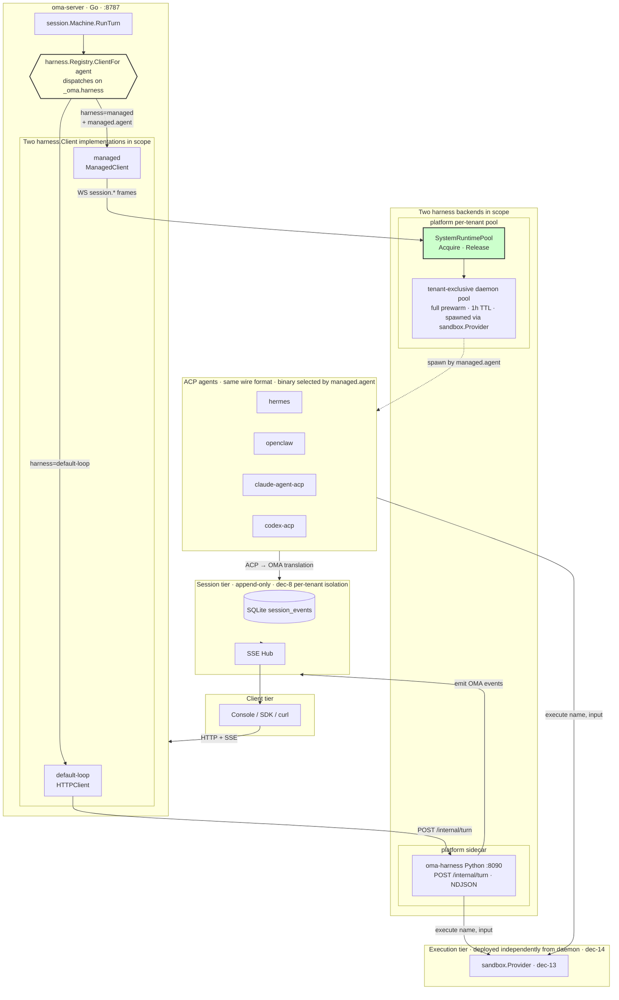

# Plan: Pluggable Harness (pipy / acp-proxy / openclaw / hermes / claude)

**Status:** APPROVED (2026-07-11)
**Date:** 2026-07-11
**Branch:** `harness`
**Scope:** `oma-platform` Go server + reference to `open-managed-agents` ACP runtime

## Implementation Status (2026-07-12 update)

**Done:**

- Base Phase 1 — `harness.Registry` dispatcher. Landed on `harness` branch
  (commit `9c5e8f3`, 2026-07-12). `Machine` holds a `HarnessRegistry` and
  resolves the per-turn `Client` from the agent's `_oma.harness` metadata.
  `OMA_FAKE_HARNESS` is preserved via `RegistryConfig.Force`.

**In scope (next):**

- Extension Phase 3: `ManagedClient` stub (returns 501 on `RunTurn` until
  Phase 4) + `system_runtimes` / `system_runtime_leases` tables + Agent API
  validation of `managed.agent` against `KnownAgents`.

**Deferred (remains in plan as design reference, removed from active diagrams §3 and §10.13):**

- Base Phase 2: `acp-proxy` harness kind — `RuntimeClient`, user-hosted daemon via
  `RuntimeRoom`, `acp-proxy-wire.md` design doc.
- Extension Phase 4: `SystemRuntimePool` real implementation + cold-start spawn path.
- Extension Phase 5: Prewarm-to-tiered cutover + per-tenant capacity + Console UX flip.
- Console integration (original Phase 3) until managed path is functional.

---

## 1. Problem

Today `oma-platform` ships **one** harness implementation: the **pipy HTTP sidecar**.
`cmd/oma-server/main.go:145` constructs a single `&harness.HTTPClient{BaseURL: harnessURL}`
at startup and threads it through every session. All sessions — regardless of the
agent's `_oma.harness` metadata — use the same pipy client.

`Agent` already carries `_oma.harness` and `_oma.runtime_binding` fields (see
`internal/store/agents.go:37`, `internal/api/agentwire.go:18-19`), and
`docs/design/runtime-architecture.md` describes an `acp-proxy` harness kind.
But **no Go code in the turn path reads `_oma.harness`** — the runtime/room
machinery exists (`internal/runtime/registry.go`, `room.go`) but is not wired
into `session/machine.go`'s turn dispatch.

We want operators (and the Console picker) to choose between:

| Harness kind | What it is | Wire format |
|--------------|-----------|-------------|
| `default-loop` (a.k.a. `pipy`) | In-platform Python sidecar | `POST /internal/turn` (NDJSON stream) |
| `acp-proxy` | Local ACP daemon on user's machine, bridged through `RuntimeRoom` | WebSocket `session.*` JSON |
| *(agents)* `openclaw` / `hermes` / `claude` / `codex` | Specific ACP agents spawned by the daemon | Same `session.*` — the daemon picks the binary via `acp_agent_id` |

Reference implementation: `open-managed-agents/packages/acp-runtime/src/`. It
separates **Spawner** / **ChildHandle** / **AcpRuntime** and ships a
`known-agents.ts` overlay listing `hermes`, `openclaw`, `claude-acp`,
`codex-acp` with `{command, args}` specs.

## 2. Key Insight: Two Kinds, Many Agents

`openclaw` / `hermes` / `claude` / `codex` are **NOT** separate harness kinds.
They are all **ACP agents** that speak the same JSON-RPC-over-stdio protocol.
The variation is in `runtime_binding.acp_agent_id`, which tells the daemon
**which binary to spawn**:

```jsonc
// Agent config
{
  "_oma": {
    "harness": "acp-proxy",            // ← harness kind (2 choices)
    "runtime_binding": {
      "runtime_id": "rt-uuid",          // ← which daemon
      "acp_agent_id": "openclaw"        // ← which agent binary (openclaw|hermes|claude-acp|codex-acp)
    }
  }
}
```

So the work is:

1. Introduce a **per-session harness dispatcher** (`harness.Registry`) keyed by `_oma.harness`.
2. Implement two `harness.Client` kinds: `default-loop` (existing HTTP) and `acp-proxy` (new WS).
3. Extend the daemon's known-agents list with `openclaw` / `hermes` / `claude-acp` / `codex-acp`.
4. (Optional) Server-side validation of `acp_agent_id` against a known-agents data file.

## 3. Architecture

```
┌────────────────────────────────────────────────────────────────────┐
│                        Client / Console                            │
└────────────────────────────┬───────────────────────────────────────┘
                             │
                             ▼
┌────────────────────────────────────────────────────────────────────┐
│  session.Machine.RunTurn                                           │
│    ├─ reads agent.Harness                                         │
│    └─ asks harness.Registry.ClientFor(agent) → harness.Client     │
└────────────────────────────┬───────────────────────────────────────┘
                             │
                   ┌─────────┼─────────┐
                   │         │         │
                   ▼         ▼         ▼
          ┌────────────┐ ┌──────────┐ ┌──────────────────┐
          │default-loop│ │ managed  │ │ fake / sim       │
          │HTTPClient  │ │Managed-  │ │ (test only)      │
          │POST /inter-│ │Client    │ │                  │
          │nal/turn    │ │WS → Pool │ │                  │
          │(NDJSON)    │ │          │ │                  │
          └─────┬──────┘ └────┬─────┘ └──────────────────┘
                │              │
                │              ▼
                │    ┌─────────────────────────┐
                │    │ SystemRuntimePool       │
                │    │ (per-tenant · prewarm)  │
                │    │ spawned via sandbox.    │
                │    │ Provider · 1h TTL       │
                │    └───────────┬─────────────┘
                │                │ spawn by managed.agent
                │                ▼
                │    ┌─────────────────────────┐
                │    │ tenant daemon pool      │
                │    │ hermes / openclaw /     │
                │    │ claude-agent-acp /      │
                │    │ codex-agent-acp         │
                │    └───────────┬─────────────┘
                │                │
                ▼                ▼
          ┌──────────────────────────────────────┐
          │   sandbox.Provider (independent)     │
          │   local / e2b / daytona / litebox    │
          └──────────────────┬───────────────────┘
                             │
                             ▼
          ┌──────────────────────────────────────┐
          │  Session tier (SQLite session_events)│
          │  append-only log · SSE Hub           │
          │  per-tenant isolation                │
          └──────────────────────────────────────┘
```

## 4. Changes

> **Scope note (2026-07-11):** §4.2 (`runtime_client.go`), §4.7 (Console picker),
> §4.8 (daemon known-agents), and the `acp_agent_id` validation piece of §4.6 are
> **DEFERRED** — they belong to the `acp-proxy` harness path which is not being
> implemented in the current pass. §4.1 / §4.3 / §4.4 / §4.5 and the
> `managed.agent` piece of §4.6 are in scope.

### 4.1 `internal/harness/registry.go` (NEW)

```go
// Kind identifies a harness implementation.
type Kind string

const (
    KindDefaultLoop Kind = "default-loop" // pipy HTTP sidecar (also "pipy" alias)
    KindAcpProxy    Kind = "acp-proxy"
    KindFake        Kind = "fake"
)

// Registry resolves a harness.Client for an agent.
type Registry struct {
    defaultClient Client               // fallback (HTTPClient to pipy)
    acpFactory    func(binding AcpBinding) (Client, error)
    knownKinds    map[Kind]struct{}
}

// AcpBinding is the parsed _oma.runtime_binding for acp-proxy.
type AcpBinding struct {
    RuntimeID  string `json:"runtime_id"`
    AcpAgentID string `json:"acp_agent_id"`
}

func (r *Registry) ClientFor(agent store.AgentConfig) (Client, error) {
    kind := Kind(agent.Harness)
    if kind == "" { kind = KindDefaultLoop }
    switch kind {
    case KindDefaultLoop, "pipy":
        return r.defaultClient, nil
    case KindAcpProxy:
        b, err := parseAcpBinding(agent.RuntimeBinding)
        if err != nil { return nil, err }
        return r.acpFactory(b)
    case KindFake:
        return &FakeClient{}, nil
    default:
        return nil, fmt.Errorf("unknown harness kind: %q", kind)
    }
}
```

### 4.2 `internal/harness/runtime_client.go` (NEW)

```go
// RuntimeClient speaks the ACP-proxy protocol: it attaches to a
// RuntimeRoom via WS and relays session.* frames, translating them
// to OMA events on the fly.
type RuntimeClient struct {
    PlatformBase string
    InternalSecret string
    Rooms        *runtime.Registry   // in-process rooms (same process)
}

func (c *RuntimeClient) RunTurnStream(ctx context.Context, req TurnRequest, onEvent EventHandler) error {
    // 1. Open WS to /v1/internal/runtimes/{runtime_id}/attach-harness
    // 2. Send session.start { session_id, agent, user_prompt, acp_agent_id }
    // 3. Read frames; translate session.update → OMA events; pass to onEvent
    // 4. Return when session.idle or context cancelled
}
```

### 4.3 `internal/session/machine.go` (MODIFY)

`runSingleHarnessTurn` currently calls `harness.RunTurnStreaming(ctx, m.Harness, req, onEvent)`
where `m.Harness` is the single global client. Change:

```go
func (m *Machine) clientForTurn() (harness.Client, error) {
    agent, err := m.Agents.Get(m.TenantID, m.AgentID)
    if err != nil { return nil, err }
    return m.HarnessRegistry.ClientFor(agent.AgentConfig)
}
```

Then `runSingleHarnessTurn` calls `clientForTurn()` and uses the returned client.

The `Machine` struct adds:

```go
HarnessRegistry *harness.Registry   // replaces Harness harness.Client
```

### 4.4 `cmd/oma-server/main.go` (MODIFY)

Replace:

```go
var harnessClient harness.Client = &harness.HTTPClient{...}
```

With:

```go
defaultHarness := &harness.HTTPClient{BaseURL: harnessURL, HTTP: &http.Client{Timeout: harnessTimeout}}
registry := harness.NewRegistry(harness.RegistryConfig{
    Default:        defaultHarness,
    AcpFactory:     func(b harness.AcpBinding) (harness.Client, error) {
        return &harness.RuntimeClient{
            PlatformBase:   harnessPlatformBase,
            InternalSecret: internalSecret,
            Rooms:          runtimeRooms,
            Binding:        b,
        }, nil
    },
})
```

Thread `registry` (instead of `harnessClient`) into `api.NewSessionHandlers` and the `Machine` deps.

### 4.5 `internal/runtime/known_agents.go` (NEW)

Mirror of `open-managed-agents/packages/acp-runtime/src/known-agents.ts`:

```go
var KnownAgents = map[string]KnownAgent{
    "claude-acp":   {Label: "Claude",        Command: "claude-agent-acp", Args: []string{"acp"}, Featured: true},
    "codex-acp":    {Label: "Codex",         Command: "codex-agent-acp",  Args: []string{"acp"}, Featured: true},
    "openclaw":     {Label: "OpenClaw",      Command: "openclaw",         Args: []string{"acp"}, Featured: true},
    "hermes":       {Label: "Hermes",        Command: "hermes",           Args: []string{"acp"}, Featured: true},
    "gemini":       {Label: "Gemini",        Command: "gemini",           Args: nil,                 Featured: false},
    "opencode":     {Label: "OpenCode",      Command: "opencode",         Args: []string{"acp"},     Featured: false},
}

// ValidateAcpAgentID returns an error if id isn't known. Used by the
// Agent create/update API to reject bad runtime_binding early.
func ValidateAcpAgentID(id string) error { ... }
```

### 4.6 Agent API validation (MODIFY `internal/api/agents.go`)

On create/update, if `_oma.harness == "acp-proxy"`, validate that
`runtime_binding.acp_agent_id` is in `KnownAgents`. Return 400 otherwise.

### 4.7 Console agent picker (MODIFY `console/src/`)

Render the `KnownAgents` list (fetched via `GET /v1/agents/known-acp-agents` — NEW)
in the runtime-binding dropdown. Group featured agents first (matches OMA CF
Console behavior).

### 4.8 Bridge daemon known-agents (OUT OF SCOPE for this task, but tracked)

The daemon's `hello` handshake advertises which ACP agents are installed locally.
We don't modify the daemon in this task — we assume it already supports openclaw /
hermes / claude-acp via `open-managed-agents`'s daemon code. If the daemon is
out-of-date, that's a separate task.

## 5. Migration Plan (Phased)

> **Scope note (2026-07-11):** Only **Phase 1** is in current scope.
> Phase 2 (acp-proxy wiring), Phase 3 (Console integration), and
> Phase 4 (daemon known-agents in separate repo) are **DEFERRED**.

### Phase 1 — Introduce registry, no behavior change (smallest possible first)

- Add `internal/harness/registry.go` with `KindDefaultLoop` + `KindFake`.
- Modify `cmd/oma-server/main.go` to construct a `Registry` instead of a bare client.
- Modify `session.Machine` to hold a `*Registry` and call `ClientFor(agent)`.
- **Behavior check:** with `_oma.harness` unset (the default today), every agent
  resolves to the same HTTPClient. No test breaks, no user-visible change.
- Update `internal/api/agents_ama_test.go` to exercise `_oma.harness = "default-loop"`
  explicitly.

### Phase 2 — Wire `acp-proxy`

- Add `internal/harness/runtime_client.go`.
- Add `AcpFactory` to `RegistryConfig`.
- Add `internal/runtime/known_agents.go` with the known-agents table.
- Add `GET /v1/agents/known-acp-agents` API.
- Validate `acp_agent_id` on Agent create/update.
- Smoke test: register a runtime (via curl), create an agent with
  `_oma.harness: acp-proxy` + `runtime_binding: {runtime_id, acp_agent_id: "hermes"}`,
  send a user message, verify the daemon spawns `hermes acp` and the events flow back.

### Phase 3 — Console integration

- Add the agent picker UI. Wire to `GET /v1/agents/known-acp-agents`.
- Featured agents first, then the rest.
- `installHint` surfacing when the daemon reports an agent missing.

### Phase 4 — Daemon known-agents expansion (separate repo)

- If `open-managed-agents`'s daemon doesn't already list `openclaw` / `hermes`,
  upstream a PR to add them. Track in a separate issue.

## 6. Tests

| Test | Scope | File |
|------|-------|------|
| `Registry.ClientFor` with each kind | Unit | `internal/harness/registry_test.go` |
| `parseAcpBinding` malformed inputs | Unit | `internal/harness/registry_test.go` |
| `RuntimeClient` frames round-trip (mock Room) | Unit | `internal/harness/runtime_client_test.go` |
| Machine dispatches to correct client per agent | Unit | `internal/session/machine_harness_test.go` |
| Agent API rejects unknown `acp_agent_id` | Integration | `internal/api/agents_ama_test.go` |
| End-to-end: pipy vs acp-proxy session | E2E | `scripts/e2e/acp-proxy-smoke.sh` |

## 7. Open Questions

1. **Should `harness` field accept `pipy` as an alias for `default-loop`?**
   Recommendation: **yes**, for back-compat and ergonomics. Normalise to
   `default-loop` on read.

2. **Should the server reject unknown `acp_agent_id` strictly, or warn-and-accept?**
   Recommendation: **reject** at Agent-write time (400). The daemon will fail to
   spawn anyway — fail-fast is cheaper.

3. **What about agents that want to mix pipy for some turns and ACP for others?**
   Out of scope for this task. The harness kind is per-Agent, per-session. If
   an agent needs both, define two agents.

4. **Do we need per-tenant default harness config?**
   Not in Phase 1. Agent-level `_oma.harness` is enough; tenant-wide default
   can land in Phase 3 if Console UX demands it.

## 8. Risks

| Risk | Impact | Mitigation |
|------|--------|------------|
| Breaking existing sessions that implicitly rely on single-client | Medium | Phase 1 keeps default behavior identical; no migration of existing rows needed |
| RuntimeRoom not yet handling multi-session fan-out | High | Verify `room.go` harness-map fan-out works before Phase 2 |
| Daemon doesn't know about `openclaw` / `hermes` | Medium | Check daemon version at connect time; surface missing-agent errors clearly |
| Event-translation drift between ACP protocol and OMA events | High | Add a goldens test in `internal/harness/testdata/acp-events.golden.json` |

## 9. Success Criteria

- [ ] An operator can create an agent with `_oma.harness: "acp-proxy"` and
      `_oma.runtime_binding.acp_agent_id: "hermes"` via Console or API.
- [ ] Sending a user message spawns `hermes acp` on the user's daemon and
      events stream back to the Console.
- [ ] The same operator can create a second agent with `acp_agent_id: "openclaw"`
      and it works without server changes.
- [ ] Existing agents (no `_oma.harness`) continue to use pipy. No behavior change.
- [ ] Unit + integration tests cover registry dispatch, binding parse, and
      API validation.

---

## Appendix A: Mapping to `open-managed-agents` Reference

| open-managed-agents | oma-platform |
|---------------------|--------------|
| `packages/acp-runtime/src/known-agents.ts` | `internal/runtime/known_agents.go` (this plan) |
| `packages/acp-runtime/src/types.ts::Spawner` | bridge daemon (out of scope here) |
| `packages/acp-runtime/src/session.ts::AcpSessionImpl` | bridge daemon side |
| `packages/session-runtime/src/machine.ts::HarnessRunFn` | `internal/harness.Client` interface (already exists) |
| `packages/session-runtime/src/machine.ts::buildHarness()` | `harness.Registry.ClientFor(agent)` (this plan) |
| CF `RuntimeRoom` DO | `internal/runtime/registry.go` + `room.go` (already exists) |

## Appendix B: File Manifest

```
NEW:
  internal/harness/registry.go
  internal/harness/registry_test.go
  internal/harness/runtime_client.go
  internal/harness/runtime_client_test.go
  internal/runtime/known_agents.go
  internal/runtime/known_agents_test.go
  scripts/e2e/acp-proxy-smoke.sh

MODIFY:
  internal/session/machine.go            (use Registry instead of bare Client)
  internal/api/sessions.go               (thread Registry into handlers)
  internal/api/router.go                 (thread Registry)
  internal/api/agents.go                 (validate acp_agent_id)
  cmd/oma-server/main.go                 (construct Registry)
  internal/harness/client.go             (no change; keep interface stable)

CONSOLE:
  console/src/components/agent-picker.tsx (runtime_binding dropdown)
  console/src/api/knownAgents.ts          (GET /v1/agents/known-acp-agents)
```

---

## Appendix C: Review Notes (autoplan condensed pass)

### CEO lens

- **Premise check**: Sound. OMA already stores `_oma.harness` + `_oma.runtime_binding`
  but never dispatches on them; the RuntimeRoom machinery exists but isn't in the
  turn path. The work is mostly *wiring*, not new concepts.
- **Scope calibration**: Phase 1 (registry + no behavior change) is the right
  first cut — it de-risks the refactor before we touch the ACP path.
- **6-month regret**: If ACP protocol shifts, we've built an adapter layer that
  may need rework. Mitigation: keep `RuntimeClient` small and put all
  ACP-specific translation in one file (`runtime_client.go`) so it's a localized
  change if the wire format evolves.
- **Alternative dismissed**: "One harness kind per Agent" (current) vs.
  "per-session override". Plan picks per-Agent — simpler, and matches the
  open-managed-agents mental model.

### Eng lens

- **Architecture sound**: Yes. `harness.Registry` with a `ClientFor(agent)` method
  is a clean seam. The `harness.Client` interface is already streaming-aware
  (`StreamingClient`), so `RuntimeClient` doesn't need a new abstraction.
- **Hidden complexity #1 — Room relay semantics**: The current `room.go` does
  *raw WS relay* — it doesn't parse `session.*` frames. This means `RuntimeClient`
  must speak the frame protocol itself. **Action**: write an explicit
  `docs/design/acp-proxy-wire.md` that pins the frame set (session.start,
  session.update, session.idle, session.error, session.cancel) before Phase 2
  coding starts. Otherwise the adapter and the daemon will disagree silently.
- **Hidden complexity #2 — ACP → OMA event translation**: ACP's `sessionUpdate`
  notifications don't map 1:1 to OMA events (`agent.tool_use`, `agent.message`,
  etc.). This is the highest-risk translation. **Action**: add a goldens test
  `internal/harness/testdata/acp-events.golden.json` with 5–10 representative
  ACP frames and their expected OMA translations. Lock the mapping in CI.
- **Edge cases**:
  - Daemon offline at turn start → `RuntimeClient` must fail fast (don't hang
    the session in `running`). Add a 5s dial timeout.
  - `acp_agent_id` not installed on daemon → daemon's `hello` should advertise
    detected agents; server should cross-check on `ClientFor()` and surface a
    clear error (`agent "hermes" not detected on runtime rt-xxx`).
  - Turn cancellation → must translate `ctx.Done()` to `session.cancel` frame.
    Currently `Machine.CancelActiveTurn()` cancels the harness context; for
    `RuntimeClient` this must send a WS frame before closing.
- **Test blast radius**: Swapping `Machine.Harness Client` → `Machine.HarnessRegistry *Registry`
  will touch every `Machine` construction site. **Action**: introduce `Registry`
  with a `DefaultOnly(defaultClient Client) *Registry` constructor so existing
  tests can migrate mechanically with a 1-line change. Do this in Phase 1.
- **Migration**: Existing `OMA_FAKE_HARNESS=1 | subagent` env-var logic must
  keep working. Plan says yes; verify by moving the env-var dispatch *inside*
  the `Registry` (so `main.go` stays clean and the env-var behavior is a
  first-class registry kind, not a side branch).

### Decision Audit Trail

| # | Phase | Decision | Classification | Principle | Rationale | Rejected |
|---|-------|----------|----------------|-----------|-----------|----------|
| 1 | CEO | Two kinds (default-loop, acp-proxy); openclaw/hermes/claude are agents not kinds | Mechanical | P3 Pragmatic | Matches open-managed-agents model; avoids N new transports | N harness kinds (one per agent) |
| 2 | CEO | Reject unknown `acp_agent_id` at Agent write time (400) | Mechanical | P1 Completeness | Fail-fast beats runtime spawn errors | Warn-and-accept |
| 3 | Eng | Phase 1 must preserve existing behavior exactly | Mechanical | P2 Boil lakes | No behavior change de-risks the refactor | Big-bang cutover |
| 4 | Eng | Add `DefaultOnly(registry)` constructor for test migration | Taste | P5 Explicit | Small API, minimal test churn | Refactor all tests to full Registry |
| 5 | Eng | Write `acp-proxy-wire.md` before Phase 2 coding | Mechanical | P5 Explicit | Pins frame set; prevents silent drift | Ad-hoc protocol negotiation |
| 6 | Eng | Goldens test for ACP→OMA event translation | Mechanical | P1 Completeness | Highest-risk translation; lock it | Hand-written unit tests only |
| 7 | Eng | Move `OMA_FAKE_HARNESS` dispatch inside Registry | Taste | P5 Explicit | Cleaner main.go; env-var becomes a first-class kind | Keep env-var side-branch in main.go |

---

## 10. Extension: Platform-Managed System Runtime (per-tenant)

**Status:** APPROVED (2026-07-11)
**Date:** 2026-07-11
**Depends on:** Phases 1–2 of the base plan (registry + acp-proxy wiring)

### 10.1 New requirement

Users should not have to run their own daemon. The platform must be able to
run claude code / codex / openclaw / hermes on **platform-hosted remote machines**,
allocated per-tenant. The user picks an ACP agent (hermes, openclaw, claude, codex)
and the platform hands them a working session — no daemon setup required.

### 10.2 Key decision (locked)

**System runtimes are per-tenant, not shared across tenants.** Each tenant gets
their own pool of platform-hosted daemon instances. Rationale:

- **Security isolation** — one tenant's agent context never lands in another
  tenant's daemon process.
- **Billing attribution** — CPU/API tokens consumed by a session are attributable
  to exactly one tenant.
- **Fault isolation** — a noisy or crashing daemon in tenant A cannot affect
  tenant B's sessions.
- **Capacity tiering** — tenants can have different SLA tiers.
  Currently (while user count is low) all tenants get **full prewarm**;
  Phase 5 will introduce tiered prewarm when user growth demands it.
- **Topology** — daemon and sandbox run independently (not colocated).
  Daemon lives in the platform's daemon pool; sandbox continues to use
  `sandbox.Provider` (local / e2b / daytona). Matches the decoupling
  philosophy from the managed-agents analysis (independent failure domains).

### 10.3 New harness kind: `managed`

Introduce a third harness kind alongside `default-loop` and `acp-proxy`.
Agent config:

```jsonc
{
  "_oma": {
    "harness": "managed",
    "managed": {
      "agent": "hermes"
      // no runtime_id — the platform picks one from the tenant's pool
    }
  }
}
```

Contrast with `acp-proxy`, which requires the user to supply a `runtime_id`
pointing at *their* daemon. With `managed`, the tenant owns no daemon — the
platform runs a pool on their behalf.

### 10.4 Data model

New tables:

```sql
CREATE TABLE system_runtimes (
    id TEXT PRIMARY KEY,
    tenant_id TEXT NOT NULL,
    agent_kind TEXT NOT NULL,           -- hermes | openclaw | claude-acp | codex-acp
    status TEXT NOT NULL,               -- prewarming | busy | draining | dead
    container_id TEXT,
    started_at INTEGER,
    last_heartbeat_at INTEGER,
    active_session_id TEXT,             -- NULL if idle
    capacity_slots INTEGER NOT NULL DEFAULT 1
);

CREATE TABLE system_runtime_leases (
    id TEXT PRIMARY KEY,
    runtime_id TEXT NOT NULL REFERENCES system_runtimes(id),
    session_id TEXT NOT NULL,
    tenant_id TEXT NOT NULL,
    leased_at INTEGER NOT NULL,
    released_at INTEGER,
    outcome TEXT                        -- completed | cancelled | failed
);

CREATE INDEX idx_system_runtimes_tenant_kind_status
    ON system_runtimes(tenant_id, agent_kind, status);
```

### 10.5 `SystemRuntimePool`

A per-tenant, per-agent-kind pool with acquire/release semantics.

```go
type SystemRuntimePool struct {
    Runtimes    *store.SystemRuntimeRepo
    Spawner     SystemRuntimeSpawner   // implemented on top of sandbox.Provider
    WarmerCount int                    // target idle slots per (tenant, kind)
}

// Acquire finds an idle slot or spawns a new daemon (cold start).
func (p *SystemRuntimePool) Acquire(ctx context.Context, tenantID, agentKind string) (*SystemRuntime, error)

// Release returns a slot to the pool (or recycles the daemon if stale).
func (p *SystemRuntimePool) Release(ctx context.Context, runtimeID, sessionID string) error
```

**Spawner implementation (locked):** reuse `sandbox.Provider` in Phase 4.
The daemon container is just another kind of sandboxed execution environment.
If Phase 4 uncovers semantic mismatch (daemon needs heartbeats / slot tracking
that sandbox.Provider can't express), split into a dedicated `daemon.Provider`
in Phase 5.

**Prewarm policy (locked):** currently **full prewarm for all tenants** — the
platform keeps a warm daemon for every (tenant, agent_kind) pair observed.
Acceptable while user count is low. Phase 5 will introduce tiered prewarm
(free: cold-only, Pro: 1–2 slots, Enterprise: N slots) when cost pressure
demands it.

**Idle TTL (locked):** fixed **1 hour**. A daemon that has been idle for
60 minutes is reaped and its slot removed from the pool. Simple, predictable,
and acceptable at current user count. Phase 5 may introduce per-tier TTLs
if cost analysis shows inactive tenants consuming disproportionate resources.

Two spawn paths:
- **Cold start** — on Acquire, if no idle slot exists, launch a new daemon
  container. Adds ~2–5s to first turn TTFT.
- **Prewarming** — a background worker maintains `WarmerCount` idle slots per
  (tenant, kind) so Acquire is the fast path most of the time.

### 10.6 `ManagedClient`

```go
type ManagedClient struct {
    Pool           *SystemRuntimePool
    InternalSecret string
    PlatformBase   string
}

func (c *ManagedClient) RunTurnStream(ctx context.Context, req TurnRequest, onEvent EventHandler) error {
    rt, err := c.Pool.Acquire(ctx, req.TenantID, req.Agent.Managed.Agent)
    if err != nil { return err }
    defer c.Pool.Release(ctx, rt.ID, req.SessionID)
    // From here, identical to RuntimeClient: speak ACP frames over WS
    // to the per-tenant daemon at rt.ContainerID.
    return c.runAcpFrames(ctx, rt, req, onEvent)
}
```

### 10.7 Registry wiring

```go
const KindManaged Kind = "managed"

func (r *Registry) ClientFor(agent store.AgentConfig) (Client, error) {
    // ... existing cases ...
    case KindManaged:
        m, err := parseManagedBinding(agent.Managed)
        if err != nil { return nil, err }
        return r.managedFactory(m)
}
```

### 10.8 Console UX flip

Default path becomes **Managed** (user picks agent kind only).
"Bring your own daemon" (acp-proxy) becomes the advanced/expert path.

```
┌─ New Session ──────────────────────────────┐
│ Harness:  [Managed (platform-hosted) ▼]    │  ← default
│ Agent:    [hermes ▼]  ← from KnownAgents   │
│                                            │
│ ▸ Advanced: use my own daemon              │  ← collapses acp-proxy path
└────────────────────────────────────────────┘
```

### 10.9 Migration phases (extension)

> **Scope note (2026-07-12):** Base Phase 1 (registry dispatcher) **landed on
> `harness` branch, commit `9c5e8f3`, 2026-07-12**. Next in scope is
> **Phase 3** (introduce `ManagedClient` stub + DB tables + Agent API
> validation). Phase 4 (`SystemRuntimePool` real implementation + cold start)
> and Phase 5 (prewarm cutover + capacity + Console UX flip) remain
> **DEFERRED** until extension Phase 3 lands and demonstrates end-to-end
> correctness.

#### Phase 3 — Introduce `managed` kind (no behavior change)

- Wire `ManagedClient` stub in the registry factory (returns 501 on
  `RunTurn` until Phase 4). `KindManaged` + `ParseManagedBinding` already
  landed in Phase 1.
- Add `system_runtimes` / `system_runtime_leases` tables via migration.
- Agent API validates `managed.agent` against `KnownAgents`.
- **Behavior check:** existing agents (default-loop, acp-proxy) unchanged.
  Creating a `managed` agent succeeds, but turn dispatch returns 501 until
  Phase 4 lands.

#### Phase 4 — `SystemRuntimePool` + cold start

- Implement `Acquire` / `Release` with cold-start spawn path.
- Define `SystemRuntimeSpawner` interface; provide containerd/docker
  implementation (or reuse `sandbox.Provider` for daemon containers).
- End-to-end smoke test: tenant creates a `managed` agent → platform
  spawns hermes daemon → session runs → events stream back.
- **Behavior check:** a fresh tenant's first turn takes ~3–5s extra
  (cold start); subsequent turns reuse the same daemon.

#### Phase 5 — Prewarm cutover + capacity + Console UX flip

- **Prewarm cutover**: flip from full prewarm to tiered prewarm
  (free: cold-only, Pro: 1–2 slots, Enterprise: N slots).
  This must land *before* user growth makes full prewarm cost-unsustainable.
- **TTL evaluation**: review 1h fixed TTL against observed idle patterns;
  consider per-tier TTLs if cost analysis warrants it.
- Optional: split `daemon.Provider` out of `sandbox.Provider` if Phase 4
  uncovered semantic mismatch.
- Per-tenant capacity configuration (admin API + Console).
- Console default flips to Managed; acp-proxy collapses under
  "Advanced: use my own daemon".
- Billing hooks: `system_runtime_leases` drives per-tenant usage reports.
- **Behavior check:** after cutover, free-tier tenants see cold-start
  latency on first turn; paid tenants still hit warm pool.

### 10.10 Risks (extension)

| Risk | Impact | Mitigation |
|------|--------|------------|
| Cold-start latency on first turn | Medium | Phase 5 prewarm cutover preserves UX for paid tenants; Phase 4 shows "warming up" indicator |
| Daemon container leaks (zombies) | High | `last_heartbeat_at` watchdog reaps stale daemons; leak-detection job in CI |
| `sandbox.Provider` reuse doesn't fit daemon semantics (heartbeats, slot tracking) | Medium | Phase 4 watch for semantic mismatch; Phase 5 splits into `daemon.Provider` if needed |
| Full prewarm cost becomes unsustainable as user count grows | High | Phase 5 prewarm cutover is a hard prerequisite before marketing push; monitor cost/tenant weekly |
| 1h fixed TTL wastes resources on inactive tenants at scale | Medium | Phase 5 TTL evaluation; consider per-tier TTLs if cost analysis warrants |
| ACP frame protocol drift between daemon versions | High | Same `acp-proxy-wire.md` goldens (shared with Phase 2); pin daemon version per tenant |
| Independent daemon/sandbox topology adds network hop per execute call | Low | Acceptable for current workloads; colocation remains an option for latency-sensitive Enterprise tiers in Phase 5 |

### 10.11 Acceptance criteria (extension)

- [ ] Tenant creates a `managed` agent with `_oma.managed.agent: "hermes"`.
- [ ] Sending a user message spawns a hermes daemon in the tenant's pool
      (cold start) and streams events back.
- [ ] The same tenant's next session reuses the warm daemon (no re-spawn).
- [ ] Tenant A's daemon is unreachable from tenant B's sessions (isolation).
- [ ] Console defaults to Managed; acp-proxy is under "Advanced".
- [ ] Unit + integration tests cover pool acquire/release, cold start, and
      Agent API validation of `managed.agent`.

### 10.12 Decision Audit Trail (extension)

| # | Phase | Decision | Classification | Principle | Rationale | Rejected |
|---|-------|----------|----------------|-----------|-----------|----------|
| 8 | CEO | System runtime is per-tenant, not shared | Mechanical | P1 Completeness | Security isolation + billing attribution + fault isolation | Cross-tenant shared pool |
| 9 | CEO | Add new `KindManaged`, don't overload `acp-proxy` | Mechanical | P5 Explicit | Different config fields (no runtime_id); different error semantics | Reuse acp-proxy + omit runtime_id |
| 10 | Eng | Pool lives at per-tenant granularity | Taste | P2 Boil lakes | Matches data model; avoids cross-tenant scheduling complexity | Global pool with tenant tags |
| 11 | Eng | Cold start in Phase 4, prewarm in Phase 5 | Mechanical | P2 Boil lakes | Ship the simple path first; prewarm adds config surface | Prewarm from day one |
| 12 | Eng | Console default flips in Phase 5, not Phase 3 | Mechanical | P3 Pragmatic | Don't flip UX until cold-start latency is hidden by prewarm | Flip default in Phase 3 |
| 13 | Eng | Reuse `sandbox.Provider` for daemon spawning in Phase 4 | Taste | P2 Boil lakes | Leverages existing abstraction; defers daemon-specific abstraction until Phase 4 proves it's needed | New `daemon.Provider` from day one |
| 14 | Eng | Daemon and sandbox run independently (not colocated) | Mechanical | P3 Pragmatic | Matches decoupling philosophy (managed-agents chapter 2); allows independent scaling | Colocation for low latency |
| 15 | CEO | Full prewarm for all tenants while user count is low | Mechanical | P3 Pragmatic | Best UX at current scale; defer tiered-prewarm cutover to Phase 5 | Tiered prewarm from day one |
| 16 | Eng | Fixed 1-hour idle TTL for daemon reaping | Mechanical | P5 Explicit | Simple, predictable; acceptable at current user count | Tiered TTL by tenant tier |

### 10.13 Unified Architecture Diagram

This diagram stitches together the base plan (§1–9, registry + acp-proxy)
and this extension (§10, managed harness). Color/border callouts map to
decision-audit entries so the picture doubles as a visual index.



**Reading guide**

- **Center of the fan-out**: `harness.Registry` (yellow) is the single
  dispatch seam introduced in Phase 1. Every agent turn passes through it.
- **Two paths, two wire formats**: `default-loop` speaks OMA's native
  NDJSON-over-HTTP. `managed` speaks ACP `session.*` frames over
  WebSocket to a platform-hosted daemon.
- **`acp-proxy` deferred**: the user-hosted daemon path (RuntimeClient +
  RuntimeRoom) is designed but not implemented; see the Deferred list at
  the top of this document.
- **ACP agents are binaries, not kinds**: `hermes` / `openclaw` /
  `claude-agent-acp` / `codex-acp` hang off the managed path. They share
  the same wire protocol; the daemon picks which binary to spawn via
  `managed.agent`.
- **Per-tenant isolation** (dec-8): the green `SystemRuntimePool` box is
  instantiated per tenant. Tenant A's daemons are unreachable from
  tenant B's sessions.
- **Independent topology** (dec-14): the `sandbox.Provider` box sits in
  its own tier, not inside any daemon tier. Daemon and sandbox talk over
  HTTP; they fail independently.
- **Reuse** (dec-13): `SystemRuntimePool.Spawner` is implemented on top
  of the existing `sandbox.Provider` in Phase 4 — daemons are just
  another kind of sandboxed execution environment.
- **Convergence**: both paths converge on the Session tier — an
  append-only SQLite event log broadcast via SSE. This is what makes the
  fan-out safe: the brain changes, the log stays.
