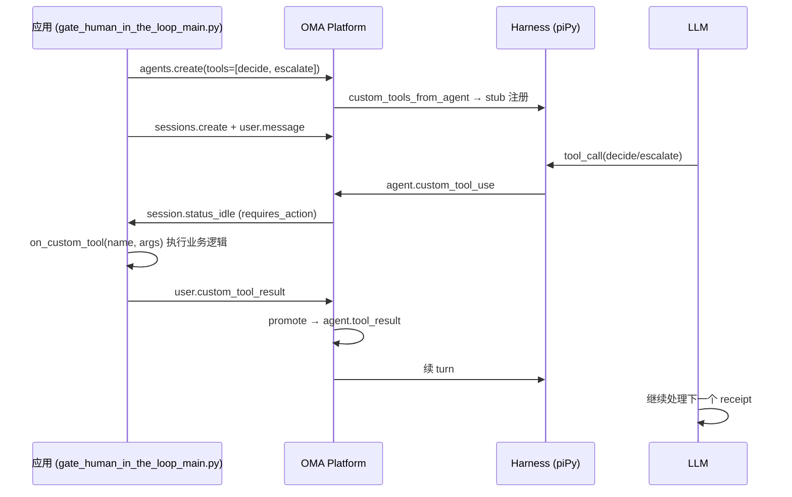

# `decide()` / `escalate()` 自定义工具在 OMA 中的定义与流转

本文说明 `gate_human_in_the_loop_main.py` 中 `decide()` 和 `escalate()` 在 OMA 系统里是如何定义、注册与执行的。

**结论先行：** `decide()` 和 `escalate()` **不是系统内置函数**，而是你在 Agent 上声明的 **custom tool（自定义工具）**。平台只负责把 schema 暴露给模型、发出 `agent.custom_tool_use` 事件并暂停等待；**真正的业务逻辑在应用侧**通过 HITL 回调实现。

---

## 1. 声明层：示例里的 JSON 定义

在示例中，它们定义在 `GATE_TOOLS` 里，`type` 为 `"custom"`：

```python
GATE_TOOLS = [
    {
        "type": "agent_toolset_20260401",
        ...
    },
    {
        "type": "custom",
        "name": "decide",
        "description": "Record a final approve/reject for a clear-cut receipt.",
        "input_schema": {
            "type": "object",
            "properties": {
                "receipt_id": {"type": "string"},
                "action": {
                    "type": "string",
                    "enum": ["approve", "reject"],
                },
                "reason": {"type": "string"},
            },
            "required": ["receipt_id", "action", "reason"],
        },
    },
    {
        "type": "custom",
        "name": "escalate",
        "description": "Surface an ambiguous receipt for human review.",
        "input_schema": {
            "type": "object",
            "properties": {
                "receipt_id": {"type": "string"},
                "question": {"type": "string"},
            },
            "required": ["receipt_id", "question"],
        },
    },
]
```

创建 Agent 时传入：

```python
agent = client.agents.create(
    name=AGENT_NAME,
    model={"id": MODEL},
    system=GATE_SYSTEM_PROMPT,
    tools=GATE_TOOLS,
)
```

这里只是 **schema 声明**，没有 Python/Go 里的 `def decide()` / `def escalate()`。

---

## 2. Harness 层：从 Agent 解析并注册 stub

Harness 会从 Agent snapshot 里解析 `type: "custom"` 的工具。

**文件：** `harness/oma_adapter/custom_tools.py`

```python
def custom_tools_from_agent(agent: AgentSnapshot) -> list[CustomToolDef]:
    """Return explicit ``type: custom`` tools from an agent snapshot."""
    out: list[CustomToolDef] = []
    for item in agent.tools or []:
        ...
        if item.get("type") != "custom":
            continue
        ...
        out.append(
            CustomToolDef(
                name=name.strip(),
                description=str(desc or ""),
                input_schema=schema,
            )
        )
    return out
```

每个 custom tool 会注册成一个 **piPy stub**——模型能看到 JSON Schema，但 `execute()` 是空的，不在 harness 里执行：

```python
def make_custom_tool_stub(defn: CustomToolDef) -> Any:
    """Build a piPy tool stub: schema for the model, no OMA tool_result."""
    ...
        async def execute(
            self,
            tool_call_id: str,
            args: dict[str, Any],
            ...
        ) -> AgentToolResult:
            del tool_call_id, args, signal, on_update
            # No execute on managed-agents — client supplies result via HITL.
            return AgentToolResult(content=[TextContent(text="")], is_error=False)
```

在 turn 开始时挂载到 session（`harness/oma_adapter/turn.py`）：

```python
custom_tool_defs = custom_tools_from_agent(agent_for_tools)
configure_custom_tools_runtime(
    CustomToolsRuntime(tools=custom_tool_defs) if custom_tool_defs else None
)
...
register_custom_tools_on_session(session, custom_tool_defs)
```

---

## 3. 事件层：与内置 tool 分流

模型调用 `decide` / `escalate` 时，harness 发出 **`agent.custom_tool_use`**（不是 `agent.tool_use`），且 **不会** 自动生成 `agent.tool_result`。

**文件：** `harness/oma_adapter/emit.py`

```python
elif kind in {"tool_use", "agent.tool_use", "tool_execution_start"}:
    ...
    if (
        custom_tool_names is not None
        and str(tool_name) in custom_tool_names
    ):
        wire_type = "agent.custom_tool_use"
    else:
        wire_type = wire_tool_use_type(str(tool_name))
    out.append(
        {
            "type": wire_type,
            "id": tool_id,
            "name": tool_name,
            "input": item.get("args") or item.get("input") or {},
        }
    )
```

Turn 结束时，若有未回复的 custom tool call，会进入 pending 状态。

---

## 4. Session 层：暂停等待应用回复

Go 侧检测 pending custom tool，session idle 时返回 `requires_action`。

**文件：** `internal/harness/pending_custom_tools.go`

```go
func BuildIdleStopReason(pendingCustom []string) map[string]any {
    if len(pendingCustom) == 0 {
        return map[string]any{"type": "end_turn"}
    }
    ...
    return map[string]any{
        "type":        "requires_action",
        "action_type": "custom_tool_result",
        "event_ids":   ids,
    }
}
```

---

## 5. 应用层：真正的 `decide` / `escalate` 逻辑

**业务实现不在平台，而在你的回调里。** 示例通过 `make_gate_handler()` 处理：

```python
def make_gate_handler(
    decisions: dict[str, dict[str, Any]],
) -> Any:
    """Build on_custom_tool callback matching cookbook Part A."""

    def handle_custom_tool(
        name: str,
        _event_id: str,
        args: dict[str, Any],
    ) -> dict[str, Any]:
        receipt_id = str(args.get("receipt_id") or "")
        if name == "decide":
            decisions[receipt_id] = {"lane": args.get("action"), **args}
            return {"recorded": True}
        if name == "escalate":
            question = str(args.get("question") or "")
            human = simulate_human_review(receipt_id, question)
            decisions[receipt_id] = {
                "lane": "escalated",
                "human_decision": human,
                **args,
            }
            return {"human_decision": human}
        return {"error": f"unknown tool {name}"}

    return handle_custom_tool
```

`stream_hitl_until_end_turn()` 在收到 `requires_action` 时调用该回调，再 POST `user.custom_tool_result`（`sdk/oma_sdk/cookbook.py`）：

```python
if reason == "requires_action":
    for event_id in stop_reason_event_ids(payload):
        ...
        result = await _dispatch_custom_tool(
            tool_name,
            event_id,
            args,
        )
        await _send_session_events_async(
            client,
            session_id,
            [
                {
                    "type": "user.custom_tool_result",
                    "custom_tool_use_id": event_id,
                    "content": [
                        {
                            "type": "text",
                            "text": json.dumps(result),
                        }
                    ],
                }
            ],
        )
```

Session 收到 `user.custom_tool_result` 后，会 **promote** 成 `agent.tool_result`，让模型继续下一轮。

**文件：** `internal/session/custom_tool_promote.go`

```go
// user.custom_tool_result also synthesizes
// agent.tool_result so the harness history includes the round-trip (AMA parity).
func appendEventsForPendingPromote(payload json.RawMessage) ([]json.RawMessage, error) {
    ...
    toolResult := map[string]any{
        "type":        "agent.tool_result",
        "tool_use_id": toolUseID,
        "content":     meta.Content,
    }
    ...
    return []json.RawMessage{payload, toolResultJSON}, nil
}
```

---

## 整体流程



---

## 总结

| 层级 | `decide` / `escalate` 是什么 |
|------|------------------------------|
| **Agent 配置** | `GATE_TOOLS` 里的 JSON schema（`type: "custom"`） |
| **Harness** | `CustomToolDef` + 空 stub，只给模型看 schema |
| **事件协议** | `agent.custom_tool_use` → `requires_action` → `user.custom_tool_result` |
| **业务实现** | 应用侧 `on_custom_tool` 回调（示例里的 `make_gate_handler`） |

系统里没有预置的 `decide()` / `escalate()` 实现；平台提供的是 custom tool 注册与 HITL 往返机制，具体 approve/reject/escalate 逻辑由你在客户端（或 webhook）自行定义。这与 Anthropic managed agents cookbook 的设计一致——工具 schema 在 agent 上声明，执行权在应用侧。

---

## 相关文件

| 文件 | 作用 |
|------|------|
| `sdk/example/example3/gate_human_in_the_loop_main.py` | Gate HITL 示例与 `make_gate_handler` |
| `harness/oma_adapter/custom_tools.py` | Custom tool 解析、stub 注册、pending 检测 |
| `harness/oma_adapter/emit.py` | `agent.custom_tool_use` 事件发射 |
| `harness/oma_adapter/turn.py` | Turn 内 custom tool 注册与 pending 返回 |
| `harness/oma_adapter/extensions/custom_tools.py` | piPy extension 入口 |
| `sdk/oma_sdk/cookbook.py` | `stream_hitl_until_end_turn` HITL 循环 |
| `internal/harness/pending_custom_tools.go` | `requires_action` idle 构建 |
| `internal/session/custom_tool_promote.go` | `user.custom_tool_result` → `agent.tool_result` |
| `docs/migrate/gate-hitl-gt1-gt3-migration.md` | GT1–GT3 迁移与架构说明 |
